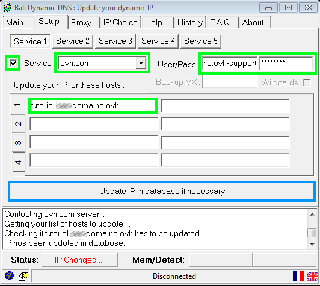

## Wymagania

- Domena zarejestrowana w OVH
- Korzystanie z serwerów DNS OVH

## Definicje

- Adres IP

W Internecie komputery komunikują się ze sobą za pomocą protokołu TCP/IP, który identyfikuje każdą maszynę i każdy komputer na podstawie adresu: xxx.xxx.xxx.xxx.

- DNS

Użytkownicy komunikują się za pomocą adresów IP. Adresy te są definiowane w nazwy stacji lub w prostsze adresy, czyli serwery DNS (Domain Name System).

## Do czego służy opcja DynHOST?
Jeśli dysponujesz dostępem do Internetu, IP Twojego łącza może się zmieniać przy każdym połączeniu.
Opcja DynHOST pozwala na wskazanie domeny lub subdomeny na IP łącza, a jeśli IP się zmieni, na dokonanie jego aktualizacji w czasie rzeczywstym za pomocą identyfikatora i hasła.

## Logowanie do panelu klienta

- Zaloguj się do [panelu klienta](https://www.ovh.com/manager/web) za pomocą identyfikatora klienta i hasła.

- Kliknij na "Login".

{.thumbnail}

## Wybór domeny

- W menu z lewej strony wybierz "Domeny" i kliknij na "swoją domenę".

{.thumbnail}

## Zarządzanie dostępami

- Kliknij na zakładkę DynHost i na "Zarządzanie dostępami".

{.thumbnail}

- Kliknij na "Utwórz identyfikator klienta".

{.thumbnail}

- Wpisz wymagane informacje:

- Identyfikator
- Subdomena
- Hasło

- Kliknij na "Zatwierdź".

{.thumbnail}
Następnie będziesz mógł sprawdzić utworzone konto oraz przypisaną subdomenę.

- Kliknij na przycisk powrót.

{.thumbnail}

## Tworzenie DynHosta

- Kliknij na "Dodaj DynHost".

{.thumbnail}
Wskaż tutaj:

- Subdomenę, na której chcesz uruchomić opcję DynHost.
- Aktualny docelowy adres IP
- Kliknij na "Zatwierdź".

{.thumbnail}
Uwaga:

- Tworzenie tego pola trwa 24 godziny.

- Następnie będziesz mógł sprawdzić, czy DynHost został prawidłowo utworzony.

{.thumbnail}
Uwaga:

- Wpis A w strefie DNS jest dodawany automatycznie. Nie trzeba go dodawać ręcznie.

## Bali Dynamic DNS (darmowe)

- W Bali Dynamic DNS wypełnij pola oznaczone na zielono i kliknij na "Update IP in database if necessary".

{.thumbnail}

- Pojawi się status "IP changed", co oznacza, że adres IP został zaktualizowany.

{.thumbnail}

## Direct Update (Shareware)

- W Direct Update wystarczy wypełnić pola oznaczone na zielono i odznaczyć pole "Wyłącz/zignoruj to konto".

{.thumbnail}

