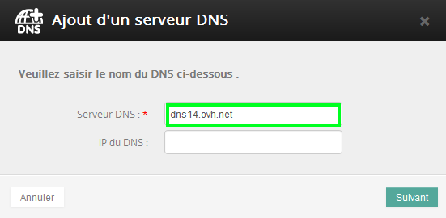

## Definition
The DNS (or Domain Name System) translates a domain name into an IP address (the actual location of your website), so that your requests can reach the target server.

{.thumbnail}

## The difference between DNS servers and DNS zones

## DNS servers

- DNS servers are the servers which have been assigned to a domain name. It is therefore these servers which respond first before handing over to the DNS zone.

## DNS zone
-The DNS zone is a file that stores different records which refer to, among other things, the addresses of the servers hosting your website (A), or your emails (MX). These addresses can take the form of IP addresses or host names.

## Why should I edit servers or the DNS zone?

## DNS servers
You may need to change DNS servers when switching registrar. Indeed, some registrars do not allow you to continue using their servers after you have switched your domain name to a competitor .
You might also have your own dedicated server which uses a DNS server, and you want to use this to manage your domain .

## DNS Zone
When you want to change the server that hosts your website or your email. For example you may have changed host and need to modify your DNS zone.
Once this has been updated, your domain will point to the new servers.

A guide on the DNS zone is available below:

- .

## Logging on to your customer account

- Log on to your [customer account](https://www.ovh.com/manager/web) using your NIC handle and password.

- Click "Login" to confirm.

{.thumbnail}

## Selecting a domain

- In the left-hand menu, select "Domains", then select the domain you want to modify.

{.thumbnail}

## Adding new DNS servers

- Then go to "DNS management" and select "Add a DNS server".

{.thumbnail}

- Enter the first DNS server to be added, then confirm and do the same for the second DNS server.

{.thumbnail}

## Deleting old DNS servers

- Click on the "trash" icon for the two old DNS servers to be deleted and then confirm.

{.thumbnail}

- Deletion in progress

{.thumbnail}

- The update will take a few minutes.

{.thumbnail}

## Reset DNS servers by default
If you make a mistake with your DNS, you can reset your default DNS servers. 

- Go to "DNS management" and select "Reset default DNS".

{.thumbnail}

- You just have to click "Confirm".

{.thumbnail}

## How to check the DNS servers which OVH has assigned to you
In order to find out which DNS servers OVH has delegated to you, you can click on "DNS Zone", and then view the two "NS records" present in your zone.

{.thumbnail}

## Advanced management of DNS with Glue Registry
To create your Glue Registry, see this guide:

## Timings
DNS Servers

- All DNS server modifications can take up to 48h.

DNS Zone
- All modifications in your DNS zone can take up to 24h.

