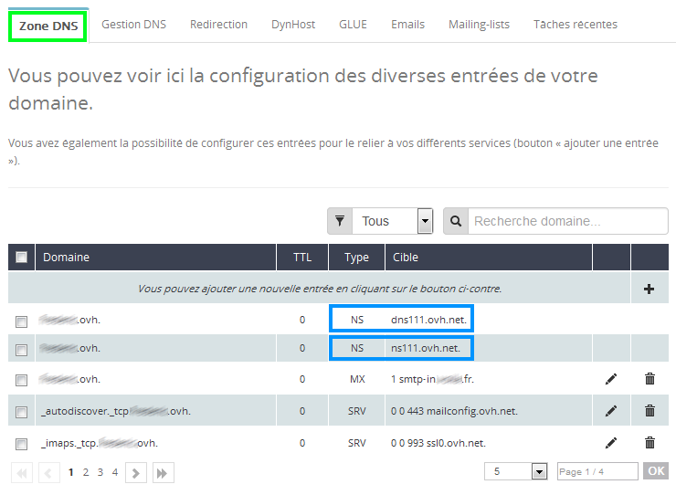

## Apibrėžimas
DNS (arba Domain Name System) suteikia domenui IP adresą, kad jūsų užklausos galėtų patekti į paskirties serverį.

{.thumbnail}

## Skirtumai - DNS serveriai/zona

## DNS serveriai

- DNS serveriai - tai serveriai, kurie buvo deklaruoti domenui. Šie serveriai atsakys pirmiausiai, prieš pereinant prie susietos DNS zonos.

## DNS zona

- DNS zona - tai failas su įvairiais įrašais, nurodančiais, tarp visų kitų duomenų, jūsų svetainių talpinimo serverių adresus (A) ar jūsų el. laiškų serverių adresus (MX). Tai gali būti IP adresai arba mazgų (host) pavadinimai.

## Kodėl redaguojami DNS serveriai ar zona?

## DNS serveriai
Keičiant registratorių būtina pakeisti DNS serverius. Kai kurie registratoriai neleidžia naudoti serverių po to, kai jūsų domenas buvo perkeltas kitur.
Keitimas taip pat būtinas, jeigu jūsų dedikuotas serveris bus naudojamas kaip DNS serveris jūsų domeno valdymui.

## DNS zona
Jeigu norite keisti svetainės talpinimo ar el. laiškų serverį po prieglobos paslaugų teikėjo keitimo, jums reikės pakeisti savo DNS zoną.
Atnaujinus DNS zoną, jūsų domenas nukreips į šiuos naujus serverius. 

DNS zonos gidas prieinamas čia:

- .

## Prisijungimas prie kliento valdymo sąsajos

- Prisijunkite prie [kliento valdymo sąsajos](https://www.ovh.com/manager/web) su savo kliento ID ir slaptažodžiu.

- Spauskite Prisijungti norėdami patvirtinti šią operaciją.

{.thumbnail}

## Domeno pasirinkimas

- Kairiajame meniu pasirinkite Domenai ir jūsų domenas.

{.thumbnail}

## Naujų DNS serverių pridėjimas

- Eikite į DNS valdymas ir pasirinkite Pridėti DNS serverį.

{.thumbnail}

- Nurodykite pirmąjį DNS serverį, kurį reikia pridėti, po patvirtinkite ir pridėkite antrąjį DNS serverį.

{.thumbnail}

## Ankstesnių DNS serverių pašalinimas

- Spauskite šiukšliadėžės piktogramą prie 2 ankstesnių DNS serverių, kuriuos reikia pašalinti, ir spauskite Patvirtinti.

{.thumbnail}

- Vyksta trynimas.

{.thumbnail}

- Po kelių minučių įrašai bus atnaujinti.

{.thumbnail}

## Kaip atkurti DNS serverius pagal nutylėjimą
Jeigu atlikote klaidingus veiksmus, jūs galite atkurti savo DNS serverius, nustatytus pagal nutylėjimą.

- Eikite į DNS valdymo skiltį ir pasirinkite Atkurti DNS pagal nutylėjimą.

{.thumbnail}

- Spauskite Patvirtinti, jei norite patvirtinti atkūrimą.

{.thumbnail}

## Kaip sužinoti, kokius DNS serverius jums priskyrė OVH
Jei nežinote, kokius DNS serverius jums priskyrė OVH, šią informaciją galite gauti spragtelėję DNS zona ir peržiūrėję NS įrašus.

{.thumbnail}

## Pažangus DNS valdymas su Glue Registry
Norėdami sukurti savo Glue Registry, vadovaukitės gidu: 

## SVARBU
DNS serveriai

- Visi DNS serverių keitimai gali įsigalioti tik po 48 val..

DNS zona
- Visi DNS zonos keitimai gali įsigalioti po 24 val..

