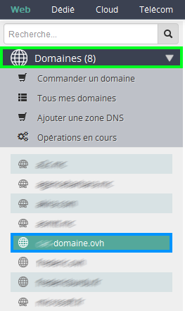

## Definitie
De DNS (of DomeinNaamSysteem) zet een domeinnaam om naar een IP-adres (de werkelijke locatie van uw website) zodat uw verzoeken de target server kunnen bereiken.

{.thumbnail}

## Het verschil tussen DNS servers en DNS zones

## DNS servers

- DNS servers zijn de servers die aan een domeinnaam zijn toegewezen. Het zijn daarom deze servers die als eerste reageren vooraf aan het overdragen naar de DNS zone.

## DNS zone

- De DNS zone is een bestand dat verschillende items opslaat die de adressen specificeren van servers die uw website (A) of uw e-mails (MX) hosten. Dit kunnen adressen zijn in de vorm van IP-adressen of hostnamen.

## Waarom servers of DNS zone wijzigen?

## DNS servers
Het kan nodig zijn om DNS servers te wijzigen bij het veranderen van register. Bij sommige registers is het niet mogelijk om gebruik te blijven maken van hun servers nadat u uw domeinnaam hebt overgezet naar een concurrent. 
Ook is het mogelijk dat u een dedicated server heeft die gebruik maakt van een DNS server en u deze wilt gebruiken om uw domein te beheren.

## DNS zone
Wanneer u de server, die uw website of e-mail host, wilt veranderen, bijvoorbeeld na een verandering van host dient u uw DNS zone aan te passen. 
Zodra dit is aangepast zal uw domein wijzen naar de nieuwe servers. 

Voor meer informatie over de DNS zone kunt u de volgende handleiding raadplegen: 

- .

## Inloggen op uw klantaccount

- Log in op uw 
[klantaccount](https://www.ovh.com/manager/web) met uw NIC-handle en wachtwoord.

- Klik "Inloggen" om te bevestigen.

{.thumbnail}

## Selecteren van een domein

- In het linkermenu selecteert u "Domeinen" en vervolgens het domein dat gewijzigd moet worden.

{.thumbnail}

## Toevoegen van nieuwe DNS servers

- Ga vervolgens naar "DNS beheer" en selecteer "DNS server toevoegen".

{.thumbnail}

- Geef de toe te voegen eerste DNS server aan, bevestig het en doe vervolgens hetzelfde voor de tweede DNS server.

{.thumbnail}

## Verwijderen van oude DNS servers
Klik bij de twee oude DNS servers op het 
"prullenbak" pictogram om ze te verwijderen en bevestig het.

{.thumbnail}

- Aan het verwijderen.

{.thumbnail}

- De update zal een paar minuten duren.

{.thumbnail}

## DNS servers standaard resetten
Mocht u uw DNS onjuist manipuleren dan kunt u us DNS servers standaard laten resetten. 

- Ga naar 'DNS beheer' en selecteer 'Standaard DNS reset'.

{.thumbnail}

- U hoeft de reset alleen maar te bevestigen.

{.thumbnail}

## Het controleren van de door OVH aan u toegewezen DNS servers
Om erachter te komen welke DNS servers OVH aan u heeft toegewezen kunt u klikken op "DNS Zone" en dan kunt u de twee "NS records" bekijken die in uw zone aanwezig zijn.

{.thumbnail}

## Geavanceerd DNS beheer met Glue Registry
Ga naar de volgende handleiding om uw Glue Registry te creëren:

## Hoe lang duurt het voordat de DNS wijzigingen actief zijn?
DNS Servers

- Alle serverwijzigingen kunnen tot 48 uur in beslag nemen.

DNS Zone
- Alle wijzigingen in uw DNS zone kunnen tot 24 uur in beslag nemen.

