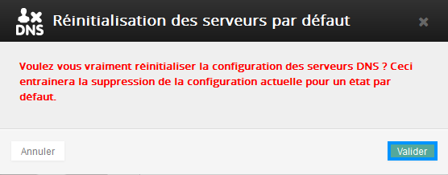

## Definicja
DNS (Domain Name System) pozwala między innymi na przetłumaczenie domeny na adres IP, aby zapytania mogły być dostarczane do serwera docelowego.

{.thumbnail}

## Różnica między serwerami i strefą DNS

## Serwery DNS

- Serwery DNS to serwery zadeklarowane dla nazwy domeny. To serwery najpierw odpowiadają, zanim zostanie zinterpretowana strefa DNS, która jest do nich przypisana.

## Strefa DNS

- Strefa DNS to plik zawierający różne wpisy wskazujące między innymi adresy serwerów obsługujących stronę (A) lub e-maile (MX). Adresy te mogą mieć formę adresu IP lub nazwy hosta.

## Dlaczego trzeba edytować serwery lub strefę DNS?

## Serwery DNS
Może wystąpić sytuacja, w której trzeba będzie zmienić serwery DNS domeny (na przykład po zmianie operatora). Niektórzy dostawcy nie pozwalają na korzystanie ze swoich serwerów po przeniesieniu domeny do konkurencyjnego operatora. 
Być może posiadasz serwer dedykowany, który jest serwerem DNS i chcesz z niego korzystać.

## Strefa DNS
Gdy chcesz zmienić serwer obsługujący stronę www lub e-maile, na przykład po zmianie dostawcy usług, musisz zmodyfikować strefę DNS domeny. 
Po zaktualizowaniu strefy domena będzie wskazywać na nowe serwery.

Przewodnik na temat strefy DNS jest dostępny tutaj:

- .

## Logowanie do panelu klienta

- Zaloguj się do [panelu klienta](https://www.ovh.com/manager/web) za pomocą identyfikatora klienta i hasła.

- Kliknij na"Login".

{.thumbnail}

## Wybór domeny

- W menu z lewej strony wybierz "Domeny" i "domenę", dla której chcesz dokonać zmiany.

{.thumbnail}

## Dodawanie nowych serwerów DNS

- Przejdź do sekcji "Zarządzanie DNS" i wybierz "Dodaj serwer DNS".

{.thumbnail}

- Wskaż pierwszy serwer DNS i zatwierdź operację. Następnie wykonaj to samo z drugim serwerem DNS.

{.thumbnail}

## Usuwanie starych serwerów DNS

- Kliknij na ikonkę "kosza" na poziomie 2 starych serwerów DNS i zatwierdź.

{.thumbnail}

- Trwa usuwanie.

{.thumbnail}

- Operacja trwa kilka minut.

{.thumbnail}

## Resetowanie domyślnych serwerów DNS
W przypadku wprowadzenia nieprawidłowej konfiguracji, można przywrócić domyślne serwery DNS.

- Przejdź do sekcji "Zarządzanie DNS" i wybierz "Zresetuj domyślne serwery DNS".

{.thumbnail}

- Kliknij na "Zatwierdź", aby potwierdzić operację.

{.thumbnail}

## Jak sprawdzić serwery DNS przyznane przez OVH
Aby sprawdzić, jakie serwery DNS zostały przyznane przez OVH, kliknij na "Strefa DNS". Są to 2 "wpisy NS" widoczne w strefie.

{.thumbnail}

## Zaawansowane zarządzanie serwerami DNS za pomocą Glue Registry
Aby utworzyć własne Glue Registry, zapoznaj się z tym przewodnikiem:

## Czas propagacji zmian
Serwery DNS

- Zmiana serwerów DNS może trwać do 48 godzin.

Strefa DNS
- Zmiana wpisów w strefie DNS może trwać do 24 godzin.

