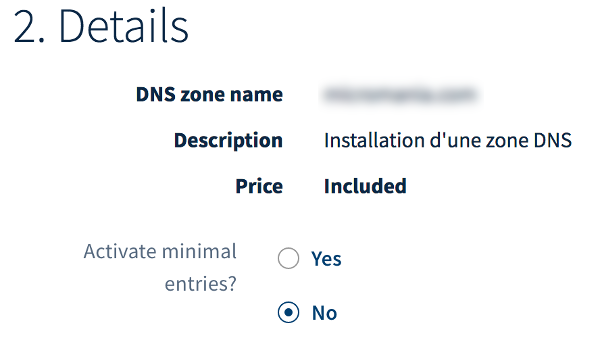

**Ultimo aggiornamento: 30/11/2018**

## Obiettivo

La zona Domain Name System (DNS) di un dominio consiste nel file di configurazione in cui si archiviano le relative informazioni tecniche, chiamate record.  Convenzionalmente questi record consentono di collegare il tuo dominio al server o ai server che ospitano il tuo sito Internet e i tuoi indirizzi email.

Per diversi motivi, potresti aver bisogno di creare in OVH una zona DNS per il tuo dominio.

Questa guida ti mostra come creare una zona DNS OVH dal tuo Spazio Cliente.

## Prerequisiti

- Disporre di un dominio
- Il dominio in questione non deve disporre già di una zona DNS OVH o essere associato a operazioni e buoni d’ordine in corso
- La configurazione tecnica del dominio deve essere corretta (stato, SOA, ecc...)
- Avere accesso allo [Spazio Cliente OVH](https://www.ovh.com/auth/?action=gotomanager){.external}

## Procedura

### Step 1: crea la zona DNS dallo Spazio Cliente OVH

Accedi al tuo [Spazio Cliente OVH](https://www.ovh.com/auth/?action=gotomanager){.external}, clicca su `Ordina`{.action} nel menu a sinistra e seleziona `Zona DNS`{.action}.

Nella nuova pagina, inserisci il dominio per cui vuoi creare la zona DNS OVH. Attendi qualche istante, il tempo necessario al sistema per effettuare un controllo delle informazioni relative al dominio.

Se compare un messaggio che indica che la zona DNS non può essere creata, verifica che il dominio rispetti tutte le condizioni richieste o chiedi a chi lo gestisce di farlo per te. Una volta apportate le modifiche necessarie, prova a ripetere l’operazione.

{.thumbnail}

Terminata la verifica, decidi se attivare il numero minimo di record per la zona DNS che verrà creata. Questa scelta non è definitiva: sarà possibile modificare i record della zona DNS anche dopo la sua creazione.

|Attivare il numero minimo di record?|Descrizione|
|---|---|
|Sì|Seleziona questa opzione per personalizzare in autonomia la zona DNS.|
|No|Seleziona questa opzione se pensi di utilizzare servizi OVH come un [hosting web](https://www.ovh.it/hosting-web/){.external}, dato che la zona è preconfigurata a tal fine.|

{.thumbnail}

Dopo aver effettuato la scelta, segui gli step fino a completare la creazione della zona DNS.

### Step 2: modifica la zona DNS (facoltativo)

Ora che la zona DNS del tuo dominio è stata creata, è possibile modificarla. Questa operazione è facoltativa, ma può rivelarsi fondamentale per garantire la disponibilità dei servizi associati al dominio (come un sito Internet o un account di posta elettronica).

Per modificare la zona DNS accedi allo [Spazio Cliente OVH](https://www.ovh.com/auth/?action=gotomanager){.external}, clicca su `Domini`{.action} nel menu a sinistra e seleziona il tuo dominio. Clicca sulla scheda `Zona DNS`{.action}.

> [!primary]
>
> Se hai appena creato la zona DNS e il dominio non compare ancora nella lista dei tuoi servizi attivi, attendi qualche istante e ricarica la pagina.
>

A questo punto, esegui le operazioni necessarie. Per maggiori informazioni sulla modifica di una zona DNS, consulta la guida [Modificare una zona DNS OVH](https://docs.ovh.com/it/domains/web_hosting_modifica_la_tua_zona_dns/){.external}. La propagazione delle modifiche potrebbe richiedere da 4 a 24 ore. 

### Step 3: modifica i server DNS del dominio

Una volta che la zona DNS OVH è pronta, è necessario associarla al dominio. Per prima cosa recupera nello Spazio Cliente i server DNS OVH attivi per il tuo dominio. Questa informazione viene mostrata nella parte superiore della pagina, sotto la voce `Name Servers`{.action}.

{.thumbnail}

A questo punto **modifica i server DNS dall’interfaccia del provider che gestisce il tuo dominio**. Ti ricordiamo che la propagazione delle modifiche potrebbe richiedere fino a 48 ore.

## Per saperne di più

[Modificare una zona DNS OVH](https://docs.ovh.com/it/domains/web_hosting_modifica_la_tua_zona_dns/){.external}

Contatta la nostra Community di utenti all’indirizzo <https://www.ovh.it/community/>