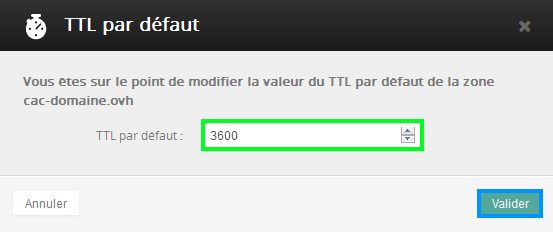

## Definición
El protocolo DNS (Domain Name System, por sus siglas en inglés) permite transformar un nombre de dominio en dirección IP para que las peticiones lleguen al servidor de destino.

{.thumbnail}

## Diferencias entre los servidores y la zona DNS

## Servidores DNS

- Los servidores DNS son los servidores asociados a un nombre de dominio. Son, por lo tanto, los servidores que responderán en primer lugar antes de pasar el testigo a la zona DNS asociada.

## Zona DNS

- La zona DNS es un archivo que contiene una serie de registros que indican, entre otros, las direcciones de los servidores que alojan su sitio (A) o sus correos (MX). Estas direcciones pueden adoptar la forma de una dirección IP o de nombres de hosts.

## ¿Por qué es necesario editar los servidores o la zona DNS?

## Servidores DNS
Es posible que necesite modificar sus servidores DNS al cambiar de agente registrador, ya que algunos registros no permiten seguir utilizando sus servidores al transferir su dominio a otro agente distinto. 
También es posible que usted disponga de un servidor dedicado que funcione como servidor DNS y que desee utilizarlo para administrar su dominio. 

Si desea más información sobre los servidores DNS, consulte la siguiente guía:

## Zona DNS
Si desea modificar el servidor que aloja su sitio web o sus servicios de correo debido a un cambio de alojamiento, por ejemplo, deberá modificar su zona DNS. 
Una vez actualizada la zona DNS, su dominio apuntará a los nuevos servidores.

## ¿Por qué es necesario un tiempo de propagación?

## Impacto del TTL
El Time to Live («tiempo de vida» o «duración de vida»), también llamado TTL, indica el periodo durante el cual una información debe conservarse en caché tras una modificación. 
En OVH, las zonas DNS de nueva creación tienen un TTL de una hora (TTL = 3600).

## Conexión al área de cliente

- Conéctese al [área de cliente](https://www.ovh.com/manager/web) con su ID de cliente (NIC Handle) y contraseña. 

- Haga clic en «Login» para validar la operación.

{.thumbnail}

## Selección del dominio

- Acceda a la sección «Dominios» en el menú de la izquierda y seleccione el dominio que desea modificar.

{.thumbnail}

## Consulta de la zona DNS
Acceda a la sección «Zona DNS» para consultar los diferentes campos de información sobre su zona DNS. 
También puede ordenar la información que se muestra en función del tipo de campo.

{.thumbnail}

## Modificación de un registro
Para modificar un registro, haga clic en el icono con forma de bolígrafo, realice los cambios que desee efectuar y haga clic en «Siguiente» > «Aceptar».

{.thumbnail}

## Eliminación de un registro
Para eliminar un registro, haga clic en el icono con forma de papelera > «Aceptar».

{.thumbnail}

## Restaurar la configuración
Este botón le permite restaurar su zona DSN para restablecer todos los campos por defecto.

{.thumbnail}
Seleccione el tipo de zona y haga clic en «Aceptar»[/ blue]: 

- Registros mínimos: Esta opción le ofrece la posibilidad de restaurar la zona con los registros de base para que su dominio funcione. 

- Restauración normal: Esta opción le ofrece registros adicionales, como los CNAME para el FTP, etc.

{.thumbnail}

## Añadir un registro
Este botón le permite añadir un nuevo campo a su zona DNS.

{.thumbnail}
Tan solo debe seleccionar el tipo de entrada y seguir los pasos que se le indican haciendo clic en «Siguiente».

{.thumbnail}

## Modificar en modo de texto
Este botón le permite configurar su zona en modo de texto para un uso avanzado. Resulta una opción útil para aquellos usuarios con experiencia que desean realizar cambios rápidamente.

{.thumbnail}
Tan solo debe modificar la zona de texto y hacer clic en Siguiente:

{.thumbnail}

## TTL por defecto
Este botón le permite modificar el TTL de su zona DNS para gestionar el tiempo de almacenamiento en caché.

{.thumbnail}
Para ello, seleccione el TTL por defecto que desee y haga clic en «Aceptar».

{.thumbnail}

## Campo de tipo A
Un registro de tipo A sirve de enlace entre un nombre de host y una dirección IPv4.
No es posible disponer de un tipo A y de un CNAME para el mismo nombre de host.

## Campo de tipo MX
Un registro MX especifica el servidor de correo responsable de la distribución de correos para un nombre de dominio específico.
Solo se puede indicar un nombre de host, y no una dirección IP.

## Campo de tipo CNAME
Un registro CNAME permite crear un alias de un nombre de host hacia otro nombre de host. 
Solo se puede indicar un nombre de host, y no una dirección IP.
No es posible disponer de un CNAME y de un tipo A para el mismo nombre de host.

## Campo de tipo TXT
Un registro TXT permite insertar un texto en su zona DNS.

## Campo de tipo SPF
Un registro SPF permite que los servidores autorizados envíen mensajes de correo con su nombre de dominio. 
Si desea más información, puede consultar la siguiente guía: 

- .

## Zona Check
Esta herramienta le permite asegurarse de que la actualización de sus servidores DNS se realizará correctamente. 
Si desea más información, puede consultar la siguiente guía: 

- .

## DNSSEC
Esta opción le permite proteger su dominio frente al «cache poisoning». 
Si desea más información, puede consultar la siguiente guía: 

- .

## Plazos
Servidores DNS

- Todos los cambios en sus servidores DNS pueden tardar hasta 48 h.

Zona DNS
- Todos los cambios en su zona DNS pueden tardar hasta 24 h.

