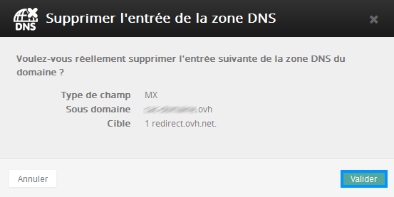

## Definizione
Il DNS (o Domain Name System) è un sistema che permette di tradurre un dominio in indirizzo IP, in modo che le tue richieste possano raggiungere il server di destinazione.

{.thumbnail}

## Differenze server/zona DNS

## Server DNS

- I server DNS sono i server dichiarati per un dominio. Rispondono per primi alle richieste e poi le reindirizzano alla zona DNS associata.

## Zona DNS

- La zona DNS è un file che contiene i diversi record corrispondenti agli indirizzi dei server che ospitano il tuo sito (A) o le tue email (MX). Questi indirizzi possono essere indirizzi IP o nomi di host.

## Perché modificare i tuoi server o la tua zona DNS?

## Server DNS
La modifica dei tuoi server DNS potrebbe essere necessaria, ad esempio, se decidi di cambiare Registrar. Alcuni di essi, infatti, non consentono di continuare a utilizzare i loro server a coloro che decidono di trasferire il proprio dominio alla concorrenza.
È possibile anche utilizzare uno dei tuoi server dedicati come server DNS, per gestire il tuo dominio.

## Zona DNS
La modifica della tua zona DNS è necessaria se decidi di cambiare il server che ospita il tuo sito o le tue email, ad esempio in seguito al passaggio a un altro provider.
Una volta che hai aggiornato la zona DNS, il tuo dominio punterà verso i nuovi server.

## Tempo di propagazione DNS

## TTL (Time To Live)
Il Time To Live ("tempo di vita" o "durata di vita"), chiamato TTL, indica per quanto tempo un'informazione viene conservata in cache dopo essere stata modificata.
In OVH, il TTL delle zone DNS create è di un'ora (TTL = 3600).

## Accedi al tuo Spazio Cliente OVH

- Accedi al tuo [Spazio Cliente OVH](https://www.ovh.com/manager/web), inserisci le tue credenziali e clicca su Login.

{.thumbnail}

## Seleziona il tuo dominio

- Nella sezione Domini del menu a sinistra, seleziona il dominio che vuoi modificare.

{.thumbnail}

## Visualizza la configurazione della tua zona DNS
Per visualizzare la configurazione della tua zona e i record presenti, clicca sulla tab Zona DNS.
Se preferisci, puoi eseguire una ricerca per tipo di record.

{.thumbnail}

## Modifica un record
Per modificare un record, clicca sull'icona a forma di matita e, dopo aver apportato la tua modifica, clicca su Seguente e poi su Conferma.

{.thumbnail}

## Elimina un record
Per eliminare un record, clicca sull'icona a forma di Cestino e Conferma.

{.thumbnail}

## Ripristina la configurazione
Il tasto "Reinstalla la configurazione" ti permette di ripristinare i campi predefiniti della tua zona DNS.

{.thumbnail}
Seleziona l'opzione di reinstallazione e clicca su Conferma:

- Numero minimo di record: questa opzione ripristina nella tua zona i record di base per il funzionamento del tuo dominio.

- Ripristino normale: questa opzione ripristina nella tua zona anche record aggiuntivi, ad esempio i CNAME per l'FTP.

{.thumbnail}

## Aggiungi un record
Il tasto "Aggiungere un accesso" ti permette di aggiungere un nuovo record nella tua zona DNS.

{.thumbnail}
Per farlo, è sufficiente selezionare il tipo di record e cliccare su Seguente.

{.thumbnail}

## Effettua una modifica utilizzando l'editor di testo
Il tasto "Utilizza l'editor di testo" ti permette di modificare la tua zona utilizzando un editor di testo. Questa modalità è utile per gli utenti avanzati che vogliono effettuare rapidamente le loro modifiche.

{.thumbnail}
Per eseguire questa operazione, è sufficiente iserire il testo delle zone DNS e confermare.

{.thumbnail}

## TTL predefinito
Il tasto "TTL predefinito" ti permette di modificare il TTL della tua zona DNS e gestire il tempo di conservazione in cache dei tuoi dati.

{.thumbnail}
Per farlo, modifica il campo TTL predefinito e Conferma.

{.thumbnail}

## Record di tipo A
Un record di tipo A crea una corrispondenza tra un hostname e un indirizzo IPv4.
Non è possibile utilizzare un record di tipo A e uno di tipo CNAME per lo stesso hostname.

## Record di tipo MX
I record MX indicano il server che gestisce l'invio e la ricezione della posta elettronica.
Non è possibile indicare un indirizzo IP, ma esclusivamente un hostname.

## Record di tipo CNAME
I record CNAME servono a creare l'alias di un hostname, consentendo di collegarlo ad un altro. Non è possibile indicare un indirizzo IP, ma esclusivamente un hostname.
Non è possibile utilizzare un record di tipo A e uno di tipo CNAME per lo stesso hostname.

## Record di tipo TXT
I record TXT permettono di inserire un testo nella tua zona DNS.

## Record di tipo SPF
Un record SPF permette di dichiarare i server autorizzati a inviare email con il tuo dominio.
Per maggiori informazioni, consulta questa guida:

- .

## Zona Check
Grazie a questo strumento sei sicuro che l'aggiornamento dei tuoi server DNS avverrà correttamente.
Consulta la guida disponibile:

- .

## DNSSEC
Questa opzione ti permette di proteggere il tuo dominio contro il Cache Poisoning.
Consulta la guida disponibile:

- .

## Quanto tempo serve perché le modifiche siano effettive?
Server DNS

- Per diventare effettive, le modifiche apportate ai tuoi server DNS possono richiedere fino a 48 ore.

Zona DNS

- Per diventare effettive, le modifiche apportate alla tua zona DNS possono richiedere fino a 24 ore.

