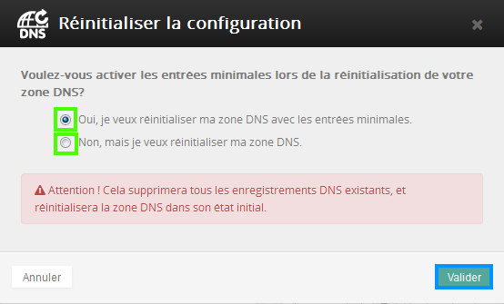
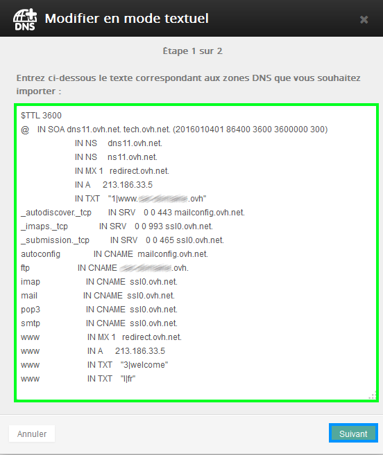

## Definição
O serviço DNS (Domain Name System) permite "traduzir" um nome de domínio num endereço IP a fim de que os seus pedidos possam chegar ao servidor "alvo".

{.thumbnail}

## Diferenças entre servidores/zonas DNS

## Servidores DNS

- Os servidores DNS são os servidores que estão declarados para um nome de domínio no sistema DNS. São, portanto, os servidores encarregues por responder em primeiro lugar aos pedidos de "tradução" e transmitem à Internet a "zona DNS".

## Zona DNS

- A zona DNS é um ficheiro que contém diferentes "registos" que indicam, entre outras coisas, os endereços dos servidores que alojam o seu site (campo A) ou os seus emails (campo MX). Estes endereços podem estar sob a forma de endereço IP (A) ou de nome canónico (CNAME).

## Por que razão se deve editar os servidores ou a zona DNS?

## Servidores DNS
Poderá ser necessário modificar os servidores DNS quando, por exemplo, muda de Registrar. Com efeito, certos Registrars apenas permitem o uso dois seus servidores DNS se o nome de domínio estiver registado com esses Registrars e não o permitem quando estão registados num concorrente
É também possível que possua um servidor que desempenhe o papel de servidor DNS e o pretenda utilizar para gerir o seu nome de domínio.

Um guia relativo aos servidores DNS está à disposição:

- .

## Zona DNS
Quando desejar modificar o servidor que aloja o seu site ou os seus emails após alteração de alojador, por exemplo, será necessário alterar os dados da sua zona DNS.
Uma vez efetuada a atualização, será necessário aguardar a propagação e o seu nome de domínio passará a apontar para esses novos servidores.

## Por que é que existe um tempo de propagação?

## Impacto do TTL
O "Time to Live" ("duração de via"), denominado TTL, indica o período de tempo durante o qual uma informação DNS deve ser conservada pelos servidores de cache após modificação.
Na OVH, as novas zonas DNS são criadas com um TTL de 1 hora (TTL=3600).

## Ligação ao Espaço Cliente

- Aceda ao seu [Espaço Cliente](https://www.ovh.com/manager/web) com recurso 'sua palavra-passe e nic-handle.

Clique em "Login" para validar a operação

{.thumbnail}

## Seleção do nome de domínio

- No menu da esquerda, selecione  "Domínios" e depois clique no "nome de domínio" em relação ao qual serão efetuadas alterações.

{.thumbnail}

## Consulta da zona DNS atual
Clique no separador "Zona DNS" a fim de consultar a sua zona DNS.
Terá a possibilidade de consultar os diferentes campos presentes na mesma, atualmente.
Para maior simplicidade na consulta tem a possibilidade de efetuar uma triagem por tipo de campo.

{.thumbnail}

## Modificação de uma entrada
A fim de modificar uma entrada, deverá clicar no ícone em forma de lápis, efetuar a modificação desejada, clicar em "Seguinte" e, por fim, em "Validar"

{.thumbnail}

## Eliminação de uma entrada
A fim de eliminar uma entrada, deverá clicar no ícone em forma de caixote do lixo e, por fim, em "Validar".

{.thumbnail}

## Reinicializar a configuração
Este botão permite-lhe reinicializar a sua zona DNS a fim de colocar os campos todos com valores padrão.

{.thumbnail}
Selecione o tipo de zona desejado e clique no botão "Validar" :

- Entradas mínimas: Esta escolha fornecerá uma zona com as entradas de base necessárias ao básico funcionamento do seu nome de domínio.

- Reinicialização normal: Esta ecolha permitirá obter uma zona DNS com entradas suplementares como CNAME para FTP, etc...

{.thumbnail}

## Adicionar uma entrada
Este botão permite adicionar um novo campo na sua zona DNS.

{.thumbnail}
Basta escolher o tipo de entrada e prosseguir, clicando no botão "Seguinte".

{.thumbnail}

## Modificação em modo textual
Este botão permite editar a sua zona em modo de texto para uma utilização avançada.
Este modo é útil para os utilizadores com conhecimentos avançados que desejem efetuar as modificações rapidamente.

{.thumbnail}
Basta modificar a zona DNS em modo de texto e depois clicar em "Seguinte".

{.thumbnail}

## TTL padrão
Este botão permite modificar o valor TTL da sua zona DNS a fim de gerir o tempo de manutenção de cache.

{.thumbnail}
Para isso, basta  escolher o TTL padrão desejado e, depois, clicar em"Validar".

{.thumbnail}

## Campo do tipo A
Uma entrada do tipo A faz corresponder um nome de host com um endereço Ipv4.
Não é autorizado o uso de um campo A e um CNAME para o mesmo nome de host.

## Campo do tipo MX
Uma entrada do tipo MX serve para identificar o servidor de email para que o correio eletrónico seja entregue ao servidor responsável pelo seu tratamento.
Apenas um nome de host pode ser indicado e nunca um endereço IP.

## Campo do tipo CNAME
Uma entrada do tipo CNAME serve para criar um alias de um nome de host para outro nome de host.
Apenas um nome de host pode ser indicado; nunca um endereço IP.
Não é autorizado o uso de um campo A e um CNAME para o mesmo nome de host.

## Campo do tipo TXT
Uma entrada do tipo

## Campo do tipo SPF
Uma entrada do tipo SPF permite declarar os servidores autorizados a enviar emails com o seu nome de domínio.
Para mais informações, pode consultar este guia:

- .

## Zone check
Esta ferramenta permite assegurar-se que a sua atualizaçao de servidores DNS será concluída com sucesso.
Um guia está à disposição:

- .

## DNSSEC
Esta opção permite-lhe proteger o seu nome de domínio contra Cache poisoning.
Um guia está à disposição:

- .

## Prazos / Delays
Servidores DNS

- Todas as modificações dos seus servidores DNS poderão levar até 48 horas.

Zona DNS

- Todas as modificações na sua zona DNS podem levar até 24 horas para serem tidas em conta.

