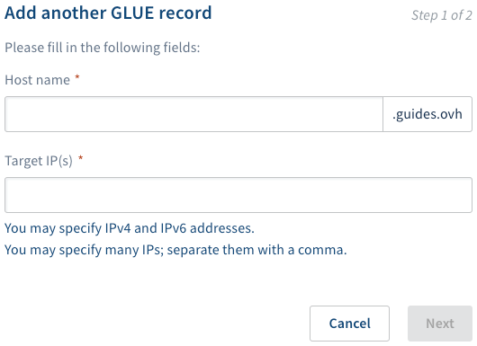

**Última atualização: 05/10/2018**

## Sumário

Os servidores DNS alojam as configurações DNS dos nomes de domínio (também conhecidas como zonas DNS) que contêm informações técnicas, tais como os registos. Numa utilização clássica, estas configurações permitem fazer a ligação entre o seu nome de domínio e os servidores que alojam o seu website e os seus endereços de e-mail.

Consoante as suas necessidades, poderá querer personalizar o nome dos servidores DNS do seu nome de domínio OVH.

**Saiba como personalizar os servidores DNS do seu nome de domínio OVH.**

## Requisitos

- Ter um nome de domínio registado na OVH.
- Ter acesso à [Área de Cliente OVH](https://www.ovh.com/auth/?action=gotomanager){.external}, na secção `Web`{.action}.

## Instruções

**Personalizar os servidores DNS de um domínio é uma operação delicada**: uma alteração inadequada poderia, por exemplo, impossibilitar o acesso ao seu website e a receção de novos e-mails. Recomendamos que siga os passos indicados abaixo ou, caso não se sinta totalmente à vontade em realizar estas operações, que obtenha ajuda para o fazer.

### 1 - Adicionar os registos GLUE

Para começar, aceda à sua [Área de Cliente OVH](https://www.ovh.com/auth/?action=gotomanager){.external}. Na secção `Web`, clique em `Domínios`{.action} na barra à esquerda e, em seguida, selecione o domínio correspondente aos servidores DNS que pretende personalizar. Por fim, clique no separador `GLUE.`{.action}

Na nova página, poderá ver uma tabela que apresenta os registos GLUE que estão configurados na OVH para o seu nome de domínio. Para adicionar um novo registo GLUE, clique em `Adicionar`{.action}.

{.thumbnail}

Em seguida, preencha as informações necessárias:

|Informações|Detalhes|  
|---|---|
|Nome do host|Personalize o nome do host que pretende utilizar enquanto servidor DNS personalizado.|
|IP(s) de destino|Indique os endereços de IP que deverão ficar associados ao nome do host. Em termos gerais, trata-se do endereço de IP do servidor DNS atualmente utilizado pelo seu nome de domínio. Se este utilizar os servidores DNS da OVH, mas não conhecer o endereço de IP correspondente: utilize a nossa ferramenta “[Dig](https://www.ovh.pt/suporte/ferramentas/dig_domain.pl){.external}”. Aparecerá na secção `ANSWER SECTION` junto de “A”.|

Depois de preencher as informações, clique no botão `Adicionar`{.action}, leia as informações apresentadas e clique em `Validar`{.action}. Repita esta operação as vezes que forem necessárias, de acordo com o número de servidores DNS utilizados pelo seu domínio.

{.thumbnail}

### 2 - Criar os registos A DNS correspondentes

É necessário criar registos A para os nomes dos hosts que definiu no passo anterior. Cada registo A deve ter como alvo o endereço de IP de destino correspondente ao nome do host criado anteriormente.

Esta operação deve ser realizada através da interface do prestador responsável pela configuração DNS do seu domínio. A partir daqui, terá duas possibilidades:

- **Se o seu nome de domínio não utilizar a configuração DNS da OVH**: contacte o prestador responsável por esta configuração e siga o passo seguinte;

- **Se o seu nome de domínio utilizar a configuração DNS da OVH**: aceda à janela `Zona DNS`{.action} e adicione um novo registo A clicando em `Adicionar uma entrada`{.action}. Selecione o tipo de registo A e siga os passos indicados. Caso seja necessário, consulte as instruções descritas na nossa documentação sobre como [Editar uma zona DNS da OVH](https://docs.ovh.com/gb/en/domains/web_hosting_how_to_edit_my_dns_zone/){.external} (versão em inglês).

{.thumbnail}

### 3 - Alterar os servidores DNS do domínio

Por último, só precisa de modificar os servidores DNS do seu nome de domínio. Para isso, aceda à janela `Servidores DNS`{.action} e clique em `Modificar os servidores DNS`{.action}. Substitua os seus servidores DNS atuais pelos que pretende utilizar. 

Siga os passos indicados e, caso necessite de ajuda, consulte o manual “[Modificar os servidores DNS de um domínio OVH](https://docs.ovh.com/gb/en/domains/web_hosting_general_information_about_dns_servers/){.external}” (versão em inglês).

Depois de alterar os servidores DNS, aguarde que as modificações fiquem registadas. É necessário um tempo máximo de propagação de 48h.

{.thumbnail}

## Quer saber mais?

Fale com a nossa comunidade de utilizadores em <https://community.ovh.com/en/>.