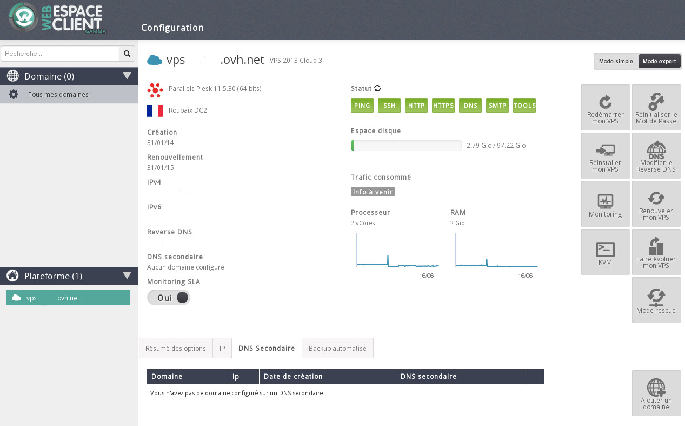

## 
OVH stellt einen sekundären DNS Server zur Verfügung, falls Sie Ihren Server als primären DNS Server für Ihre Domain verwenden möchten.

Die Option Sekundärer DNS finden Sie auf der Übersichtsseite Ihres VPS im OVH Kundencenter nach dem Umstellen der Anzeige auf den "Experten-Modus".

Die angezeigte Seite im Kundencenter:

{.thumbnail}
Auf dieser Seite können Sie:


- Die Liste der bereits auf unserem sekundären DNS Server konfigurierten Domains einsehen.
- Eine Domain zu unserem sekundären DNS Server hinzufügen oder von diesem löschen.


## 1. Eine Domain hinzufügen
Um eine Domain hinzuzufügen klicken Sie auf den Button Eine Domain hinzufügen und tragen die benötigten Angaben ein:

{.thumbnail}

- Tragen Sie unter "Hinzuzufügende Domain" den Domainnamen ein, der zum sekundären DNS Server hinzugefügt werden soll.


{.thumbnail}
Schließen Sie die Operation mit einem Klick auf Bestätigen ab.

Sobald dies erfolgt ist, erscheint dann Ihre Domain in der Liste:

{.thumbnail}
Für eingetragene Domains werden folgende Informationen angezeigt:


- DOMAIN: Die Domain, die auf unserem sekundären DNS Server konfiguriert wurde.
- ERSTELLUNGSDATUM: Das Datum, an dem die Domain auf unserem sekundären DNS Server hinzugefügt wurde.
- IP: Die IP-Adresse des primären DNS Servers der Domain (Ihr Server).
- Sekundärer DNS: Der Name des sekundären DNS Servers von OVH, auf dem die Domain konfiguriert ist.


In manchen Fällen wird eine Überprüfung durchgeführt, dass Sie Zugriff auf die Verwaltung der Domain haben. Sie erhalten dann beim Hinzufügen der Domain folgende Fehlermeldung:
Bei der Anfrage zum Hinzufügen der Domain auf dem sekundären DNS ist ein Fehler aufgetreten. (Wir müssen zuerst überprüfen, dass Sie der Inhaber der Domain sind. Um dies durchzuführen erstellen Sie bitte einen TXT Eintrag in der DNS Zone Ihrer Domain ihredomain.tld mit der Subdomain 'ownercheck' und dem Wert '339ea8d0'. Sobald dies erfolgt ist und die DNS Zone neu geladen wurde, können Sie es erneut versuchen: Sie müssen in diesem Fall die DNS Propagation nicht abwarten).
Wenn dies der Fall ist, müssen Sie einen TXT Eintrag für die Subdomain ownercheck.ihredomain.tld in der derzeitigen DNS Zone Ihrer Domain erstellen. Dieser Eintrag hat folgende Form:


```
ownercheck TXT "339ea8d0"
```


## 2. Eine Domain löschen
Um den Eintrag auf dem sekundären DNS Server für eine Domain zu löschen klicken Sie einfach auf das Mülleiner-Symbol rechts in der Zeile mit der gewünschten Domain.


## 
In dieser Anleitung wird beschrieben, wie man:

- Eine Domain zu unserem sekundären DNS Server hinzufügen kann.
- Eine Domain von unserem sekundären DNS Server löschen kann.


