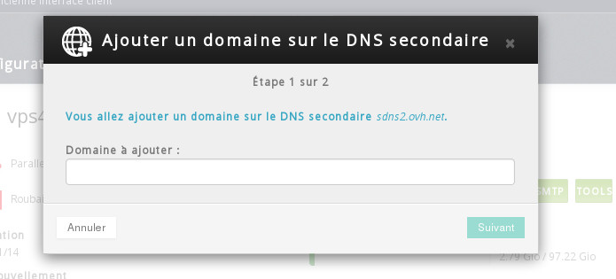

## 
Con OVH hai a disposizione un DNS secondario da utilizzare insieme al DNS primario per il tuo dominio.

Trovi l'opzione DNS secondario nelle informazioni di riepilogo del tuo VPS nello Spazio Cliente OVH.

Ecco come si presenta:

{.thumbnail}
Su questa pagina puoi:


- Visualizzare direttamente tutti i domini già configurati con il DNS secondario.
- Aggiungere o eliminare un dominio sul server DNS secondario.


## 1. Aggiungi un dominio
Per aggiungere un dominio, clicca su Aggiungere un dominio e inserisci quanto richiesto.

{.thumbnail}

- Nel campo "Dominio": inserisci il dominio da aggiungere.


{.thumbnail}
Per completare l'operazione, clicca su Conferma.

A quel punto, il tuo dominio verrà incluso nell'elenco, come in questo esempio:

{.thumbnail}
Per ogni dominio, visualizzerai queste informazioni:


- Dominio: il dominio configurato con il server DNS secondario.
- IP: l'indirizzo IP del server DNS primario del dominio in questione.
- Data di creazione: la data in cui il dominio è stato aggiunto al server DNS secondario.
- DNS secondario: il nome del DNS secondario OVH in cui è stato configurato il dominio.


Può essere richiesta una verifica di gestione del dominio. In tal caso dopo aver confermato l'aggiunta del dominio, comparirà questo messaggio di errore:
Si è verificato un errore nella richiesta di aggiunta del DNS secondario (First we need to verify you are the owner of this domain. To do so, please add a TXT field on your DNS zone for the domain tuodominio.com, with the subdomain 'ownercheck' and the following value: '339ea8d0'. Once done and your zone reloaded, try again (you don't need to wait for DNS propagation).)
In questo caso dovrai aggiungere un campo TXT per il sottodominio ownercheck.tuodominio.com nell'attuale zona DNS del dominio:


```
ownercheck TXT "339ea8d0"
```


## 2. Elimina un dominio
Per eliminare un dominio da un DNS secondario, ti basta cliccare sul Cestino a destra di ogni dominio configurato.


## 
Con questa guida hai imparato a:

- aggiungere un dominio sul server DNS secondario.
- eliminare un dominio sul server DNS secondario.


