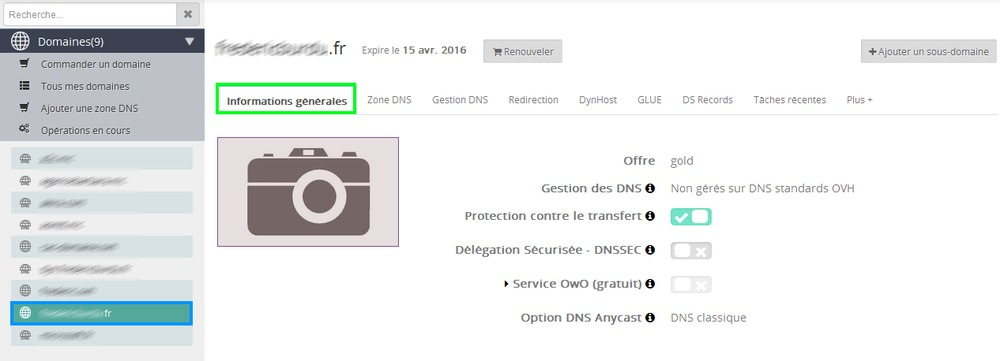

## Dominio genérico (gTLD)
Para transferir un dominio genérico (.com, .net, .org, .info, .biz y similares) a otro agente registrador, asegúrese de que cumple los siguientes requisitos:

- El dominio no debe haber caducado*.
- El dominio no debe haber sido creado o transferido en los últimos 61 días*.
- La organización, los apellidos o el nombre del propietario no deben haber sido modificados en los últimos 61 días*.
- El dominio no debe haber sido renovado en los últimos 46 días (recomendado). 
- Las direcciones de correo electrónico de los contactos del Whois deben ser válidas*. 
- Los contactos del Whois, y sobre todo el propietario, deben haber sido informados de la solicitud de transferencia*.
- El dominio no debe estar bloqueado*. 
- La fecha de caducidad debe ser superior a 60 días*.

*Obligatorio.

## Dominio geográfico (ccTLD)
Para transferir un dominio geográfico (.fr, .re, .eu, .be y similares) a otro agente registrador, asegúrese de que cumple los siguientes requisitos:

- El dominio no debe haber caducado*.
- El dominio no debe haber sido renovado en los últimos 46 días (recomendado).
- Los contactos del Whois, y sobre todo el propietario, deben haber sido informados de la solicitud de transferencia*.
- El dominio no debe estar bloqueado*.
- La fecha de caducidad debe ser superior a 60 días*.

*Obligatorio.

## 1. Confirmación de la información del dominio
Encontrará toda la información disponible en su [área de cliente](https://www.ovh.com/manager/web/login/). 
Debe conectarse con el contacto administrador. 

Una vez conectado, haga clic en su nombre de dominio en la sección «Dominios» y acceda al apartado «Información general».

{.thumbnail}

## 2. Desbloqueo del dominio
Para desbloquear el dominio, haga clic en el botón de desactivación en el apartado «Protección contra la transferencia».

{.thumbnail}
A continuación, haga clic en «Aceptar».

{.thumbnail}
La operación tardará algunos minutos en registrarse.

{.thumbnail}

## 3. Recuperación del código de transferencia
Una vez desactivada la protección, aparecerá el botón «AUTH/INFO».

{.thumbnail}
Al hacer clic en este botón, aparecerá una nueva ventana con el código de transferencia.

{.thumbnail}
El dominio permanecerá desprotegido durante 7 días. Una vez transcurrido este plazo, volverá a bloquearse.

## 4. Transmisión de la información a su nuevo agente registrador
No tendrá que realizar ninguna otra operación con OVH. Ya cuenta con toda la información necesaria para transferir su dominio.

