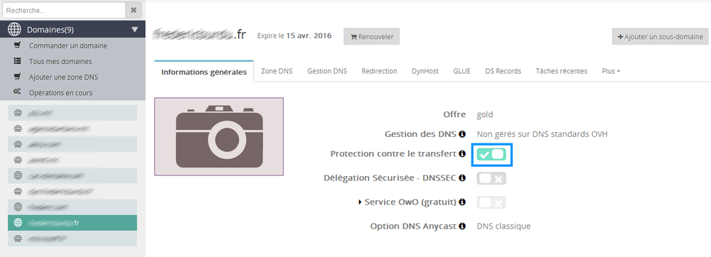

## Domínio genérico (GTLD)

Para poder transferir um nome de domínio genérico  (.com, .net, .org, .info, .biz e semelhantes) para a OVH, deve assegurar-se que respeita os seguintes pré-requisitos:

- O seu domínio não está expirado. *
- O seu domínio deve ter sido criado há mais do que 61 dias. *
- A organização, o nome e o apelido do proprietário não podem ter sido modificados há menos de 61 dias. *
- Não deve ter renovado o seu domínio há menos de 46 dias. (Recomendação)
- Os endereços de e-mail de contactos na base Whois devem ser válidos. *
- Os contactos na base Whois bem como o proprietário devem ser indicados no pedido de transferência. *
- O domínio não deve estar bloqueado. *
- A data de expiração do domínio deve ser superior a61 dias. (Recomendação)

( *Obrigatório)

## Domínio geográfico (CCTLD)

Para poder efetuar uma transferência de domínio geográfico (.fr, .re, .eu, .be, e similares) para um outro registrar, deve assegurar-se que respeita os seguintes pré-requisitos:

- O seu domínio não está expirado. *
- Não deve ter renovado o seu domínio há menos de 46 dias. (Recomendação)
- Os contactos na base Whois bem como o proprietário devem ser indicados no pedido de transferência. *
- O domínio não deve estar bloqueado. *
- A data de expiração do domínio deve ser superior a61 dias. (Recomendação)

(* : Obrigatório)

## Etapa 1: Verificações das informações do domínio
Pode encontrar estas informações a partir do seu Espaço Cliente acessível [aqui](https://www.ovh.com/manager/web/login/).
 É necessário ligar-se com o contacto administrador.

Após estar ligado é necessário clicar no nome de domínio à esquerda no separador Domínios, e depois em Informações gerais.

{.thumbnail}

## Etapa 2: Desbloqueio do domínio
É necessário clicar no botão de desativação no separador Proteção contra a transferência.

{.thumbnail}
Clique de seguida em Validar.

{.thumbnail}
Aguarde alguns minutos para que a operação seja corretamente tomada em conta.

{.thumbnail}

## Etapa 3: Recuperação do código de transferência
Após ter desativado o domínio, o botão AUTH/INFO aparecerá.

{.thumbnail}
É necessário clicar em AUTH/INFO. Uma janela será apresentada com o código de transferência em baixo.

{.thumbnail}
 O domínio ficará desprotegido durante 7 dias. Após este prazo o domínio voltará a ser bloqueado.

## Etapa 4: Transmita as informações ao novo registrar.
As etapas estão agora terminadas do lado da OVH. Dispõe de todas as informações necessárias para transferir o seu nome de domínio.

