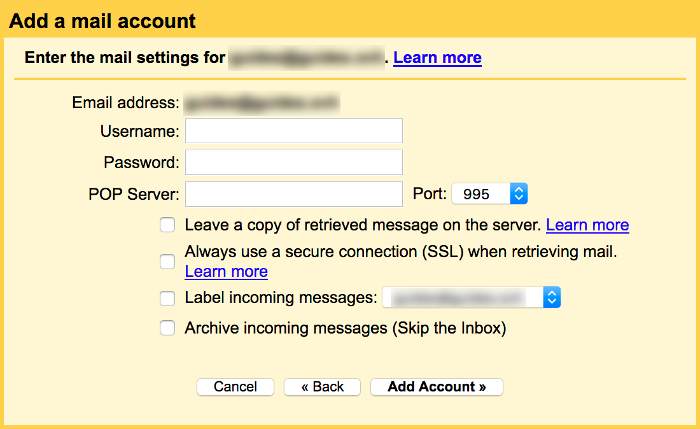

**Letzte Aktualisierung am 18.03.2020**

## Ziel

E-Mail Pro Accounts können auf verschiedenen, kompatiblen E-Mail-Clients und Webinterfaces eingerichtet werden. So können Sie Ihr bevorzugtes Gerät oder Webinterface für Versand und Empfang Ihrer E-Mails verwenden.

**In dieser Anleitung wird erklärt, wie Sie einen E-Mail Pro Account im Webinterface von Gmail einrichten.**

> [!warning]
>OVHcloud stellt Ihnen Dienstleistungen zur Verfügung, für deren Konfiguration und Verwaltung Sie die alleinige Verantwortung tragen. Es liegt somit bei Ihnen, sicherzustellen, dass diese ordnungsgemäß funktionieren.
>
>Wir stellen Ihnen diese Anleitung zur Verfügung, um Ihnen bei der Bewältigung alltäglicher Verwaltungsaufgaben zu helfen. Dennoch empfehlen wir Ihnen, falls Sie Hilfe brauchen, einen spezialisierten Dienstleister und/oder den Herausgeber des Dienstes zu kontaktieren. Für externe Dienstleistungen bietet OVHcloud leider keine Unterstützung. Weitere Hinweise finden Sie im Teil „Weiterführende Informationen” dieser Anleitung.
> 

## Voraussetzungen

- Sie verfügen über eine [E-Mail Pro](https://www.ovh.de/emails/email-pro/) Lösung.
- Sie haben die Login-Daten des E-Mail Pro Accounts, den Sie einrichten möchten.
- Sie haben die Login-Daten des Gmail-Accounts, auf dem Sie den E-Mail Pro Account einrichten möchten.

> [!primary]
>
> Diese Anleitung wurde anhand des neuen Gmail-Interface erstellt. Wenn sich die Abbildungen leicht von Ihrer Version unterscheiden, können Sie die Anweisungen dennoch befolgen.
>

## In der praktischen Anwendung

### Schritt 1: E-Mail Pro Account im Gmail-Interface hinzufügen

> [!primary]
>
> In dieser Anleitung verwenden wir als Serverbezeichnung: pro**X**.mail.ovh.net. Das „X“ muss mit der jeweils passenden Nummer Ihres zuständigen Servers für den einzurichtenden Email Pro Dienst ersetzt werden.
> 
> Sie finden diese Information im [OVHcloud Kundencenter](https://www.ovh.com/auth/?action=gotomanager), wenn Sie im Bereich `Web Cloud`{.action} im Menü links unter `E-Mail Pro`{.action}
> den Dienst auswählen. Der Servername wird im Kasten **Verbindung** auf der Seite `Allgemeine Informationen`{.action} angezeigt.
>

Gehen Sie zunächst über Ihren Webbrowser in das Gmail-Webinterface. Geben Sie dort die Login-Daten Ihres Gmail-Accounts ein, um sich mit diesem zu verbinden.

Wenn Sie im Interface eingeloggt sind, klicken Sie auf das Zahnrad-Symbol und anschließend auf `Einstellungen`{.action}. Klicken Sie im angezeigten Fenster auf den Tab `Konten und Import`{.action}. 

{.thumbnail}

Klicken Sie neben `Nachrichten von anderen Konten abrufen` auf `E-Mail-Konto hinzufügen`{.action}. Geben Sie im angezeigten Fenster Ihre OVHcloud E-Mail Pro Adresse ein und klicken Sie dann auf `Weiter`{.action}. Wählen Sie `E-Mails von meinem anderen Konto (POP3) importieren`{.action} aus und klicken Sie anschließend auf `Weiter`{.action}.

{.thumbnail}

Geben Sie jetzt die Einstellungen des POP-Servers (Eingangsserver) Ihres OVH E-Mail Pro Accounts ein:

|Information|Beschreibung| 
|---|---| 
|Nutzername|Geben Sie die **vollständige** E-Mail-Adresse ein.|  
|Passwort|Geben Sie das Passwort der E-Mail-Adresse ein.|
|POP-Server|Tragen Sie „pro**X**.mail.ovh.net“ ein.|
|Port|Wählen Sie den Port „995“ aus.|

Sie können folgende Optionen auswählen:

- **„Kopie aller Nachrichten auf dem Server belassen“**: Setzen Sie hier einen Haken, falls Sie eine Kopie der Nachrichten, die Sie mit Ihrer OVHcloud E-Mail Pro Adresse empfangen, auf unseren Servern speichern möchten.

- **„Beim Abrufen von E-Mails immer eine sichere Verbindung (SSL) verwenden“**: Vergewissern Sie sich, dass Sie hier einen Haken gesetzt haben, damit eine Verbindung mit Ihrer OVHcloud E-Mail Pro Adresse hergestellt werden kann.

- **„Eingehende Nachrichten mit folgendem Label kennzeichnen“**: Mit dieser Option können Sie ein Label zu den Nachrichten hinzufügen, die von Ihrer OVHcloud E-Mail Pro Adresse in Ihren Gmail-Account importiert werden.

- **„Eingehende Nachrichten archivieren (Posteingang überspringen)“**: Hier können Sie einstellen, dass die E-Mails, die von Ihrer OVHcloud E-Mail Pro Adresse in Ihren Gmail-Account importiert werden, nicht in Ihrem Posteingang angezeigt werden.

Nachdem Sie alle Informationen eingegeben haben, klicken Sie auf `Konto hinzufügen`{.action}. Sind die Angaben korrekt, wird die Verbindung zu Ihrer E-Mail-Adresse hergestellt. 

{.thumbnail}

Wenn Sie über das Gmail-Interface auch E-Mails mit Ihrer OVHcloud E-Mail Pro Adresse versenden möchten, setzen Sie nun einen Haken in dem Feld `Ja, ich möchte Nachrichten auch als xxxxxx@xxx.xx senden`{.action} und klicken Sie dann auf `Weiter`{.action}. 

Geben Sie nun den Namen des Absenders ein, der beim Versand mit der E-Mail-Adresse angezeigt wird, setzen Sie einen Haken bei `Als Alias behandeln`{.action} und klicken Sie anschließend auf den Button `Nächster Schritt`{.action}.

{.thumbnail}

Geben Sie jetzt die Einstellungen des SMTP-Servers (Ausgangsserver) Ihres OVHcloud E-Mail Pro Accounts ein:

|Information|Beschreibung| 
|---|---| 
|SMTP-Server|Tragen Sie „pro**X**.mail.ovh.net“ ein.|
|Port|Wählen Sie den Port „587“ aus.|
|Nutzername|Geben Sie die **vollständige** E-Mail-Adresse ein.|  
|Passwort|Geben Sie das Passwort der E-Mail-Adresse ein.|

Nachdem Sie die Informationen ausgefüllt haben, setzen Sie einen Haken bei `Sichere Verbindung über TLS`{.action} und klicken Sie anschließend auf `Konto hinzufügen`{.action}. Sind die Angaben korrekt, wird die Verbindung zu Ihrer E-Mail-Adresse hergestellt. 

{.thumbnail}

Jetzt müssen Sie nur noch das Hinzufügen des Accounts bestätigen, indem Sie den Bestätigungscode eingeben, der an Ihre OVHcloud E-Mail Pro Adresse versandt wurde. Loggen Sie sich hierzu wie gewohnt in unserem [Webinterface](https://www.ovh.de/mail/) ein.

Nach der Bestätigung erscheint Ihre OVHcloud E-Mail Pro Adresse im Tab `Konten und Import`{.action}, auf den Sie zu Beginn der Änderung zugegriffen haben.

### Schritt 2: E-Mail Pro Account über das Gmail-Interface verwenden

Ihr E-Mail Pro Account ist nun fertig konfiguriert und Sie können auf diesem jetzt über das Gmail-Interface Nachrichten versenden und empfangen.

Um eine Nachricht mit Ihrer OVHcloud E-Mail Pro Adresse über das Gmail-Interface zu versenden, wählen Sie diese einfach als Absender aus, wenn Sie eine neue Nachricht verfassen. Die Auswahl treffen Sie neben dem Feld `Von`{.action} im E-Mail-Eingabefenster.

{.thumbnail}

Natürlich können Sie auch weiterhin unser Webinterface unter <https://www.ovh.de/mail> verwenden, um auf Ihre OVHcloud E-Mail Pro Adresse zuzugreifen. Loggen Sie sich hierzu wie gewohnt mit Ihren zugehörigen Login-Daten ein.

## Weiterführende Informationen

Für den Austausch mit unserer User Community gehen Sie auf <https://community.ovh.com/en/>.