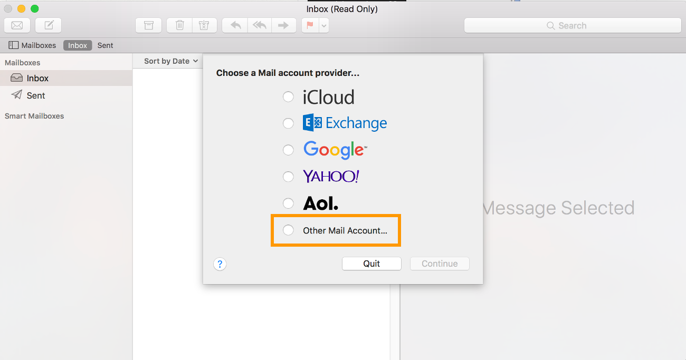

**Letzte Aktualisierung am 18.03.2020**

## Ziel

E-Mail Pro Accounts können auch auf einem kompatiblen E-Mail-Client eingerichtet werden. So können Sie Ihre bevorzugte App für Ihre E-Mail-Adressen verwenden.

**In dieser Anleitung erfahren Sie, wie Sie Ihren E-Mail Pro Account auf der Mail App von macOS El Capitan, Sierra und High Sierra einrichten.**

> [!warning]
>OVHcloud stellt Ihnen Dienstleistungen zur Verfügung, für deren Konfiguration und Verwaltung Sie die alleinige Verantwortung tragen. Es liegt somit bei Ihnen, sicherzustellen, dass diese ordnungsgemäß funktionieren.
>
>Wir stellen Ihnen diese Anleitung zur Verfügung, um Ihnen bei der Bewältigung alltäglicher Verwaltungsaufgaben zu helfen. Dennoch empfehlen wir Ihnen, falls Sie Hilfe brauchen, einen spezialisierten Dienstleister und/oder den Herausgeber des Dienstes zu kontaktieren. Für externe Dienstleistungen bietet OVHcloud leider keine Unterstützung. Weitere Hinweise finden Sie im Teil „Weiterführende Informationen” dieser Anleitung.
>

## Voraussetzungen

- Sie besitzen ein [E-Mail Pro](https://www.ovh.de/emails/email-pro/) Angebot.
- Die Mail App ist auf Ihrem Gerät installiert
- Sie haben die Login-Daten der E-Mail-Adresse, die Sie einrichten möchten.

> [!primary]
>
> Diese Anleitung gilt für folgende macOS Versionen: El Capitan, Sierra, High Sierra.
>

## In der praktischen Anwendung

Es gibt zwei Möglichkeiten, um Ihre E-Mail-Adresse zur Mail App hinzuzufügen:

- **In nur wenigen Klicks über unser Apple Devices Tool**: Klicken Sie auf den Link [https://autodiscover.mail.ovh.net/AppleDevices/](https://autodiscover.mail.ovh.net/AppleDevices/){.external} und folgen Sie den Konfigurationsschritten.

- **Folgen Sie dem Konfigurationsassistenten der Mail App**: Starten Sie die Mail App auf Ihrem Gerät.

Die vorliegende Anleitung beschreibt von hier an nur die Konfiguration über die Mail App.

### Schritt 1: Account hinzufügen

> [!primary]
>
> In dieser Anleitung verwenden wir als Serverbezeichnung: pro**X**.mail.ovh.net. Das „X“ muss mit der jeweils passenden Nummer Ihres zuständigen Servers für den einzurichtenden Email Pro Dienst ersetzt werden.
> 
> Sie finden diese Information im [OVHcloud Kundencenter](https://www.ovh.com/auth/?action=gotomanager), wenn Sie im Bereich `Web Cloud`{.action} im Menü links unter `E-Mail Pro`{.action}
> den Dienst auswählen. Der Servername wird im Kasten **Verbindung** auf der Seite `Allgemeine Informationen`{.action} angezeigt.
>

Nachdem Sie die Mail App auf Ihrem Gerät gestartet haben, können Sie einen Account auf zwei Arten hinzufügen:

- **Wenn Sie die App zum ersten Mal starten**, öffnet sich ein Fenster, in dem Sie einen Anbieter für Ihren E-Mail-Account auswählen können. Wählen Sie `Anderen Mail-Account hinzufügen`{.action} und fahren Sie fort.

- **Wenn Sie bereits einen Account eingerichtet haben**, klicken Sie auf `Mail`{.action} am oberen Rand Ihres Bildschirms und anschließend auf `Account hinzufügen`{.action}. Wählen Sie `Anderen Mail-Account hinzufügen`{.action} und fahren Sie fort.

{.thumbnail}

Geben Sie Ihre Account-Daten ein:

|Information|Beschreibung|  
|---|---|  
|Name|Geben Sie den Namen ein, der als Absender angezeigt werden soll, wenn E-Mails von dieser Adresse aus versendet werden.| 
|E-Mail-Adresse|Geben Sie die vollständige E-Mail-Adresse ein.| 
|Passwort|Geben Sie das Passwort der E-Mail-Adresse ein.|  

Klicken Sie auf `Anmelden`{.action}. Es erscheint eine Nachricht, die Sie auffordert, fortzufahren und anschließend weitere Informationen einzugeben.

|Information|Beschreibung|  
|---|---|  
|Accounttyp|Lassen Sie IMAP im Drop-down-Menü ausgewählt.| 
|Server für eintreffende E-Mails|Tragen Sie „pro**X**.mail.ovh.net“ ein.| 
|Server für ausgehende E-Mails|Tragen Sie „pro**X**.mail.ovh.net“ ein.|  

Klicken Sie erneut auf `Anmelden`{.action}. Wenn Ihre Angaben korrekt sind, wird die Verbindung zu Ihrem Account hergestellt.

{.thumbnail}

Stellen Sie sicher, dass Sie bei der Wahl der Anwendungen `Mail`{.action} ausgewählt lassen, damit die App den Account verwenden kann. Klicken Sie anschließend auf `Fertig`{.action}.

Sie können eine Test-E-Mail versenden, um zu überprüfen, dass der Account korrekt eingerichtet ist.

Wenn manuelle Änderungen in den Account-Einstellungen erforderlich sind, verwenden Sie die folgenden technischen Einstellungen für unsere E-Mail Pro Lösung.

|Servertyp|Servername|SSL|Port|
|---|---|---|---|
|Für eintreffende E-Mails|pro**X**.mail.ovh.net|Ja|993|
|Für ausgehende E-Mails|pro**X**.mail.ovh.net|Ja|587|

### Schritt 2: E-Mail-Adresse verwenden

Ihre E-Mail-Adresse ist nun fertig konfiguriert und Sie können jetzt Nachrichten versenden und empfangen.

OVHcloud bietet Ihnen außerdem eine Webanwendung mit [kollaborativen Funktionen](https://www.ovh.de/emails/). Diese ist über <https://www.ovh.de/mail/> verfügbar. Sie können sich mit den Login-Daten Ihrer E-Mail-Adresse anmelden. 

## Weiterführende Informationen

Für den Austausch mit unserer User Community gehen Sie auf [https://community.ovh.com/en/](https://community.ovh.com/en/){.external}.