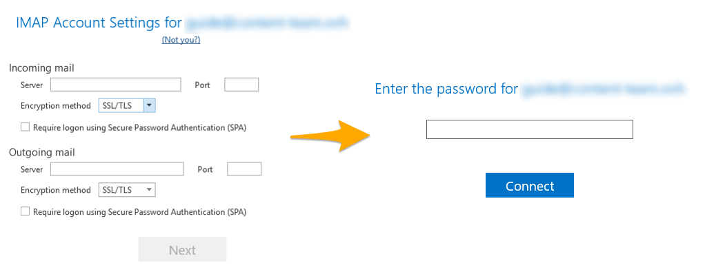

**Dernière mise à jour le 19/03/2020**

## Objectif

Les comptes E-mail Pro peuvent être configurés sur différents logiciels de messagerie compatibles. Cela vous permet d’utiliser votre adresse e-mail depuis l’appareil de votre choix.

**Apprenez à configurer un compte E-mail Pro sur Outlook 2016 pour Windows.**

> [!warning]
>
> OVH met à votre disposition des services dont la configuration, la gestion et la responsabilité vous incombent. Il vous revient de ce fait d'en assurer le bon fonctionnement.
> 
> Nous mettons à votre disposition ce guide afin de vous accompagner au mieux sur des tâches courantes. Néanmoins, nous vous recommandons de faire appel à un prestataire spécialisé et/ou de contacter l'éditeur du service si vous éprouvez des difficultés. En effet, nous ne serons pas en mesure de vous fournir une assistance. Plus d'informations dans la section « Aller plus loin » de ce guide.
> 

## Prérequis

- Disposer d'une offre [E-mail Pro](https://www.ovh.com/fr/emails/email-pro/){.external}.
- Disposer du logiciel Microsoft Outlook 2016 installé sur votre appareil.
- Posséder les identifiants relatifs à l'adresse e-mail que vous souhaitez paramétrer.

> [!primary]
>
> Vous utilisez Outlook 2016 pour Mac ? Consultez notre documentation : [Configurer son compte E-mail Pro sur Outlook 2016 pour Mac](https://docs.ovh.com/fr/emails-pro/configuration-outlook-2016-mac/){.external}.
>

## En pratique

### Étape 1 : ajouter le compte

> [!primary]
>
> Dans notre exemple, nous utilisons la mention serveur : pro**X**.mail.ovh.net. Vous devrez remplacer le « X » par le chiffre désignant le serveur de votre service E-mail Pro.
> 
> Retrouvez ce chiffre dans votre [espace client OVHcloud](https://www.ovh.com/auth/?action=gotomanager){.external}, dans la rubrique `Web`{.action} puis `E-mail Pro`{.action}
>  dans la colonne de gauche. Le nom du serveur est visible dans le cadre **Connexion** de l'onglet `Informations Générales`{.action}.
> 

Une fois l'application Outlook lancée sur votre appareil, l'ajout d'un compte peut être effectué de deux manières différentes.

- **Lors du premier démarrage de l'application** : un assistant de configuration s'affiche et vous invite à renseigner votre adresse e-mail.

- **Si un compte a déjà été paramétré** : cliquez sur `Fichier`{.action} dans la barre de menu en haut de votre écran puis sur `Ajouter un compte`{.action}.

{.thumbnail}

Renseignez à présent votre adresse e-mail, puis appuyez sur `Options avancées`{.action}. Cochez la case à côté de `Configurer mon compte manuellement`{.action} qui vient d'apparaître, puis cliquez sur `Connexion`{.action}. Parmi les différents types de comptes, choisissez **IMAP**.

{.thumbnail}

Complétez ensuite les informations demandées :

- **pour le courrier entrant :**

|Information|Description|
|---|---|
|Serveur|Renseignez le serveur « pro**X**.mail.ovh.net ».|
|Port|Indiquez le port « 993 ».|
|Méthode de chiffrement|Sélectionnez « SSL/TLS ».|
|Exiger l'authentification|Ne cochez pas la case « Exiger l'authentification par mot de passe sécurisé (SPA) lors de la connexion ».|

- **pour le courrier sortant :**

|Information|Description|
|---|---|
|Serveur|Renseignez le serveur « pro**X**.mail.ovh.net ».|
|Port|Indiquez le port « 587 ».|
|Méthode de chiffrement|Sélectionnez « STARTTLS ».|
|Exiger l'authentification|Ne cochez pas la case « Exiger l'authentification par mot de passe sécurisé (SPA) lors de la connexion ».|

Une fois les informations complétées, cliquez sur `Suivant`{.action} puis renseignez le **mot de passe** de l'adresse e-mail. Si les informations renseignées sont correctes, la connexion au compte réussira.

Vous pouvez effectuer un test d'envoi pour vérifier que le compte est correctement paramétré.

{.thumbnail}

Si vous êtes amené à renseigner manuellement des champs techniques dans les préférences du compte, vous trouverez ci-dessous les paramètres à utiliser avec notre offre E-mail Pro :

|Type de serveur|Nom du serveur|Méthode de chiffrement|Port|
|---|---|---|---|
|Entrant|pro**X**.mail.ovh.net|SSL/TLS|993|
|Sortant|pro**X**.mail.ovh.net|STARTTLS|587|

### Étape 2 : utiliser l'adresse e-mail

Une fois l'adresse e-mail configurée, il ne reste plus qu’à l'utiliser ! Vous pouvez dès à présent envoyer et recevoir des messages.

OVH propose également une application web disposant de [fonctions collaboratives](https://www.ovh.com/fr/emails/){.external}. Celle-ci est accessible à l’adresse <https://pro1.mail.ovh.net>. Vous pouvez vous y connecter grâce aux identifiants de votre adresse e-mail.

## Aller plus loin

[Configurer son adresse e-mail comprise dans l’offre MX Plan ou dans une offre d’hébergement web sur Outlook 2016 pour Windows](https://docs.ovh.com/fr/emails/configuration-outlook-2016/){.external}

[Configurer son compte Exchange sur Outlook 2016 pour Windows](https://docs.ovh.com/fr/microsoft-collaborative-solutions/exchange-configuration-automatique-sous-outlook-2016/){.external}

Échangez avec notre communauté d'utilisateurs sur <https://community.ovh.com>.