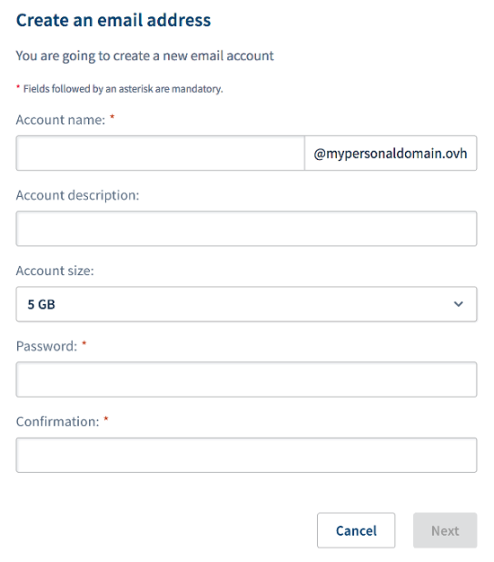

**Última atualização: 05/02/2019**

## Sumário

Os endereços de e-mail da oferta MX Plan permitem enviar e receber e-mails no dispositivo que preferir.

**Saiba como criar um endereço de e-mail com a oferta MX Plan.**

## Requisitos

- Dispor de uma oferta MX Plan (incluída na oferta de [alojamento web da OVH](https://www.ovh.pt/alojamento-partilhado/){.external}).
- Ainda ter a possibilidade de criar endereços de e-mail no âmbito do seu plano.
- Ter acesso à secção de gestão da oferta MX Plan através da [Área de Cliente OVH](https://www.ovh.com/auth/?action=gotomanager){.external}.

## Instruções

### 1 - Aceder à interface de gestão do serviço de e-mail

Para começar, aceda à [Área de Cliente OVH](https://www.ovh.com/auth/?action=gotomanager){.external}. Clique em `E-mails`{.action} na barra à esquerda e selecione o domínio para o qual a oferta MX Plan foi subscrita. Clique no separador `Emails`{.action}.

Aparecerá uma tabela com todas os endereços de e-mail criados com o plano MX Plan.

{.thumbnail}

### 2 - Criar o endereço de e-mail

Para criar um novo endereço de e-mail, clique no botão `Criar um endereço de e-mail`{.action}. Na nova janela que aparecerá, preencha as informações necessárias:

|Informação|Descrição|  
|---|---|  
|Nome da conta|Introduza um nome para o seu endereço de e-mail (por exemplo, nome.apelido). O domínio em questão já está preenchido por predefinição.|  
|Descrição da conta|Insira uma breve descrição que lhe permita reconhecer esta conta do resto das contas na sua Área de Cliente OVH.|  
|Tamanho da conta|Selecione o tamanho da conta que pretende. Trata-se do espaço que o seu endereço terá para armazenar mensagens.|  
|Palavra-passe|Introduza a respetiva palavra-passe, confirme-a|

e clique em `Seguinte`{.action}. De seguida, verifique as informações apresentadas no resumo. Se estiverem corretas, clique novamente em `Seguinte`{.action}.

Finalmente, clique em `Validar`{.action} para lançar a criação do endereço de e-mail. Volte a efetuar esta operação as vezes que forem necessárias para criar vários endereços de e-mail.

> [!primary]
>
> Por razões de segurança, escolha a sua palavra-passe de acordo com as indicações apresentadas. Além disso, recomendamos que:
>
> - não utilize duas vezes a mesma palavra-passe;
>
> - selecione uma palavra-passe sem qualquer relação com as suas informações pessoais (apelido, nome ou data de nascimento, por exemplo);
>
> - renove as suas palavras-passe de forma regular;
>
> - não anote nem envie as suas palavras-passe para o seu endereço de e-mail;
>
> - não guarde as suas palavras-passe no seu browser, mesmo que lhe seja sugerido.
>

{.thumbnail}

### 3 - Utilizar o endereço de e-mail

Os seus endereços de e-mail podem ser usados com o Roundcube, um serviço de webmail incluído na oferta de alojamento OVH. Para isso, a OVH coloca à disposição uma aplicação online (webmail): Roundcube. Aceda a <https://www.ovh.com/pt/mail/>, e preencha os dados associados ao endereço de e-mail criado através do sistema OVH.

Para saber mais sobre o Roundcube, consulte o manual: [Utilização do Roundcube](https://docs.ovh.com/pt/emails/webmail_guia_de_utilizacao_do_roundcube/){.external}. Se desejar associar o seu endereço de e-mail a um software (cliente) de correio eletrónico no computador, smartphone ou um tablet, consulte a página: <https://docs.ovh.com/pt/emails/>.

## Quer saber mais?

Fale com a nossa comunidade de utilizadores em [https://community.ovh.com/en/](https://community.ovh.com/en/){.external}