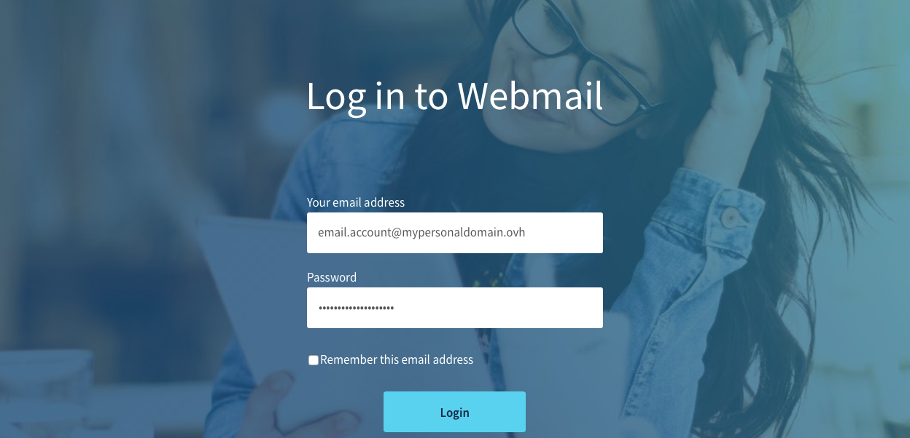
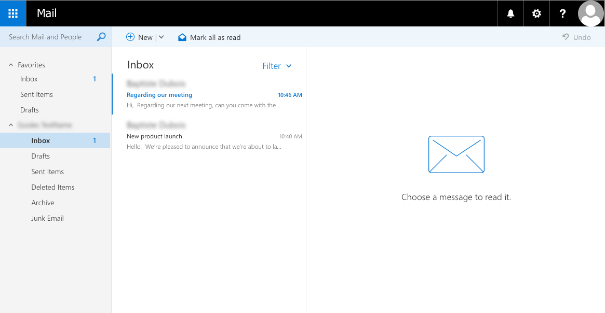
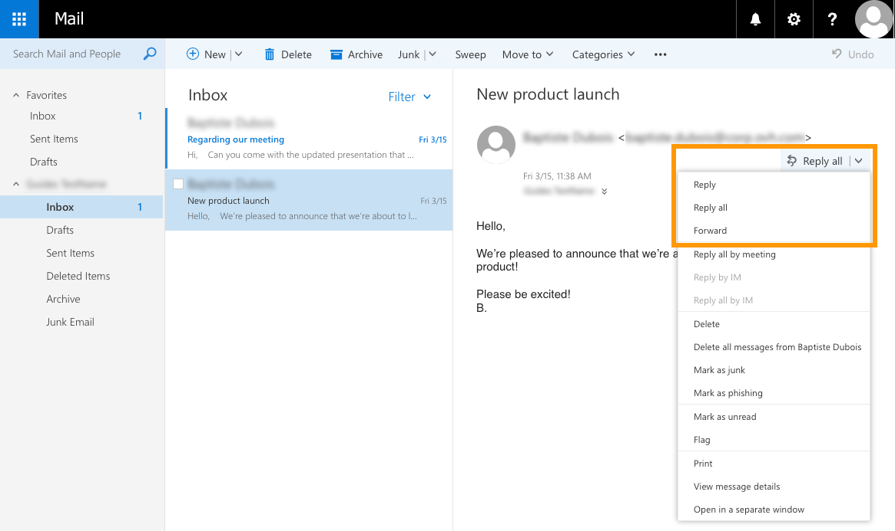
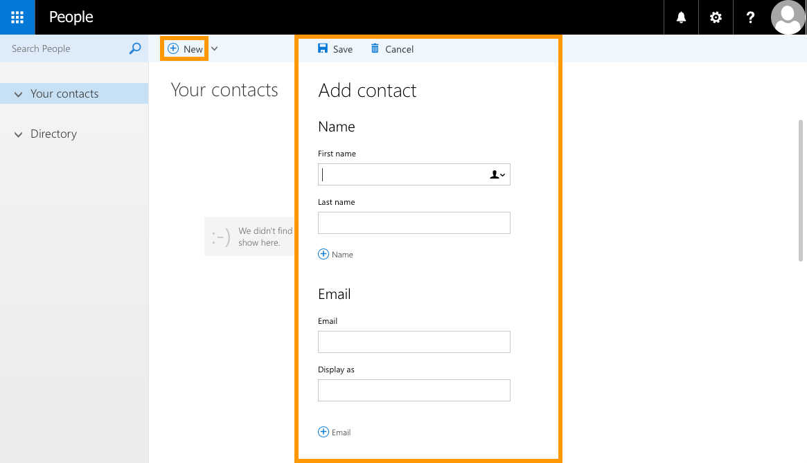
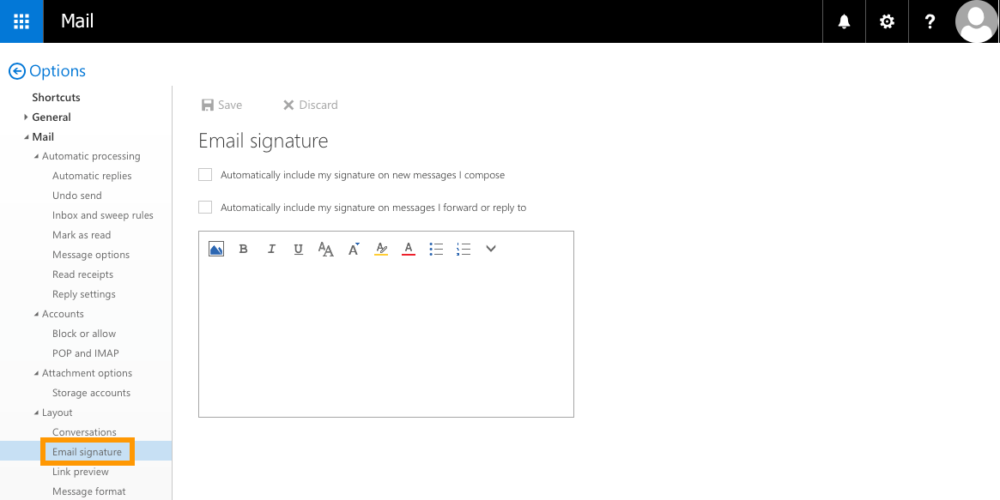
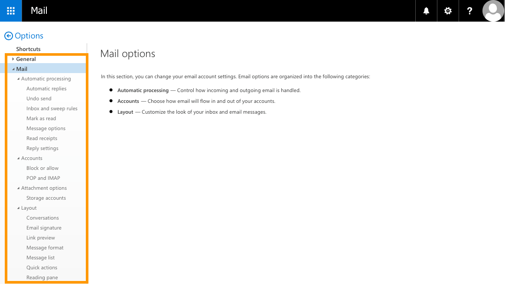

**Stand 28.06.2019**

## Einleitung

Mit E-Mail-Adressen von MX Plan können Sie E-Mails über Ihr bevorzugtes Gerät versenden und empfangen. Um den Zugriff zu erleichtern, stellt OVH unter [diesem Link](https://www.ovh.de/mail/){.external} eine Online-Anwendung (Webmail) zur Verfügung: Outlook on the web (OWA).

**Hier erfahren Sie, wie Sie die gängigsten Aktionen zur Verwendung Ihrer E-Mail-Adresse mit OWA Webmail durchführen.**

## Voraussetzungen

- Sie besitzen ein MX Plan Angebot, verfügbar mit einer [Webhosting](https://www.ovh.de/hosting/){.external} Lösung, dem [kostenlosen Start 10M Hosting](https://www.ovh.de/domains/angebot_hosting_start10m.xml){.external} oder separat bestellbar.
- Sie haben die Login-Daten der E-Mail-Adresse, die Sie nutzen möchten.

## Beschreibung

In dieser Anleitung erhalten Sie ein besseres Verständnis dafür, wie Sie gängige Aufgaben mit OWA Webmail ausführen. Sie können die Anleitung komplett lesen oder direkt zu den für Sie interessanten Abschnitten springen.

1. [Auf OWA Webmail einloggen](./#1-auf-owa-webmail-einloggen)
2. [Die Webmail-Anzeige verstehen](https://docs.ovh.com/de/emails/verwendung-owa/#2-die-webmail-anzeige-verstehen)
3. [E-Mails einsehen](./#3-e-mails-einsehen)
4. [E-Mails senden und beantworten](./#4-e-mails-senden-und-beantworten)
5. [Posteingang organisieren](./#5-posteingang-organisieren)
6. [Adressbuch verwalten](./#6-adressbuch-verwalten_1)
7. [Passwort ändern](./#7-passwort-andern)
8. [Automatische Antwort einrichten](./#8-automatische-antwort-einrichten) (Auto-Reply)
9. [Signatur hinzufügen](./#9-signatur-hinzufugen)
10. [Auf Optionen zugreifen](./#10-auf-optionen-zugreifen)

> [!primary]
>
> Falls ein bestimmter Vorgang nicht in dieser Anleitung enthalten ist, suchen Sie im Internet nach entsprechender Dokumentation, da das OWA Interface nicht von OVH entwickelt wurde.
>

### 1. Auf OWA Webmail einloggen

Um sich mit Ihrer E-Mail-Adresse im OWA Webmail einzuloggen, gehen Sie auf die Seite „[Webmail Login](https://www.ovh.de/mail/){.external}“. Geben Sie dort Ihre vollständige E-Mail-Adresse und das zugehörige Passwort ein. Klicken Sie anschließend auf den Button `Login`{.action}.

{.thumbnail}

Beim ersten Login auf Outlook on the web Webmail werden Sie aufgefordert, die Sprache sowie Ihre Zeitzone festzulegen. Wählen Sie die entsprechenden Einstellungen aus und klicken Sie dann auf `Speichern`{.action}.

{.thumbnail}

Daraufhin wird Ihr Postfach angezeigt. 

{.thumbnail}

### 2. Die Webmail-Anzeige verstehen

Sobald Sie auf OWA Webmail eingeloggt sind, sehen Sie, dass die Anzeige in verschiedene Bereiche unterteilt ist. Mithilfe der folgenden Tabelle und Abbildung können Sie die Aufteilung besser kennenlernen.

|Bereiche|Beschreibung|  
|---|---|  
|oberer Bereich (1)|Enthält zwei Tab-Balken. Im ersten können die allgemeinen Einstellungen vorgenommen (z. B. Zugriff auf Optionen), im zweiten bestimmte Aktionen für Ihre E-Mail-Adresse durchgeführt werden (z. B. Versand oder Beantworten einer E-Mail).|  
|linker Bereich (2)|Listet die Ordner Ihrer E-Mail-Adresse auf. Die Liste wird in Form einer Ordnerstruktur angezeigt, deren Elemente Sie erweitern oder verbergen können.|
|mittlerer Bereich (3)|Listet die (gelesenen und ungelesenen) Nachrichten des Ordners auf, den Sie im linken Bereich ausgewählt haben. Dieser Teil kann auch das Ergebnis einer Suchanfrage anzeigen.|
|rechter Bereich (4)|Enthält den Lesebereich der ausgewählten Nachricht.|

{.thumbnail}

### 3. E-Mails einsehen

Um Ihre E-Mails einzusehen, klicken Sie auf einen Ordner im linken Bereich. Empfangene E-Mails werden standardmäßig im Ordner „Posteingang“ abgelegt. Um nachzusehen, ob Sie neue Nachrichten empfangen haben, überprüfen Sie, ob neben einem Ordner eine Zahl angezeigt wird.

Um eine E-Mail einzusehen, gehen Sie zum entsprechenden Ordner. Die Nachrichten des Ordners werden im mittleren Bereich angezeigt. Ungelesene Nachrichten werden in einer anderen Farbe angezeigt, um sie von bereits gelesenen zu unterscheiden.

{.thumbnail}

Klicken Sie auf eine E-Mail, um deren Inhalt im rechten Bereich anzuzeigen.

{.thumbnail}

### 4. E-Mails senden und beantworten

**Um eine neue E-Mail zu versenden**, klicken Sie auf den Button `Neu`{.action} im oberen Bereich des Webmail-Interface. Daraufhin wird rechts der Editierbereich angezeigt. Füllen Sie die Felder für Ihre E-Mail aus (Empfänger, Betreff, Nachricht, Anhänge). Wenn Ihre E-Mail fertig ist, klicken Sie auf den Butten `Senden`{.action}.

{.thumbnail}

**Um eine empfangene E-Mail zu beantworten**, [rufen Sie diese zunächst auf](./#3-e-mails-einsehen), sodass ihr Inhalt im rechten Bereich des Webmail-Interface angezeigt wird. Klicken Sie nun auf den Button `Allen antworten`{.action}. Wenn Sie nur dem Verfasser der E-Mail antworten möchten (um alle in Kopie gesetzten Personen auszuschließen), klicken Sie auf den Abwärtspfeil (˅).

{.thumbnail}

Wenn Sie auf eine E-Mail antworten, erscheint der Editierbereich über der Nachricht, ebenfalls im rechten Bereich des Interface. Verfassen Sie Ihre Antwort. Wenn Sie fertig sind, klicken Sie auf den Button `Senden`{.action}.

{.thumbnail}

### 5. Posteingang organisieren

Um den Posteingang nach Ihren Wünschen zu organisieren, haben Sie mehrere Möglichkeiten: 

- [Ordner und Unterordner erstellen](./#ordner-erstellen)
- [Nachrichten verschieben](./#nachrichten-verschieben)
- [Regeln einrichten](./#regeln-einrichten), um automatische Aktionen beim Empfang einer neuen E-Mail festzulegen 

#### Ordner erstellen

Um einen neuen Ordner zu erstellen, klicken Sie mit der rechten Maustaste im linken Bereich auf den Namen Ihrer E-Mail-Adresse und anschließend auf `Neuen Ordner erstellen`{.action}. Um einen Unterordner zu erstellen, klicken Sie mit der rechten Maustaste auf einen vorhandenen Ordner und dann auf `Neuen Unterordner erstellen`{.action}. 

{.thumbnail}

#### Nachrichten verschieben

**Um eine Nachricht zu verschieben**, klicken Sie auf die betreffende Nachricht, halten Sie die Maustaste gedrückt und verschieben Sie sie in den gewünschten Ordner.
**Um mehrere Nachrichten auf einmal zu verschieben**, wählen Sie die gewünschten Nachrichten aus, indem Sie im Kästchen daneben einen Haken setzen, und klicken Sie dann auf `Verschieben`{.action} (im rechten Bereich) oder auf `Verschieben in`{.action} (im oberen Bereich). Wählen Sie anschließend den Zielordner aus.

{.thumbnail}

#### Regeln einrichten

Um die Regeln zu verwalten, klicken Sie im oberen Bereich auf das Zahnrad-Symbol und anschließend auf `Optionen`{.action}.

{.thumbnail}

Klicken Sie im linken Bereich auf der neu geöffneten Seite auf `Posteingangsregeln`{.action}. Diese finden Sie in der Ordnerstruktur der Optionen unter „E-Mail“ und „Automatische Verarbeitung“. Hier können Sie Regeln in der Liste erstellen, bearbeiten, löschen oder verschieben. 

> [!primary]
>
> Wenn Sie mehrere Regeln anlegen, die bei denselben Bedingungen greifen, wird nur die erste Regel in der Liste angewendet.
>

Um eine neue Regel hinzuzufügen, klicken Sie auf den Button `+`{.action}. 

{.thumbnail}

Geben Sie nun die angeforderten Informationen an, um das gewünschte Verhalten einzurichten. Wenn Sie fertig sind, klicken Sie auf `OK`{.action}. 

{.thumbnail}

### 6. Adressbuch verwalten

Um zur Kontaktverwaltung zu gelangen, klicken Sie im oberen Bereich auf das Logo mit den 9 Vierecken und anschließend auf `Personen`{.action}.

{.thumbnail}

Auf der neu geöffneten Seite können Sie einen neuen Kontakt hinzufügen, eine Kontaktliste anlegen oder vorhandene Kontakte löschen. 

**Um einen neuen Kontakt hinzuzufügen**, klicken Sie auf `Neu`{.action} und geben Sie anschließend die Informationen des Kontakts ein, den Sie hinzufügen möchten. Wenn Sie fertig sind, klicken Sie auf `Speichern`{.action}.

{.thumbnail}

**Um eine Kontaktliste zu erstellen**, klicken Sie auf den Abwärtspfeil (˅) neben „Neu“ und dann auf `Kontaktliste`{.action}. Geben Sie einen Namen für die Liste ein, fügen Sie Mitglieder hinzu und klicken Sie dann auf `Speichern`{.action}.

{.thumbnail}

### 7. Passwort ändern

Wenn Sie auf OWA eingeloggt sind, können Sie Ihr Passwort ändern. Klicken Sie hierzu im oberen Bereich auf das Zahnrad-Symbol und anschließend auf `Optionen`{.action}.

{.thumbnail}

Erweitern Sie im linken Bereich auf der neu geöffneten Seite den Tab „Allgemein“ der Ordnerstruktur und klicken Sie auf `Mein Konto`{.action}. Klicken Sie dann auf `Kennwort ändern`{.action}.

{.thumbnail}

Geben Sie im neu geöffneten Fenster zunächst Ihr aktuelles Passwort ein. Geben Sie anschließend Ihr neues Passwort ein und bestätigen Sie dieses. Um die Änderung zu speichern, klicken Sie auf den Button `Speichern`{.action}.

> [!primary]
>
> Geben Sie das neue Passwort auf allen Geräten ein, auf denen die E-Mail-Adresse eingerichtet ist.
>

{.thumbnail}

### 8. Automatische Antwort einrichten

In OWA können Sie automatische Antworten für Ihre E-Mail-Adresse einrichten (im Prinzip wie ein Anrufbeantworter). Klicken Sie hierzu im oberen Bereich auf das Zahnrad-Symbol und anschließend auf `Automatische Antworten`{.action}.

{.thumbnail}

Setzen Sie im neu geöffneten Fenster einen Haken neben „Automatische Antworten senden“. Sie haben nun die Möglichkeit, den Versand nach verschiedenen Kriterien anzupassen, und können:
- automatische Antworten nur in einem bestimmten Zeitraum oder kontinuierlich, bis sie deaktiviert werden, senden
- festlegen, an wen die automatischen Antworten versendet werden (nur an interne Absender in Ihrer Kontaktliste oder auch an externe Absender)

Geben Sie nun die angeforderten Informationen an, um das gewünschte Verhalten einzurichten. Wenn Sie fertig sind, klicken Sie auf `OK`{.action}. 

{.thumbnail}

### 9. Signatur hinzufügen

Um eine Signatur hinzuzufügen, klicken Sie im oberen Bereich auf das Zahnrad-Symbol und anschließend auf `Optionen`{.action}.

{.thumbnail}

Klicken Sie im linken Bereich auf der neu geöffneten Seite auf `E-Mail-Signatur`{.action}. Diese finden Sie in der Ordnerstruktur der Optionen unter „E-Mail“ und „Layout“. Hier können Sie die Verwendung der Signatur aktivieren oder deaktivieren und ihren Inhalt bearbeiten.

{.thumbnail}

Um Ihre E-Mail-Signatur zu bearbeiten, nutzen Sie das hierfür vorgesehene Textfeld. Legen Sie außerdem fest, ob Sie die Signatur in neu verfassten Nachrichten und in Nachrichten, die Sie weiterleiten oder beantworten, verwenden möchten. Wenn Sie fertig sind, klicken Sie auf `Speichern`{.action}. 

### 10. Auf Optionen zugreifen

Um auf die Optionen zuzugreifen, klicken Sie im oberen Bereich auf das Zahnrad-Symbol und anschließend auf `Optionen`{.action}.

{.thumbnail}

Gehen Sie dann im linken Bereich in die Ordnerstruktur der Optionen.

{.thumbnail}

## Weiterführende Informationen

Für den Austausch mit unserer User Community gehen Sie auf <https://community.ovh.com/en/>.