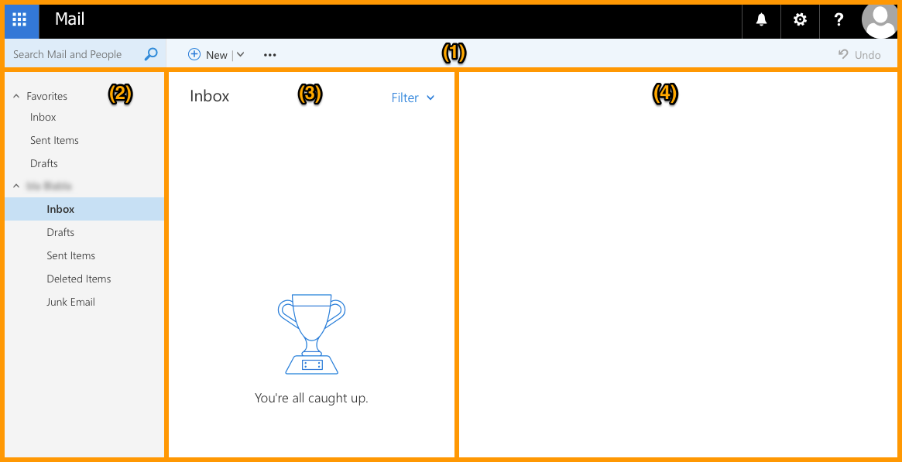
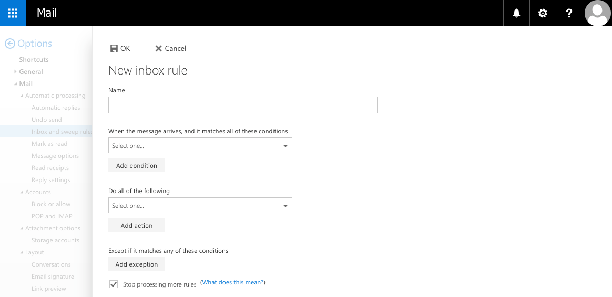
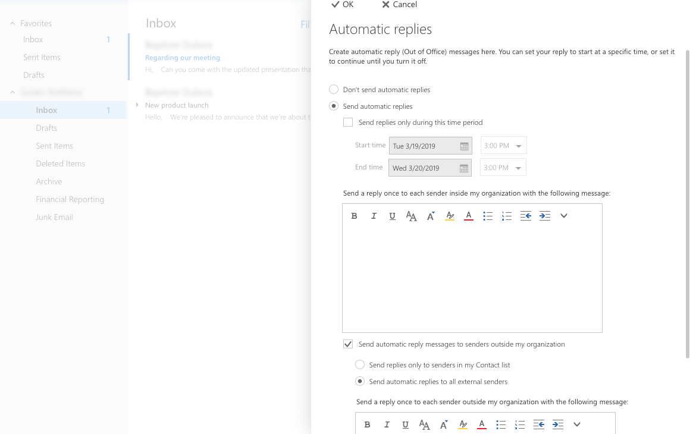

**Última atualização: 28/06/2019**

## Sumário

Os endereços de e-mail da oferta MX Plan permitem-lhe enviar e receber e-mails no dispositivo que preferir. Para simplificar este acesso, a OVH disponibiliza-lhe uma aplicação online (webmail) acessível [a partir de um endereço web específico](https://www.ovh.pt/mail/){.external}: Outlook Web Access (OWA).

**Este manual explica como realizar as operações mais comuns num endereço de e-mail a partir do webmail OWA.**

## Requisitos

- Ter o serviço MX Plan (incluído num plano de [alojamento web](https://www.ovh.pt/alojamento-partilhado/){.external}, num [alojamento gratuito Start 10M](https://www.ovh.pt/dominios/oferta_alojamento_start10m.xml){.external} ou disponível em separado).
- Ter acesso às credenciais do endereço de e-mail que pretende utilizar.

## Instruções

Esta documentação permite-lhe melhor compreender determinadas operações comuns que podem ser realizadas a partir do webmail OWA. Poderá encontrar algumas ações a seguir:

1. [Aceder ao webmail OWA](./#1-aceder-ao-webmail-owa).
2. [Entender a distribuição do webmail](./#2-compreender-a-distribuicao-do-webmail).
3. [Consultar os e-mails](./#3-consultar-os-e-mails).
4. [Enviar ou responder a um e-mail](./#4-enviar-ou-responder-a-um-e-mail).
5. [Organizar a caixa de entrada](./#5-organizar-a-caixa-de-entrada).
6. [Gerir os contactos](./#6-gerir-os-contactos_1).
7. [Alterar a palavra-passe](./#7-alterar-a-palavra-passe).
8. [Adicionar uma resposta automática](./#8-adicionar-uma-resposta-automatica) (atendedor).
9. [Adicionar uma assinatura](./#9-adicionar-uma-assinatura).
10. [Aceder às opções](./#10-aceder-as-opcoes).

> [!primary]
>
> A OVH não criou a interface OWA e é possível que algumas ações não estejam incluídas neste manual, pelo que não podemos orientá-lo sobre como executá-las.
>

### 1. Aceder ao webmail OWA

Para aceder ao webmail OWA com o seu endereço de e-mail, aceda à página “[Ligação ao webmail](https://www.ovh.pt/mail/){.external}”. Indique o seu endereço de e-mail completo e a respetiva palavra-passe. De seguida, clique no botão `Ligação`{.action}.

{.thumbnail}

Se for a primeira vez que acede ao webmail Outlook Web Access com este endereço de e-mail, deverá definir o idioma da interface e o fuso horário no qual se encontra. Faça a sua escolha e clique em `Guardar`{.action}.

{.thumbnail}

A seguir, poderá consultar a sua caixa de entrada. 

{.thumbnail}

### 2. Compreender a distribuição do webmail

A interface do webmail OWA divide-se em várias secções, que poderá consultar abaixo:

|Secção|Descrição|  
|---|---|  
|Parte superior (1)|Contém dois separadores. O primeiro permite gerir parâmetros gerais (aceder às opções, por exemplo), o segundo permite realizar ações precisas com o seu endereço (enviar ou responder a um e-mail, por exemplo).|  
|Parte lateral esquerda (2)|Apresenta a lista das pastas do seu endereço de e-mail. Estas pastas aparecem em forma de diretórios que podem ser abertos ou fechados.|
|Parte central (3)|Apresenta a lista das mensagens (lidas ou não lidas) da pasta que selecionou na parte lateral esquerda. Esta parte também pode apresentar o resultado de uma pesquisa.|
|Parte lateral direita (4)|Apresenta o conteúdo de uma mensagem selecionada.|

{.thumbnail}

### 3. Consultar os e-mails

Para consultar os seus e-mails, selecione uma pasta na parte lateral esquerda. Por predefinição, os e-mails que recebe chegam à pasta “Caixa de entrada”. Para identificar novas mensagens recebidas, repare se aparece um número junto à pasta.

Para consultar um e-mail, clique na pasta. As mensagens presentes nessa mesma pasta aparecem na parte central. As mensagens não lidas são apresentados com uma cor diferente para que possa distingui-las das mensagens lidas.

{.thumbnail}

A seguir, clique no e-mail para visualizar o conteúdo na parte lateral direita.

{.thumbnail}

### 4. Enviar ou responder a um e-mail

**Para enviar um novo e-mail**, clique no botão `Novo`{.action} na parte lateral superior do webmail. A zona de redação aparecerá na parte lateral direita. Preencha os campos inerentes à mensagem (destinatários, objeto, corpo da mensagem, anexos). Quando a sua mensagem estiver pronta, envie-a clicando no botão `Enviar`{.action}.

{.thumbnail}

**Para responder a um e-mail que recebeu**, [consulte-o](./#3-consultar-os-e-mails) para que o seu conteúdo apareça na parte lateral direita do webmail.  A seguir, clique no botão `Responder a todos`{.action}. Utilize o botão em forma de seta descendente se pretender reencaminhar ou responder só ao remetente do e-mail (excluindo assim as pessoas em Cc).

{.thumbnail}

Ao escolher a opção de responder, aparecerá uma zona de redação acima da mensagem, sempre na parte lateral direita. Insira a sua resposta e, quando a sua mensagem estiver pronta para ser enviada, clique em `Enviar`{.action}.

{.thumbnail}

### 5. Organizar a caixa de entrada

Para organizar a caixa de entrada, pode realizar diferentes ações: 

- [criar pastas e subpastas](./#criar-uma-pasta);
- [mover mensagens](./#mover-uma-mensagem);
- [atribuir regras](./#criar-uma-regra) para que as ações automáticas sejam realizadas quando recebe uma nova mensagem. 

#### Criar uma pasta

Para criar uma nova pasta, clique com o botão direito do rato no nome do seu endereço de e-mail, na parte lateral à esquerda, e clique em `Criar nova pasta`{.action}. Ao clicar numa pasta existente, poderá criar uma subpasta clicando em `Criar nova subpasta`{.action}. 

{.thumbnail}

#### Mover uma mensagem

**Para mover uma mensagem**, clique na respetiva mensagem e, mantendo o botão do rato pressionado, deslize-a para a pasta para onde a quer mover.
**Para mover várias mensagens** de uma só vez, escolha as mensagens que quer mover selecionando-as e, depois, clique em `Mover`{.action} (na parte lateral direita) ou em `Mover para`{.action} (na parte superior). A seguir, selecione a pasta de destino.

{.thumbnail}

#### Criar uma regra

Para gerir as regras, clique no ícone em forma de roda dentada na parte superior e, a seguir, em `Opções`{.action}.

{.thumbnail}

Na parte lateral esquerda da nova página que aparece, clique em `Regras da caixa de entrada`{.action}. Na lista das opções, esta escolha encontra-se em “Correio” > “Processamento automático”. A partir daí, poderá criar, alterar, eliminar ou mover regras na lista. 

> [!primary]
>
> Se criar várias regras com as mesmas condições, só será executada a primeira da lista.
>

Para adicionar uma nova regra, clique em `+`{.action}. 

{.thumbnail}

De seguida, preencha as informações solicitadas consoante o comportamento que pretende obter. Depois de fazer isso, clique em `OK`{.action}. 

{.thumbnail}

### 6. Gerir os contactos

Para aceder à gestão dos contactos, clique no logótipo que representa nove quadrados na parte superior e, depois, em `Pessoas`{.action}.

{.thumbnail}

Na nova página que aparece, pode adicionar um novo contacto, criar uma lista de contactos ou eliminar entradas existentes. 

**Para adicionar um novo contacto**, clique em `Novo`{.action} e introduza as informações do contacto que pretende adicionar. Depois de fazer isso, clique em **Guardar**.

{.thumbnail}

**Para criar uma lista de contactos**, clique no botão em forma de seta para baixo junto de “Novo” e selecione a opção `Lista de contactos`{.action}. Atribua-lhe um nome e adicione membros. De seguida, clique em `Guardar`{.action}.

{.thumbnail}

### 7. Alterar a palavra-passe

Uma vez ligado ao OWA, poderá alterar a sua palavra-passe. Para isso, clique no ícone em forma de roda dentada na parte superior e, a seguir, em `Opções`{.action}.

{.thumbnail}

Na nova janela, do lado esquerdo, expanda a opção “Geral” e depois clique em `A minha conta`{.action}. Finalmente, clique em `Alterar a palavra-passe`{.action}.

{.thumbnail}

Na nova janela, comece por indicar a sua palavra-passe atual. A seguir, escreva a nova palavra-passe e confirme-a. Clique no botão `Guardar`{.action} para a alteração ficar registada.

> [!primary]
>
> Deverá indicar a nova palavra-passe em todos os dispositivos onde o endereço de e-mail foi configurado.
>

{.thumbnail}

### 8. Adicionar uma resposta automática

Uma vez ligado ao OWA, pode criar uma resposta automática (atendedor) no seu endereço de e-mail. Para isso, clique no ícone em forma de roda dentada na parte superior e, a seguir, em `Respostas automáticas`{.action}.

{.thumbnail}

Na nova janela, comece por selecionar a opção “Enviar respostas automáticas”. Terá então a possibilidade de configurar este envio segundo vários critérios:
- enviar mensagens de resposta automática durante um intervalo de tempo definido ou de forma contínua até à desativação;
- definir o destinatário das mensagens de resposta automática para quem serão enviadas (remetentes internos apenas, ou incluindo remetentes externos).

De seguida, preencha as informações solicitadas consoante o comportamento que pretende obter. Depois de fazer isso, clique em `OK`{.action}. 

{.thumbnail}

### 9. Adicionar uma assinatura

Para adicionar uma assinatura, clique no ícone em forma de roda dentada na parte superior e, a seguir, em `Opções`{.action}.

{.thumbnail}

Na parte lateral esquerda da nova página que aparece, clique em `Assinatura de e-mail`{.action}. Na lista das opções, esta escolha encontra-se em “Correio” > “Esquema”. Aqui, poderá ativar ou desativar a utilização da assinatura e alterar o seu conteúdo.

{.thumbnail}

Para alterar a sua assinatura eletrónica, utilize a zona de texto prevista para o efeito. Pode selecionar se quer que a assinatura seja incluída automaticamente nas novas mensagens que compõe ou também nas mensagens que reencaminha ou responde. Depois de fazer isso, clique em `Guardar`{.action}. 

### 10. Aceder às opções

Para aceder às opções do seu endereço de e-mail, clique no ícone em forma de roda dentada na parte superior e, a seguir, em `Opções`{.action}.

{.thumbnail}

Pode consultar todas as opções disponíveis no menu que aparece na parte lateral esquerda.

{.thumbnail}

## Quer saber mais?

Fale com a nossa comunidade de utilizadores em <https://community.ovh.com/en/>.