## Über die OVH Webseite
Begeben Sie sich auf die [OVH Webseite](http://www.ovh.de) und klicken Sie rechts oben auf "Webmail".

{.thumbnail}

### Verbindungs-Interface
Sie werden dann auf eine Internetseite geleitet, auf der Sie Ihre E-Mail-Adresse eingeben können.
Über dieses Interface werden Sie direkt mit dem Webmail Ihres OVH Mailing-Dienstes verbunden.

Wenn Sie bereits wissen, welcher unserer Webmail-Dienste der richtige für Sie ist, können Sie auch direkt darauf zugreifen. Klicken Sie hierfür unter "Die von OVH angebotenen Webmailer" auf .

Wenn Sie auf  klicken, kommen Sie direkt zu den OVH Anleitungen zum gewünschten Webmailer.

{.thumbnail}
Wenn Sie bei "Diese E-Mail-Adresse speichern" ein Häkchen setzen, werden alle so angegegebenen E-Mail-Adresse gespeichert und später rechts oben angezeigt (Webmail). So können Sie sich jederzeit direkt mit der gewünschten Adresse verbinden!


### Verbindungs-Interface
Es wird nun das Webmail-Interface Ihres Mailing-Dienstes angezeigt. Falls die E-Mail-Adresse nicht automatisch eingetragen ist, geben Sie sie erneut an.

Tragen Sie also Ihre E-Mail-Adresse und das dazugehörige Passwort ein und klicken Sie auf "Anmelden".

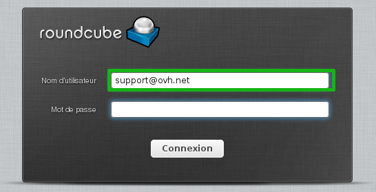{.thumbnail}


## Posteingang
Nach der Anmeldung mit Ihrem E-Mail-Account befinden Sie sich direkt im Posteingangsordner.
In der Spalte auf der linken Seite finden Sie die wichtigsten Ordner Ihres E-Mail-Accounts: empfangene und gesendete Mails, Entwürfe...

In der linken Spalte unten gelangen Sie auch zu den [Ordner-Einstellungen](#DOSSIERS) und der Anzeige zur Speicherbelegung Ihres E-Mail-Accounts.

Auf der rechten Seite der Anzeige werden die empfangenen E-Mails mit folgenden Informationen angezeigt:


- Absender,
- Betreff,
- Lesestatus der E-Mail,
- Eventuell zur Mail hinzugefügte Markierungen,
- Größe der E-Mail,
- Vorhandensein von Anhängen (in der Spalte mit der Büroklammer ganz rechts).


Standardmäßig werden einige Spalten nicht angezeigt, zum Beispiel zur den E-Mails zugewiesenen Priorität. Um dies zu ändern kann die Anzeige mit den weiter unten vorgestellten Optionen individuell angepasst werden.

{.thumbnail}


### Anzeige- und Sortieroptionen
Diese Option erreichen Sie über das Zahnrad-Icon im linken oberen Bereich des Roundcube Hauptfensters direkt neben dem Betreff (siehe Bild rechts).

Mit dieser Option können Sie:

- Weitere anzuzeigende Spalten hinzufügen (Priorität der E-Mails usw.).
- Die Spalte auswählen, die standardmäßig zur Sortierung der Mails verwendet werden soll.
- Die Sortierreihenfolge auswählen (auf- oder absteigend).


Sobald Sie Ihre Auswahl getätigt haben bestätigen Sie diese mit einem Klick auf "Speichern".

{.thumbnail}


### Status der E-Mails
Das RoundCube Webmail-Interface eignet sich für die Verwaltung sämtlicher E-Mail-Optionen (Lesebestätigungen, Markierungen, Anhänge usw.).
Auf dem Bild rechts sehen Sie einen Überblick über die verschiedenen Funktionen.

Die Anzahl ungelesener E-Mails wird in der linken Spalte direkt neben dem Posteingang angezeigt.
Eine nicht gelesene E-Mail wird im rechten Fenster fett angezeigt.

Sie können für jede E-Mail folgende Aktionen durchführen:

- Antworten: Direkte Antwort an den Absender der E-Mail.
- Allen antworten: Direkte Antwort an alle in den Feldern "An" und "Kopie" eingetragenen E-Mail-Adressen.
- Weiterleiten: Weiterleitung der ausgewählten E-Mail an den/die Empfänger Ihrer Wahl.
- Löschen: Verschiebt die ausgewählte E-Mail in den Ordner "Gelöscht".
- Spam: Verschiebt die ausgewählte E-Mail in den Ordner "Spam" und markiert diese als unerwünschte Spam-Mail.
- Markieren: Diese Option wird im nächsten Abschnitt der Hilfe vorgestellt.
- Mehr: Diese Option wird im übernächsten Abschnitt der Hilfe vorgestellt.


Wenn eine E-Mail markiert wird, erscheint ein rotes Fähnchen in der entsprechenden Spalte.
Wenn eine E-Mail mit einer Priorität versehen ist, wird ein aufsteigender (hohe / höchste Priorität) oder absteigender (niedrige Priorität) Pfeil angezeigt.

{.thumbnail}
Wenn ein Absender einer E-Mail eine Lesebestätigung angefordert hat, erhalten Sie folgende Nachricht, wenn Sie die E-Mail öffnen: 
Der Absender dieser E-Mail hat um eine Benachrichtigung gebeten, wenn Sie diese Mail lesen. Möchten Sie den Absender benachrichtigen? (Siehe Screenshot).


### Markieren
Wenn Sie auf "Markieren" klicken, wird folgendes Menü angezeigt.
Darüber können Sie eine Nachricht markieren, eine Markierung entfernen und eine bereits gelesene Nachricht erneut als ungelesen deklarieren. Diese Optionen können auch auf eine Auswahl mehrerer E-Mails gleichzeitig angewandt werden.

Die Markierungsoptionen sind nützlich, um bestimmte E-Mails in der Mailbox hervorzuheben.

{.thumbnail}


### Mehr
Wenn Sie auf "Mehr" klicken, wird folgendes Menü angezeigt.
Sie können darüber folgende Aktionen durchführen:

- Nachricht drucken: Öffnet die Nachricht in einem neuen Fenster zum Ausdruck aus.
- Lokal speichern: Download der E-Mail im .eml Format auf Ihren Computer.
- Als neue Nachricht öffnen: Erlaubt das Bearbeiten einer E-Mail unter Beibehaltung des originalen Layouts.
- Quelltext anzeigen: Anzeige des vollständigen Quelltexts der E-Mail. Dort finden Sie im Bedarfsfall auch den [Header der E-Mail](https://www.ovh.de/g1365.recuperation-entetes-e-mail#webmail_roundcube).
- In neuem Fenster öffnen: Öffnet die Nachricht in einem neuen Fenster. Dies ist nützlich, um mehrere E-Mails gleichzeitig zu öffnen.


{.thumbnail}


## Zugriff auf die Einstellungen
Sie müssen mit Ihrer E-Mail-Adresse mit dem RoundCube Webmail verbunden sein, um auf die Einstellungen zuzugreifen.
Klicken Sie auf das Zahnradsymbol oben rechts, um zu den Einstellungen Ihrer Mailbox zu gelangen.

{.thumbnail}


### Benutzeroberfläche
Klicken Sie auf "Benutzeroberfläche", um die Einstellungen des Interfaces aufzurufen.
Dort können Sie die verwendete Sprache, das Datumsformat und das Oberflächendesign auswählen.

Die weiteren verfügbaren Optionen sehen Sie im nebenstehenden Screenshot.

{.thumbnail}


### Mailbox-Ansicht
In der Rubrik Mailbox-Ansicht können Sie die Anzahl der E-Mails, die pro Seite angezeigt werden, einstellen. Sie können auch auswählen, ob standardmäßig eine Nachrichtenvorschau angezeigt oder eine Empfangsbestätigung gesendet werden soll.

Die weiteren verfügbaren Optionen sehen Sie im nebenstehenden Screenshot.

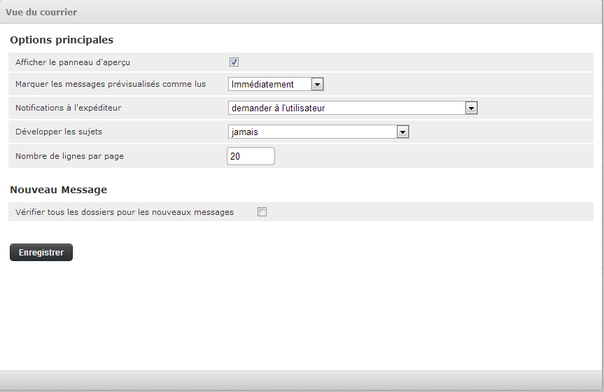{.thumbnail}


### Nachrichtendarstellung
In der Rubrik Nachrichtendarstellung können Sie auswählen, ob Nachrichten in einem neuen Fenster geöffnet werden und welches Format genutzt werden soll (HTML oder nicht).

Die weiteren verfügbaren Optionen sehen Sie im nebenstehenden Screenshot.

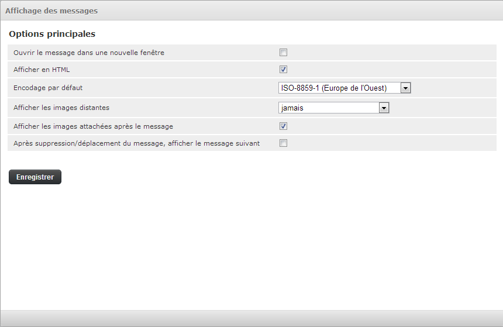{.thumbnail}


### Nachrichtenerstellung
In der Rubrik Nachrichtenerstellung können Sie verschiedene Optionen für das Verfassen Ihrer E-Mails festlegen: Format der E-Mail, Empfangsbestätigung, Signatur usw.

Die weiteren verfügbaren Optionen sehen Sie im nebenstehenden Screenshot.


- Im neuen  Roundcube-Interface ("Larry") ist die Option "Nachricht im HTML-Format erstellen" standardmäßig auf den Wert "nur bei Antwort auf HTML-Nachrichten" gesetzt.


Sie können dies auf "immer" umstellen, wenn Sie alle E-Mails im HTML-Format versenden möchten.

{.thumbnail}


### Adressbuch
In der Rubrik Adressbuch können Sie das standardmäßig verwendete Adressbuch (wenn mehrere [Adressbücher](#CARNET) erstellt wurden) sowie die Sortier- und Anzeigeoptionen der Kontakte festlegen.

Die weiteren verfügbaren Optionen sehen Sie im nebenstehenden Screenshot.

{.thumbnail}


### Spezialordner
In der Rubrik Spezialordner können Sie selbst festlegen, in welchen Ordnern Entwürfe, Gesendete E-Mails, Spam und Gelöschte E-Mails abgelegt werden sollen.

Die Erstellung personalisierter Ordner wird im Abschnitt [Ordner-Einstellungen](#DOSSIERS) beschrieben.

{.thumbnail}

### Server-Einstellungen
In der Rubrik Server-Einstellungen können Sie verschiedene Optionen im Zusammenhang mit der Löschung von E-Mails auf dem Server über das Webmail-Interface festlegen.

Die weiteren verfügbaren Optionen sehen Sie im nebenstehenden Screenshot.

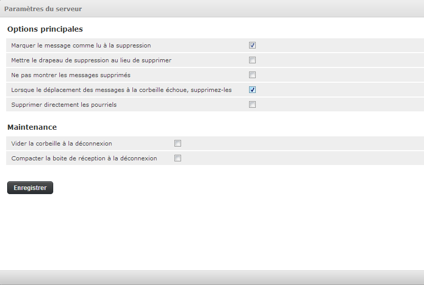{.thumbnail}

> [!primary]
> 
> Anwendungsbeispiel: Fehlermeldung beim Löschen von E-Mails
> Sie können keine E-Mails mehr empfangen, da Ihre Mailbox den gesamten verfügbaren Speicherplatz belegt. Sie möchten einige alte E-Mails löschen, um aufzuräumen und wieder neue Nachrichten empfangen zu können. Sie erhalten jedoch eine Fehlermeldung, die Sie am Löschen der gewünschten Mails hindert.
> Was ist der Grund?
Beim Löschen einer E-Mail wird diese zuerst in den Ordner "Gelöscht" kopiert, bevor sie aus dem Posteingang gelöscht wird (dies geschieht für den Benutzer unsichtbar im Hintergrund). Da die Mailbox jedoch bereits voll ist, kann die Kopie nicht durchgeführt werden, und deshalb wird diese Fehlermeldung angezeigt!
> Wie kann ich dies beheben?
> Setzen Sie in den Server-Einstellungen ein Häkchen bei der Option "Wenn verschieben in den Papierkorb fehlschlägt, Nachricht löschen". Sie können die nicht mehr benötigten E-Mails nun problemlos löschen.
> 

## Ordner

### Ordner erstellen (1)

Um einen personalisierten Ordner zu erstellen (um zum Beispiel alle E-Mails eines Kommunikationspartners oder alle Mails zu einem bestimmten Thema zu versammeln) klicken Sie auf das "+" Symbol.

{.thumbnail}

### Ordner erstellen (2)

In diesem Beispiel erstellen wir den Ordner "Test OVH". Dieser wird innerhalb der INBOX platziert und die Anzeige der E-Mails erfolgt in Listenform.

INBOX ist der englische Begriff für den "Posteingang". Der Ordner "Test OVH" wird also innerhalb des Ordners Posteingang erstellt.

Klicken Sie auf Speichern, um die Erstellung des Ordners abzuschließen.

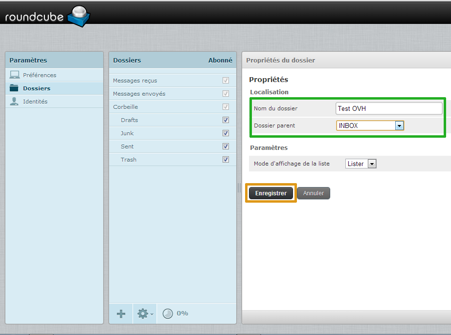{.thumbnail}

### Ordner erstellen (3)

Wir sehen nun, dass der Ordner erfolgreich erstellt wurde.

Er erscheint in der Ordnerstruktur parallel zu den anderen Elementen der INBOX:
. Drafts: Entwürfe
. Junk: Spam
. Sent: Gesendet
. Trash: Gelöscht

{.thumbnail}

### Ordner löschen

Das Löschen (Achten Sie beim Löschen auf eventuell noch in dem Ordner vorhandene E-Mails!) oder Bearbeiten eines Ordners ist ebenfalls sehr einfach möglich.

Um einen Ordner zu löschen wählen Sie diesen aus und klicken auf das Zahnradsymbol im unteren Bereich der Seite. Sie haben dann mehrere Möglichkeiten zur Auswahl: den Ordner löschen oder leeren. Sie können auch die prozentuale Belegung Ihrer Mailbox einsehen.

Um einen Ordner zu bearbeiten klicken Sie einfach darauf. Sie können dann den Namen des Ordners, den übergeordneten Ordner und den Anzeigemodus ändern. Außerdem können Sie die Anzahl vorhandener E-Mails sowie den Speicherplatz, den die E-Mails des ausgewählten Ordners belegen, einsehen. Mit dem Link "Ordnergröße anzeigen" können Sie die Berechnung der Größe dieser E-Mails anstoßen (sofern deren Anzahl größer als 0 ist).

{.thumbnail}

> [!primary]
> 
> Die nativen Elemente Posteingang, Entwürfe, Gesendet, Spam und Gelöscht können wie auch im Screenshot ersichtlich nicht geändert werden.
> 

### Eigenschaften der Hauptordner

Wie bereits erwähnt können die Ordner Posteingang, Entwürfe, Gesendet, Spam und Gelöscht nicht beziehungsweise nicht vollständig geändert werden.

Bei diesen Ordnern kann lediglich der Anzeigemodus geändert werden. Die beiden dafür verfügbaren Optionen sind "Liste" und "Konversationen".

{.thumbnail}

## Identitäten

### Erstellung einer Signatur

Um eine Signatur zu erstellen, die in allen Ihren E-Mails eingefügt wird, begeben Sie sich in die Rubrik Einstellungen und klicken auf Identitäten. Dort sehen Sie dann die E-Mail-Adresse, mit der Sie sich mit dem Webmail-Interface verbunden haben.

Klicken Sie auf die E-Mail-Adresse und vervollständigen Sie die Angaben für Ihre Signatur.
Standardmäßig sind der Angezeigte Name und die E-Mail-Adresse bereits eingetragen.
Folgende Optionen stehen zur Verfügung:

- Organisation: Hier können Sie Ihr Unternehmen, Organisation, Verein usw. eintragen.
- Antwort an: Hier können Sie eine andere Adresse als diejenige, mit der Sie Ihrem Gesprächspartner geschrieben haben, eintragen, an die geantwortet werden soll.
- Blindkopie: Hier können Sie eine nicht sichtbare E-Mail-Adresse eintragen, an die bei jedem Versand einer Mail eine Kopie gesendet werden soll.
- Als Standard: Wenn Sie mehrere Identitäten bzw. Signaturen erstellt haben, können Sie die Ausgewählte hier als Standard für den Versand auswählen.
- Signatur: Hier können Sie die Fußzeilen Ihrer E-Mails anpassen (Name, Vorname, Funktion, Zitate, Bilder...).
- HTML-Signatur: Diese Option können Sie auswählen, wenn der unter Signatur eingetragene Text HTML-Code enthält und/oder Sie möchten, dass dieser Text mit dem E-Mail-Programm eines Empfängers kompatibel ist, der seine E-Mails im HTML-Modus liest.

Klicken Sie auf Speichern, um die Änderungen an der Hauptidentität zu bestätigen.

Wie Sie die dieser Identität zugewiesene Signatur einfügen wird im Abschnitt [Einfügen einer Signatur im HTML-Format](#SIGNATURE) beschrieben.

{.thumbnail}

### Erstellung einer Signatur mit einem Bild (1)

Um ein Bild zu einer Signatur hinzufügen zu können, muss dieses Bild auf einem Server gehostet werden (z.B. Ihrem OVH Webhosting, einem Dedicated Server...).

Wie Sie sich per FTP mit Ihrem OVH Webhosting verbinden, um ein Bild hochzuladen, wird in [dieser Hilfe](http://hilfe.ovh.de/HostingFTPServer) beschrieben.

Wenn Sie HTML-Signatur auswählen, wird ein WYSIWYG* Editor eingeblendet (siehe Bild).
Klicken Sie auf die HTML-Kachel, um ein Fenster zu öffnen, in das Sie Ihren HTML-Code eingeben können.
Um ein Bild hinzuzufügen können Sie folgenden Code verwenden:

```

```

Klicken Sie auf Aktualisieren, um die getätigten Änderungen zu bestätigen.

* What You See Is What You Get: "Was Sie sehen ist das Ergebnis, das Sie erhalten".

{.thumbnail}

### Erstellung einer Signatur mit einem Bild (2)

Nach erfolgter Aktualisierung wird das Bild nun korrekt im Editierbereich der Signatur angezeigt.

Es stehen Ihnen auch mehrere Optionen für den Text zur Verfügung: fett, kursiv, unterstrichen, durchgestrichen, Textformatierung, Schriftart, Größe und Schriftfarbe...

Die weiteren verfügbaren Optionen sehen Sie im nebenstehenden Screenshot.

Sobald Sie fertig sind klicken Sie auf Speichern, und es wird eine Nachricht angezeigt, dass die Speicherung erfolgreich durchgeführt wurde.

Wie Sie die dieser Identität zugewiesene Signatur einfügen wird im Abschnitt [Einfügen einer Signatur im HTML-Format](#SIGNATURE) beschrieben.

{.thumbnail}

### Neue Identität / Signatur (1)
Wenn Sie nur eine einzige E-Mail-Adresse haben (zum Beispiel beim Start 10M Angebot) oder nur eine einzige Adresse in Ihrem Webmail verwalten möchten, können Sie dafür verschiedene Identitäten und/oder Signaturen erstellen.
So können Sie Nachrichten für einen anderen E-Mail-Account versenden, ohne sich mit Ihrer derzeit genutzten E-Mail-Adresse abmelden zu müssen.

Ein Anwendungsbeispiel:
Ich habe den E-Mail-Account support@ovh.net und möchte als no-reply@ovh.net Mails versenden, ohne mich im Webmail-Interface mit dem Account  no-reply@ovh.net anmelden zu müssen.

Unter Identitäten kann man dann auf das "+" Symbol klicken, um eine Neue Identität hinzuzufügen.

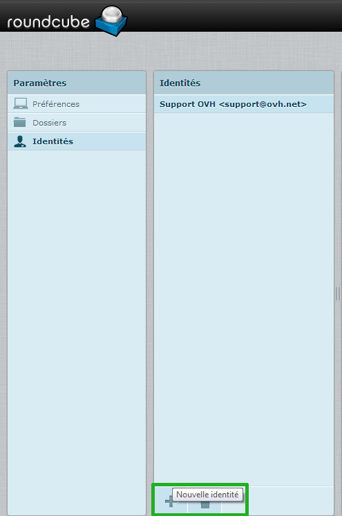{.thumbnail}

### Neue Identität / Signatur (2)

In unserem nebenstehenden Beispiel erstellen wir eine Identität namens Guides OVH. Diese Identität wird der Adresse no-reply@ovh.net zugewiesen, die bei den Empfängern angezeigt wird. Wenn diese auf die E-Mails antworten, geht die Antwort an die Adresse support@ovh.net. Optional kann die Signatur noch personalisiert werden, und zum Abschluss werden die Änderungen mit einem Klick auf Speichern bestätigt.

Danach erscheint die neue Identität Guides OVH <no-reply@ovh.net> in der Liste der Identitäten.

Wie Sie die dieser Identität zugewiesene Signatur einfügen wird im Abschnitt [Einfügen einer Signatur im HTML-Format](#SIGNATURE) beschrieben.

{.thumbnail}

## neuen Nachricht

### Verfassen einer neuen Nachricht

Um eine neue Nachricht zu verfassen klicken Sie auf Schreiben. Wenn Sie diesen Button nicht sehen, weil Sie zum Beispiel gerade die Einstellungen oder das Adressbuch aufgerufen haben, klicken Sie auf das weiße Briemumschlagssysmbol rechts oben, dann wird der Button eingeblendet.

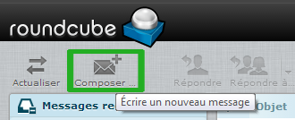{.thumbnail}

### Optionen

Wenn Sie auf "Schreiben" klicken, werden Optionen zum Verfassen Ihrer E-Mail angezeigt, zum Beispiel die Möglichkeit zum Hinzufügen von Kontakten aus dem [Adressbuch](#CARNET), [Anhänge](#ATTACHED) und nachrichtenspezifische [Einstellungen](#SIGNATURE).

Sie können Ihre gespeicherten Kommunikationspartner auswählen, indem Sie auf den Typ der Mail bzw. Kopie klicken, die diese erhalten sollen:

- To+: Der Kommunikationspartner wird als direkter Empfänger der E-Mail hinzugefügt.
- Cc+: Der Kommunikationspartner wird als Empfänger einer Kopie der E-Mail hinzugefügt.
- Bcc+: Der Kommunikationspartner wird als Empfänger einer Blindkopie der E-Mail hinzugefügt. Die anderen Empfänger der E-Mail können die Empfänger der Blindkopien nicht sehen.

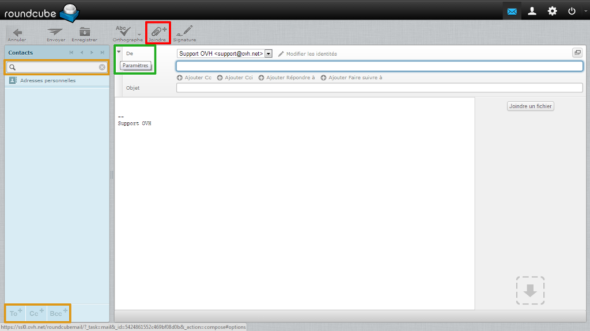{.thumbnail}

### Einfügen einer Signatur im HTML-Format

Um wie im Abschnitt Identitäten angesprochen eine Signatur im HTML-Format einzufügen wählen Sie einfach Editor-Typ: HTML aus (siehe Screenshot).
Klicken Sie dann oben auf Signatur, um diese einzufügen. Es wird dann das in der Signatur enthaltene Bild angezeigt.

1. In dem Menü können Sie die gewünschte Identität auswählen, wenn Sie zusätzliche Identitäten erstellt haben (siehe Abschnitt Identität).
2. Hier können Sie den/die regulären Empfänger der E-Mail eintragen.
3. Hier können Sie klicken, um einen Empfänger als einfache Kopie oder Blindkopie hinzuzufügen, oder die Optionen "Antwortadresse hinzufügen" oder "Followup-To hinzufügen" auswählen.
4. Tragen Sie hier den Betreff Ihrer E-Mail ein.
5. Verwenden Sie den WYSIWYG* Editor, um Ihre Nachricht zu verfassen.

* What You See Is What You Get: "Was Sie sehen ist das Ergebnis, das Sie erhalten".

{.thumbnail}

### Nachricht versenden

Um Ihre E-Mail zu senden klicken Sie auf den Senden Button.

{.thumbnail}

### Nachricht empfangen

Der Versand der E-Mail im vorherigen Abschnitt wurde für support@ovh.net selbst durchgeführt. Wir haben uns die E-Mail also selbst zugesandt.

Wenn die E-Mail nicht automatisch angezeigt wird, können Sie links oben auf "Aktualisieren" klicken.

Wir sehen, dass der Absender Support OVH ist und die Signatur korrekt angezeigt wird.

{.thumbnail}

### Anhang hinzufügen (1)

Um eines oder mehrere Dokumente (PDF, Office-Datei, Bild...) an Ihre Nachricht anzuhängen, klicken Sie einfach oben auf "Anhängen".

Im rechten Bereich des Nachrichtenfensters befindet sich auch ein "Datei anfügen" Button. Damit gelangen Sie zum gleichen Fenster zum Hinzufügen von Dokumenten wie beim Klick auf "Anhängen".

Als dritte Möglichkeit können Sie die anzuhängenden Dateien auch per Drag and Drop in den dafür vorgesehenen Bereich rechts unter dem "Datei anfügen" Button bewegen.

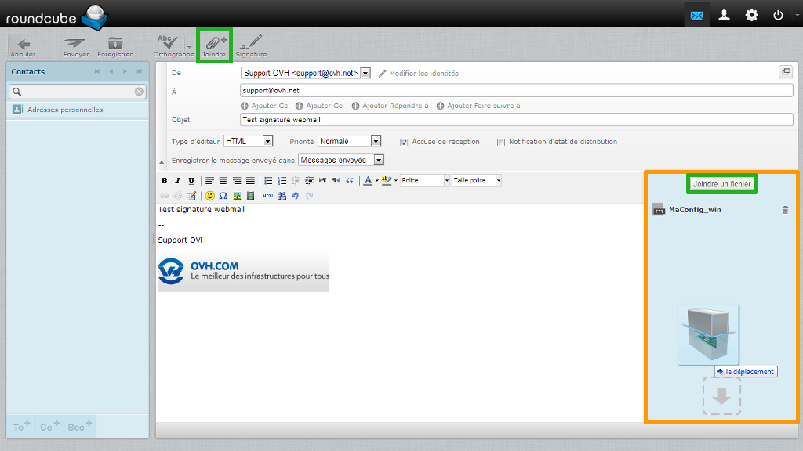{.thumbnail}

### Anhang hinzufügen (2)

Wenn Sie nicht Drag and Drop zum Hinzufügen der Dateien nutzen, sondern auf "Anhängen" oder "Datei anfügen" klicken, wird folgendes Fenster zur Auswahl der Dateien angezeigt.

In diesem Beispiel fügen wir die Datei MaConfig_win hinzu.
Klicken Sie nach der Auswahl der Datei auf Öffnen.

{.thumbnail}

### Anhang hinzufügen (3)

Nach dem Klick auf Öffnen wird folgendes Interface mit dem Namen der ausgewählten Datei angezeigt. Darüber können Sie das Hinzufügen dieser Datei bestätigen oder mit einem Klick auf "+" weitere Dateien hinzufügen. Klicken Sie auf Übertragen, sobald Sie Ihre Auswahl abgeschlossen haben.

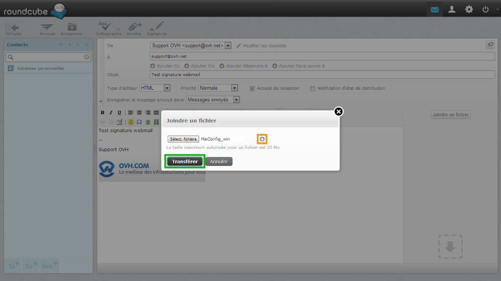{.thumbnail}

> [!primary]
> 
> Wie im nebenstehenden Screenshot ersichtlich beträgt die maximale Größe einer im Webmail-Interface angehängten Datei 20 MB.
> 

## Adressbuch

### Organisation des Adressbuchs

Abhängig von Ihren Bedürfnissen, Ihrem Unternehmen und Ihren Abläufen kann es hilfreich sein, das Adressbuch mit Ordnern (Kontaktgruppen) zu organisieren.
In diesem Beispiel zur Verwendung des Adressbuchs werden wir 2 Gruppen erstellen, um die verschiedenen Funktionen genauer vorzustellen.

Um zu beginnen klicken Sie auf das Icon des RoundCube Adressbuchs, um folgendes Interface aufzurufen.

Wir erstellen hier eine Gruppe "Guides", in die alle in Zusammenhang mit den OVH Guides stehenden Kontakte aufgenommen werden.

Klicken Sie auf das "+" Symbol links unten, um eine Kontaktgruppe zu erstellen.
Der Cursor erscheint dann wie im nebenstehenden Screenshot automatisch im Bereich zur Angabe des Namens.

Es ist auch möglich, direkt Kontakte in der standardmäßig erstellten Gruppe (Persönliche Adressen) ohne Umweg über die Erstellung einer neuen Kontaktgruppe hinzuzufügen.
Klicken Sie dazu einfach auf das "+" Symbol unten in der zweiten Spalte (Einen neuen Kontakt erstellen).

{.thumbnail}

### Operationen mit Kontaktgruppen

Nachdem Ihre Gruppe erstellt wurde haben Sie zugriff auf die Gruppenfunktionen.

Dort finden Sie folgende Möglichkeiten:

- Die Gruppe umbenennen.
- Die Gruppe löschen.
- Das Suchergebnis speichern (aktiv, sobald Sie eine Suche auf einer Gruppe durchführen).
- Das Suchergebnis löschen (aktiv, sobald Sie eine Suche auf einer Gruppe durchführen).

{.thumbnail}

### Einen Kontakt hinzufügen, Teil 1 - Eigenschaften

Um einen Kontakt zur Gruppe "Guides" hinzuzufügen, klicken Sie zuerst auf das "+" in der zweiten Spalte mit den Kontakten. Stellen Sie sicher, dass Sie im Vorfeld die Gruppe ausgewählt haben, diese muss fett markiert sein.
Wir haben an dieser Stelle noch eine weitere Gruppe "Support" hinzugefügt.

Klicken Sie auf Hinzufügen, um die Angaben Ihres Kontakts in die Bereiche einzutragen:

- Allgemeiner Bereich: Hier können Sie Namen, Vornamen, Unternehmen usw. des Kontakts eintragen.
- Eigenschaften: Hier können Sie E-Mail-Adressen, Telefonnummern usw. eintragen (unter Adresse erreichen Sie auch ein Menü, mit dem Sie "Ein Feld hinzufügen" können.
- Persönliche Angaben: Geburtstag, Geschlecht, Mädchenname usw. des Kontakts.
- Notizen: Hier können Sie verschiedenste Informationen zu Ihrem Kontakt eintragen.

Für den allgemeinen Bereich haben Sie folgende Moglichkeiten:

- Präfix
- Middle Name (US)
- Suffix
- Anzeigename
- Beiname
- Organisation
- Dienstleistung
- Funktion

Sobald Sie die gewünschten Angaben eingetragen haben klicken Sie auf "Speichern".

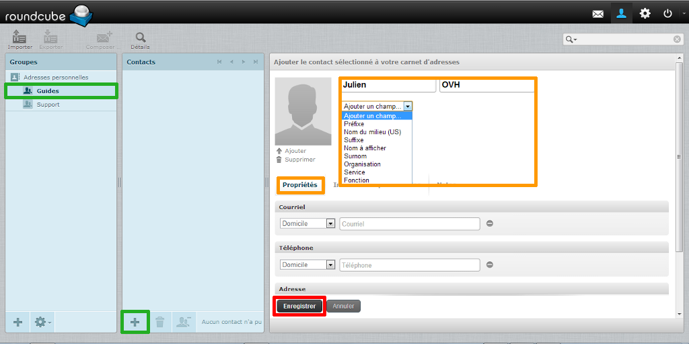{.thumbnail}

Noch schneller geht es, wenn Sie bei Eingang einer E-Mail direkt auf das kleine "+" klicken.

{.thumbnail}

### Einen Kontakt hinzufügen, Teil 2 - Persönliche Angaben

Im nebenstehenden Bild sehen Sie einige über das Menü "Ein Feld hinzufügen" zum allgemeinen Bereich hinzugefügte Elemente: Präfix, Vorname, Name, Beiname und Organisation.

Im nebenstehenden Bild sehen Sie die im vorherigen Abschnitt vorgestellte Rubrik "Persönliche Angaben" und das Menü, um zusätzliche Felder hinzuzufügen.

Sobald Sie die gewünschten Angaben eingetragen haben klicken Sie auf "Speichern".

{.thumbnail}

### Einen Kontakt hinzufügen, Teil 3 - Notizen

Im Bereich "Notizen" können Sie beliebige Notizen zu dem Kontakt eintragen.

Sobald Sie die gewünschten Angaben eingetragen haben klicken Sie auf "Speichern".

{.thumbnail}

### Einen Kontakt hinzufügen, Teil 4 - Avatar

Wenn Sie einem Kontakt ein Bild / Foto zuweisen möchten (Avatar), können Sie dies ganz einfach tun.

Klicken Sie auf "Hinzufügen" und in dem sich dann öffnenden Fenster auf "Datei auswählen". Wählen Sie die gewünschte Datei auf Ihrem Computer aus und bestätigen Sie die Auswahl.
Sobald Sie zum nebenstehenden Interface zurückgekehrt sind klicken Sie auf "Übertragen", um das Hinzufügen des Bildes abzuschließen.

{.thumbnail}

### Einen Kontakt hinzufügen, Teil 5 - Fertigstellung

Das Bild wurde hinzugefügt und die E-Mail-Adresse sowie die erforderlichen Angaben des Kontakts eingetragen. Nun kann das Hinzufügen des Kontakts mit einem Klick auf "Speichern" bestätigt werden.

Sie können wenn Sie möchten das Bild noch mit einem Klick auf "Ersetzen" ändern.

{.thumbnail}

### Einen Kontakt hinzufügen, Teil 6 - Überprüfung

Der Kontakt wurde gespeichert, und Sie erhalten zur Bestätigung eine Benachrichtigung, dass die Speicherung erfolgreich war.
Sie können nun Ihren Kontakt aufrufen bzw. überprüfen, indem Sie in der Liste der Kontakte auf dessen Namen klicken (wählen Sie zuerst die richtige Gruppe aus oder führen Sie eine Suche nach dem Kontakt durch).
Standardmäßig ist der Tab Eigenschaften aktiv, und es werden die in dieser Rubrik gemachten Angaben angezeigt (siehe Teil 1).

Sobald ein Kontakt in einer Gruppe erstellt ist, kann dieser über das "-" Icon im unteren Bereich der Kontaktspalte wieder aus dieser Gruppe entfernt werden.

{.thumbnail}

### Einen Kontakt ändern

Sie können die Angaben und Gruppen eines Kontakts jederzeit ändern.

Wählen Sie dazu den gewünschten Kontakt aus und klicken Sie rechts oben auf "Kontakt ändern".
Sie können dann sämtliche Angaben des Kontakts editieren.

Im nebenstehenden Screenshot haben wir auf den Tab "Gruppen" geklickt, um die Gruppen anzuzeigen, zu denen der Kontakt gehört.

In diesem Tab können Sie den Kontakt zu einer Gruppe hinzufügen, indem Sie ein entsprechendes Häkchen setzen.

Sie können Ihre Kontakte auch per Drag and Drop in die gewünschten Gruppen umziehen. Der Tab "Gruppen" wird dann automatisch geupdatet.

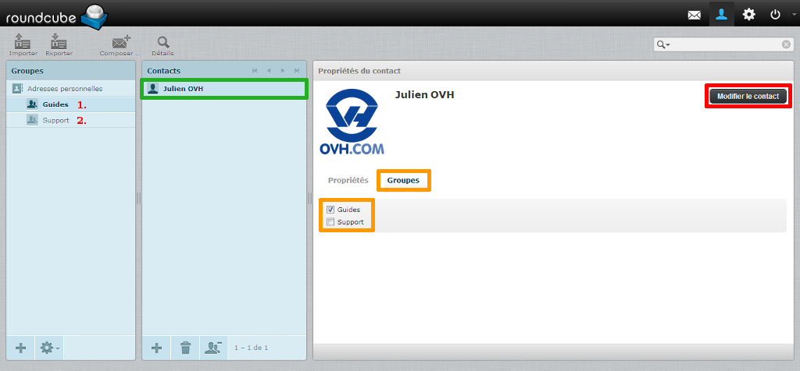{.thumbnail}

### Eine Suche durchführen

Sie möchten eine Suche in allen Ihren Kontakten durchführen. Klicken Sie dazu in der oberen Symbolleiste auf "Erweitert".
Es werden nun sämtliche verfügbaren Suchfelder angezeigt, und Sie können eine detaillierte Suche durchführen.

Tragen Sie Ihre Suchbegriffe ein und klicken Sie dann auf "Suche".

{.thumbnail}

### Export Ihres Adressbuchs

Sie können bei Bedarf sämtliche in Ihrem OVH RoundCube Webmail existierenden Kontakte in eine Datei exportieren. Klicken Sie dazu in der oberen Symbolleiste auf "Exportieren".

Es wird dann eine Datei mit dem Namen rcube_contacts.vcf erstellt und Ihnen zum Download angeboten.

{.thumbnail}

### Import eines bestehenden Adressbuchs

Sie haben Ihre Kontakte bisher mit einem anderen E-Mail-Programm verwaltet und diese exportiert. Dann können Sie sie mit einem Klick auf "Importieren" in RoundCube hinzufügen.

Das einzige unterstützte Datenformat beim Import ist .vcf.
Der Import von Adressen im vCard oder CSV Format wird ebenfalls unterstützt.

Nach einem Klick auf "Importieren" wird folgendes Interface angezeigt.
Klicken Sie auf "Durchsuchen", um die vCard oder CSV Datei zu laden, die das zu importierende Adressbuch enthält.

Dabei können Sie auswählen, ob das Bestehende Adressbuch komplett ersetzt werden soll oder nicht.

Sobald Sie alle notwendigen Angaben gemacht haben klicken Sie auf "Importieren", und der Import Ihres Adressbuchs wird durchgeführt.

{.thumbnail}

## Allen antworten
Wenn Ihre Liste der Empfänger eine Mailing-Liste sowie klassische Empfänger beinhaltet, klicken Sie auf Allen antworten im Menü oben (s. Screenshot).

So können Sie in nur einem Schritt tatsächlich allen Empfängern antworten (Mailing-Liste und klassische Empfänger).

Klicken Sie auf den anderen Button, um ausschließlich der Mailing-Liste zu antworten und die klassischen Empfänger auszuschließen.

{.thumbnail}