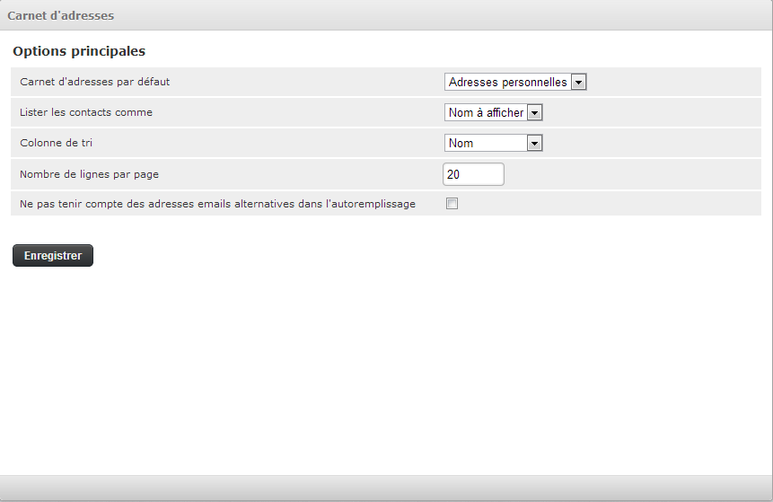
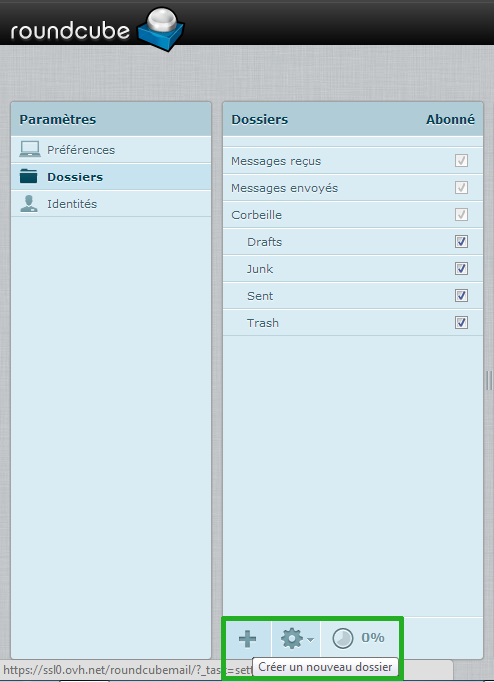
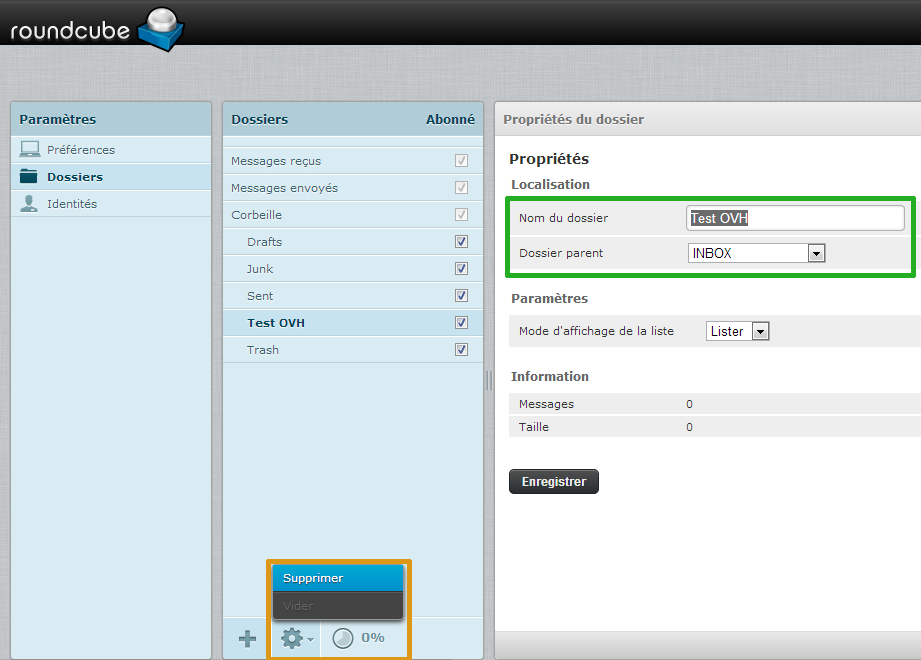
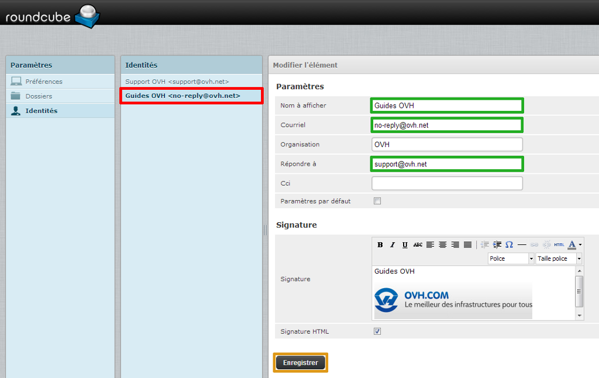
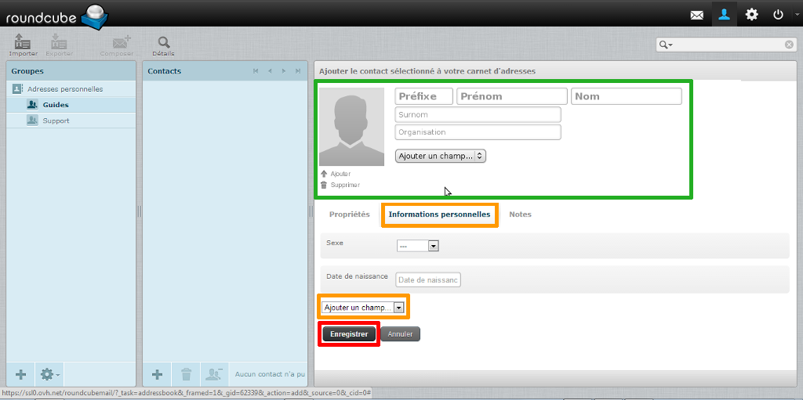
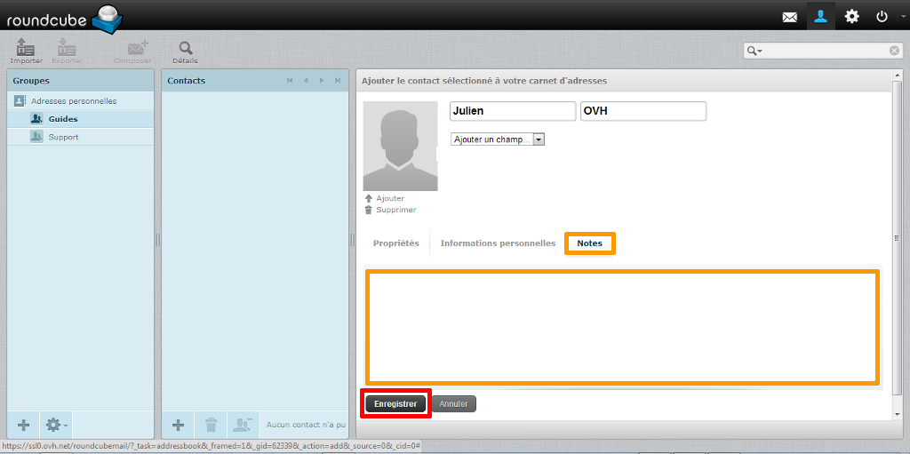
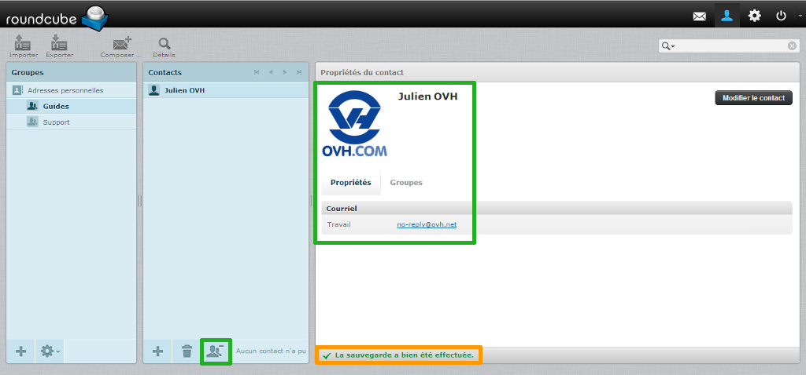
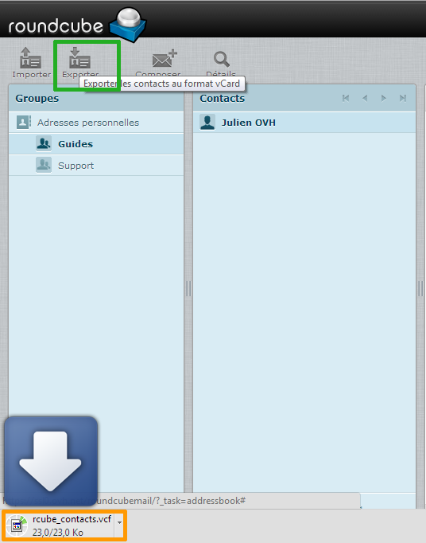

## Ou et comment se connecter au Webmail RoundCube ?

### Via le site OVH.com
Rendez-vous sur le site [OVH.com](http://www.ovh.com){.external} et cliquez sur "Webmail" en haut à droite.


{.thumbnail}


### Interface generale de Webmail OVH
Vous arrivez alors sur une interface de saisie d'adresse e-mail. Cette interface permet de vous rediriger directement vers le Webmail propre à votre service mail OVH sans à vous soucier de quoi que ce soit.

Si vous connaissez déjà votre type d'offre mail OVH, vous pouvez accéder directement au Webmail de votre choix en bas de page en cliquant sur .

En cliquant sur , vous accéderez directement aux guides relatifs au Webmail survolé.


{.thumbnail}


> [!success]
>
> En cochant "Mémoriser cette adresse e-mail", les différentes adresses alors
> saisies de la sorte seront sauvegardées dans le menu contextuel en haut à
> droite (Webmail en bleu). L'avantage est que vous pourrez vous connecter
> directement à l'adresse souhaitée très facilement !
> 


### Interface de connexion
Une fois votre choix fait, vous arrivez alors sur l'interface du Webmail de votre service mail. Si l'adresse n'est pas déjà préremplie, saisissez-la à nouveau.

Renseignez donc ici votre adresse e-mail ainsi que le mot de passe associé, puis cliquez sur  **"Connexion"** .


{.thumbnail}


## Decouvrir l'interface

### Boite de reception
Une fois connecté à votre compte e-mail, vous avez accès à votre boîte de réception et d'envoi. Dans la colonne de gauche, vous pouvez trouver les dossiers principaux de votre compte e-mail : les messages reçus et envoyés.

Dans cette même colonne, en pied de page, se trouvent l'accès au [paramétrage des dossiers](#DOSSIERS){.external} et le quota de remplissage de votre compte e-mail.

Dans la partie de droite, vous pouvez visualiser très simplement tous les e-mails reçus et voir les informations suivantes :

- l'expéditeur,
- l'objet,
- l'état lu ou non lu du message,
- les éventuelles marques apportées au message
- la taille de chaque e-mail
- la présence de pièces jointes (colonne avec le trombone tout à droite).

Par défaut, certaines colonnes n'apparaissent pas. C'est le cas des priorités attribuées aux e-mails. Pour y remédier, il faut modifier l'affichage grâce à l'option présentée ci-dessous.


{.thumbnail}


### Options d'affichage et de tri
Pour accéder à cette option, veuillez cliquer sur l'icône en forme d'engrenage sur la partie gauche du bandeau principal de vos e-mails, à gauche d'Objet, comme indiqué sur la capture ci-contre.

Dans cette option, vous aller pouvoir :

- Ajouter des colonnes à afficher (priorités des mails, etc.) ;
- Choisir la colonne sur laquelle le tri par défaut sera effectué ;
- Choisir l'ordre de tri (ascendant ou descendant).

Une fois votre (vos) sélection(s) effectuée(s), validez en cliquant sur "Enregistrer".


{.thumbnail}


### Les e-mails dans tous leurs etats
Le Webmail RoundCube gère très bien les principales options relatives aux e-mails (accusés de lecture, marquage, pièces jointes, protection de la vie privée). La capture ci-contre vous offre un aperçu global de toutes ces fonctionnalités.

Le nombre d'e-mails non lus apparaît dans une petite pastille dans la colonne de gauche, à la droite de Messages reçus. **Un e-mail non lu**  apparaît en  **gras**  dans la partie de droite.

Pour chaque message vous pouvez :

- Répondre : vous permet de répondre directement à l'expéditeur ;
- Répondre à tous : vous permet de répondre directement à tous les e-mails présent dans les champs "A" et "Copie" ;
- Transférer : vous permet de transférer l'e-mail sélectionné au(x) correspondant(s) de votre choix ;
- Supprimer : vous permet de mettre l'e-mail sélectionné à la "Corbeille" ;
- Indésirables : vous permet de placer l'e-mail sélectionné directement dans la boîte du courrier indésirable (Junk). Le marque comme spam ;
- Marquer : pour cette option, cf. paragraphe ci-après ;
- ...Plus : pour cette option, cf. paragraphe ci-après.

Si un message est marqué comme suivi (cf. option ci-après), un drapeau rouge apparaît dans la colonne de suivi. Si le mail est doté d'une priorité, une flèche ascendante (la plus élevée, élevée) ou descendante (basse) est affichée.


{.thumbnail}


> [!success]
>
> Si l'un de vos correspondants demande à ce qu'un accusé de lecture lui soit
> adressé lorsque vous lisez son e-mail, vous obtiendrez le message suivant :
> L'expéditeur de ce message a demandé d'être prévenu quand vous lirez ce
> message. Souhaitez-vous prévenir l'expéditeur ? (cf capture ci-contre).
> 


### Marquer un message
Lorsque vous cliquez sur l'option "Marquer", vous obtenez ce menu contextuel. Vous pouvez donc marquer un message, retirer un marquage et déclarer comme non lu un message qui a été lu. Cette option fonctionne également (et surtout) pour une sélection multiple d'e-mails.

Ces options sont utiles pour mettre en avant certains de vos e-mails.


{.thumbnail}


### ... Plus
Lorsque vous cliquez sur l'option "...Plus", vous obtenez ce menu contextuel. Vous pouvez donc :

- Imprimer ce message : ouvre le message dans une nouvelle fenêtre et propose la validation de l'impression ;
- Télécharger : vous permet de télécharger sur votre ordinateur l'e-mail au format .eml ;
- Éditer en tant que nouveau message : vous permet d'éditer un e-mail en conservant sa mise en page d'origine ;
- Voir la source : permet d'afficher la source complète du message. Très utile lorsqu'un [entête vous est
demandé](https://www.ovh.com/fr/g1365.recuperation-entetes-e-mail#webmail_roundcube){.external} !
- Ouvrir dans une nouvelle fenêtre : vous permet d'ouvrir le message dans une nouvelle fenêtre (utile pour consulter/ouvrir plusieurs messages à la fois)


{.thumbnail}


## Parametres

### Acceder aux parametres
Vous devez être connecté à votre compte e-mail sur le Webmail RoundCube pour accéder à cette fonctionnalité. Afin d'accéder aux paramètres de votre boîte e-mails, cliquez sur l'engrenage tout en haut à droite.


{.thumbnail}


## Parametres - Preferences

### Interface utilisateur
Après avoir cliqué sur l'engrenage, vous tombez directement sur l'Interface utilisateur des Paramètres. Dans cette interface, vous pouvez modifier différents éléments comme la langue, les formats des dates et heures ainsi que le thème graphique de l'interface.

Pour les autres options disponibles, consultez la capture ci-contre.


{.thumbnail}


### Vue du courrier
Dans Vue du courrier, vous pouvez modifier le nombre d'e-mails affichés dans l'interface afin de générer moins de pages par exemple si vous avez un grand nombre d'e-mails. Vous pouvez également décider de ne pas afficher directement dans cette première interface l'aperçu des e-mails sélectionnés afin de les visualiser uniquement lors d'un double clic ou encore dans une nouvelle fenêtre.

Pour les autres options disponibles, consultez la capture ci-contre.


{.thumbnail}


### Affichage des messages
Dans Affichage des messages, vous pouvez choisir l'affichage (HTML ou non, les images distantes, l'encodage des caractères) de vos e-mails dans l'interface.

Pour les autres options disponibles, consultez la capture ci-contre.


{.thumbnail}


### Ecriture des messages
Dans Écriture des messages, vous pouvez choisir les différents éléments liés à la rédaction de vos e-mails, comme le format d'écriture, l'avis de réception, de distribution, la police d'écriture, etc.

Pour les autres options disponibles, consultez la capture ci-contre.

- Par défaut sur la nouvelle interface de Roundcube ("Larry") l'option "Composer un message au format HTML" est mise par défaut sur la valeur "en réponse aux messages HTML uniquement" .

Il vous est possible de la modifier vers "toujours" afin d'envoyer vos e-mails en format HTML.


{.thumbnail}


### Carnet d'adresses
Dans Carnet d'adresses, vous pouvez choisir le carnet d'adresses à utiliser par défaut (si plusieurs [carnets d'adresses](#CARNET){.external} ont été créés) ainsi que les options de tri et d'affichage des contacts.

Pour les autres options disponibles, consultez la capture ci-contre.


{.thumbnail}


### Dossiers speciaux
Dans Dossiers spéciaux, vous pouvez définir vous-même où placer (choix des dossiers) les e-mails considérés comme  **Brouillons** , les  **Messages envoyés** , les  **Indésirables**  et les e-mails qui iront à la **Corbeille** .

Consultez la capture ci-contre si besoin.

Pour la création des dossiers personnalisés, veuillez vous référer au paragraphe [Paramètres - Dossiers](#DOSSIERS){.external}


{.thumbnail}


### Parametres du serveur
Dans Paramètres du serveur, vous pouvez paramétrer tout ce qui a trait à la suppression des e-mails sur le serveur (depuis le Webmail).

Pour les autres options disponibles, consultez la capture ci-contre.


{.thumbnail}


> [!success]
>
> Exemple de suppression :
> Vous ne recevez plus d'e-mails. Votre boîte est quasiment pleine voire en overquota. Vous voulez supprimer des e-mails afin de "faire du ménage" et recevoir vos e-mails à nouveau. Cependant vous rencontrez un message d'erreur qui vous empêche de supprimer les messages souhaités.
> Que se passe-t-il ?
> Lors de la suppression d'un e-mail, celui-ci est d'abord copié dans la corbeille avant d'être supprimé de la boîte de réception (de manière invisible pour l'utilisateur). Cependant, la boîte étant déjà pleine, la copie n'est pas possible, d'où le message d'erreur !
> Comment y remédier ?
> Dans cette interface Paramètres du serveur, cochez "Lorsque le déplacement des messages à la corbeille échoue, supprimez-les". Vous pouvez désormais supprimer les e-mails sans aucun souci.
> 

<a name="DOSSIERS"></a>

## Parametres - Dossiers

### Creer un dossier (1)
Pour créer un dossier personnalisé et ainsi isoler les messages d'un thème ou d'un correspondant précis, cliquez sur le "+".


{.thumbnail}


### Creer un dossier (2)
Ici nous créons le dossier "Test OVH", il sera placé dans la INBOX et l'affichage des e-mails s'y trouvant sera sous forme de liste.

La INBOX est l'anglicisme pour  **"Boîte de réception"** . Le dossier "Test OVH" sera donc créé dans la boîte de réception.

Cliquez sur Enregistrer pour valider la création.


{.thumbnail}


### Creer un dossier (3)
On constate que Le dossier a bien été créé.

Il apparaît avec la même arborescence que : . Drafts : Brouillons ; . Junk : Courrier indésirable ; . Sent : Messages envoyés ; . Trash : Corbeille ;

tous éléments de la  **INBOX** .


{.thumbnail}


### Editer - Supprimer un dossier
La suppression (attention aux e-mails présents dans le dossier lors de la suppression) ou l'édition d'un dossier est elle aussi très simple.

Pour procéder à la suppression, sélectionnez votre dossier puis cliquez sur l'engrenage en bas de page. Vous pouvez au choix : supprimer le dossier ou le vider. Vous pouvez également voir le taux d'occupation globale de votre boîte (en pourcentage).

Afin de modifier un dossier, cliquez simplement sur le dossier concerné. Vous pouvez alors modifier le nom du dossier, le dossier parent, le type d'affichage et pouvez  **consulter**  le *nombre de messages* présents ainsi que la *taille occupée* par les e-mails du dossier sélectionné. Le lien "Cliquer pour obtenir la taille de dossier" permet de procéder au calcul de la taille de ces e-mails (dès lors que le nombre sera supérieur à 0).


{.thumbnail}


> [!success]
>
> /!Les éléments natifs : Messages reçus, messages envoyés et
> Corbeille ne peuvent être modifiés, comme vous le constatez dans la capture
> ci-contre.
> 


### Proprietes des dossiers principaux
Comme évoqué précédemment, les dossiers *Messages reçus*, *Messages envoyés* et *Corbeille* ne peuvent être entièrement modifiés.

Vous ne pouvez modifier que le mode d'affichage de la liste. Les 2 options possibles sont  **"Liste"**  et  **"Sujets"** .


{.thumbnail}


## Parametres - Identites

### Mettre en place une signature
Pour mettre en place une signature, qui apparaîtra de manière systématique dans chacun de vos mails envoyés, rendez-vous dans Paramètres puis Identités. L'adresse e-mail à partir de laquelle vous êtes connecté au Webmail.

Cliquez dessus puis renseignez les éléments que vous considérez comme essentiels à votre signature. Par défaut, Nom à afficher et Courriel sont déjà renseignés. Les autres pourront vous servir si :

- Organisation : vous souhaitez renseigner votre société, association, ou autre entité de votre choix ;
- Répondre à : vous souhaitez que votre correspondant réponde à une autre adresse e-mail que celle avec laquelle vous lui avez écrit ; 
- Cci : vous souhaitez mettre en copie cachée une adresse e-mail à tous vos envois ;
- Paramètres par défaut : vous avez créé une ou plusieurs identités (signatures) et souhaitez mettre celle-ci par défaut pour vos envois ; 
- Signature : vous souhaitez personnaliser le pied de page de vos e-mails (nom, prénom, poste occupé, phrases, images...) ; 
- Signature HTML : ce qui a été renseigné dans Signature contient du code HTML et/ou vous souhaitez qu'elle soit compatible avec le client de messagerie de votre correspondant qui paramètre les réceptions de ses e-mails en HTML.

Cliquez sur Enregistrer pour valider la modification de l'identité principale.

Pour insérer la signature associée à cette identité, référez-vous à la section [Insérer une signature au format HTML](#SIGNATURE){.external}.


{.thumbnail}


### Mettre en place une signature avec une image (1)
Cette étape nécessite que l'image soit hébergée sur un serveur (votre hébergement OVH ou autre).

Afin de placer une image sur votre hébergement OVH, veuillez suivre le guide disponible [ici](http://guides.ovh.com/FtpFileZilla){.external}.

En cochant Signature HTML, l'éditeur WYSWYG* apparaît comme montré ci-contre. Cliquez sur le carré  **HTML**  afin d'ouvrir la fenêtre qui vous permettra d'insérer du code HTML. Pour ajouter une image vous pouvez ajouter le code suivant :


```bash

```

Cliquez sur Mettre à jour afin de valider les modifications et différents ajouts.

- **W** hat  **Y** ou  **S** ee is  **W** hat  **Y** ou  **G** et : Ce que vous voyez sera ce que vous obtiendrez


{.thumbnail}


### Mettre en place une signature avec une image (2)
Après validation de la mise à jour, l'image est correctement affichée dans la zone d'édition de la signature.

Vous pouvez également éditer le texte grâce aux différentes options de **mise en gras** , *italique*, souligné, barré, traitement d'alignement de paragraphe, police, taille et couleur de la police d'écriture, etc.

Pour les autres options disponibles, consultez la capture ci-contre.

Une fois que vous avez terminé, cliquez sur Enregistrer, le message "La sauvegarde a bien été effectuée" apparaît.

Pour insérer la signature associée à cette identité, référez-vous à la section [Insérer une signature au format HTML](#SIGNATURE){.external}.


{.thumbnail}


### Nouvelle identite/signature (1)
Vous n'avez qu'une seule adresse e-mail (offre Start 10 M par exemple) ou ne souhaitez en gérer qu'une seule en terme de Webmail et d'envois, vous pouvez créer des identités et/ou signatures. Vous pouvez ainsi envoyer des messages de la part d'un autre compte e-mail, sans vous déconnecter de votre adresse mail.

L'exemple présenté ici est le suivant : J'ai un compte e-mail [support@ovh.net](mailto:support@ovh.net){.external}, je souhaite faire des envois en tant que [no-reply@ovh.net](mailto:no-reply@ovh.net){.external} mais ne souhaite pas me connecter pour autant sur le compte e-mail [no-reply@ovh.net](mailto:no-reply@ovh.net){.external} via le Webmail.

Dans Identités, cliquez sur le "+" afin d'ajouter une nouvelle identité.


{.thumbnail}


### Nouvelle identite/signature (2)
Dans l'exemple ci-contre, je m'apprête à créer une identité nommée Guides OVH. Celle-ci est rattachée à l'adresse [no-reply@ovh.net](mailto:no-reply@ovh.net){.external}, adresse que je souhaite montrer à mes correspondants. Lorsque ceux-ci répondront à mes messages, la réponse sera envoyée à l'adresse [support@ovh.net](mailto:support@ovh.net){.external}. Je personnalise ma signature (facultatif) et clique sur Enregistrer.

Une fois enregistrée, ma nouvelle identité Guides OVH <[no-reply@ovh.net](mailto:no-reply@ovh.net){.external}> apparaît dans la colonne des identités.

Pour insérer la signature associée à cette identité, référez-vous à la section [Insérer une signature au format HTML](#SIGNATURE){.external}.


{.thumbnail}


## Nouveau message

### Acceder a la redaction d'un nouveau message
Afin d'écrire un nouveau message, cliquez sur Composer.... Si vous ne voyez pas ce bouton (vous êtes dans les paramètres ou le carnet d'adresses), cliquez sur l'enveloppe blanche (Courriel) en haut à droite. Vous trouverez alors ce bouton.


{.thumbnail}


### Differentes options
Vous avez cliqué sur "Composer...". Apparaissent alors des options utiles à la rédaction de votre e-mail telles que l'ajout des contacts issus du [carnet d'adresses](#CARNET){.external}, les [pièces jointes](#ATTACHED){.external} et les [paramètres](#SIGNATURE){.external} propres au message. Vous pouvez donc rechercher vos correspondants enregistrés en cliquant sur les types de copie que vous souhaitez leur attribuer :

- To+ : ajouter votre correspondant en destinataire direct ;
- Cc+ : ajouter votre correspondant en copie simple ;
- Bcc+ : ajouter votre correspondant en copie cachée. Les autres destinataires de l'e-mail ne verront pas ceux en Bcc.


{.thumbnail}

<a name="SIGNATURE"></a>

### Inserer une signature au format HTML
Afin d'insérer une signature au format HTML (comme vu précédemment dans la section *Identités*), il vous suffit de choisir le *Type d'éditeur : HTML* (cf. capture ci-contre). Puis cliquez sur Signature (bouton en haut avec le crayon) pour l'insérer. L'image incluse dans la signature s'affiche alors.

**1.**  Dans le menu déroulant, vous pouvez choisir l'identité souhaitée si vous en avez créées (cf. section *Identité*) ; **2.**  Vous pouvez définir ici votre/vos destinataire(s) principal/aux **3.**  Vous pouvez cliquer ici pour ajouter un correspondant en copie simple, copie cachée ou une option "Répondre à" ou encore "Faire suivre à" ; **4.**  Saisissez ici le sujet de votre message ; **5.**  Utilisez ici l'éditeur WYSWYG* pour mettre en forme le contenu de votre message.

- **W** hat  **Y** ou  **S** ee is  **W** hat  **Y** ou  **G** et : Ce que vous voyez sera ce que vous obtiendrez


{.thumbnail}


### Envoyer le message
Afin d'envoyer votre message, cliquez sur le bouton Envoyer (en forme d'avion en papier).


{.thumbnail}


### Receptionner le message
L'envoi précédent a été effectué pour [support@ovh.net](mailto:support@ovh.net){.external} (lui-même). Voici comment est reçu l'e-mail que l'on s'est donc envoyé.

Si l'e-mail n'est pas reçu automatiquement, vous pouvez cliquer sur "Actualiser" tout en haut à gauche (flèches horizontales opposées).

On constate bien que l'expéditeur est Support OVH et la signature est affichée correctement.


{.thumbnail}

<a name="ATTACHED"></a>

### Ajouter une piece jointe (1)
Afin de joindre un/des document(s) numérique(s) (PDF, Office, image...) depuis la rédaction de votre message, il vous suffit simplement de cliquer sur "Joindre" en haut dans le bandeau (bouton avec le  **trombone** ). Notez que le bouton "Joindre un fichier" est accessible à droite de la rédaction de votre message. Vous obtiendrez la même fenêtre d'ajout de document (cf. capture ci-dessous) depuis votre ordinateur qu'en cliquant sur le  **trombone** .

La dernière possibilité (cf. capture ci-contre) est de simplement faire un glisser-déposer depuis votre explorateur de fichiers de votre ordinateur sur la zone prévue à cet effet au niveau du bouton "Joindre un fichier".


{.thumbnail}


### Ajouter une piece jointe (2)
Si vous ne faites pas de glisser-déposer, mais que vous cliquez sur le **trombone**  ou sur  **"Joindre un fichier"** , la fenêtre suivante s'ouvre afin de charger le fichier souhaité.

Ici nous avons décidé de joindre le fichier MaConfig_win. Une fois sélectionné, cliquez sur Ouvrir.


{.thumbnail}


### Ajouter une piece jointe (3)
En cliquant sur Ouvrir, l'interface suivante s'affiche avec le nom du fichier sélectionné. À partir de celle-ci, vous pouvez valider l'ajout de ce fichier ou en ajouter d'autres en cliquant sur le "+". Cliquez sur Transférer une fois votre sélection terminée.


{.thumbnail}


> [!success]
>
> Comme l'indique la capture ci-contre, la taille maximum pour un fichier
> attaché via le Webmail est de 20 Mo maximum.
> 


## Utiliser le carnet d'adresses

### Organiser son carnet
Selon vos besoins, votre société et votre quotidien, il peut être très utile d'organiser son carnet d'adresses avec des dossiers (groupes de contacts). Dans cet exemple d'utilisation du carnet d'adresses, nous allons créer 2 groupes afin d'illustrer nos différents exemples.

Pour commencer, cliquez sur l'icône du Carnet d'adresses RoundCube (personnage en haut à droite) afin d'accéder à l'interface ci-contre.

Afin de mettre tous les contacts qui seront en lien avec les guides OVH, nous décidons de créer un groupe intitulé "Guides".

Pour cela, cliquez sur le "+" en bas à gauche afin de créer un groupe de contacts. Le curseur se place automatiquement dans la zone de saisie du nom, comme sur la capture ci-contre

Notez qu'il est tout à fait possible de créer directement des contacts dans le "groupe" créé par défaut (*Adresses personnelles*) sans passer par la création d'un nouveau groupe de contacts. Pour cela, cliquez simplement sur le  **"+"**  en bas de la 2ème colonne (*Créer un nouveau contact*).


{.thumbnail}


### Operations sur groupes de contacts
Une fois votre groupe créé, vous avez accès aux fonctionnalités liées aux groupes.

Vous trouverez donc :

- Renommer le groupe ;
- Supprimer le groupe ;
- Enregistrer la recherche (actif dès lors que vous faites une recherche sur un groupe) ;
- Supprimer la recherche (actif dès lors que vous faites une recherche sur un groupe).


{.thumbnail}


### Ajouter un contact, partie 1 - Proprietes
Afin d'ajouter un contact au groupe "Guides", il faut tout d'abord cliquer sur le "+" de la 2ème colonne (colonne des contacts) en vous assurant d'avoir sélectionné le groupe au préalable (il doit être en gras par rapport aux autres groupes). Vous pouvez constater par la même occasion que nous avons ajouté un groupe "Support".

Cliquez sur Ajouter pour renseigner les informations de votre contact dans 4 zones différentes :

- Partie générale : où vous allez pouvoir renseigner nom, prénom, société, etc. ;
- Propriétés : où vous allez renseigner différents adresses e-mails, téléphones, etc. (un menu déroulant avec "Ajouter un champ" est disponible sous Adresse ) ;
- Informations personnelles : où vous allez pouvoir renseigner la date de naissance, le sexe, nom de jeune fille, etc. ;
- Notes : où vous allez pouvoir saisir au kilomètre des informations diverses et variées sur votre contact.

Pour la partie générale, vous pouvez constater ci-contre les possibilités :

- Préfixe
- Nom du milieu (US)
- Suffixe
- Nom à afficher
- Surnom
- Organisation
- Service
- Fonction

Si vous avez renseigné les informations nécessaires, cliquez sur "Enregistrer".


{.thumbnail}

Autre possibilité plus rapide, lors de la réception d'un e-mail vous pouvez directement cliquer sur l'icône en forme de " **+** ".


{.thumbnail}


### Ajouter un contact, partie 2 - Informations personnelles
Vous pouvez voir ci-contre les quelques éléments ajoutés à la partie générale (*Préfixe*, *Prénom*, *Nom*, *Surnom* et *Organisation*) grâce au menu déroulant "Ajouter un champ...".

Remarquez ici la section "Informations personnelles" présentée dans le paragraphe ci-dessus, ainsi que le menu déroulant permettant d'y ajouter des champs supplémentaires.

Si vous avez renseigné les informations nécessaires, cliquez sur "Enregistrer".


{.thumbnail}


### Ajouter un contact, partie 3 - Notes
La section "Notes" est une zone de saisie simple où vous pouvez ajouter toute sorte d'annotations liées au contact.

Si vous avez renseigné les informations nécessaires, cliquez sur "Enregistrer".


{.thumbnail}


### Ajouter un contact, partie 4 - Avatar
Si vous souhaitez ajouter/associer une image/photo à votre correspondant (avatar), sachez que vous pouvez le faire de manière très simple en procédant comme suit et comme démontré dans la capture ci-contre.

Cliquez sur "Ajouter", puis sur la fenêtre qui s'ouvre, cliquez sur "Choisissez un fichier". Chargez le fichier qui vous intéresse depuis votre ordinateur, validez votre choix. Une fois revenu sur l'interface ci-contre, cliquez sur "Transférer" afin de valider l'ajout de l'image.


{.thumbnail}


### Ajouter un contact, partie 5 - Finalisation
L'image est ajoutée, l'adresse e-mail ainsi que les informations nécessaires au contact sont également renseignées. Il est donc possible de valider l'ajout du contact en cliquant sur "Enregistrer".

Vous pouvez malgré tout modifier l'image en cliquant sur "Remplacer".


{.thumbnail}


### Ajouter un contact, partie 6 - Verifications
Le contact a été enregistré, le message "La sauvegarde a bien été effectuée" vous le confirme. Vous pouvez alors vérifier/consulter la fiche de votre contact en cliquant sur son nom dans la liste des contacts (en ayant sélectionné le bon groupe au préalable ou en ayant fait une recherche). Par défaut, l'onglet propriété est actif et vous affiche les informations renseignées dans cette section (cf. partie 1).

Dès lors qu'un contact est créé dans un groupe, il est possible de le retirer du groupe en cliquant sur l'icône en bas de la colonne des contacts (personnages avec "-").


{.thumbnail}


### Modifier un contact
Il vous est bien sûr possible de modifier un contact.

Pour cela, sélectionnez le contact concerné, puis cliquez sur "Modifier le contact" en haut à droite. Vous aurez alors accès à toutes les informations en mode éditable.

Dans la capture ci-contre, nous avons cliqué sur l'onglet "Groupes" afin d'afficher les groupes auxquels appartient le contact.

Dans cet onglet, vous pouvez ajouter un contact à un groupe en cochant la case correspondante.

Vous pouvez également faire des glisser-déposer de vos contacts pour les déplacer dans les bons groupes. L'onglet "Groupes" sera alors mis à jour.


{.thumbnail}


### Faire une recherche
Vous souhaitez faire une recherche parmi tous vos contacts. Cliquez sur "Détails" dans le bandeau en haut. Tous les champs de recherches possibles s'affichent alors afin de vous permettre de réaliser une recherche avancée.

Saisissez votre/vos critère(s) de recherche et cliquez sur "Rechercher" (le bouton est ici caché et se trouve juste sous "Messagerie insta...").


{.thumbnail}


### Exporter votre carnet d'adresses
Vous souhaitez récupérer l'ensemble de vos contacts actuels de votre Webmail RoundCube OVH par le biais d'un export de fichier de votre carnet d'adresses. Pour cela, cliquez sur l'option "Exporter" dans le bandeau du haut.

En cliquant dessus, un fichier rcube_contacts.vcf est généré et vous est proposé au téléchargement.


{.thumbnail}


### Importer un carnet d'adresses existant
Vous aviez l'habitude de travailler, de gérer vos contacts avec un autre logiciel de messagerie et avez réussi à exporter vos contacts. Il vous est possible, à la manière de l'export, d'importer vos contacts en cliquant sur **"Importer"**  à gauche d'"Exporter".

Le seul format autorisé est l'extension .vcf. Cependant, l'importation d'adresses à partir des formats de données vCard ou CSV (champs séparés par une virgule) est supportée.

L'interface ci-contre apparaît. Cliquez sur "Parcourir..." afin de charger le fichier vCard ou CSV qui contient votre carnet d'adresses à importer.

Vous avez le choix de remplacer le carnet d'adresses entier ou non.

Une fois tout cela renseigné, cliquez sur "Importer" et l'importation de votre carnet commencera.


{.thumbnail}


## Astuces

### Repondre a tous
Dans le cas où votre liste de destinataires comporte une mailing-list, ainsi que des destinataires classiques, cliquez sur répondre à tous dans le menu présent en haut de l'outil, cf capture ci-contre.

Ceci permettra  de répondre à tous les destinataires (mailing-list et destinataires classiques compris).

En cas contraire, cliquez sur l'icône à gauche pour répondre uniquement à la mailing-list, excluant les destinataires classiques de votre e-mail.


{.thumbnail}