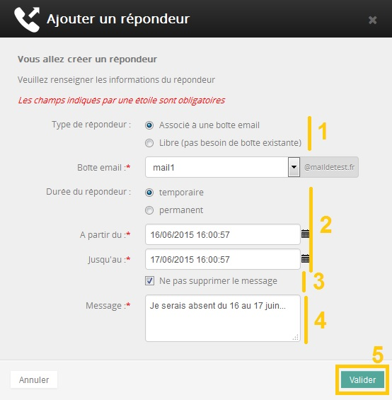

## Prerequisiti

- Avere accesso al tuo Spazio Cliente OVH
- Aver attivato un servizio OVH che permette di creare email
- Utilizzare i server MX* OVH

*Per maggiori informazioni sui server MX, consulta la guida 

## Accedi al tuo Spazio Cliente OVH

- Per accedere al tuo [Spazio Cliente OVH](https://www.ovh.com/manager/web), inserisci le tue credenziali e clicca su Login.

{.thumbnail}

## Seleziona il dominio associato al tuo servizio email
Clicca sulla sezione Email del menu a sinistra e seleziona il tuo dominio.

{.thumbnail}

## Tab Email
Per gestire le tue risposte automatiche, clicca prima sul tab Email (1) e poi su Gestisci le risposte automatiche (2).

{.thumbnail}

## Menu risposta automatica
Clicca su Aggiungi una risposta automatica.

{.thumbnail}

## Imposta la risposta automatica
Inserisci queste informazioni:

Tipo di risposta automatica (1):

- Associata a una casella email (da utilizzare per un account esistente, non un alias).
- Libera (da utilizzare per un alias).

Casella email:
- l'indirizzo email o l'alias in questione.

Durata della risposta automatica (2):
- Temporanea: ti permette di definire il periodo in cui è attiva la tua risposta automatica.
- Permanente: la risposta automatica viene inviata fino a quando non la disattivi.

Salva i messaggi sul server (3):
- Seleziona questa casella per conservare i messaggi ricevuti. Se hai scelto l'opzione Libera, puoi scegliere l'indirizzo email a cui inviare la copia dei messaggi ricevuti.

Messaggio (4):
- Il testo della risposta automatica che riceveranno i contatti che ti invieranno un'email.

Conferma (5):
- Clicca su Conferma per attivare la tua risposta automatica.

{.thumbnail}

- Compare un messaggio che ti conferma che l'aggiunta della tua risposta automatica è in corso:

{.thumbnail}

## Visualizza la risposta automatica
Una volta completata la configurazione, la tua risposta automatica compare nella lista. Per modificarla o eliminarla, clicca sulla ruota dentata a destra e seleziona l'operazione che vuoi effettuare.

{.thumbnail}

