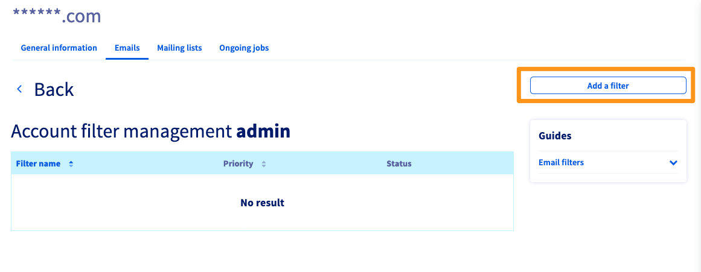
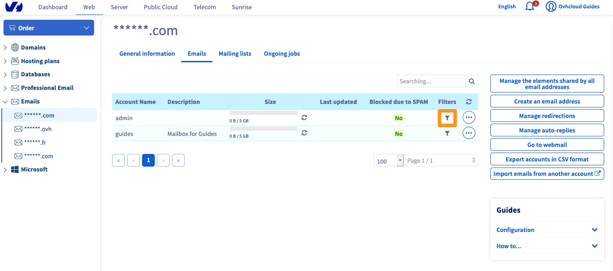

## ¿Qué es un filtro de correo?
Un filtro permite configurar condiciones y las acciones que se realizan en función de dichas condiciones.

Por ejemplo:

Si

- condición = el mensaje de correo contiene spam

entonces,

- acción = eliminar el mensaje de correo

## Requisitos

Es necesario:

- Tener un servicio de correo [MX Plan](https://www.ovh.es/productos/mxplan.xml) o un [plan de hosting](https://www.ovh.es/hosting/).
- Tener acceso al [área de cliente](https://ca.ovh.com/auth/?action=gotomanager) de OVH.

Si no puede acceder al área de cliente, consulte [esta guía](https://www.ovh.es/g1909.web_hosting_administrar_y_acceder_a_sus_contrasenas).

## ¿Dónde se configuran los filtros de correo?

Para empezar, conéctese al [área de cliente](https://ca.ovh.com/auth/?action=gotomanager).

Seleccione en la columna izquierda el dominio al que está asociado el servicio de correo.

La tabla que muestra las distintas direcciones de correo contiene una columna llamada «Filtros».

Haga clic en el icono con forma de embudo situado en esa columna correspondiente a la cuenta de la que desee gestionar los filtros.

{.thumbnail}
Para añadir un filtro, haga clic en el botón «Añadir un filtro».

{.thumbnail}

## Información

- Nombre del filtro: Sirve para diferenciar los distintos filtros que cree en la tabla de resumen. No es información técnica, sino un dato para facilitar la administración.

- Prioridad: Determina el orden de ejecución de los filtros en un mismo buzón de correo. Cuanto menor sea el número, mayor será la prioridad: un filtro de prioridad 1 se ejecutará antes que un filtro de prioridad 5.

- Activar el filtro: Determina si el filtro está activo o no. Puede crear un filtro desmarcando esta opción y luego activarlo más adelante.

## Reglas

Aquí es donde se configuran las condiciones, es decir, las reglas de filtrado.

Cabecera

- De: Remitente, por ejemplo: «si el remitente...»
- A: Destinatario, por ejemplo: «si el destinatario...»
- Asunto del mensaje: Por ejemplo: «si el asunto del mensaje...»
- Otro: Otros parámetros de la cabecera del mensaje.

Regla
- SPF: Parámetro que depende del registro SPF, por ejemplo: «si el remitente no tiene registro SPF...»
- contiene: Por ejemplo: «si el asunto del mensaje contiene...»
- no contiene: Por ejemplo: «si el asunto del mensaje no contiene...»

Valor
- Por ejemplo: «Si el asunto del mensaje contiene [SPAM]...»

+
- Permite establecer varias condiciones para el mismo filtro (ver apartado relativo a la creación de [reglas múltiples](#MULTI)).

{.thumbnail}

## Acción

Aquí es donde se configuran las acciones, es decir, lo que hará el filtro si se cumplen las condiciones anteriores. Las posibles acciones son:

- aceptar: Recibe el mensaje normalmente.
- redirigir a una dirección local: Redirige el mensaje a una de las direcciones de correo asociadas al mismo dominio.
- eliminar: Elimina el mensaje.
- redirigir a una dirección remota: Redirige el mensaje a otra dirección de correo.

## Eliminar el spam

|Cabecera|Regla|Valor|Acción|
|---|---|---|---|
||Cabecera|Regla|Valor|Acción|
|Parámetros del filtro|Asunto del mensaje|contiene|[SPAM]|eliminar|
|Lo que hace el filtro|Si el asunto del mensaje|contiene|la cadena «[SPAM]»,|entonces, eliminar el mensaje|

## Redirigir los emails de un destinatario

|Cabecera|Regla|Valor|Acción|
|---|---|---|---|
||Cabecera|Regla|Valor|Acción|
|Parámetros del filtro|De|contiene|contacto@test.com|redirigir a una dirección remota: conta@finanzas.com|
|Lo que hace el filtro|Si el remitente del mensaje|es|contacto@test.com,|entonces, reenviar el mensaje a conta@finanzas.com|

## Redirigir los emails dirigidos a una lista de correo

|Cabecera|Regla|Valor|Acción|
|---|---|---|---|
||Cabecera|Regla|Valor|Acción|
|Parámetros del filtro|A|contiene|ML@mailing.com|redirigir a una dirección local:  el@midominio.com|
|Lo que hace el filtro|Si el mensaje ha sido enviado a la lista de correo|llamada|ML@mailing.com|entonces, reenviar el mensaje a mi otra dirección: el@midominio.com|

## Eliminar los emails que contengan una indicación no deseada, excepto un remitente 

|Cabecera|Regla|Valor|Acción|
|---|---|---|---|
||Cabecera|Regla|Valor|Acción|
|Parámetros del filtro 1|Asunto del mensaje|contiene|money|eliminar|
|Parámetros del filtro 2|De|no contiene|john@mybank.ovh|eliminar|
|Lo que hace el filtro 1|Si el asunto del mensaje|contiene|la palabra «money»|y|
|Lo que hace el filtro 2|el remitente del mensaje|no es|john@mybank.ovh,|entonces, eliminar el mensaje|

En este caso, habría que configurar dos reglas:

{.thumbnail}

