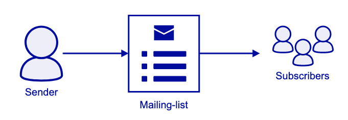
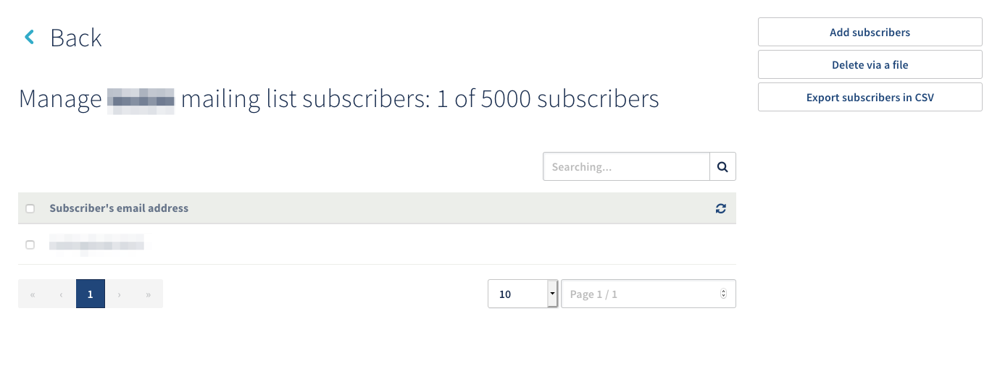
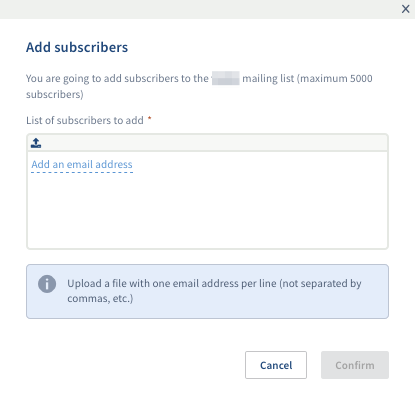
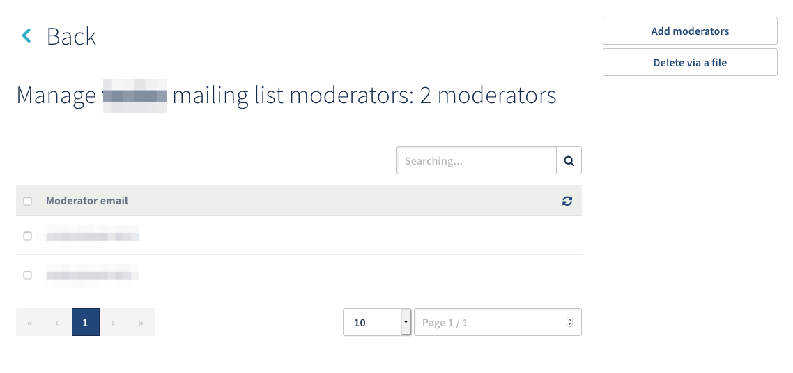
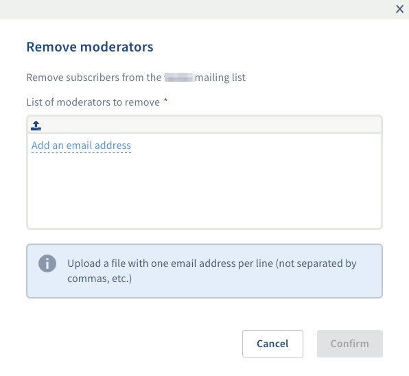

**Letzte Aktualisierung am 13.02.2020**

## Ziel

Über eine Mailingliste können Sie Massenabonnenten kontaktieren, d. h. eine Nachricht oder Informationen gleichzeitig an mehrere Empfänger senden. Das kann im Zusammenhang mit einem Informationsmailing z. B. über die Veröffentlichung eines neuen Produkts (für eine E-Commerce-Site) oder als Information über ein bevorstehendes Meeting (für eine Community-Website) nützlich sein. 

**Erfahren Sie in dieser Anleitung, wie Sie Ihre Mailinglisten verwalten.**

### Prinzip der Moderation

Eine Mailingliste kann moderiert werden, um zu verhindern, dass jemand E-Mails an Ihre Abonnentenliste sendet. Eine moderierte Mailingliste kann zum Versenden von Newslettern verwendet werden, während Sie mithilfe einer nicht moderierten Mailingliste auf einfache Weise einen Dialog zwischen mehreren Abonnenten per E-Mail herstellen können.

**Mailingliste ohne Moderation**

{.thumbnail}

Der Absender (sender) sendet die E-Mail an die Mailingliste, Abonnenten (subscribers) erhalten die E-Mail direkt.

**Mailingliste mit Moderation**

{.thumbnail}

Der Absender (sender) sendet die E-Mail an die Mailingliste. Der Moderator (moderator) erhält eine E-Mail mit einer Validierungs- oder Ablehnungsanfrage. Wenn der Moderator diese bestätigt, erhalten Abonnenten (subscribers) die an die Mailingliste gesendete E-Mail. Wenn der Moderator ablehnt, wird die E-Mail des Absenders gelöscht und die Abonnenten erhalten nichts.

> [!warning]
>
> - Eine Mailingliste ist keine Lösung zum Versenden von Massen-Spam (Werbebotschaften). Diese Verwendung wird bis zu einem gewissen Grad toleriert, solange sie sich nicht als missbräuchlich erweist.
> - Ein Abonnent kann jederzeit entscheiden, sich von einer Mailingliste abzumelden. Er kann auch jeden Missbrauch melden, wenn er diesen für erwiesen erachtet.
>

## Voraussetzungen

- Sie verfügen über mindestens ein E-Mail-Angebot MX Plan 100 oder ein kompatibles [Webhosting](https://www.ovh.de/hosting).
- Sie haben Zugriff auf Ihr [OVHcloud Kundencenter](https://www.ovh.com/auth/?action=gotomanager).

## In der praktischen Anwendung

### Ihre Mailingliste erstellen

Um Ihre Mailingliste zu erstellen, loggen Sie sich in Ihrem [OVHcloud Kundencenter](https://www.ovh.com/auth/?action=gotomanager) ein und wählen Sie oben die Kategorie `Web`{.action}.

Sobald die Verbindung hergestellt ist, klicken Sie in der linken Spalte auf `E-Mails`{.action} und dann auf den betreffenden Domainnamen. Wechseln Sie zur Registerkarte `Mailinglisten`{.action} Ihres E-Mail-Dienstes.

{.thumbnail}

Wenn Sie bereits Mailinglisten erstellt haben, werden diese in der Übersichtstabelle angezeigt. Im folgenden Beispiel wurde bereits eine Mailingliste erstellt.

Um eine neue Mailingliste zu erstellen, klicken Sie auf `Mailingliste hinzufügen`{.action}.

{.thumbnail}

Füllen Sie das Formular gemäß den Angaben in der folgenden Tabelle aus:

| Information                      	| Beschreibung                                                                                                            	|
|----------------------------------	|------------------------------------------------------------------------------------------------------------------------	|
| Name                              	| Der Name Ihrer Mailingliste.                                                                                          	|
| Inhaber                     	| Geben Sie die E-Mail-Adresse des Inhabers der Mailingliste ein (er wird ebenfalls Moderator sein).                              	|
| Antwort auf                        	| Definieren Sie den/die Empfänger, wenn ein Abonnent auf die Mailingliste antwortet.                                        	|
| Sprache                           	| Wählen Sie die Sprache für die automatischen Abonnements oder Abmeldungen aus Ihrer Mailingliste aus.				|
| Alle Nachrichten moderieren         | Der Inhaber oder ein Moderator muss die an die Mailingliste gesendete E-Mail genehmigen.                                     	|
| Nur Abonnenten können posten 	| Beschränken Sie das Senden von E-Mails auf der Mailingliste auf Abonnenten.              								|
| Jeder kann posten (keine Moderation) | Das Senden einer E-Mail an die Mailingliste erfolgt ohne Validierung direkt an Abonnenten.             		|
| Moderation der Abonnenten         	| Der Inhaber oder ein Moderator muss Einträge in die Mailingliste genehmigen.                                    	|


{.thumbnail}


> [!primary]
>
> Maximale Anzahl von Abonnenten auf der Mailingliste:
>
> - 5000 bei Moderation der Nachrichten
> - 250 ohne Moderation der Nachrichten
>


### Die Mailinglisten-Optionen verwalten

Um die Optionen der Mailingliste zu ändern, klicken Sie rechts davon auf `...`{.action}. Sie können dann die Optionen aktualisieren, die Mailingliste löschen sowie die Abonnentenliste per E-Mail freigeben. 

{.thumbnail}


### Abonnenten verwalten

Um die Abonnenten Ihrer Mailingliste zu verwalten, klicken Sie auf die Figur in der Spalte „Abonnenten“.

{.thumbnail}

Das folgende Fenster wird angezeigt:

{.thumbnail}

#### Abonnenten hinzufügen/entfernen

|Abonnenten hinzufügen|Abonnenten entfernen|
|---|---|
|Klicken Sie rechts auf `Abonnenten hinzufügen`{.action}.|Klicken Sie rechts auf `Über eine Datei entfernen`{.action}.|
|{.thumbnail}|{.thumbnail}|

Es gibt zwei Methoden zum Hinzufügen/Entfernen von Abonnenten:

- manuelle Eingabe von Adressen durch Klicken auf `E-Mail-Adresse hinzufügen`{.action}.
- Import einer Textdatei mit einer E-Mail-Adresse pro Zeile durch Klicken auf das Download-Symbol über dem Eingaberahmen.

#### Ihre Abonnentenliste in eine CSV-Datei exportieren

Klicken Sie auf `Abonnenten in CSV exportieren`{.action}, um eine CSV-Datei mit allen Ihren Abonnenten zu erstellen. Diese Option ist in unserem Fall nicht verfügbar, da kein Abonnent hinzugefügt wurde.
 
### Moderatoren verwalten

Um die Moderatoren Ihrer Mailingliste zu verwalten, klicken Sie auf das Icon in der Spalte „Moderatoren“.

{.thumbnail}

Das folgende Fenster wird angezeigt:

{.thumbnail}

#### Moderatoren hinzufügen/entfernen

|Moderatoren hinzufügen|Moderatoren entfernen|
|---|---|
|Klicken Sie rechts auf `Moderatoren hinzufügen`{.action}.|Klicken Sie rechts auf `Über eine Datei entfernen `{.action}.|
|{.thumbnail}|{.thumbnail}|

Es gibt zwei Methoden zum Hinzufügen/Entfernen von Moderatoren:

- manuelle Eingabe von Adressen durch Klicken auf `Eine E-Mail-Adresse hinzufügen`{.action}.
- Import einer Textdatei mit einer E-Mail-Adresse pro Zeile durch Klicken auf das Upload-Symbol über dem Eingaberahmen.

> [!primary]
> - Wenn mehrere Moderatoren in einer Mailingliste definiert sind, reicht die Validierung nur eines der Moderatoren aus, damit die E-Mail an Abonnenten gesendet werden kann.
> - Wenn ein Moderator eine E-Mail an die Mailingliste sendet, erhält nur er die Moderations-E-Mail.
> 

Je nach Anzahl der hinzuzufügenden Abonnenten kann es einige Zeit dauern, bis der Vorgang abgeschlossen ist.


### Eine Mailingliste abonnieren

Wenn jemand Ihre Mailingliste abonnieren möchte, muss er nur eine E-Mail senden an:


```bash
Name_Ihrer_ML-subscribe@Ihredomain.com
```


### Eine Mailingliste abbestellen

Wenn ein Abonnent sich von Ihrer Mailingliste abmelden möchte, muss er nur eine E-Mail senden an:


```bash
Name_Ihrer_ML-unsubscribe@Ihredomain.com
```


### Automatisches Löschen fehlerhafter Adressen

Im Mailinglistensystem wird ein Abonnenten nach einer einzelnen Fehlerrückgabe nicht aus der Liste entfernt (Nachricht nicht zugestellt, nicht vorhandene Adresse ...). Es wartet ungefähr 12 Tage nach dem ersten Sendefehler und sendet dann eine Warnmeldung an den Abonnenten.

Die Warnmeldung zeigt die Referenzen der fehlenden Nachrichten an. Wenn diese Warnmeldung ebenfalls fehlschlägt, wartet unser Mailinglistensystem weitere 12 Tage und sendet dann eine „Test“-Nachricht. Wenn diese Testnachricht ebenfalls fehlschlägt, wird der Abonnent aus der Liste der Abonnenten gelöscht.


### Wiederkehrende Fehler

#### Senden ohne Angabe eines Betreffs in der E-Mail

Eine Sendung an eine Mailingliste muss einen Betreff enthalten. Andernfalls wird automatisch ein Fehler generiert und eine Fehlermeldung per E-Mail an den Absender der Nachricht gesendet.

Der Absender der E-Mail ohne Betreff erhält daher eine E-Mail mit einer Fehlermeldung zurück, wie unten angezeigt.


```bash
Hi. This is the qmail-send program at mx1.ovh.net.
I'm afraid I wasn't able to deliver your message to the following addresses.
This is a permanent error; I've given up. Sorry it didn't work out.

<newsletter@testinterne.ovh>:

ezmlm-reject: fatal: Sorry, I don't accept message with empty Subject (#5.7.0)
```


#### Senden durch Eingabe der Adresse der Mailingliste in Blindkopie

Um eine Nachricht an eine Mailingliste zu senden, muss ihre Adresse entweder im Feld „An“ oder im Feld „Kopie an“ (Cc) angegeben werden.

Wenn der Absender die Adresse in das Feld „Blindkopie“ eingibt, wird folgende Fehlermeldung erzeugt:


```bash
Hi. This is the qmail-send program at mx1.ovh.net.
I'm afraid I wasn't able to deliver your message to the following addresses.
This is a permanent error; I've given up. Sorry it didn't work out.

<newsletter@testinterne.ovh>:

ezmlm-reject: fatal: List address must be in To: or Cc: (#5.7.0)
```


### Erweiterte Anpassung

Sie können die meisten Texte in Ihrer Mailingliste anpassen. Als Moderator müssen Sie eine leere E-Mail an [Name_Ihrer_ML-edit@yourdomain.com](mailto:edit@votredomaine.com) senden.

- Beispiel: Ihre Mailingliste lautet [newsletter@testinterne.ovh](mailto:newsletter@testinterne.ovh). Von Ihrer Moderator-E-Mail-Adresse aus müssen Sie eine Nachricht an [newsletter-edit@testinterne.ovh](mailto:newsletter-edit@testinterne.ovh) senden.

Sie erhalten dann eine E-Mail, die Sie anleitet wie Sie Ihre Änderungen vornehmen können.

Unten finden Sie eine Liste der Dateien mit den Antworttexten und eine kurze Beschreibung der Verwendung ihres Inhalts. Um eine Datei zu bearbeiten, senden Sie einfach eine Nachricht an send-edit.file und ersetzen Sie den Dateinamen durch 'file'. Die Bearbeitungsanleitung wird mit der Textdatei gesendet.


|Datei|Verwendung|
|---|---|
|bottom|Fußzeile aller Antworten: allgemeine Informationen.|
|digest|'administrativer' Abschnitt der regelmäßigen Rundschreiben.|
|FAQ|Antworten auf häufig gestellte Fragen zu dieser Liste.|
|get_bad|im Fall von Nachrichten, die nicht im Archiv vorhanden sind.|
|help|allgemeine Hilfe (zwischen 'top' und 'bottom').|
|info|Informationen auf der Liste. Die erste Zeile ist eine Zusammenfassung.|
|mod_help|spezifische Hilfe für Listenmoderatoren.|
|mod_reject|an den Absender abgelehnter Sendungen.|
|mod_request|an Moderatoren mit einer Sendung.|
|mod_sub|an den Abonnenten nach Bestätigung der Registrierung durch den Moderator.|
|mod_sub_confirm|an Moderatoren zur Validierung einer Registrierung.|
|mod_timeout|an den Absender einer Nachricht, der seit langem nicht gültig war.|
|mod_unsub_confirm|an einen Administrator zum Anfordern einer Abmeldung.|
|sub_bad|an den Abonnenten, wenn die Bestätigung falsch war.|
|sub_confirm|an den Abonnenten zum Bestätigen seiner Anfrage.|
|sub_nop|an den Abonnenten nach einem neuen Abonnement.|
|sub_ok|an den Abonnenten nach einem erfolgreichen Abonnement.|
|Top|in der Überschrift jeder Antwort.|
|trailer|am Ende jedes Beitrags zur Liste hinzugefügt.|
|unsub_bad|an den Abonnenten, wenn die Abmeldebestätigung falsch ist.|
|unsub_confirm|an den Abonnenten, um eine Abmeldebestätigung anzufordern.|
|unsub_nop|an einen Nicht-Abonnenten nach einer Abmeldeanforderung.|
|unsub_ok|an einen ehemaligen Abonnenten nach erfolgreicher Abmeldung.|

> [!primary]
>
> Beispiel: Wenn Sie die Standardfußzeile für E-Mails ändern möchten, die an Ihre Mailingliste gesendet werden, müssen Sie eine Nachricht an die Adresse „newsletter-edit.bottom@testinterne.ovh“ senden. Sie erhalten dann eine neue E-Mail, in der erläutert wird, wie Sie die Fußzeile anpassen.
> 

## Weiterführende Informationen

Für den Austausch mit unserer User Community gehen Sie auf https://community.ovh.com/en/