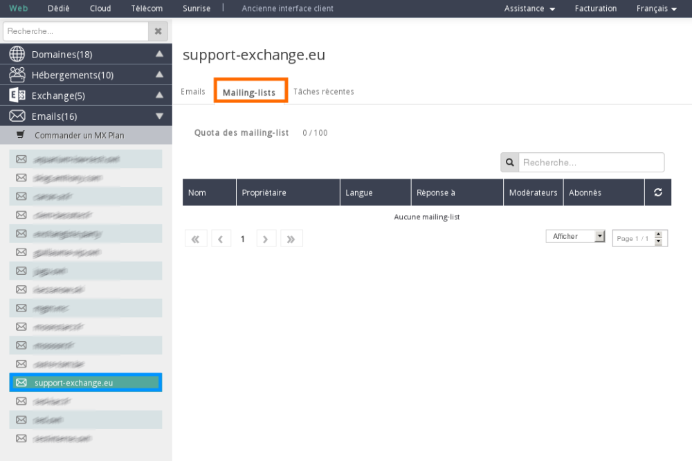
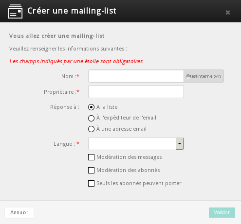

OVH propose à ses clients une solution de mailing list. Cette dernière est comprise dans certaines offres d'[hébergement Web](http://www.ovh.com/fr/hebergement-web/){.external} et [MxPlan](https://www.ovh.com/fr/produits/mxplan.xml){.external}.

## La mailing list

### Généralités

Une mailing list vous permet de contacter des abonnés en masse, c'est à dire de diffuser un message ou une information à plusieurs destinataires à la fois. Ceci peut avoir un intérêt dans le cadre d'un mailing d'information sur la sortie d'un nouveau produit (pour un site e-commerce) ou pour informer d'un prochain rassemblement (pour un site communautaire). Il existe diverses utilisations qui peuvent répondre à vos besoins.

Ezmlm est un gestionnaire de listes de diffusion très répandu et performant. Nous allons voir dans ce guide comment créer, gérer et configurer une mailing list.


> [!alert]
>
> - Il faut garder à l'esprit qu'une mailing list n'est pas une solution à l'envoi de Spam (messages de publicités) en masse. Ce type d'utilisation est toléré dans une certaine mesure tant que celle-ci ne se révèle pas abusive.
> - Sachez qu'à tout moment, un utilisateur peut décider de se désabonner d'une liste de diffusion, mais peut également reporter tout abus si il le juge probant.
>

## Utiliser la mailing list OVH

### Créer sa mailing list

Dans notre exemple, il s'agit du service mailing list associée à une offre mutualisée pro. Afin de créer votre mailing list, vous devez dans un premier temps vous rendre dans votre [Espace client](http://www.ovh.com/manager/web){.external} OVH.

Une fois connecté, sélectionnez votre hébergement dans la section `Emails`{.action} puis cliquez sur l'onglet `mailing lists`{.action}.

{.thumbnail}

Si vous avez déjà créé des mailing lists, celles-ci apparaissent dans le tableau récapitulatif. Dans notre exemple aucune mailing list n'est crée.

Pour créer une nouvelle mailing list, cliquez sur Ajouter une mailing list.


{.thumbnail}

Voici le formulaire pour créer votre mailing list, plusieurs informations sont nécessaires afin de pouvoir le valider :

- Nom : le nom de votre mailing list
- Propriétaire : saisir l'adresse e-mail du propriétaire de la mailing list (il sera aussi modérateur)
- Réponse à : définir l'adresse de réponse
- Langue : sélectionner la langue de votre mailing list (traduction des e-mails automatiques d'inscription ou de désinscription)
- Modération des messages : le propriétaire (modérateur) doit approuver les réponses.
- Modération des abonnés : le propriétaire (modérateur) doit approuver les inscriptions
- Seuls les abonnés peuvent poster : il n'est pas possible d'envoyer un e-mail à la mailing list si la personne n'est pas inscrite à celle-ci


{.thumbnail}

Une fois le formulaire de création validé, un message de confirmation apparait :


{.thumbnail}


> [!primary]
>
> Nombre maximum d'abonnés à la mailing list :
>
> - 5000 si modération des messages
> - 250 sans modération des messages
>

### Principe de la modération

Une mailing list peut être modérée pour éviter que n'importe qui n'envoie d'e-mail à votre liste d'abonnés. Une mailing list modérée sert principalement à réaliser l'envoi de newsletters par exemple, contrairement à une mailing list non modérée qui servira plus facilement à réaliser un dialogue entre plusieurs abonnés par e-mail.


{.thumbnail}

.


{.thumbnail}


### Modifier les options de la mailing list ou la supprimer

Si vous souhaitez modifier les options précédemment validées lors de la création de la mailing list ou la supprimer, cliquez sur la roue crantée à droite de votre mailing list.

{.thumbnail}


### Importer des abonnés

Dans notre exemple nous n'avons pas encore enregistré d'abonné. Pour ce faire il faut cliquer sur le symbole noire dans la section "Abonnés"


{.thumbnail}

- Cliquez sur `Ajouter des abonnés`{.action} afin de pouvoir ajouter vos abonnés.


{.thumbnail}

Il y a 2 méthodes pour ajouter des abonnés à une mailing list :

- la saisie d'adresse manuelle ;
- l'import d'un fichier texte contenant une adresse email par ligne.


{.thumbnail}

Une fois la validation réalisée, un message de confirmation apparait :


{.thumbnail}

Selon le nombre d'abonnés à ajouter, cela peut prendre un certains temps afin de réaliser l'opération.


### Exporter votre liste d'abonnés vers un fichier CSV

- Cliquez sur `exporter les abonnés en CSV`{.action} afin de générer un fichier CSV contenant l'ensemble de vos abonnés. Cette option n'est pas disponible dans notre cas car aucun abonné n'a été ajouté.


### S'inscrire à une mailing list

Si quelqu'un souhaite s'inscrire à votre mailing list, il lui suffit d'envoyer un e-mail à :


```bash
nom_de_votre_ML-subscribe@votredomaine.com
```


### Se désinscrire d'une mailing list

Si un abonné souhaite se désinscrire de votre mailing list, il lui suffit d'envoyer un e-mail à :


```bash
nom_de_votre_ML-unsubscribe@votredomaine.com
```


### Suppression automatique des adresses erronées

Il est important de savoir que le système de mailing list ne supprime pas un abonné de la liste après un seul retour d'erreur (message non délivré, adresse inexistante...). Au contraire, il attend environ 12 jours après le premier échec d'envoi, puis envoie un message d'avertissement à l'abonné.

Le message d'avertissement indique les références des messages manqués. Si ce message d'avertissement tombe en échec également, notre système de mailing list attend encore 12 jours puis envoie un message "test". Si ce message de test tombe également en erreur, l'abonné est effacé de la liste des abonnés.


## Erreurs récurrentes

### Envoi sans indiquer de sujet dans l'e-mail

Un envoi vers une mailing list doit obligatoirement contenir un sujet. Sans cela, une erreur sera automatiquement générée et un e-mail de retour en erreur sera envoyé à l'expéditeur de l'envoi.

L'expéditeur de l'e-mail sans objet recevra donc un mail de retour en erreur comme visible ci-dessous :


```bash
Hi. This is the qmail-send program at mx1.ovh.net.
I'm afraid I wasn't able to deliver your message to the following addresses.
This is a permanent error; I've given up. Sorry it didn't work out.

<newsletter@testinterne.ovh>:

ezmlm-reject: fatal: Sorry, I don't accept message with empty Subject (#5.7.0)
```


### Envoi en renseignant l'adresse de la mailing list en copie cachée

Pour envoyer un message à une mailing list, l'adresse de celle-ci doit obligatoirement se trouver soit dans le champ « To », soit dans le champ « Copie à » (Cc).

Si le client renseigne l'adresse dans le champ « Copie Cachée », une erreur lui sera alors retournée.

L'expéditeur de l'e-mail recevra un retour d'erreur :


```bash
Hi. This is the qmail-send program at mx1.ovh.net.
I'm afraid I wasn't able to deliver your message to the following addresses.
This is a permanent error; I've given up. Sorry it didn't work out.

<newsletter@testinterne.ovh>:

ezmlm-reject: fatal: List address must be in To: or Cc: (#5.7.0)
```


## Personnalisation avancée

### Comment personnaliser le contenu de ma mailing list ?

Vous pouvez personnaliser la plupart des textes de votre mailing list. En tant que modérateur, vous devez envoyer un e-mail vide à nom_de_votre_ML- [edit@votredomaine.com](mailto:edit@votredomaine.com){.external}.

- Exemple : Votre mailing list est [newsletter@testinterne.ovh](mailto:newsletter@testinterne.ovh){.external} . Depuis votre adresse e-mail modérateur, il vous faudra envoyer un message à [newsletter-edit@testinterne.ovh](mailto:newsletter-edit@testinterne.ovh){.external} .

Vous recevrez alors un e-mail qui vous guidera pour effectuer vos modifications.

Ci-dessous, une liste des fichiers contenant les textes de réponses et une brève description de l'utilisation de leur contenu. Pour éditer un fichier, envoyez simplement un message à envoi-edit.fichier, en substituant le nom du fichier à 'fichier'. Les instructions d'édition seront envoyées avec le fichier de texte.


|Fichier|Utilisation|
|---|---|
|bottom|pied de page de toutes les réponses : infos générales.|
|digest|section 'administrative' des bulletins periodiques.|
|faq|réponses aux questions fréquentes au sujet de cette liste.|
|get_bad|dans le cas de messages absents des archives.|
|help|aide générale (entre 'top' et 'bottom').|
|info|informations sur la liste. La première ligne en est un résumé.|
|mod_help|aide spécifique aux modérateurs de liste.|
|mod_reject|à l'expéditeur d'envois refusés.|
|mod_request|aux modérateurs avec un envoi.|
|mod_sub|à l'abonné après confirmation d'inscription du modérateur.|
|mod_sub_confirm|aux modérateurs pour valider une inscription.|
|mod_timeout|à l'expéditeur d'un message non valide depuis longtemps.|
|mod_unsub_confirm|à un administrateur pour demander une désinscription.|
|sub_bad|à l'abonné si la confirmation était mauvaise.|
|sub_confirm|à l'abonné pour confirmer sa requête.|
|sub_nop|à l'abonne après une nouvelle inscription.|
|sub_ok|à l'abonne après un abonnement réussi.|
|top|en-tête de chaque réponse.|
|trailer|ajouté à la fin de chaque contribution à la liste.|
|unsub_bad|à l'abonné si la confirmation de désinscription est fausse.|
|unsub_confirm|à l'abonné pour demander confirmation de désinscription.|
|unsub_nop|à un non-abonné après une demande de désabonnement.|
|unsub_ok|à un ex-abonné après une désinscription réussie.|

> [!primary]
>
> Exemple : Si vous souhaitez modifier le pied de page par défaut des e-mails envoyés à votre mailing list, il vous faudra envoyer un message à l'adresse « newsletter-edit.bottom@testinterne.ovh ». Vous recevrez alors un nouvel e-mail vous expliquant comment personnaliser le pied de page.
> 

## Aller plus loin

Échangez avec notre communauté d'utilisateurs sur https://community.ovh.com