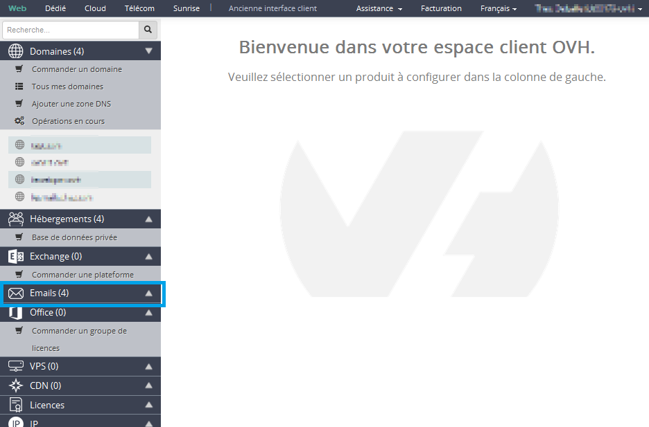
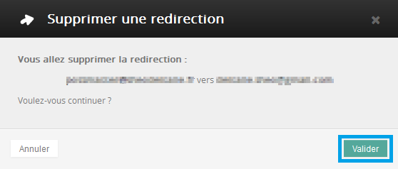

## Was ist eigentlich eine Mail-Umleitung?
Mit einer Mail-Umleitung können Sie E-Mails, die Sie auf einer bestimmten Mail-Adresse empfangen, direkt an eine oder mehrere andere Adresse(n) schicken.

Sie können also beispielsweise

- eine E-Mail, die an Ihre Adresse MeineAdresse@MeineDomain.com geschickt wurde,
- automatisch weiterleiten an MeineAndereAdresse@AndereDomain.com.

So können Sie die erste Adresse (MeineAdresse@MeineDomain.com) öffentlich mitteilen, ohne dass jemand Ihre eigentlich verwendete Adresse erfährt(MeineAndereAdresse@AndereDomain.com).

Sie können eingehende Nachrichten auch an mehrere Adressen umleiten. Gleichzeitig können Sie auch festlegen, dass immer eine Kopie der umgeleiteten Nachricht in Ihrem ersten Postfach gespeichert wird.

Jede Mail, die an eine Adresse gesendet wird, für die eine Umleitung eingerichtet ist, wird an die von Ihnen gewählte(n) Adresse(n) umgeleitet, ohne dass der Absender davon etwas erfährt.

{.thumbnail}

## Voraussetzungen

- Zugang zu Ihrem [OVH Kundencenter](https://www.ovh.com/manager/web/login/).

Falls Sie die Zugangsinformationen zu Ihrem Kundencenter nicht mehr haben, kann Ihnen [diese Anleitung](https://www.ovh.de/g1909.mutualise_gerer_et_acceder_a_ses_mots_de_passe#les_differents_mots_de_passe_lies_au_service_mutualise_dovh_lacces_au_manager_dovh) weiterhelfen.

- Wenn Sie bereits OVH Postfächer verwenden, können Sie sofort zum nächsten Schritt übergehen.

- Falls Sie bisher kein Mailing-Angebot verwenden, lesen Sie zunächst folgende Anleitung:.

## Wo kann ich Mail-Umleitungen konfigurieren?
Loggen Sie sich zunächst in Ihr [Kundencenter](https://www.ovh.com/manager/web/login/) ein.

Klicken Sie dann im Menü links auf E-Mails.

{.thumbnail}
Wählen Sie aus der Liste Ihrer Domainnamen denjenigen aus, für den Sie eine Mail-Umleitung einrichten wollen.

Falls der von Ihnen gewünschte Domainname in der Liste nicht aufgeführt ist, verfügt er nicht über ein Mailing-Angebot. In diesem Fall können Sie den Anweisungen in [dieser Anleitung](https://www.ovh.de/g1864.commander_un_mx_plan) folgen oder in Ihrem Kundencenter auf "Ein MX Plan Paket bestellen" klicken, bevor Sie fortfahren.

{.thumbnail}
Wenn Sie auf den gewünschten Domainnamen klicken, kommen Sie in den E-Mail-Bereich.

Bleiben Sie im ersten Tab E-Mails und klicken Sie rechts auf den Button "Verwaltung der Weiterleitungen".

Hier sehen Sie nun eine Liste der aktiven Mail-Umleitungen und können auch neue erstellen.

{.thumbnail}

## Eine Weiterleitung hinzufügen
Sie sehen in Ihrem Kundencenter aktuell Folgendes:

In der Mitte befindet sich eine Liste Ihrer aktiven Weiterleitungen.
Rechts sehen Sie den Button "Eine Weiterleitung hinzufügen", mit dem Sie neue Umleitungen einrichten können.

{.thumbnail}
Folgende drei Angaben sind zum Einrichten einer Umleitung notwendig:

- Von der Adresse: Geben Sie hier die E-Mail-Adresse an, von der die Nachrichten weitergeleitet werden sollen.

Dabei handelt es sich um ein Postfach, das auf @IhrDomainname endet.

- Zur Adresse: Geben Sie hier die Zieladresse an, auf die Sie alle Nachrichten umleiten möchten. Dies kann eine Ihrer OVH Adressen sein oder auch eine externe Adresse eines anderen Anbieters.

- Eine lokale Kopie aufbewahren: Setzen Sie hier ein Häkchen, wenn alle weitergeleiteten Nachrichten dennoch in Ihrem ursprünglichen Posteingang gespeichert werden sollen. Sie finden die Nachricht dann in beiden Postfächern.

Klicken Sie dann auf "Bestätigen", um die Weiterleitung zu erstellen.

{.thumbnail}

## Eine Weiterleitung löschen
Wenn Ihre eingehenden Nachrichten künftig nicht mehr umgeleitet werden sollen bzw. Sie eine aktive Weiterleitung löschen möchten, gehen Sie auf die Liste Ihrer aktiven Weiterleitungen.

- Dann klicken Sie auf das kleine Zahnrad rechts neben der Umleitung, die Sie ändern möchten.

- Klicken Sie dann auf "Die Weiterleitung löschen"

{.thumbnail}
Dann müssen Sie nur noch auf "Bestätigen" klicken, um die Weiterleitung endgültig zu löschen.

{.thumbnail}

## Sie wollen alle auf eine E-Mail-Adresse A eingehenden Nachrichten als Kopie an eine E-Mail-Adresse B weiterleiten.
Dies kann etwa sinnvoll sein, wenn auch Ihr(e) Sekretär(in) alle an Sie gesendeten Nachrichten empfangen soll. Nehmen Sie dann folgende Konfiguration vor:

{.thumbnail}

## Sie wollen alle auf eine E-Mail-Adresse A eingehenden Nachrichten als Kopie an die beiden E-Mail-Adressen B und C weiterleiten.
Ausgangslage:
Sie haben eine neue E-Mail-Adresse, möchten das aber nicht den Hunderten Kontakten in Ihrem Adressbuch mitteilen müssen. Sie möchten die eingehenden Nachrichten also nicht mehr über Ihre E-Mail-Adresse A empfangen, sondern Sie direkt an Ihre beiden anderen Mail-Adressen B und C weiterleiten.
In diesem Fall müssen Sie zwei getrennte Umleitungen einrichten.

{.thumbnail}

