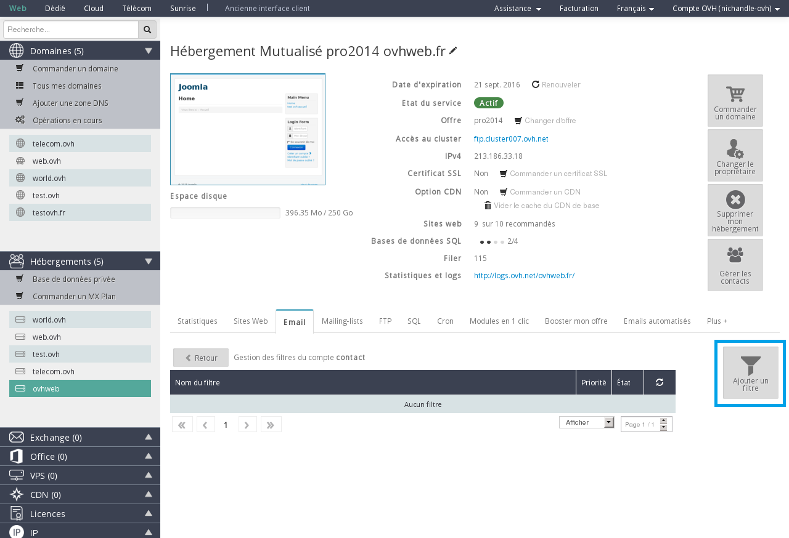
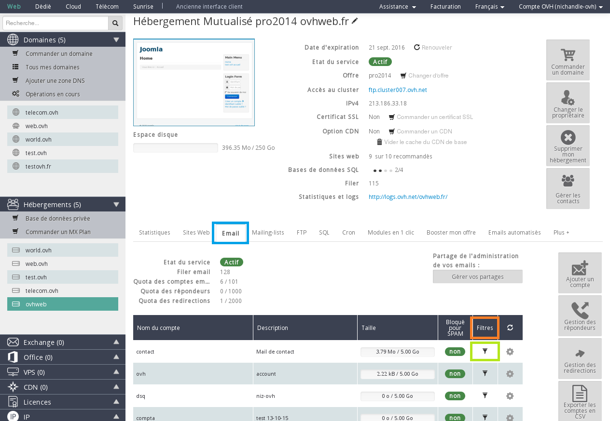
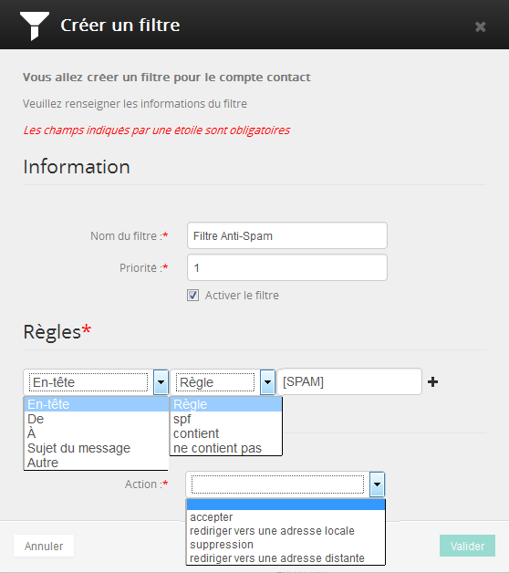

Vous trouverez dans ce guide différentes informations et aides concernant la configuration de vos filtres d'e-mails, par exemple pour filtrer les SPAMS reçus.

## Généralité sur les filtres d'e-mails

### Qu'est-ce qu'un filtre d'e-mail ?

Un filtre permet de configurer des conditions sur les e-mails que vous recevez, ainsi que des actions qui en découlent.

Par exemple : vous souhaitez que tout e-mail contenant "[SPAM]" dans le sujet soit supprimé.

- Condition = le sujet de l'e-mail contient *SPAM*
- Action = supprimer l'e-mail

### Prérequis

- Avoir une offre e-mail MX Plan ou un [Pack Hébergement Web](https://www.ovh.com/fr/hebergement-web/){.external} .
- Avoir l'accès à votre [espace client](https://www.ovh.com/manager/web/login/){.external}.

### Ou se configurent les filtres d'e-mails ?

Dans un premier temps, connectez-vous à votre [espace client](https://www.ovh.com/manager/web/login/){.external}.

Une fois connecté, sélectionnez votre nom de domaine concerné dans la Section Emails.

Dans le tableau listant vos différentes adresses e-mails, cliquez sur l'icône `Filtre`{.action} de l'adresse concernée.

{.thumbnail}

Vous accéderez à la liste de vos filtres actuellement configurés pour cette adresse e-mail. Pour en ajouter un, cliquez donc sur le bouton à droite `Ajouter un Filtre`{.action}.

{.thumbnail}

## Comprendre la configuration des filtres d'e-mails

{.thumbnail}

### Informations

- **Nom du filtre :** Cela sert à différencier vos filtres dans l'espace client.
- **Priorité :** Cela définit l'ordre d'exécution de vos filtres sur une même boite e-mail. Un filtre de priorité 1 s'exécutera avant un filtre de priorité 5.
- **Activer le filtre :** Cela détermine si le filtre sera effectif ou pas (Vous pouvez créer un filtre en décochant l'option si vous souhaitez l'activer plus tard par exemple).

### Règles

C'est ici que vous allez configurer les conditions, les règles du filtre.

**Premier choix (En-tête):**

- **De :** Correspond à l'expéditeur, exemple : "Si l'expéditeur ..."
- **À :** Correspond au destinataire, exemple : "Si le destinataire ..."
- **Sujet du message :** Correspond au sujet du message, exemple : "Si le sujet du message ..."
- **Autre :** Autre paramètre

**Deuxième choix (Règle):**

- **spf :** Paramètre qui dépend du champ SPF, exemple : "... n'a pas de champ SPF ..."
- **contient :** exemple : "... contient ..."
- **ne contient pas :** exemple : "... ne contient pas ..."

**Troisième choix (valeur):**

- Exemple : [SPAM]

**Quatrième choix (+) :**

- Cela vous permet d'ajouter une ou plusieurs conditions pour la même action (voir partie [règles multiples](#MULTI){.external} )

**Résultat de ces conditions** - Exemple : "Si le sujet du message contient [SPAM]"

### Actions
C'est ici que vous allez choisir ce qui sera fait par le filtre si les conditions au dessus sont réunies.

Vous avez le choix entre :

- **Accepter :** Les e-mails remplissant les conditions seront reçus normalement.
- **Rediriger vers une adresse locale :** Redirige les e-mails remplissant les conditions vers une des adresses e-mails de votre domaine.
- **Suppression :** Les e-mails remplissant les conditions seront supprimés.
- **Rediriger vers une adresse distante :** Redirige les e-mails remplissant les conditions vers l'adresse e-mail de votre choix.

## Exemples

### Supprimer les spams

||En-tête|Règle|Valeur|Action|
|---|---|---|---|---|
|Paramètres du filtre|Sujet du message|contient|[SPAM]|suppression|
|Ce que le filtre va faire|Si le sujet du message|contient|la suite "[SPAM]",|alors, supprimer le message.|

### Rediriger les e-mails d'un destinataire

||En-tête|Règle|Valeur|Action|
|---|---|---|---|---|
|Paramètres du filtre|De|contient|contact@test.com|rediriger vers une adresse distance : compta@finance.com|
|Ce que le filtre va faire|Si l'expéditeur|est|contact@test.com,|alors, renvoyer l'e-mail vers compta@finance.com|

### Rediriger les e-mails adresses a une Mailing-List

||En-tête|Règle|Valeur|Action|
|---|---|---|---|---|
|Paramètres du filtre|À|contient|ML@mailing.com|Rediriger vers une adresse locale : lui@mypersonaldomain.ovh|
|Ce que le filtre va faire|Si le message a été envoyé à la Mailing-List|appelée|ML@mailing.com|alors, renvoyer le message vers mon autre adresse : lui@mypersonaldomain.ovh|

### Supprimer les e-mails contenant "otarie" sauf ceux d'un ami précis

**Cela se fait avec plusieurs filtres**

||En-tête|Règle|Valeur|Action|
|---|---|---|---|---|
|Paramètres du filtre 1|Sujet du message|contient|"otarie"|suppression|
|Paramètres du filtre 2|De|ne contient pas|ami@domaine.com|suppression|

**Ce que ce filtre va faire, avec ces deux conditions :** si le sujet du message contient le mot "otarie", **et que** l'expéditeur du message n'est pas "ami@domaine.com" alors le message sera supprimé.

Dans ce cas, le configuration sera la suivante :

{.thumbnail}
