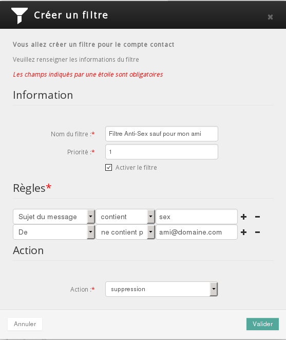

## Che cos'è un filtro email?
Un filtro permette di definire delle condizioni, da cui derivano azioni specifiche.

Ad esempio, puoi definire che:
Se

- condizione=[l'email contiene SPAM]

allora,

- Azione=[elimina l'email].

## Requisiti necessari

- Aver attivato un servizio email [MX Plan](https://www.ovh.it/prodotti/mxplan.xml) o un [Pack Hosting Web](https://www.ovh.it/hosting-web/).

- Avere accesso al tuo [Spazio Cliente OVH](https://www.ovh.com/manager/web/login/).

Se non riesci ad accedere al tuo Spazio Cliente OVH, consulta [questa guida](https://www.ovh.it/g1909.hosting_web_gestisci_le_tue_password#le_password_associate_ai_tuoi_servizi_di_web_hosting_ovh_accesso_al_tuo_spazio_cliente_ovh).

## Dove configurare il filtro email?
Accedi al tuo [Spazio Cliente OVH](https://www.ovh.com/manager/web/login/).

Seleziona il tuo dominio nella sezione Email del menu a sinistra e clicca sul tab Email.

Visualizzi una tabella con la lista dei tuoi indirizzi email. Per accedere ai filtri configurati per la tua casella di posta, clicca sull'icona in corrispondenza del tuo account nella colonna Filtri.

{.thumbnail}
Per aggiungere un filtro, clicca sul tasto Aggiungi un filtro.

{.thumbnail}

## Informazioni

- Nome del filtro: identifica i tuoi filtri nella tabella riepilogativa. Questa informazione è puramente descrittiva, non contiene indicazioni tecniche.

- Priorità: determina l'ordine di esecuzione dei tuoi filtri su una stessa casella di posta. Ad esempio, un filtro con priorità 1 viene applicato prima di un filtro con priorità 5.

- Attiva il filtro: indica se il filtro è attivo.
Deseleziona questa opzione se vuoi creare il filtro ma attivarlo in secondo momento.

## Regole
In questa sezione definisci le condizioni e le regole dei tuoi filtri.

Condizione:

- Da: corrisponde al mittente (Esempio: Se il mittente...)
- A: corrisponde al destinatario (Esempio: Se il destinatario...)
- Oggetto del messaggio: corrisponde all'oggetto del messaggio (Esempio: Se l'oggetto del messaggio...)
- Altro: altro parametro

Regola:
- spf: parametro che dipende dal record SPF (Esempio: Se il mittente non ha record SPF...)
- contiene: Esempio: Se l'oggetto del messaggio contiene...
- non contiene: Esempio: Se l'oggetto del messaggio non contiene

Valore:
- Esempio: Se l'oggetto del messaggio contiene [SPAM]...

+:

- Ti permette di definire più condizioni per lo stesso filtro, cioè di impostare [regole multiple](#MULTI))

{.thumbnail}

## Azione
In questa sezione puoi configurare l' azione, cioè l'operazione eseguita dal filtro se le condizioni definite sono rispettate. Puoi scegliere tra:

- Accetta: ricevi l'email normalmente
- Reindirizza a un indirizzo locale: reindirizza l'email verso una delle caselle di posta associate allo stesso dominio
- Eliminazione: l'email verrà eliminata
- Reindirizza verso un altro indirizzo: reindirizza l'email verso un account di tua scelta

## Elimina i messaggi di Spam
||Condizione|Regola|Valore|Azione|
|---|---|---|---|
||Condizione|Regola|Valore|Azione|
|Parametri del filtro|Oggetto del messaggio|contiene|[SPAM]|eliminazione|
|Azione del filtro|Se l'oggetto del messaggio|contiene|[SPAM],|allora, elimina il messaggio|

## Reindirizza le email a un altro destinatario
||Condizione|Regola|Valore|Azione|
|---|---|---|---|
||Condizione|Regola|Valore|Azione|
|Parametri del filtro|Da|contiene|contatto@test.com|Reindirizza verso un altro indirizzo: account@finance.com|
|Azione del filtro|Se il mittente del messaggio|è|contatto@test.com,|allora, reindirizza l'email a account@finance.com|

## Reindirizza le email inviate a una mailing list
||Condizione|Regola|Valore|Azione|
|---|---|---|---|
||Condizione|Regola|Valore|Azione|
|Parametri del filtro|A|contiene|ML@mailing.com|Reindirizza a un indirizzo locale:  nome@tuodominio.com|
|Azione del filtro|Se il messaggio è stato inviato alla mailing list |chiamata|ML@mailing.com|allora, reindirizza il messaggio a un tuo altro indirizzo:nome@tuodominio.com|

## Elimina email che contengono la parola "sex" se non sono inviate da un amico
||Condizione|Regola|Valore|Azione|
|---|---|---|---|
||Condizione|Regola|Valore|Azione|
|Parametri del filtro 1|Oggetto del messaggio|contiene|"sex"|eliminazione|
|Parametri del filtro 2|Da|non contiene|amico@dominio.com|eliminazione|
|Azione del filtro 1|Se l'oggetto del messaggio|contiene|la parola "sex",|e se|
|Azione del filtro 2|il mittente del messaggio|non è|amico@dominio.com|allora, elimina il messaggio|

Esempio di configurazione di queste due regole:

{.thumbnail}

