## Microsoft Outlook Express
Seleziona l'email di cui vuoi recuperare l'header.

Accedi a File -> Proprietà poi Dettagli.

Clicca su Sorgente del messaggio per recuperare l'header.

## Microsoft Outlook 2003
Apri l'email di cui vuoi recuperare l'header.

Nella nuova finestra, accedi a Visualizza -> Opzioni.

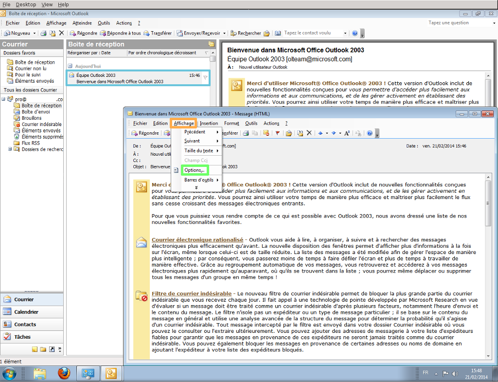{.thumbnail}
L'header completo viene visualizzato (vedi immagine).

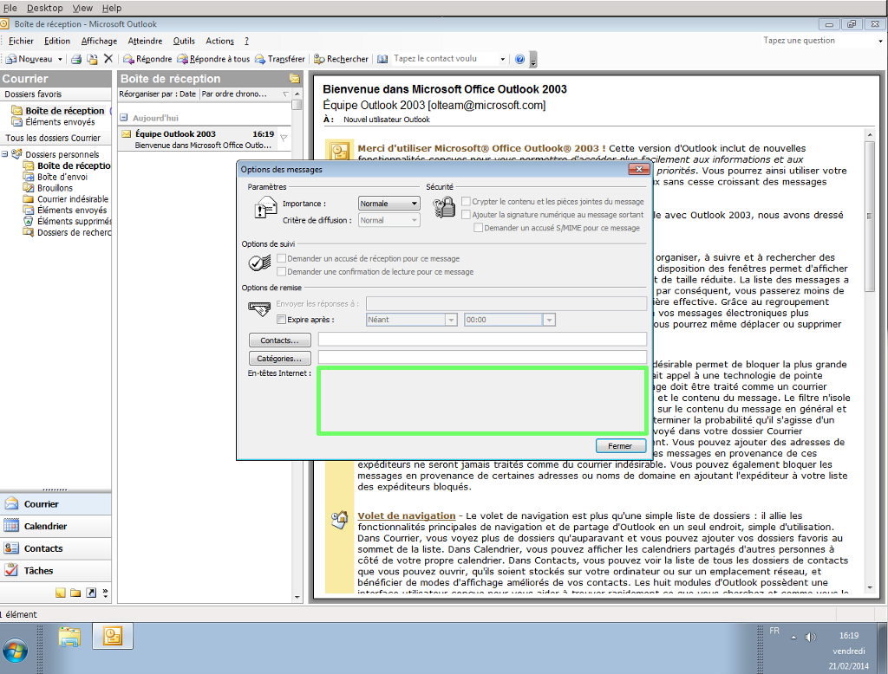{.thumbnail}

## Microsoft Outlook 2007
Clicca con il tasto destro sull'email di cui vuoi recuperare l'header.

Accedi a Opzioni dei messaggi.

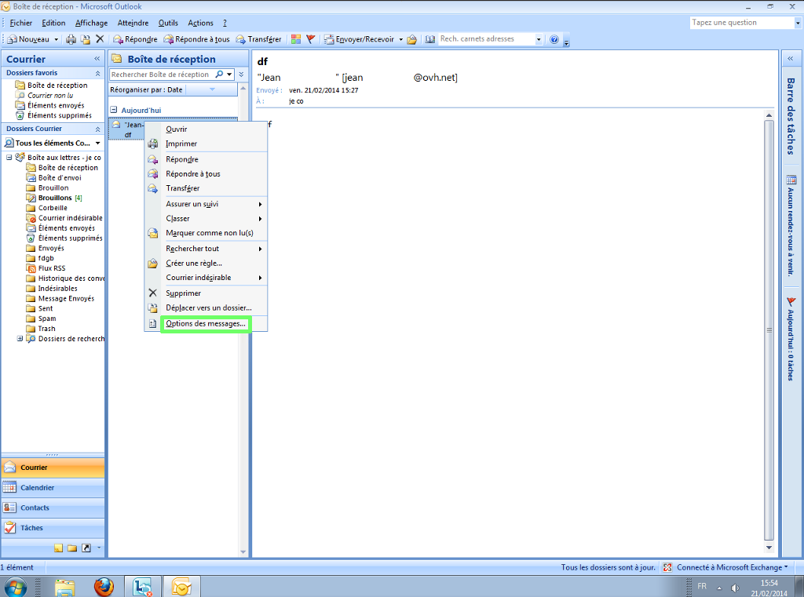{.thumbnail}
L'header completo viene visualizzato (vedi immagine).

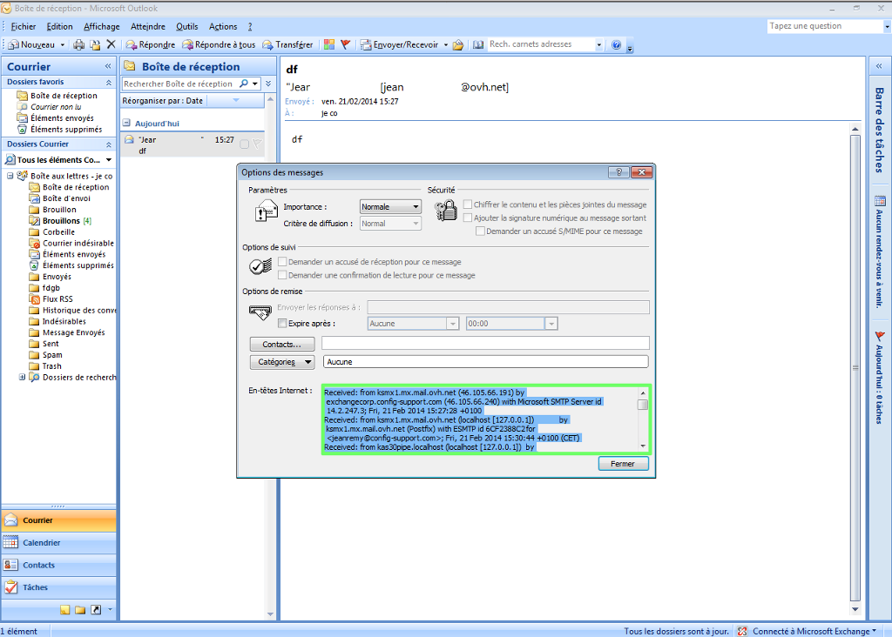{.thumbnail}

## Microsoft Outlook 2010
Apri l'email di cui vuoi recuperare l'header.

Nella nuova finestra, accedi alla sezione Messaggio e clicca sulla freccia che trovi a destra di Indicatori, come vedi in figura.

{.thumbnail}
L'header completo viene visualizzato (vedi immagine).

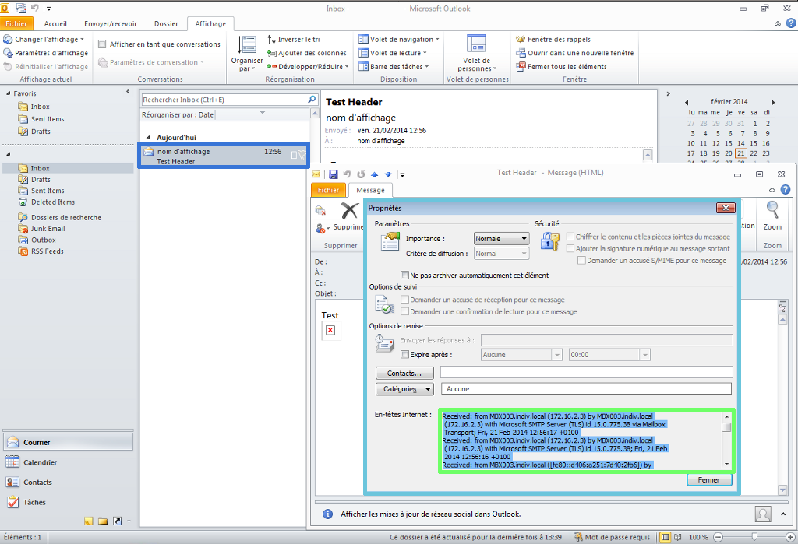{.thumbnail}

## Microsoft Outlook 2013/2016
Apri l'email di cui vuoi recuperare l'header.

Nella nuova finestra, accedi a File.

{.thumbnail}
Seleziona Informazioni e poi Proprietà.

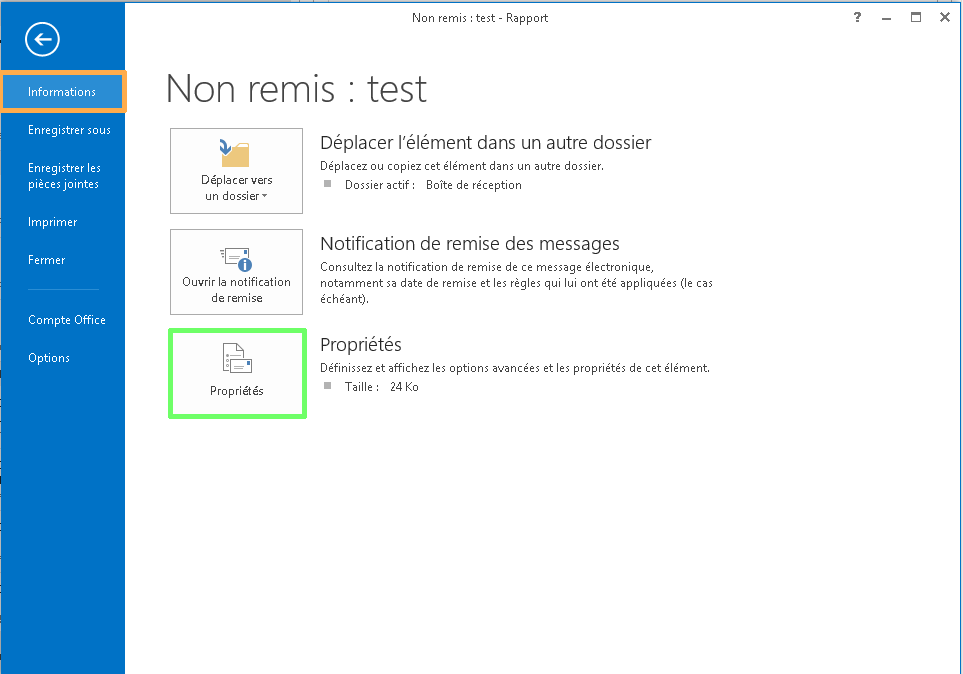{.thumbnail}
L'header completo viene visualizzato (vedi immagine).

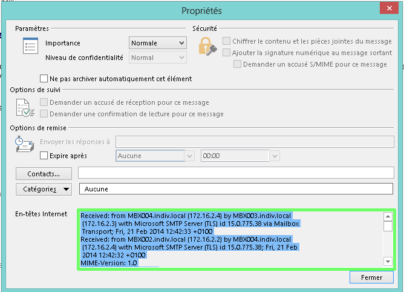{.thumbnail}

## Mozilla Thunderbird
Seleziona l'email di cui vuoi recuperare l'header.

Premi Ctrl+U.

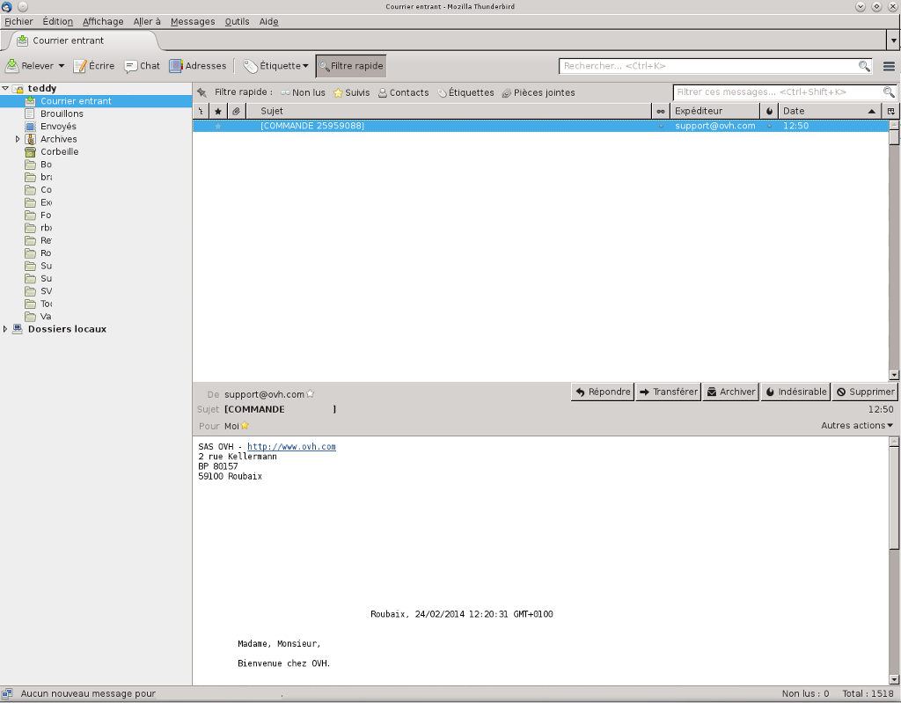{.thumbnail}
L'header completo viene visualizzato (vedi immagine).

{.thumbnail}

## Mail di Mac
Seleziona l'email di cui vuoi recuperare l'header.

Accedi a Presentazione -> Messaggio -> Tutti gli header.

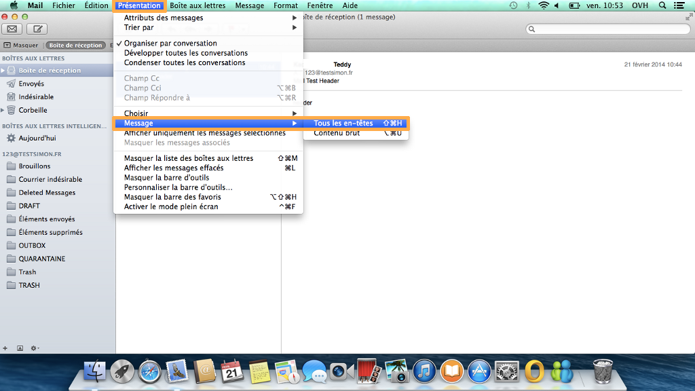{.thumbnail}
L'header completo viene visualizzato. A questo punto, puoi recuperarlo.

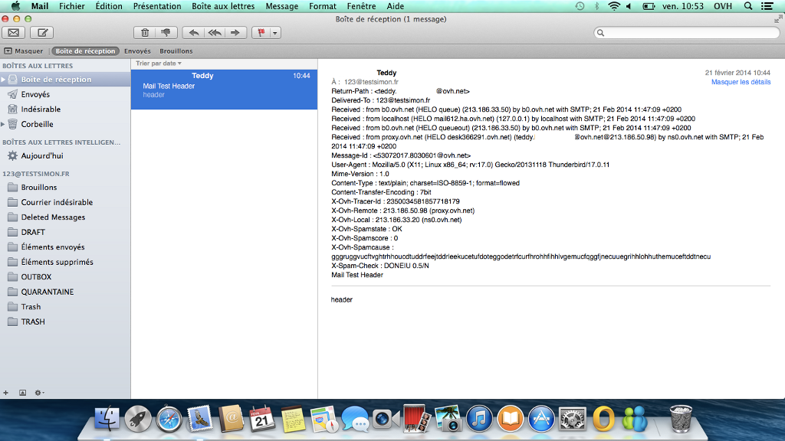{.thumbnail}

## Microsoft Outlook 2011 per Mac
Clicca con il tasto destro sulla mail di cui vuoi recuperare l'header e seleziona Visualizza sorgente.

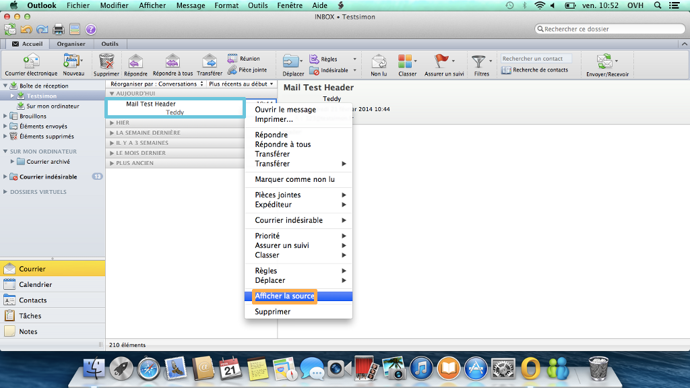{.thumbnail}
L'header completo viene visualizzato. A questo punto, puoi recuperarlo.

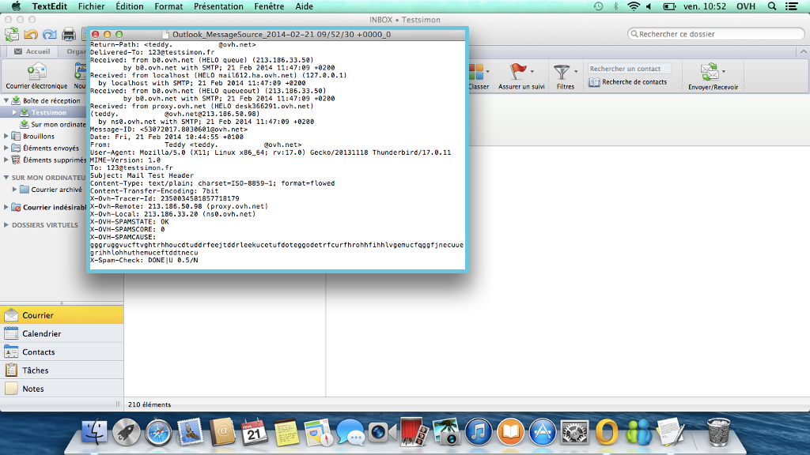{.thumbnail}

## Microsoft Entourage 2008 per Mac
Seleziona l'email di cui vuoi recuperare l'header e cliccaci con il tasto destro. 

Seleziona Sorgente.

Nella nuova finestra che si apre trovi l'header completo dell'email.

## Roundcube
Seleziona l'email di cui vuoi recuperare l'header.

Accedi a ... (Plus) -> Visualizza la sorgente.

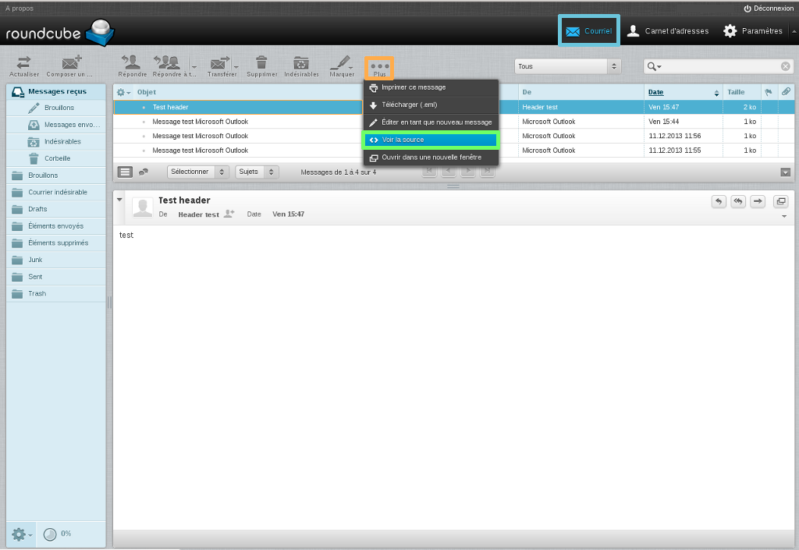{.thumbnail}
Nel tuo browser visualizzi l'header completo dell'email.

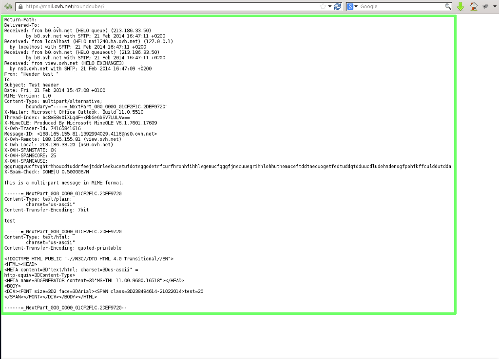{.thumbnail}

## OWA 2013
Seleziona l'email di cui vuoi recuperare l'header.

Accedi a ... -> Visualizza i dettagli del messaggio.

{.thumbnail}
L'header completo viene visualizzato. A questo punto, puoi recuperarlo.

{.thumbnail}

## OWA 2016
Seleziona l'email di cui vuoi recuperare l'header.

{.thumbnail}
Clicca sulla freccia in corrispondenza Rispondi a tutti e seleziona Visualizza dettagli del messaggio

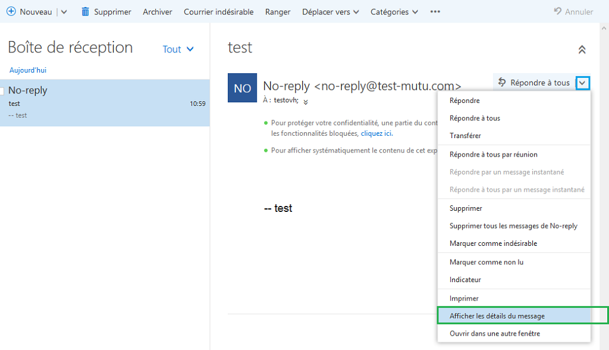{.thumbnail}
Visualizzi l'header dell'email selezionata:

{.thumbnail}

## Gmail
Apri l'email di cui vuoi recuperare l'header.

Clicca sulla freccia a destra del link di risposta. 

Seleziona "Visualizza originale" per aprire l'header in una nuova finestra.

