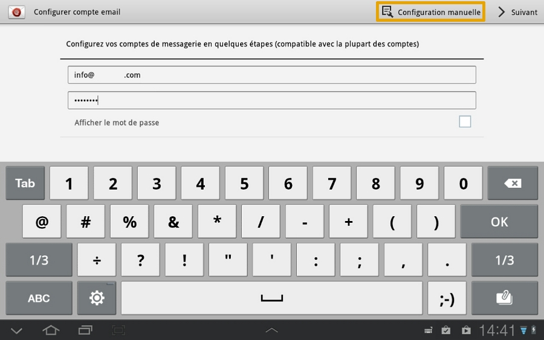
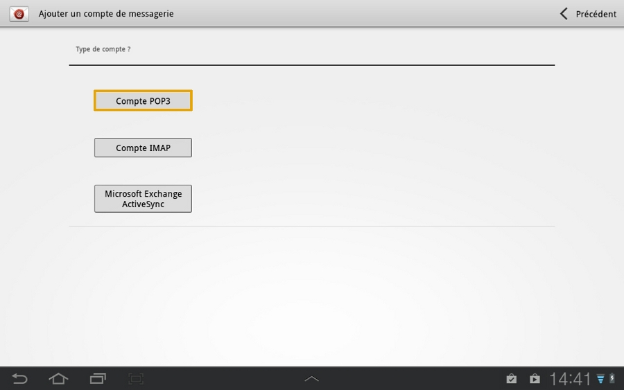
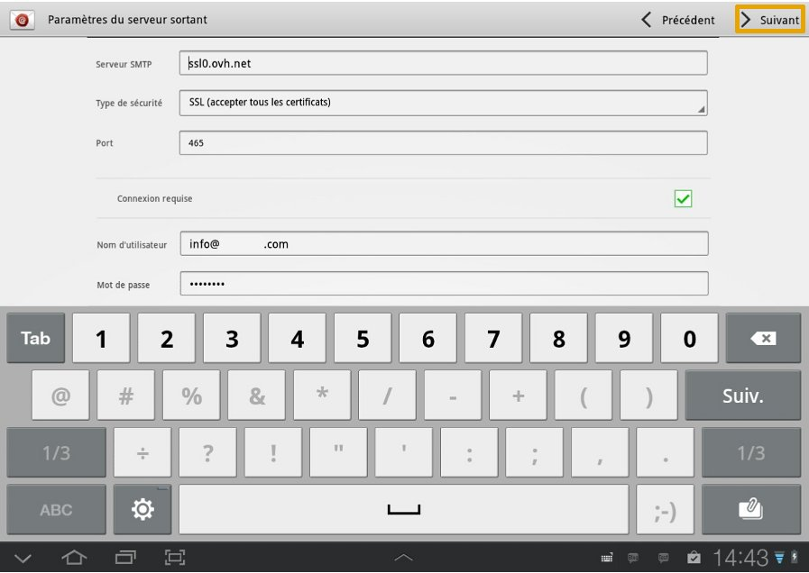
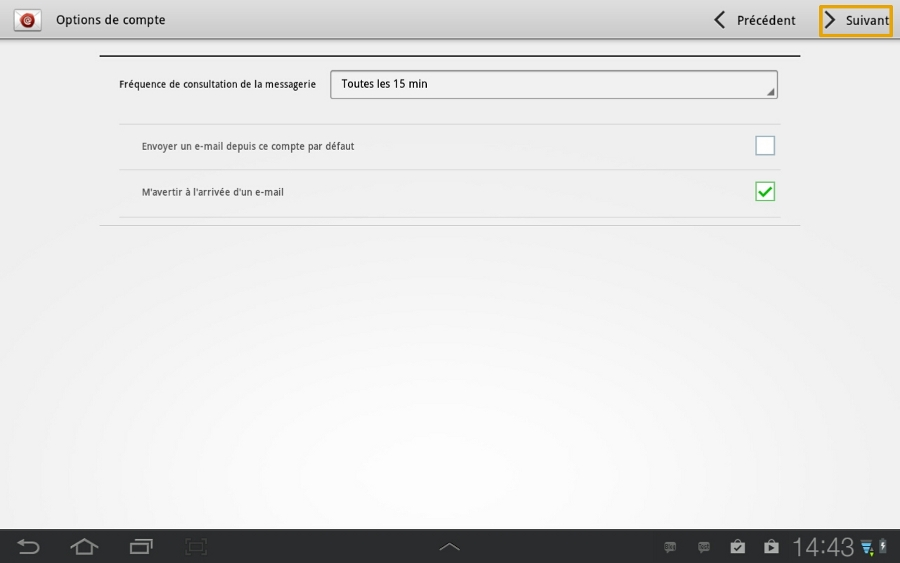
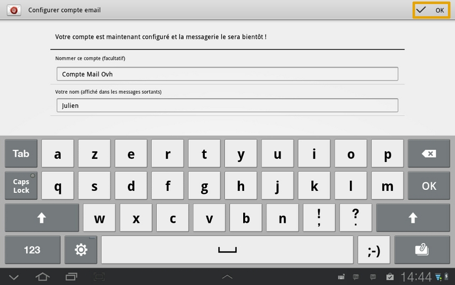
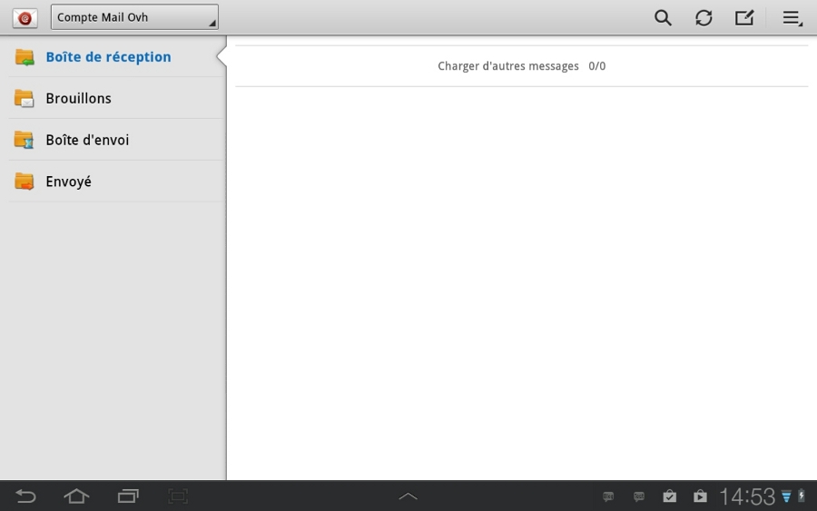

## Parte 1: E-mail
Num primeiro tempo, encontre e clique no ícone "E-mail".

No nosso exemplo, a conta de e-mail partilhada foi configurada como POP num Samsung Tab GT p7510 com Android versão 4.1.2.

Antes de efetuar a adição da conta, verifique que a sua ligação 3G ou Wifi está ativa.

{.thumbnail}

## Parte 2: Configuração da conta de e-mail
Introduza o endereço de e-mail partilhado na íntegra bem como a password definida no seu [manager](https://www.ovh.pt/managerv3/) para o seu endereço de e-mail.

Clique de seguida em "Configuração manual" para continuar.

{.thumbnail}

## Parte 3: Tipo de conta de e-mail
Selecione de seguida "Conta POP3" para prosseguir com a configuração da conta de e-mail partilhado.

Se desejar configurar a conta em IMAP deve utilizar os parâmetros indicados no fim deste guia.

{.thumbnail}

## Parte 4: Parâmetros do servidor de receção
Introduza as informações da sua conta de e-mail partilhada para o servidor de receção.

"Nome do utilizador": o seu endereço de e-mail na íntegra.

"Password": A password definida na interface [manager](https://www.ovh.pt/managerv3/).

"Servidor POP3": introduza ssl0.ovh.net

"Tipo de segurança": selecione "SSL (aceitar todos os certificados)".

"Porta": a porta a introduzir é a 995.

Clique em "Seguinte" para continuar.

{.thumbnail}

## Parte 4: Parâmetros do servidor de envio
Introduza as informações da sua conta de e-mail partilhada para o servidor de envio.

"Servidor SMTP": introduza ssl0.ovh.net

"Tipo de segurança": selecione "SSL ((aceitar todos os certificados)".

"Porta": a porta a introduzir é a 465.

"Ligação obrigatória": deve estar selecionada.

"Nome do utilizador": o seu endereço de e-mail na íntegra.

"Password": A password definida na sua interface [manager](https://www.ovh.pt/managerv3/).

Clique em "Seguinte" para continuar.

{.thumbnail}

- A autenticação para o email de saída é uma configuração indispensável para que a emissão de um email possa funcionar corretamente nos nossos servidores SMTP.

- Se a autenticação não estiver ativada, um ticket de incidente com o assunto Open SMTP poderá ser encetado pelos nossos serviços para o informar que a autenticação "POP before SMTP" não é suportada. Deverá, imperativamente, ativar a autenticação para o servidor de envio a fim de poder enviar emails.

## Parte 6: Opções da conta
Nesta interface será possível que defina algumas opções de configuração para o endereço de e-mail partilhado.

Continue ao clicar em "Seguinte", após definir os parâmetros.

{.thumbnail}

## Parte 7: Finalização
Pode agora definir um nome para a sua conta e escolher o nome a apresentar nas mensagens enviadas.

Para finalizar a instalação da sua conta de e-mail clique em "OK".

{.thumbnail}

## Interface de e-mail
Veja a interface de e-mail que poderá agora utilizar.

Um clique no ícone à sua direita permite-lhe aceder aos parâmetros da conta de e-mail partilhado.

{.thumbnail}

## Informações de configuração IMAP
Veja as informações de configuração em IMAP para o servidor de receção.

"Nome do utilizador": o seu endereço de e-mail na íntegra.

"Password": A password definida na sua interface [manager](https://www.ovh.pt/managerv3/).

"Servidor IMAP": introduza ssl0.ovh.net

"Tipo de segurança": selecione "SSL (aceitar todos os certificados)".

"Porta": a porta a introduzir é a 993.

Vejas as informações de configuração em IMAP para o servidor de envio. 

"Servidor SMTP": introduza ssl0.ovh.net

"Tipo de segurança": selecione "SSL (aceitar todos os certificados)".

"Porta": a porta a introduzir é a 465.

"Ligação obrigatória": deve estar selecionada.

"Nome do utilizador": o seu endereço de e-mail na íntegra.

"Password": A password definida na sua interface [manager](https://www.ovh.pt/managerv3/).

## Configuração POP
Eis as informações a ter em conta para a configuração de uma conta de email POP.

Configuração POP com encriptação SSL activada ou SSL desativada : 

Endereço de Email : O seu endereço de email completo.
Palavra-passe : A palavra-passe que definiu no seu espaço [Espaço Cliente](https://www.ovh.com/managerv3/).
Nome de utilizador : O seu endereço de email completo.
Servidor de receção : Servidor de receção de emails : SSL0.OVH.NET
Porta do servidor de receção : A porta : 995 ou 110
Servidor de envio : O servidor deve ser : SSL0.OVH.NET
Porta do servidor de envio: Use a porta: 465 ou 587

As portas 110 e 587 correspondem à encriptação SSL desativada.
As portas 995 e 465 correspondem à encriptação SSL ativada.

- Deve obrigatoriamente ativar a  autenticação[/url] para o servidor SMTP.

|Portas|SSLactivado|SSLdesativado|
|Receção|995|110|
|Envio|465|587|

## Configuração IMAP
Eis as informações a ter em conta para a configuração de uma conta de email IMAP.

Configuração IMAP com encriptação SSL activada ou SSL desativada : 

Endereço de Email : O seu endereço de email completo.
Palavra-passe : A palavra-passe que definiu no seu espaço [Espaço Cliente](https://www.ovh.com/managerv3/).
Nome de utilizador : O seu endereço de email completo.
Servidor de receção : Servidor de receção de emails : SSL0.OVH.NET
Porta do servidor de receção : A porta : 993 ou 143
Servidor de envio : O servidor deve ser : SSL0.OVH.NET
Porta do servidor de envio: Use a porta: 465 ou 587

As portas 143 e 587 correspondem à encriptação SSL desativada.
As portas 993 e 465 correspondem à encriptação SSL ativada.

- Deve obrigatoriamente ativar a  autenticação[/url] para o servidor SMTP.

|Portas|SSLactivado|SSLdesativado|
|Receção|993|143|
|Envio|465|587|

