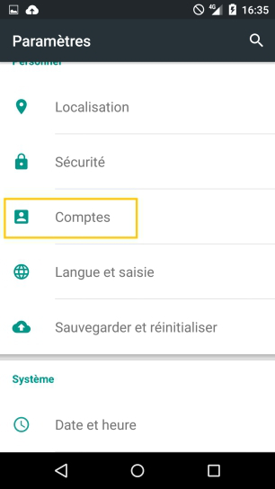
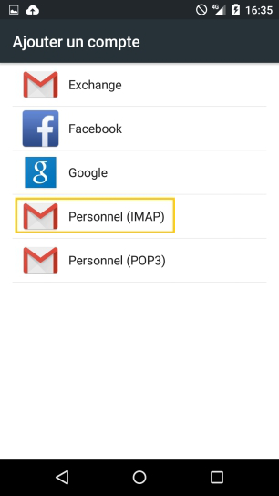
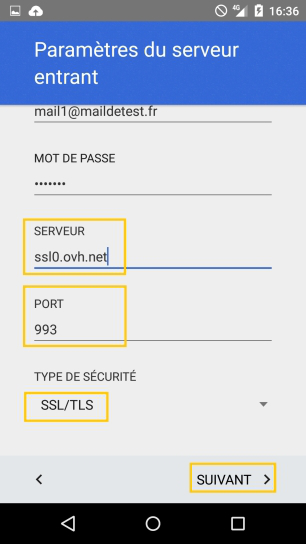
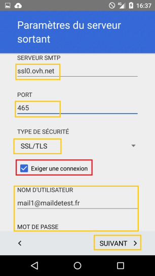
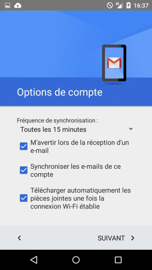

Cliquez [ici](http://www.ovh.com/fr/hebergement-web/faq){.external} pour retrouver nos différents guides de configuration e-mail.

> [!warning]
>
> OVH met à votre disposition des services dont la configuration, la gestion et la responsabilité vous incombent. Il vous revient de ce fait d'en assurer le bon fonctionnement.
> 
> Nous mettons à votre disposition ce guide afin de vous accompagner au mieux sur des tâches courantes. Néanmoins, nous vous recommandons de faire appel à un prestataire spécialisé et/ou de contacter l'éditeur du service si vous éprouvez des difficultés. En effet, nous ne serons pas en mesure de vous fournir une assistance. Plus d'informations dans la section « Aller plus loin » de ce guide.
> 

## Configuration d'un telephone mobile sous Android 5.1 (lollipop)
Ce guide ne s'applique pas aux adresses Exchange

### Parametres du telephone
Veuillez vous rendre d'abord dans les paramètres de votre smartphone.

{.thumbnail}

### Gestion des comptes
Vous devez ensuite vous rendre dans "Comptes".

{.thumbnail}

### Ajout du compte
Il faut ensuite cliquer sur "Ajouter un compte".

{.thumbnail}

### Protocole e-mail
Sélectionnez le protocole "IMAP" pour continuer.

*Notez qu'il vous est possible de sélectionner "POP". Dans ce cas, utilisez les informations de configuration données en fin de ce guide.*

{.thumbnail}

### Saisie de l'adresse e-mail
Il suffit de renseigner l'adresse e-mail concernée et de cliquer sur le bouton "Suivant".

{.thumbnail}

### Mot de passse
Renseignez les paramètres demandés :

Vous devez ensuite renseigner votre mot de passe et appuyer sur "Suivant".

{.thumbnail}

### Configuration du compte (1)
Renseignez les paramètres demandés : Nom d'utilisateur : votre adresse e-mail en entier. Mot de passe : le mot de passe que vous avez défini dans l'espace client. Serveur : SSL0.OVH.NET Port : 993 Type de sécurité : SSL/TLS (accepter tous les certificats)

Pour utiliser une autre configuration, rendez-vous à la fin de ce guide pour trouver les différents paramètres possibles.

Cliquez sur "Suivant" pour continuer la configuration.

{.thumbnail}

### Configuration du compte (2)
Renseignez les paramètres demandés : Serveur SMTP : SSL0.OVH.NET Port :465 Type de sécurité : SSL/TLS (accepter tous les certificats) "Exiger une connexion" doit être coché. Nom d'utilisateur : votre adresse e-mail en entier. Mot de passe : le mot de passe que vous avez défini dans l'espace client.

*Pour utiliser une autre configuration, rendez-vous à la fin de ce guide pour trouver les différents paramètres possibles*.

Cliquez sur "Suivant" pour continuer la configuration. Icon L'authentification pour le serveur sortant est un paramétrage indispensable afin que l'émission d'e-mails puisse fonctionner sur nos serveurs SMTP. Si l'authentification n'est pas activée, un ticket incident Open SMTP peut être ouvert vous informant que l'authentification "POP before SMTP" n'est pas supportée. Vous devrez impérativement activer l'authentification du serveur sortant afin de pouvoir émettre des e-mails.

{.thumbnail}

### Option de compte
Vous pouvez ici choisir la fréquence de synchronisation et demander à être averti lors de la réception d'un e-mail.

{.thumbnail}

### Finalisation
Cette dernière étape vous demande simplement le nom du compte que vous souhaitez utiliser et le nom qui s'affichera sur vos e-mails sortants.

{.thumbnail}

## Rappel des parametres POP - IMAP

### Configuration POP
Voici les informations à retenir pour la configuration d'un compte e-mail **POP** .

Configuration  **POP**  avec sécurisation SSL activée ou désactivée :

Adresse Email : Votre adresse e-mail mutualisée entière. Mot de passe : Le mot de passe que vous avez défini dans [l'espace client](https://www.ovh.com/managerv3/){.external}. Nom d'utilisateur : Votre adresse e-mail mutualisée entière. Serveur entrant : Le serveur de réception des e-mails :  **SSL0.OVH.NET** Port serveur entrant : Le port du serveur entrant :  **995**  ou  **110** Serveur sortant : Le serveur d'envoi des e-mails :  **SSL0.OVH.NET** Port serveur sortant : Le port du serveur sortant :  **465**  ou  **587**

Les ports  **110**  et  **587**  correspondent à la sécurisation SSL désactivée. Les ports  **995**  et  **465**  correspondent à la sécurisation SSL activée.

- Vous devez obligatoirement activer [l'authentification](#configuration_dun_telephone_mobile_sous_android_partie_6_configuration_du_compte_2){.external} du serveur sortant SMTP.

|Ports|SSL activé|SSL désactivé|
|---|---|---|
|Entrant|995|110|
|Sortant|465|587|

### Configuration IMAP
Voici les informations à retenir pour la configuration d'un compte e-mail **IMAP** .

Configuration  **IMAP**  avec sécurisation SSL activée ou désactivée :

Adresse Email : Votre adresse e-mail mutualisée entière. Mot de passe : Le mot de passe que vous avez défini dans [l'espace client](https://www.ovh.com/managerv3/){.external}. Nom d'utilisateur : Votre adresse e-mail mutualisée entière. Serveur entrant : Le serveur de réception des e-mails :  **SSL0.OVH.NET** Port serveur entrant : Le port du serveur entrant :  **993**  ou  **143** Serveur sortant : Le serveur d'envoi des e-mails :  **SSL0.OVH.NET** Port serveur sortant : Le port du serveur sortant :  **465**  ou  **587**

Les ports  **143**  et  **587**  correspondent à la sécurisation SSL désactivée. Les ports  **993**  et  **465**  correspondent à la sécurisation SSL activée.

- Vous devez obligatoirement activer [l'authentification](#configuration_dun_telephone_mobile_sous_android_partie_6_configuration_du_compte_2){.external} du serveur sortant SMTP.

|Ports|SSL activé|SSL désactivé|
|---|---|---|
|Entrant|993|143|
|Sortant|465|587|

## Aller plus loin

Échangez avec notre communauté d'utilisateurs sur <https://community.ovh.com>.