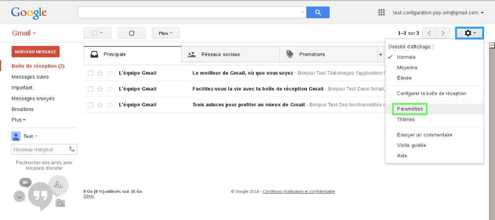
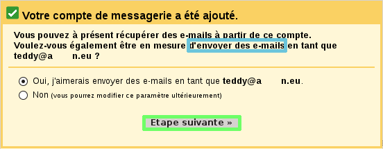
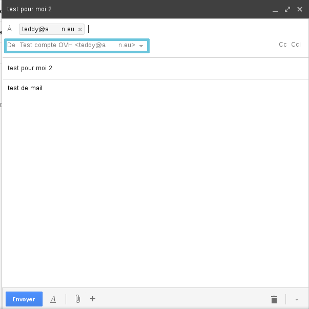

Vous désirez utiliser la solution d'e-mail d'OVH, mais vous souhaitez utiliser l'interface e-mail de Gmail.

Dans ce guide vous sera expliqué comment ajouter votre compte e-mail mutualisé commandé chez OVH dans l'interface de Gmail.

Cliquez [ici](http://www.ovh.com/fr/hebergement-web/faq){.external} pour retrouver nos différents guides de configuration e-mail.

## Configuration e-mail OVH dans l'interface Gmail

### Ajout du compte mutualise OVH
Connectez-vous à votre compte Gmail.

Sélectionnez l'icône en forme de roue denté (cf. screen ci-contre encadré bleu).

Puis cliquez sur "Paramètres".

{.thumbnail}

Rendez-vous dans "Comptes et importation".

Sélectionnez ensuite "Ajouter un compte de messagerie POP3 que vous possédez".

{.thumbnail}

Renseignez l'adresse e-mail OVH que vous désirez ajouter dans l'interface de Gmail.

Cliquez sur "Étape suivante".

{.thumbnail}

Vous devez renseigner les informations demandées :

Nom d'utilisateur :*votre adresse e-mail entière.*

Mot de passe :*Son mot de passe associé.*

Serveur POP : **SSL0.OVH.NET**

Port : **995**

Assurez que vous que soit coché :"**Toujours utiliser une connexion sécurisée (SSL) lors de la récupération des e-mails.**"

Différentes options pour votre compte e-mail sont proposées.

Sélectionnez les options désirées puis cliquez sur "Ajouter un compte".

{.thumbnail}

On vous propose de permettre l'envoi des e-mails depuis votre adresse OVH.

On choisit de permettre d'envoyer des e-mails par le compte e-mail mutualisé.

Sélectionnez "Étape suivante" pour continuer.

{.thumbnail}

Vous devez renseigner le nom d'affichage que vous désirez pour le compte e-mail mutualisé.

Sélectionnez les options désirées puis cliquez sur "Étape suivante".

{.thumbnail}

Il vous est possible d'ajouter le serveur SMTP de votre adresse e-mail mutualisé.

Pour cela sélectionnez "Envoyer par les serveurs SMTP".

Différents paramètres vous seront demandées :

Serveur SMTP :  **SSL0.OVH.NET** Port :  **465** Nom d'utilisateur : *votre adresse e-mail entière* Mot de passe : *le mot de passe définie dans votre espace client*

Sélectionnez "Connexion sécurisée SSL".

Cliquez sur "Ajouter un compte" pour finaliser l'opération.

{.thumbnail}

Dans cette dernière étape, vous devez confirmer la validation afin d'ajouter votre adresse e-mail mutualisé dans l'interface de Gmail.

Pour cela vous devrez :

- soit cliquez sur le lien fourni dans l'e-mail de confirmation envoyé sur votre adresse e-mail mutualisé.
- soit renseigner le code fourni dans l'e-mail de confirmation envoyé sur votre adresse e-mail mutualisé.

Cliquez sur "Vérifier" pour finaliser l'ajout du compte.

*La configuration de votre compte sur Gmail est terminée !*

{.thumbnail}

## Astuces

### Modifier l'expediteur du mail dans l'interface Gmail.
Il vous est possible de modifier l'expéditeur d'un e-mail depuis l'interface de Gmail.

Si vous avez configuré votre compte e-mail en suivant ce guide, vous avez alors ajouté le serveur SMTP d'OVH lors de la configuration.

Il vous est possible lors d'un envoi d'un e-mail de modifier le champ "De" afin de permettre l'envoi depuis votre adresse e-mail mutualisé OVH.

{.thumbnail}

## Rappel des parametres POP - IMAP

### Configuration POP
Voici les informations à retenir pour la configuration d'un compte e-mail **POP** .

Configuration  **POP**  avec sécurisation SSL activée ou désactivée :

Adresse Email : Votre adresse e-mail mutualisée entière. Mot de passe : Le mot de passe que vous avez défini dans [l'espace client](https://www.ovh.com/managerv3/){.external}. Nom d'utilisateur : Votre adresse e-mail mutualisée entière. Serveur entrant : Le serveur de réception des e-mails :  **SSL0.OVH.NET** Port serveur entrant : Le port du serveur entrant :  **995**  ou  **110** Serveur sortant : Le serveur d'envoi des e-mails :  **SSL0.OVH.NET** Port serveur sortant : Le port du serveur sortant :  **465**  ou  **587**

Les ports  **110**  et  **587**  correspondent à la sécurisation SSL désactivée. Les ports  **995**  et  **465**  correspondent à la sécurisation SSL activée.

- Vous devez obligatoirement activer [l'authentification](#configuration_e-mail_ovh_dans_linterface_gmail_ajout_du_compte_mutualise_ovh){.external} du serveur sortant SMTP.

|Ports|SSL activé|SSL désactivé|
|---|---|---|
|Entrant|995|110|
|Sortant|465|587|

### Configuration IMAP
Voici les informations à retenir pour la configuration d'un compte e-mail **IMAP** .

Configuration  **IMAP**  avec sécurisation SSL activée ou désactivée :

Adresse Email : Votre adresse e-mail mutualisée entière. Mot de passe : Le mot de passe que vous avez défini dans [l'espace client](https://www.ovh.com/managerv3/){.external}. Nom d'utilisateur : Votre adresse e-mail mutualisée entière. Serveur entrant : Le serveur de réception des e-mails :  **SSL0.OVH.NET** Port serveur entrant : Le port du serveur entrant :  **993**  ou  **143** Serveur sortant : Le serveur d'envoi des e-mails :  **SSL0.OVH.NET** Port serveur sortant : Le port du serveur sortant :  **465**  ou  **587**

Les ports  **143**  et  **587**  correspondent à la sécurisation SSL désactivée. Les ports  **993**  et  **465**  correspondent à la sécurisation SSL activée.

- Vous devez obligatoirement activer [l'authentification](#configuration_e-mail_ovh_dans_linterface_gmail_ajout_du_compte_mutualise_ovh){.external} du serveur sortant SMTP.

|Ports|SSL activé|SSL désactivé|
|---|---|---|
|Entrant|993|143|
|Sortant|465|587|