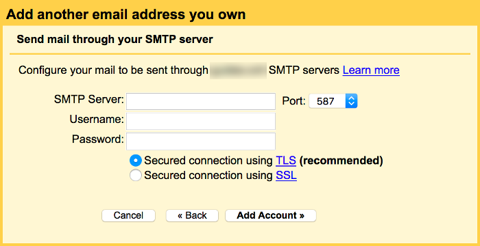

**Ostatnia aktualizacja dnia 2018-08-16**

## Wprowadzenie

Konta e-mail usługi MX Plan mogą być skonfigurowane w jednym z kompatybilnych programów pocztowych i interfejsów online. Dzięki temu możesz wysyłać i odbierać wiadomości, korzystając z wybranej przez Ciebie aplikacji lub interfejsu online.

**Dowiedz się, jak skonfigurować konto e-mail MX Plan w interfejsie online programu pocztowego Gmail.**

> [!warning]
>
> OVH udostępnia różnorodne usługi, jednak ich konfiguracja, zarządzanie oraz utrzymanie należy do Ciebie.  Jesteś tym samym odpowiedzialny za ich prawidłowe funkcjonowanie.
> 
> Oddajemy w Twojej ręce niniejszy przewodnik, którego celem jest pomoc w jak najlepszym wykonywaniu bieżących zadań. W przypadku trudności zalecamy skorzystanie z pomocy wyspecjalizowanego webmastera lub kontakt z producentem oprogramowania. Niestety firma OVH nie będzie mogła udzielić wsparcia w tym zakresie. Więcej informacji znajduje się w sekcji „Sprawdź również”.
> 

## Wymagania początkowe

- Posiadanie konta e-mail MX Plan (zawartego w usłudze MX Plan lub w usłudze [hostingu OVH](https://www.ovh.pl/hosting/){.external})
- Dane do logowania do konta e-mail OVH, które chcesz skonfigurować
- Dane do konta Gmail, w którym chcesz skonfigurować konto e-mail OVH

> [!primary]
>
> Niniejszy przewodnik został przygotowany w oparciu o nowy interfejs Gmail. Nawet jeśli elementy graficzne nieznacznie różnią się od Twojej wersji, instrukcje postępowania pozostają takie same.
>

## W praktyce

### Etap 1: dodaj konto e-mail OVH do interfejsu Gmail

Przed rozpoczęciem operacji przejdź do interfejsu online programu Gmail, korzystając z Twojej przeglądarki internetowej. Wprowadź Twoje dane identyfikacyjne przypisane do konta Gmail, a następnie zaloguj się.

Po zalogowaniu do interfejsu kliknij ikonę koła zębatego, a następnie `Ustawienia`{.action}. Na stronie, która się wyświetli, kliknij zakładkę `Konta i import`{.action}. 

{.thumbnail}

Obok pozycji `Sprawdź inne konta programu pocztowego`, kliknij `Dodaj konto programu pocztowego`{.action}. W oknie, które się wyświetla wprowadź konto e-mail OVH, następnie kliknij `Dalej`{.action}. Wybierz `Importuj e-maile z innego konta (POP3)`{.action}, następnie ponownie kliknij `Dalej`{.action}.

{.thumbnail}

Teraz podaj parametry serwera POP (serwer poczty przychodzącej) dla Twojego konta e-mail OVH:

|Informacja|Opis| 
|---|---| 
|Nazwa użytkownika|Wpisz **pełny** adres e-mail.|  
|Hasło|Wpisz hasło przypisane do tego konta e-mail.|
|Serwer POP|Wpisz serwer « ssl0.ovh.net ».|
|Port|Wybierz port „995”.|

Opcje, które możesz zaznaczyć:

- **„Zachowaj kopię wiadomości na serwerze”**: zalecamy zaznaczenie tej kratki, jeśli chcesz zachowywać na serwerach OVH kopie wiadomości przychodzących na Twoje konto e-mail;

- **„Kiedy pobierasz Twoje e-maile, zawsze używaj bezpiecznego połączenia (SSL)”**: upewnij się, że zaznaczyłeś tę kratkę, aby połączenie z Twoim kontem e-mail OVH mogło zostać zrealizowane;

- **„Dodaj etykietę do wiadomości przychodzących„**: wybór tej opcji pozwala dodać etykietę do e-maili, które będą importowane z Twojego konta e-mail OVH do Twojego konta Gmail;

- **„Archiwizuj wiadomości przychodzące (tak, aby nie przechodziły przez skrzynkę odbiorczą)”**: wybór tej opcji sprawi, że wiadomości zaimportowane z Twojego konta OVH nie będą się wyświetlały w skrzynce odbiorczej Gmail.

Po uzupełnieniu informacji kliknij przycisk `Dodaj konto`{.action}. Jeśli wpisane informacje są poprawne, logowanie zakończy się sukcesem. 

{.thumbnail}

Jeśli chcesz również wysyłać e-maile z Twojego konta OVH przy użyciu interfejsu online programu Gmail, zaznacz kratkę `Tak, chciałbym wysyłać e-maile z konta`{.action}, a następnie kliknij `Dalej`{.action}. 

Następnie wprowadź nazwę nadawcy, która ma się wyświetlać w przypadku wysyłki z konta e-mail, zaznacz kratkę `Traktuj jako alias`{.action}, następnie kliknij przycisk `Następny etap`{.action}.

{.thumbnail}

Teraz podaj parametry serwera SMTP (serwer poczty wychodzącej) dla Twojego konta e-mail OVH:

|Informacja|Opis| 
|---|---| 
|Serwer SMTP|Wpisz serwer « ssl0.ovh.net ».|
|Port|Wybierz port „587”.|
|Nazwa użytkownika|Wpisz **pełny** adres e-mail.|  
|Hasło|Wpisz hasło przypisane do tego konta e-mail.|

Po uzupełnieniu informacji zaznacz kratkę obok `Bezpieczne połączenie TLS`{.action}, następnie kliknij przycisk `Dodaj konto`{.action}. Jeśli wpisane informacje są poprawne, logowanie zakończy się sukcesem. 

{.thumbnail}

Teraz zatwierdź dodane konto, wprowadzając kod wysłany na Twój adres e-mail OVH.  Aby pobrać kod, zaloguj się jak zwykle do konta OVH, korzystając z interfejsu online dostępnego tutaj: <https://www.ovh.pl/mail/>. 

Po zatwierdzeniu dodanego konta, e-mail konto pojawi się w zakładce `Konta i import`{.action}, którą otworzyłeś na początku operacji.

### Etap 2: korzystanie z konta e-mail przy użyciu interfejsu programu Gmail

Po zakończeniu konfiguracji konto jest gotowe do użytku. Możesz teraz wysyłać i odbierać wiadomości na konto, używając interfejsu Gmail.

Aby wysłać wiadomość z konta e-mail OVH za pośrednictwem interfejsu online Gmail, po napisaniu wiadomości wybierz konto e-mail OVH. Odpowiednie konto należy zaznaczyć obok pola `Od`{.action} w oknie wiadomości e-mail.

{.thumbnail}

Pamiętaj, że aby uzyskać dostęp do Twojego konta e-mail OVH, możesz również użyć interfejsu OVH online dostępnego pod adresem <https://www.ovh.pl/mail/>. Zaloguj się, używając Twoich danych identyfikacyjnych.

## Sprawdź również

Przyłącz się do społeczności naszych użytkowników na stronie <https://community.ovh.com/en/>