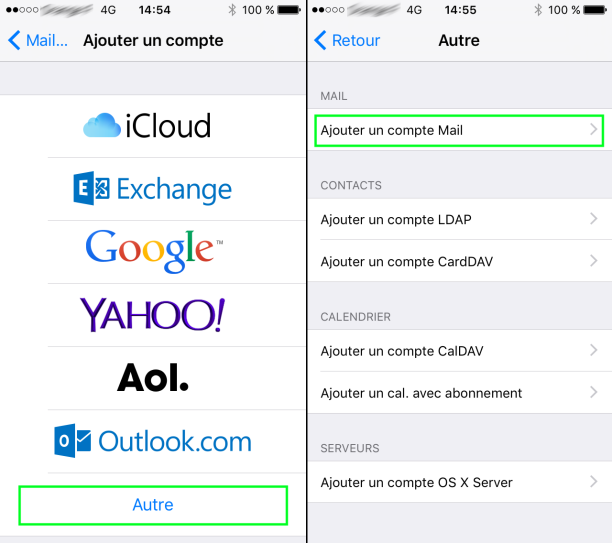
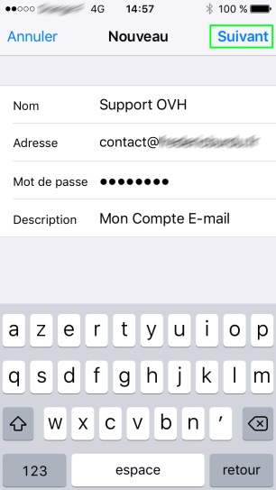
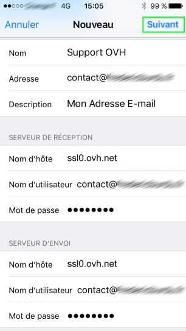
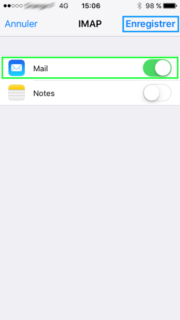

## Wstępne wymagania

- Aktywny adres e-mail na hostingu www OVH
- Iphone z systemem IOS 9

## Konto e-mail OVH na iPhonie
Nie ma nic prostszego niż korzystanie z konta e-mail OVH na iPhonie. 

Z poziomi iPhone'a wejdź na stronę [https://ssl0.ovh.net/roundcube/auto/](https://ssl0.ovh.net/roundcube/auto/).

Wpisz adres e-mail, który posiadasz w OVH, kliknij na "Generer" i przejdź przez kolejne etapy. 

Dzięki temu na Twoim iPhonie zostanie dodany profil, z którego będziesz mógł zacząć korzystać.

## Konfiguracja iPhone IOS 9 w trybie Imap

## Część 1: Ustawienia
Otwórz ustawienia w iPhonie.

{.thumbnail}

## Część 2: Poczta, Kontakty, Kalendarz
Przejdź do sekcji "Poczta, Kontakty, Kalendarz".

{.thumbnail}

## Część 3: Dodawanie konta e-mail
Wybierz "Dodaj konto".

{.thumbnail}

## Część 4: Typ konta e-mail
Wybierz "Inne" i "Dodaj konto Mail".

{.thumbnail}

## Część 5: Ustawienia konta e-mail
Zostaniesz poproszony o podanie nazwiska, adresu e-mail i hasła do poczty. 

Opis uzupełni się automatycznie.

Po wpisaniu tych informacji kliknij na "Dalej".

{.thumbnail}

## Część 7: Ustawienia serwerów poczty przychodzącej i wychodzącej.

- Typ konta:
IMAP / POP: Wybierz typ konta.

{.thumbnail}

- W części "Serwer poczty przychodzącej":

Nazwa hosta: SSL0.OVH.NET
Użytkownik: adres e-mail
Hasło: hasło do konta e-mail

- W części "Serwer poczty wychodzącej":

Nazwa hosta: SSL0.OVH.NET
Użytkownik: adres e-mail
Hasło: hasło do konta e-mail

Kliknij na "Dalej"" po wpisaniu tych informacji.

{.thumbnail}

- Uwierzytelnianie za pomocą nazwy użytkownika i hasła dla serwera poczty wychodzącej jest niezbędne do działania wysyłki e-maili na naszych serwerach SMTP.

## Część 9: Konfiguracja konta e-mail
Dokończ konfigurowanie konta e-mail, wybierając opcje synchronizacji. 

Kliknij na "Zachowaj", aby dokończyć dodawanie konta.

{.thumbnail}

## Konfiguracja POP
Oto informacje do konfiguracji konta e-mail POP

Konfiguracja POP z zabezpieczeniem SSL włączonym/green] lub wyłączonym:

Adres Email : Cały adres e-mail
Hasło: Hasło zdefiniowane w [panelu klienta](https://www.ovh.com/manager/web/login/).
Nazwa użytkownika: Cały adres e-mail
Serwer poczty przychodzącej:ssl0.ovh.net
Port serwera poczty przychodzącej:995 lub 110
Serwer poczty wychodzącej:ssl0.ovh.net
Port serwera poczty wychodzącej:465 lub 587

Porty 110 i 587 są podawane, gdy zabezpieczenie SSL jest wyłączone.
Porty 995 i 465 są podawane, gdy zabezpieczenie SSL jest włączone.

|Porty|SSLwłączony|SSLwyłączony|
|Wchodzący|995|110|
|Wychodzący|465|587|

## Konfiguracja IMAP
Oto informacje do konfiguracji konta e-mai IMAP

Konfiguracja IMAP z zabezpieczeniem SSL włączonym lub wyłączonym:

Adres Email : Cały adres e-mail
Hasło: Hasło zdefiniowane w [panelu klienta](https://www.ovh.com/manager/web/login/).
Nazwa użytkownika: Cały adres e-mail
Serwer poczty przychodzącej:ssl0.ovh.net
Port serwera poczty przychodzącej:993 lub 143
Serwer poczty wychodzącej:ssl0.ovh.net
Port serwera poczty wychodzącej:465 lub 587

Porty 143 i 587 są podawane, gdy zabezpieczenie SSL jest wyłączone.
Porty 993 i 465 są podawane, gdy zabezpieczenie SSL jest włączone.

|Porty|SSLwłączony|SSLwyłączony|
|Wchodzący|993|143|
|Wychodzący|465|587|

