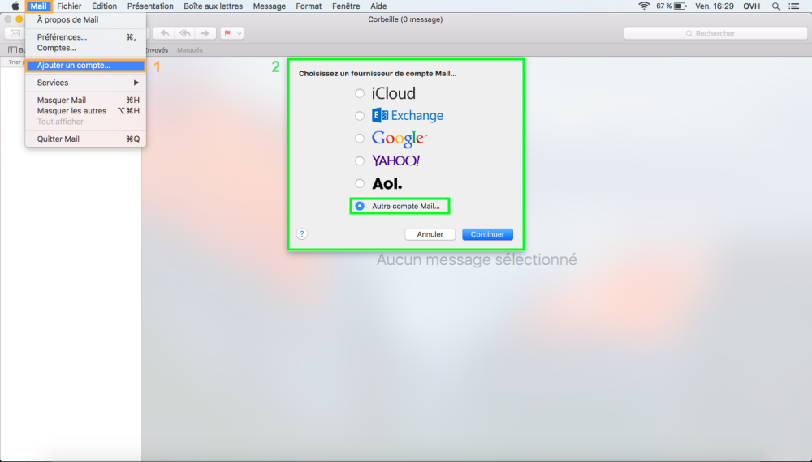
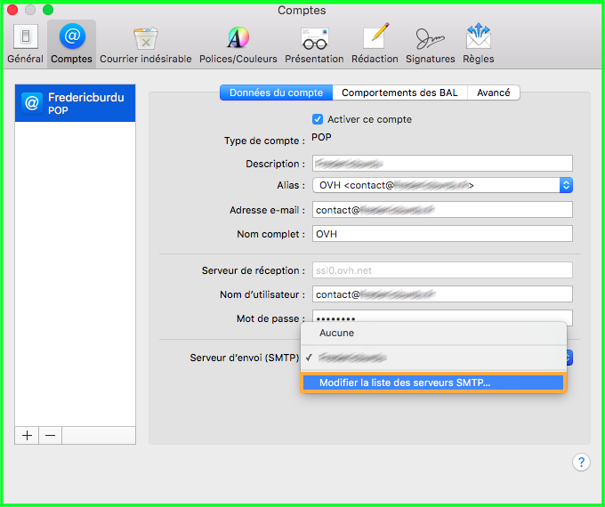

## Il tuo account email OVH sul tuo Mac in 1 click
Se vuoi configurare il tuo account email OVH sul tuo Mac, la configurazione automatica è la soluzione più semplice.

Dal tuo Mac, accedi alla pagina [https://ssl0.ovh.net/roundcube/auto/](https://ssl0.ovh.net/roundcube/auto/), inserisci il tuo indirizzo email OVH e clicca su "Generer", poi segui le indicazioni.

Il tuo profilo è aggiunto sul tuo Mac e puoi iniziare a utilizzarlo!

## Parte 1: avvio
Apri il tuo programma Mail di Mac. 

- 1. Se hai già configurato il tuo account (riquadro arancione dell'immagine):

Clicca su Account....

- 2. Se non hai ancora configurato il tuo account (riquadro verde dell'immagine):

Seleziona Aggiungi un altro account e-mail....

{.thumbnail}

## Parte 2: informazioni dell'account
Per configurare il tuo account email, inserisci queste informazioni:

- Nome completo:il nome che verrà visualizzato nei tuoi messaggi inviati.

- Indirizzo e-mail:il tuo indirizzo email completo.

- Password:la password del tuo account.

Clicca su Crea per continuare.

{.thumbnail}

## Parte 3: configura il server di posta in entrata e in uscita
Ti viene richiesto di configurare il tuo server di posta in entrata e in uscita.

Inserisci le informazioni richieste:

- Indirizzo e-mail:il tuo indirizzo email completo.

- Nome utente:il tuo indirizzo email completo.

- Password:la password del tuo account.

- Tipo di account:scegli la configurazione del tuo client di posta, POP o IMAP.

- Server di posta in entrata:inserisci il server SSL0.OVH.NET

- Server di posta in uscita:inserisci il server SSL0.OVH.NET

{.thumbnail}

## Modifica SMTP
Per accedere ai parametri SMTP del tuo account email, avvia Mail di Mac, clicca su Mail e poi su Preferenze...

{.thumbnail}
Seleziona l'account email per visualizzarne le informazioni.

- Tipo account: la configurazione scelta per l'account di posta elettronica IMAP

- Descrizione: il nome dell'account Mail visualizzato nel client.

- Alias: il nome dell'indirizzo email visualizzato dal destinatario.

- Indirizzo e-mail: il tuo indirizzo email completo.

- Nome completo: il nome visualizzato per l'account Mail.

- Server di posta in entrata: il server di posta in arrivo, SSL0.OVH.NET

- Nome utente: il tuo indirizzo email completo.

- Password: la password che hai definito nel tuo [Spazio Cliente OVH](https://www.ovh.com/manager/web/login/).

- Server di posta in uscita (SMTP): il server di posta in uscita configurato per il tuo account.

{.thumbnail}
Per modificare la configurazione del server SMTP, clicca sulla freccia di fianco al nome del tuo server SMTP.

Visualizzi la lista dei server disponibili. (solo se sono presenti altri server SMTP).

- Clicca su Modifica elenco del server SMTP...

{.thumbnail}

## Parametri SMTP
A questo punto, puoi modificare uno dei server SMTP che visualizzi nell'elenco.

Nella sezione Informazioni account trovi queste informazioni:

- Descrizione: il nome visualizzato per il server SMTP.

- Nome server: il server di posta SSL0.OVH.NET.

Nella sezione Avanzate trovi queste informazioni:

- Rileva automaticamente le impostazioni dell'account: deseleziona questa opzione.

- Porta: inserisci la porta 465.

- Usa SSL (Secure Sockets Layer):

Se hai inserito SSL0.OVH.NET, puoi selezionare o deselezionare questa opzione per attivare o disattivare il protocollo SSL.

- Autenticazione: inserisci "Password".

- Consenti autenticazione non sicura: deseleziona questa opzione.

- Nome utente: il tuo indirizzo email completo.

- Password: la password che hai definito nel tuo [Spazio Cliente OVH](https://www.ovh.com/manager/web/login/).

{.thumbnail}

- L'autenticazione tramite password è un parametro indispensabile per inviare email utilizzando i nostri server SMTP.

- Se l'autenticazione tramite password non è attiva, un ticket incidente Open SMTP ti informa che l'autenticazione "POP before SMTP" non è supportata. Per inviare messaggi di posta, è necessario attivare l'autentificazione tramite password.

## Configurazione POP
Ecco le informazioni necessarie alla configurazione di un account email POP.

Configurazione POP con protocollo SSL attivato o disattivato:

Indirizzo email: il tuo indirizzo email completo.
Password: la password che hai definito nel tuo [Spazio Cliente OVH](https://www.ovh.com/manager/web/login/).
Nome utente: il tuo indirizzo email completo.
Server in entrata: il server di posta in arrivo, SSL0.OVH.NET.
Porta del server in entrata: 995 o 110
Server in uscita: il server di posta in uscita, SSL0.OVH.NET.
Porta del server in uscita:465 o 587.

Se utilizzi le porte 110 e 587, il protocollo SSL è disattivato.
Se utilizzi le porte 995 e 465, il protocollo SSL è attivato.

- Ricordati che è necessario attivare [l'autenticazione](#informazioni_sulla_configurazione_del_server_smtp_parametri_smtp) del server di posta in uscita SMTP.

|Porte|SSLattivato|SSLdisattivato|
|In entrata|995|110|
|In uscita|465|587|

## Configurazione IMAP
Ecco le informazioni necessarie alla configurazione di un account email IMAP.

Configurazione IMAP con protocollo SSL attivato o disattivato:

Indirizzo email: il tuo indirizzo email completo.
Password: la password che hai definito nel tuo [Spazio Cliente OVH](https://www.ovh.com/manager/web/login/).
Nome utente: il tuo indirizzo email completo.
Server in entrata: il server di posta in arrivo, SSL0.OVH.NET.
Porta del server in entrata:993 o 143.
Server in uscita: il server di posta in uscita, SSL0.OVH.NET.
Porta del server in uscita:465 o 587.

Se utilizzi le porte 143 e 587, il protocollo SSL è disattivato.
Se utilizzi le porte 993 e 465, il protocollo SSL è attivato.

- Ricordati che è necessario attivare [l'autenticazione](#informazioni_sulla_configurazione_del_server_smtp_parametri_smtp) del server di posta in uscita SMTP.

|Porte|SSLattivato|SSLdisattivato|
|In entrata|993|143|
|In uscita|465|587|

