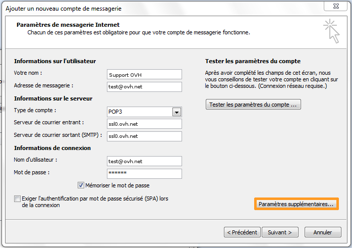
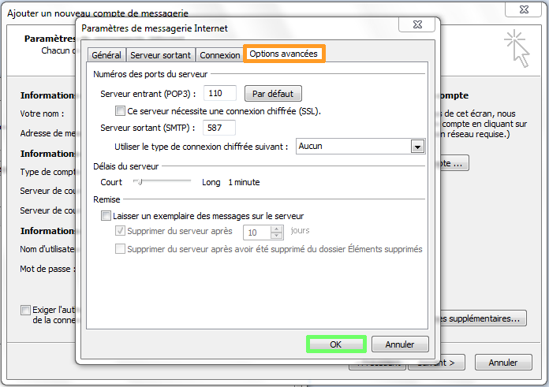

## Vaihe 1: aloitus
Käynnistä Outlook 2007.

Klikkaa  ”Tools”-valikkoa jonka jälkeen ”Account Settings...”.

Avautuneessa uudessa käyttöliittymässä klikkaa ”New”-painiketta jatkaaksesi postilaatikon lisäämisessä.

{.thumbnail}

## Vaihe 2: tilin lisäys
Jatkaaksesi asennusta, valitse valintalaatikko vasemmalta alhaalta ”Manually configure server settings or additional server types”.

Klikkaa ”Next” jatkaaksesi.

{.thumbnail}

## Vaihe 3: palvelun tyyppi
Valitse ”Internet Mail” ja klikkaa ”Next”.

{.thumbnail}

## Vaihe 4: postiasetukset
Tässä osiossa syötä seuraavat tiedot:

Name: haluamasi näyttönimi.
Email Address: täysi sähköpostiosoitteesi.
Account Type:POP3
Incoming Mail Server: tuleva postipalvelin l. SSL0.OVH.NET
Outgoing Mail Server: lähtevä postipalvelin l. SSL0.OVH.NET

Username: täysi sähköpostiosoitteesi (esim. joku@verkkotunnus.fi).
Password:[hallintapaneelin kautta](https://www.ovh-hosting.fi/managerv3/) postilaatikolle määrittelemäsi salasana.

Tämän jälkeen klikkaa painiketta ”More Settings” jatkaaksesi.

{.thumbnail}

## Vaihe 5: lähtevä palvelin
Välilehdellä ”Outgoing Server”, rastita valinta ”My outgoing server requires authentication to connect” ja ”Connect using:”

Username: täysi sähköpostiosoitteesi (esim. joku@verkkotunnus.fi).
Password:[hallintapaneelin kautta](https://www.ovh-hosting.fi/managerv3/) postilaatikolle määrittelemäsi salasana.

Portin 587 ja käyttäjätunnuksen & salasanan käyttö on pakollista lähtevään palvelimeen yhdistämistä varten. Tämä portti on kaikkien internetpalveluntarjoajien käytettävissä.

{.thumbnail}

- Lähtevän palvelimen autentikointi on pakollinen asetus, jotta sähköpostinlähetys toimisi moitteettomasti SMTP-palvelimillamme.

- Jos autentikointia ei aktivoida, Open SMTP-häiriötiketti voidaan avata, jossa ilmoitetaan, että "POP before SMTP" autentikointia ei tueta. Lähtevän palvelimen autentikointi on aktivoitava sähköpostien lähettämiseksi.

## Vaihe 6: edistyneet asetukset
Osiossa ”Advanced settings”, syötä seuraavat asetukset:

Incoming Server (POP3)110.

This server requires an encrypted connection (SSL)tulisi olla valitsematta.

Outgoing Server (SMTP)587.

Use the following type of encrypted connection: älä valitse suojaustyypiksi mitään klikkaamalla None

Klikkaa ”OK” jatkaaksesi.

Tässä vaiheessa voit määritellä, poistetaanko sähköpostit myös palvelimelta kun ne tuhotaan.

{.thumbnail}

## Vaihe 7: valmis
Tilin konfigurointi on valmis.

{.thumbnail}

## POP-konfiguraatio
Tässä ovat sähköpostilaatikon POP-tilin asetukset.

POP-tilin konfigurointi SSL-suojaus aktivoituna tai deaktivoituna: 

Sähköpostiosoite: sähköpostiosoite kokonaisuudessaan.
Salasana: salasana, joka on määritelty [hallintapaneelissa](https://www.ovh.com/managerv3/).
Käyttäjätunnus:jaettu sähköpostiosoite kokonaisuudessaan.
Saapuvan postin palvelin: saapuvien sähköpostiviestien palvelin: SSL0.OVH.NET
Saapuvan postin palvelimen portti: saapuvien sähköpostiviestien palvelimen portti: 995 tai 110
Lähtevän postin palvelin: lähtevien sähköpostiviestien palvelin: SSL0.OVH.NET
Saapuvan postin palvelimen portti: lähtevien sähköpostiviestien palvelimen portti: 465 tai 587

Portit 110 ja 587 vastaavat deaktivoitua SSL-suojausta.
Portit 995 ja 465 vastaavat  aktivoitua SSL-suojausta.

- Lähtevän SMTP-palvelimen [autentikointi](#configuration_manuelle_partie_5_serveur_sortant) on aktivoitava.

|Portti|SSLaktiivinen|SSLdeaktivoitu|
|Saapuva|995|110|
|Lähtevä|465|587|

## IMAP-konfiguraatio
Tässä ovat sähköpostilaatikon IMAP-tilin asetukset.

IMAP-tilin konfigurointi SSL-suojaus aktivoituna tai deaktivoituna: 

Sähköpostiosoite: sähköpostiosoite kokonaisuudessaan.
Salasana: salasana, joka on määritelty [hallintapaneelissa](https://www.ovh.com/managerv3/).
Käyttäjätunnus: sähköpostiosoite kokonaisuudessaan.
Saapuvan postin palvelin: saapuvien sähköpostiviestien palvelin: SSL0.OVH.NET
Saapuvan postin palvelimen portti: saapuvien sähköpostiviestien palvelimen portti: 993 tai 143
Lähtevän postin palvelin: lähtevien sähköpostiviestien palvelin: SSL0.OVH.NET
Saapuvan postin palvelimen portti: lähtevien sähköpostiviestien palvelimen portti: 465 tai 587

Portit 143 ja 587 vastaavat deaktivoitua SSL-suojausta.
Portit 993 ja 465 vastaavat  aktivoitua SSL-suojausta.

- Lähtevän SMTP-palvelimen [autentikointi](#configuration_manuelle_partie_5_serveur_sortant) on aktivoitava.

|Portti|SSLaktiivinen|SSLdeaktivoitu|
|Saapuva|993|143|
|Lähtevä|465|587|

## Yleistä
Halutessasi voimme maksua vastaan määritellä sähköpostilaatikon puolestasi käyttämääsi sähköpostiohjelmaan. Voimme suorittaa muitakin sähköpostiin liittyviä toimenpiteitä.

Maksulliset toimenpiteet on eritelty seuraavassa linkissä:

- 

Katso ohjeesta, miten maksullista toimenpidettä pyydetään.

{.thumbnail}

