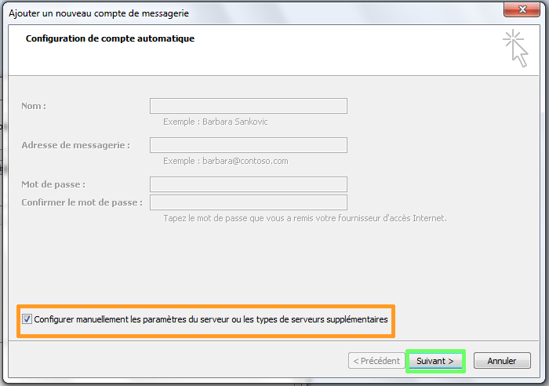
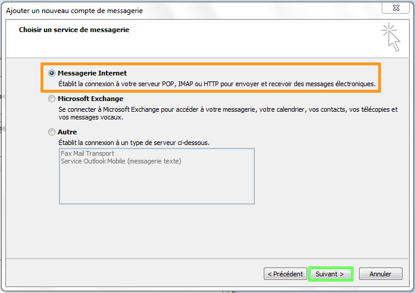

Cliquez [ici](http://www.ovh.com/fr/hebergement-web/faq){.external} pour retrouver nos différents guides de configuration e-mail.

Ce guide vous permettra de paramétrer vos comptes e-mails avec Outlook 2007. Il vous suffit de suivre les étapes pas à pas.

*Dans notre exemple, nous allons configurer le compte e-mail en POP, sans SSL. Il vous sera tout à fait possible de le configurer autrement, en utilisant les paramètres renseignés à la fin de ce guide.*

## Configuration manuelle

### Demarrage
Ouvrez le logiciel Outlook 2007.

Cliquez sur le menu  **"Outils"**  puis sur  **"Paramètres du compte..."** .

Dans la nouvelle interface, cliquez sur le bouton  **"Nouveau"**  pour enregistrer une nouvelle boîte e-mail.

{.thumbnail}

### Ajouter
Cochez la case en bas à gauche :  **"Configurer manuellement les paramètres du serveur ou les types de serveurs supplémentaires"** .

Cliquez sur le bouton  **"Suivant"** .

{.thumbnail}

### Type de service
Choisissez  **"Messagerie Internet"**  et cliquez sur  **"Suivant"** .

{.thumbnail}

### Parametres de messagerie
Sur cette page, il vous faut entrer les informations suivantes :

**Votre nom** :  le nom d'affichage désiré. **Adresse de messagerie** :  votre adresse mail entière.

**Type de compte** :  **POP3** **Serveur de courrier entrant** :  **SSL0.OVH.NET** **Serveur de courrier sortant** :  **SSL0.OVH.NET**

**Nom d'utilisateur:**  votre adresse e-mail entière (ex: [test@ovh.net](mailto:test@ovh.net){.external}) **Votre mot de passe:**  utilisez le mot de passe correspondant à ce compte e-mail.

Cliquez ensuite sur le bouton  **"Paramètres supplémentaires"**  pour continuer.

{.thumbnail}

### Serveur sortant
Dans l'onglet "Serveur sortant", cochez la case  **"Mon serveur sortant requiert une authentification pour se connecter"**  puis  **"Se connecter à l'aide de :"**

**Nom d'utilisateur:**   votre adresse e-mail entière (ex: [test@ovh.net](mailto:test@ovh.net){.external}) **Votre mot de passe:**   utilisez le mot de passe correspondant à ce compte e-mail

*Il est impératif d'utiliser le port 587 en SMTP et de cocher cette authentification pour se connecter au serveur sortant. En effet, il s'agit du port authentifié pour tous les fournisseurs d'accès à Internet (FAI).*

{.thumbnail}

> [!success]
>
> - 
> L'Authentification pour le serveur sortant est un paramétrage
> indispensable afin que l'émission d'email puisse fonctionner sur nos
> serveurs SMTP.
> - 
> Si l'authentification n'est pas activée, un ticket incident Open SMTP
> peut être ouvert vous informant que l'authentification "POP before
> SMTP" n'est pas supportée. Vous devrez impérativement activer l'
> authentification du serveur sortant afin de pouvoir émettre des
> emails.
> 
> 

### Options avancees
Dans l'onglet  **"Options avancées"** , renseignez ces paramètres :

**Serveur entrant (POP3)**  :  **110** .

**Ce serveur nécessite une connexion chiffrée (SSL)**  doit être **décoché** .

**Serveur sortant (SMTP)**  :  **587** .

**Utiliser le type de connexion chiffrée suivant** :  doit être renseigné sur **Aucun**

Cliquez sur  **"OK"**  pour continuer.

*À cette étape, il vous est aussi possible de définir si les e-mails doivent être supprimés du serveur de messagerie.*

{.thumbnail}

### Finalisation
Votre compte est désormais correctement configuré.

{.thumbnail}

## Rappel des parametres POP - IMAP

### Configuration POP
Voici les informations à retenir pour la configuration d'un compte e-mail **POP** .

Configuration  **POP**  avec sécurisation SSL activée ou désactivée :

Adresse Email : Votre adresse e-mail mutualisée entière. Mot de passe : Le mot de passe que vous avez défini dans [l'espace client](https://www.ovh.com/managerv3/){.external}. Nom d'utilisateur : Votre adresse e-mail mutualisée entière. Serveur entrant : Le serveur de réception des e-mails :  **SSL0.OVH.NET** Port serveur entrant : Le port du serveur entrant :  **995**  ou  **110** Serveur sortant : Le serveur d'envoi des e-mails :  **SSL0.OVH.NET** Port serveur sortant : Le port du serveur sortant :  **465**  ou  **587**

Les ports  **110**  et  **587**  correspondent à la sécurisation SSL désactivée. Les ports  **995**  et  **465**  correspondent à la sécurisation SSL activée.

- Vous devez obligatoirement activer [l'authentification](#configuration_manuelle_partie_5_serveur_sortant){.external} du serveur sortant SMTP.

|Ports|SSL activé|SSL désactivé|
|---|---|---|
|Entrant|995|110|
|Sortant|465|587|

### Configuration IMAP
Voici les informations à retenir pour la configuration d'un compte e-mail **IMAP** .

Configuration  **IMAP**  avec sécurisation SSL activée ou désactivée :

Adresse Email : Votre adresse e-mail mutualisée entière. Mot de passe : Le mot de passe que vous avez défini dans [l'espace client](https://www.ovh.com/managerv3/){.external}. Nom d'utilisateur : Votre adresse e-mail mutualisée entière. Serveur entrant : Le serveur de réception des e-mails :  **SSL0.OVH.NET** Port serveur entrant : Le port du serveur entrant :  **993**  ou  **143** Serveur sortant : Le serveur d'envoi des e-mails :  **SSL0.OVH.NET** Port serveur sortant : Le port du serveur sortant :  **465**  ou  **587**

Les ports  **143**  et  **587**  correspondent à la sécurisation SSL désactivée. Les ports  **993**  et  **465**  correspondent à la sécurisation SSL activée.

- Vous devez obligatoirement activer [l'authentification](#configuration_manuelle_partie_5_serveur_sortant){.external} du serveur sortant SMTP.

|Ports|SSL activé|SSL désactivé|
|---|---|---|
|Entrant|993|143|
|Sortant|465|587|