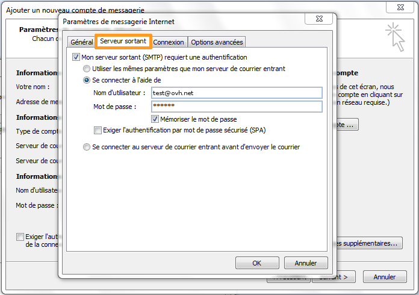

## Deel 1: Aan de slag
Open de Outlook 2007 software.

Klik op het "Tools"[/ blue] menu en dan op "Accountinstellingen...".

Klik in de nieuwe interface, op de knop "Nieuw"   om een ​​nieuw e-mailaccount te registreren.

{.thumbnail}

## Deel 2: Toevoegen
Vink het vakje in de linkerbenedenhoek aan: "Configureer handmatig de server instellingen of extra server types".

Klik op de knop "Volgende"[b/].

{.thumbnail}

## Deel 3: Type dienst
Selecteer "Internet e-mail" en klik op  "Volgende".

{.thumbnail}

## Deel 4: E-mail instellingen
Op deze pagina, moet u de volgende gegevens invullen:

Uw naam:  de gewenste weergavenaam.
E-mailadres:  uw volledige e-mailadres.

Account type: POP3
Inkomende mail server: SSL0.OVH.NET
Uitgaande mail server:SSL0.OVH.NET

Gebruikersnaam: uw volledige e-mailadres (bijv. test@ovh.net)
Uw wachtwoord: gebruik het wachtwoord voor dit e-mailaccount.

Klik dan op "Meer instellingen" om verder te gaan.

{.thumbnail}

## Deel 5: Uitgaande server
In de "Uitgaande server" tab, vink het vakje aan: "Mijn uitgaande server vereist authenticatie om verbinding te maken" en "Verbind mbv:"

Gebruikersnaam: uw volledige e-mailadres (bijv. test@ovh.net)
Uw wachtwoord: gebruik het wachtwoord voor dit e-mailaccount

Het is noodzakelijk om de port 587 en SMTP te gebruiken, selecteer deze authenticatie om verbinding te maken met de uitgaande server. Het is de port geauthenticeerd voor alle Internet Service Providers (ISP). 

{.thumbnail}

- De Authenticatie voor de uitgaande server is essentieel, omdat de ontvangst van de e-mail dan functioneert op onze SMTP servers.

- Als de authentificatie niet is geactiveerd, kan een Open SMTP incident ticket worden geopend met de mededeling dat de "POP voor SMTP"-authenticatie niet wordt ondersteund. U moet absoluut de Uitgaande server authenticatie activeren om de e-mails te verzenden.

## Deel 6: Geavanceerde opties
Voer in de ""Geavanceerde opties" tab, deze instellingen in:

Inkomende server (POP3)[/ b] 110.

Haal het vinkje weg bij: 'Deze server vereist een versleutelde (encrypted) (SSL) verbinding'

Uitgaande server (SMTP)587.

'Gebruik de volgende versleutelde (encrypted) verbinding', moet op Geen ingesteld zijn.

Klik op "OK" om verder te gaan.

Op dit niveau, kunt u ook bepalen of e-mails van de mailserver zouden moeten worden verwijderd.

{.thumbnail}

## Deel 7: Afronding
Uw account is nu correct geconfigureerd.

{.thumbnail}

## POP-configuratie
Hier zijn de gegevens die moeten worden gebruikt om een POP e-mailaccount te configureren.

POP configuratie met SSL-beveiliging geactiveerd of gedeactiveerd:

E-mailadres: uw volledige e-mailadres.
Wachtwoord:  het wachtwoord zoals in [de manager](https://www.ovh.com/managerv3/).
Gebruikersnaam: uw volledige e-mailadres.
Inkomende server: de server voor het ontvangen van de e-mails: SSL0.OVH.NET
Inkomende server port: de port van de inkomende server: 995 of 110
Uitgaande server: de server voor het verzenden van de e-mails: SSL0.OVH.NET
Uitgaande server port: de port van de uitgaande server: 465 of 587

De ports 110 en 587 komen overeen met de SSL-beveiliging op gedeactiveerd.
De ports 995 en 465 die overeenkomen met de SSL beveiliging op geactiveerd.

- U moet [de authentificatie](#configuration_manuelle_partie_5_serveur_sortant) van de uitgaande SMTP server activeren.

|Ports|SSLgeactiveerd|SSLgedeactiveerd|
|Inkomend|995|110|
|Uitgaand|465|587|

## IMAP-configuratie
Hier zijn de gegevens die gebruikt moeten worden om een IMAP e-mailaccount te configureren.

IMAP configuratie met SSL-beveiliging [green ]geactiveerd of gedeactiveerd:

E-mailadres: uw volledige e-mailadres
Wachtwoord:  het wachtwoord zoals in [het control panel](https://www.ovh.com/managerv3/).
Gebruikersnaam: uw volledige e-mailadres
Inkomende server:  de server voor het ontvangen van e-mails:  SSL0.OVH.NET 
Inkomende server port:  de port van de inkomende server: 993 of 143
Uitgaande server:  de server voor het verzenden van e-mails: SSL0.OVH.NET
Uitgaande server port:  de port van de uitgaande server: 465 of 587

De ports 143 en 587 komen overeen met de SSL-beveiliging gedeactiveerd.
De ports 993 en 465 komen overeen met de SSL beveiliging geactiveerd.

- U moet [de authenticatie](#configuration_manuelle_partie_5_serveur_sortant) van de uitgaande SMTP server activeren.

|Ports|SSLgeactiveerd|SSLgedeactiveerd|
|Inkomend|993|143|
|Uitgaand|465|587|

## In het algemeen
Indien u dat wilt, kunnen wij zorgen voor het instellen van de e-mailaccount van uw messaging software via een betaalde interventie. OVH kan ook andere interventies uitvoeren inzake uw e-mailadres.

U kunt de handleiding inzake de verschillende interventies, die OVH kan uitvoeren, raadplegen via:

- 

Raadpleeg de bovenstaande handleiding om een interventie aan te vragen en voor de te volgen procedure.

{.thumbnail}

