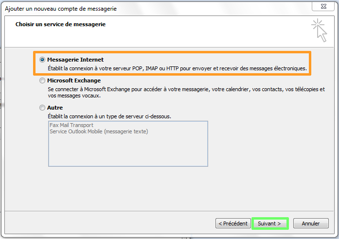

## Parte 1: Início
Aceda ao software Outlook 2007.

Clique no menu "Ferramentas" e depois aceda aos "Parâmetros da conta...".

Nessa nova interface clique no botão "Nova" para adicionar uma nova caixa de e-mail.

{.thumbnail}

## Parte 2: Adicionar
Selecione a caixa em baixo à esquerda: "Configurar manualmente os parâmetros da conta ou os tipos de servidores suplementares".

Clique no botão "Seguinte".

{.thumbnail}

## Parte 3: Tipo de serviço
Escolha "Correio eletrónico da Internet" e clique em "Seguinte".

{.thumbnail}

## Parte 4: Parâmetros da conta
Nessa página deverá introduzir as seguintes informações:

O seu nome: o nome que irá ser apresentado.
Endereço de e-mail: o seu endereço de e-mail na íntegra.

Tipo de conta:POP3
Servidor de receçãoSSL0.OVH.NET
Servidor de envio:SSL0.OVH.NET

Nome do utilizador: o seu endereço de e-mail na íntegra (ex:test@ovh.net
Password: A password que definiu no [manager](https://www.ovh.com/managerv3/) para a conta de e-mail partilhada.

Clique de seguida no botão "Parâmetros suplementares" para continuar.

{.thumbnail}

## Parte 5: servidor de envio
No separador "Servidor de envio" selecione a opção "O meu servidor de envio requer uma autenticação para se ligar" e depois "Ligar-se com a ajuda de:"

Nome do utilizador: o seu endereço de e-mail na íntegra (ex:test@ovh.net
Password: A password que definiu no [manager](https://www.ovh.com/managerv3/) para a conta de e-mail partilhada.

É imperativo que utilize a porta 587 em SMTP e selecione esta autenticação para se ligar ao servidor de envio. Trata-se da porta autenticada para todos os fornecedores de acesso à internet (ISP). 

{.thumbnail}

- A autenticação para o email de saída é uma configuração indispensável para que a emissão de um email possa funcionar corretamente nos nossos servidores SMTP.

- Se a autenticação não estiver ativada, um ticket de incidente com o assunto Open SMTP poderá ser encetado pelos nossos serviços para o informar que a autenticação "POP before SMTP" não é suportada. Deverá, imperativamente, ativar a autenticação para o servidor de envio a fim de poder enviar emails.

## Parte 6: Opções avançadas
No separador "Opções avançadas", introduza os seguintes parâmetros:

Servidor de receção (POP3)110.

Este servidor necessita de uma ligação encriptada (SSL) deve estar desselecionada.

Servidor de envio (SMTP)587.

Utilizar o seguinte tipo de ligação encriptada: deve estar selecionado Nenhum

Clique em "OK" para continuar.

Nesta etapa é ainda possível que defina se os e-mails devem ou não ser eliminados do servidor de e-mails.

{.thumbnail}

## Parte 7: Finalização
A sua conta está agora corretamente configurada.

{.thumbnail}

## Configuração IMAP
Eis as informações a ter em conta para a configuração de uma conta de email IMAP.

Configuração IMAP com encriptação SSL activada ou SSL desativada : 

Endereço de Email : O seu endereço de email completo.
Palavra-passe : A palavra-passe que definiu no seu espaço [Espaço Cliente](https://www.ovh.com/managerv3/).
Nome de utilizador : O seu endereço de email completo.
Servidor de receção : Servidor de receção de emails : SSL0.OVH.NET
Porta do servidor de receção : A porta : 993 ou 143
Servidor de envio : O servidor deve ser : SSL0.OVH.NET
Porta do servidor de envio: Use a porta: 465 ou 587

As portas 143 e 587 correspondem à encriptação SSL desativada.
As portas 993 e 465 correspondem à encriptação SSL ativada.

- Deve obrigatoriamente ativar a  autenticação[/url] para o servidor SMTP.

|Portas|SSLactivado|SSLdesativado|
|Receção|993|143|
|Envio|465|587|

## Configuração POP
Eis as informações a ter em conta para a configuração de uma conta de email POP.

Configuração POP com encriptação SSL activada ou SSL desativada : 

Endereço de Email : O seu endereço de email completo.
Palavra-passe : A palavra-passe que definiu no seu espaço [Espaço Cliente](https://www.ovh.com/managerv3/).
Nome de utilizador : O seu endereço de email completo.
Servidor de receção : Servidor de receção de emails : SSL0.OVH.NET
Porta do servidor de receção : A porta : 995 ou 110
Servidor de envio : O servidor deve ser : SSL0.OVH.NET
Porta do servidor de envio: Use a porta: 465 ou 587

As portas 110 e 587 correspondem à encriptação SSL desativada.
As portas 995 e 465 correspondem à encriptação SSL ativada.

- Deve obrigatoriamente ativar a  autenticação[/url] para o servidor SMTP.

|Portas|SSLactivado|SSLdesativado|
|Receção|995|110|
|Envio|465|587|

