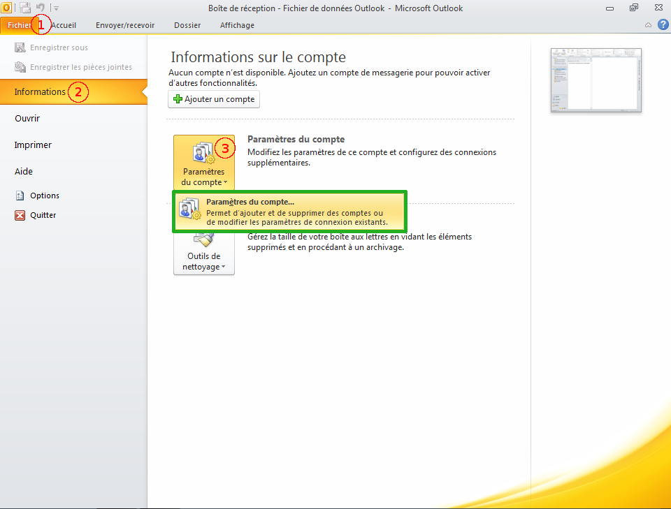
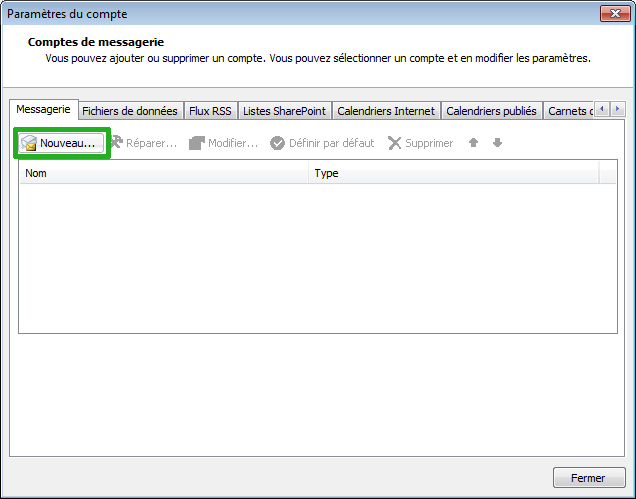
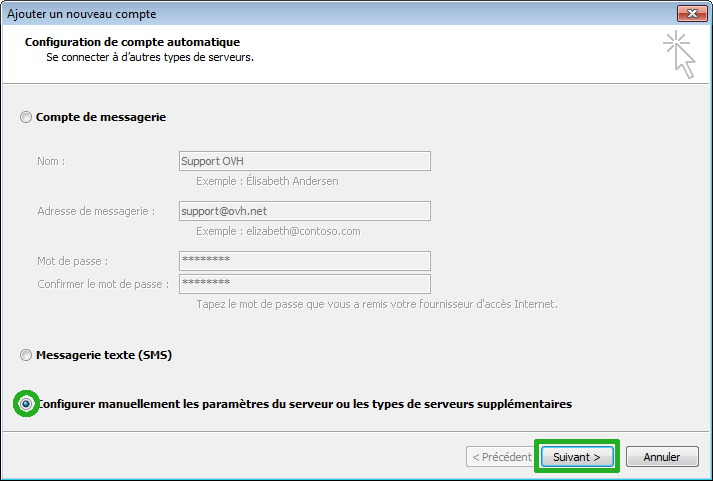
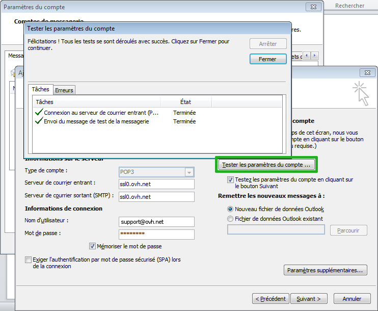
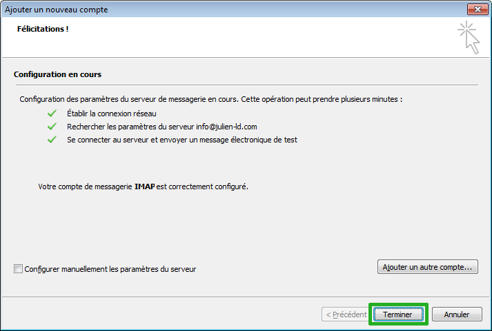

## Tilin lisäys (vaihe 1)
Käynnistä Outlook 2010 ja mene osioon ”Tilin asetukset...”, kuvakaappauksen mukaisesti.

{.thumbnail}


## Tilin lisäys (vaihe 2)
Tämän jälkeen klikkaa Uusi....

Voit valita [manuaalisen](#MANU) tai [automaattikonfiguraation](#AUTO).

{.thumbnail}


## Vaihe 1: konfiguraation valinta
Valitse Konfiguroi palvelinasetukset manuaalisesti tai ylimääräiset palvelintyypit ja tämän jälkeen klikkaa Seuraava >.

{.thumbnail}


## Vaihe 2: palvelun valinta
Valitse Internet-sähköposti jonka jälkeen jatka valitsemalla Seuraava >.

{.thumbnail}


## Vaihe 3: lähtevän postipalvelimen asetukset
Tässä osiossa syötä seuraavat tiedot:

1. Nimi: haluamasi näyttönimi.
2. Sähköpostiosoite: täysi sähköpostiosoitteesi.

3. Tilin tyyppi:POP3
(IMAP-yhteyttä varten ks. [POP- ja IMAP-asetukset](#RAPPEL)).
4. Saapuvan postin palvelin:SSL0.OVH.NET
5. Lähtevän postin palvelin (SMTP):SSL0.OVH.NET

6. Käyttäjänimi: täysi sähköpostiosoitteesi
7. Salasana: hallintapaneelin kautta postilaatikolle määrittelemäsi salasana.

{.thumbnail}


## Vaihe 4: yleisasetukset
1. Klikkaa painiketta ”Lisää asetuksia”.
Voit syöttää kuvaavan nimen tilillesi tässä vaiheessa mikäli haluat. Oletuksena se on sama kuin sähköpostiosoite. Tässä esimerkissä kuvaus on Support OVH.
Tieto näytetään Outlookissa sähköpostilaatikoiden hallinnassa.

2. Klikkaa osiota Lähtevä palvelin.

{.thumbnail}


## Vaihe 5: lähtevä palvelin & lisäasetukset
Osiossa Lähtevä palvelin, valitse ”Lähtevä palvelin (SMTP) requires authenticationvaatii autentikointia" ja rastita ruutu Käytä samoja asetuksia kuin saapuvalle palvelimelle.

Portin 587 ja käyttäjätunnuksen sekä salasanan käyttö on pakollista lähtevään palvelimeen yhdistämistä varten. Tämä portti on kaikkien internetpalveluntarjoajien asiakkaiden käytettävissä.

- Lähtevän palvelimen autentikointi on tehtävä, jotta sähköpostinlähetys toimisi moitteettomasti SMTP-palvelimillamme.

- Jos autentikointia ei aktivoida, Open SMTP-häiriötiketti voidaan avata, jossa ilmoitetaan, että "POP before SMTP" autentikointia ei tueta. Lähtevän palvelimen autentikointi on aktivoitava sähköpostien lähettämiseksi.


Osiossa Edistyneet asetukset, syötä seuraavat tiedot:

Saapuva palvelin (POP3):  portti 110.

Palvelin vaatii salatun yhteyden (SSL)ei saa olla valittuna.

Lähtevä palvelin (SMTP): portti 587.

Käytä seuraavan tyyppistä salattua yhteyttä: valitse Ei mitään

Klikkaa ”OK” jatkaaksesi.

Tässä vaiheessa voit määritellä, poistetaanko sähköpostit myös palvelimelta kun ne tuhotaan sekä aika ennen tuhoamista.

{.thumbnail}


## Vaihe 6: asetuksien testaus
Tässä vaiheessa voit testata tilisi asetuksia klikkaamalla ”Testaa tiliasetuksia...”.

{.thumbnail}


## Vaihe 7: asennuksen viimeistely
1. Kun olet varmistanut että asetukset ovat oikeat, klikkaa Seuraava >.
2. Asetuksien varmistamiseksi suoritetaan uusi testi ennen tilin valmistumista. Klikkaa lopuksi Sulje.

{.thumbnail}


## Vaihe 8: valmis!
Tässä vaiheessa tilisi pitäisi olla määriteltynä toimivasti käyttöön Outlook 2010:ssä. Klikkaa Finish.

{.thumbnail}


## 1. Tietojen määrittely
1. Nimi: valitsemasi nimi jonka haluat näkyvän kontakteille.
2. Sähköpostiosoite: täysi sähköpostiosoitteesi.
3. Salasana: hallintapaneelin kautta postilaatikolle määrittelemäsi salasana.

Tämän jälkeen klikkaa Seuraava >.

{.thumbnail}


## 2. Autorisointi
Outlook etsii verkkotunnuksesta tarvitsemiaan tietoja automaattisen konfiguraation tekoa varten. Jos kaikki sujuu hyvin, oheinen viesti tulee näkyviin.

Aiotko lisätä useita samaan verkkotunnukseen liittyvää sähköpostiosoitetta? Rastita ruutu Älä enää kysy minulta tätä verkkosivua koskien.
Näin et joudu rastittamaan tätä ruutua kutakin sähköpostitiliä lisätessäsi.

Klikkaa Autorisoi.

Jos et saa oheista viestiä, tarkista salasanasi oikeellisuus [selainposti](http://webmail.ovh.net) avulla.
Mikäli salasanasi todellakin on oikein, varmista, että DNS-alueessasi on seuraavat kolme riviä:


```
_submission._tcp.omadomain SRV 0 0 465 SSL0.OVH.NET
_imaps._tcp.omadomain SRV 0 0 993 SSL0.OVH.NET
_autodiscover._tcp.omadomain SRV 0 0 443 mailconfig.ovh.net.
```


Kirjaudu [hallintapaneeliin](https://www.ovh.com/manager/web), valitse ko. verkkotunnus vasemmanpuoleisesta valikosta ja klikkaa välilehteä DNS-alueYhteenvedon oikealta puolelta. Varmista, että olet Asiantuntija-tilassa (oikealla yläkulmassa).

{.thumbnail}


## 3. Asennuksen viimeistely
Konfiguraatio on suoritettu loppuun. Klikkaa lopuksi Valmis.

{.thumbnail}


## POP-asetukset
Tässä ovat sähköpostilaatikon POP-tilin asetukset.

POP-tilin konfigurointi SSL-suojaus aktivoituna tai deaktivoituna: 

Sähköpostiosoite: sähköpostiosoite kokonaisuudessaan.
Salasana: salasana, joka on määritelty [hallintapaneelissa](https://www.ovh.com/managerv3/).
Käyttäjätunnus:jaettu sähköpostiosoite kokonaisuudessaan.
Saapuvan postin palvelin: saapuvien sähköpostiviestien palvelin: SSL0.OVH.NET
Saapuvan postin palvelimen portti: saapuvien sähköpostiviestien palvelimen portti: 995 tai 110
Lähtevän postin palvelin: lähtevien sähköpostiviestien palvelin: SSL0.OVH.NET
Saapuvan postin palvelimen portti: lähtevien sähköpostiviestien palvelimen portti: 465 tai 587

Portit 110 ja 587 vastaavat deaktivoitua SSL-suojausta.
Portit 995 ja 465 vastaavat  aktivoitua SSL-suojausta.


- Lähtevän SMTP-palvelimen [autentikointi](#configuration_du_compte_e-mail_mutualise_sous_windows_phone_8_partie_7_parametres_du_compte_e-mail) on aktivoitava.


|Portti|SSLaktiivinen|SSLdeaktivoitu|
|Saapuva|995|110|
|Lähtevä|465|587|


## IMAP-asetukset
Tässä ovat sähköpostilaatikon IMAP-tilin asetukset.

IMAP-tilin konfigurointi SSL-suojaus aktivoituna tai deaktivoituna: 

Sähköpostiosoite: sähköpostiosoite kokonaisuudessaan.
Salasana: salasana, joka on määritelty [hallintapaneelissa](https://www.ovh.com/managerv3/).
Käyttäjätunnus: sähköpostiosoite kokonaisuudessaan.
Saapuvan postin palvelin: saapuvien sähköpostiviestien palvelin: SSL0.OVH.NET
Saapuvan postin palvelimen portti: saapuvien sähköpostiviestien palvelimen portti: 993 tai 143
Lähtevän postin palvelin: lähtevien sähköpostiviestien palvelin: SSL0.OVH.NET
Saapuvan postin palvelimen portti: lähtevien sähköpostiviestien palvelimen portti: 465 tai 587

Portit 143 ja 587 vastaavat deaktivoitua SSL-suojausta.
Portit 993 ja 465 vastaavat  aktivoitua SSL-suojausta.


- Lähtevän SMTP-palvelimen [autentikointi](#configuration_du_compte_e-mail_mutualise_sous_windows_phone_8_partie_7_parametres_du_compte_e-mail) on aktivoitava.


|Portti|SSLaktiivinen|SSLdeaktivoitu|
|Saapuva|993|143|
|Lähtevä|465|587|


