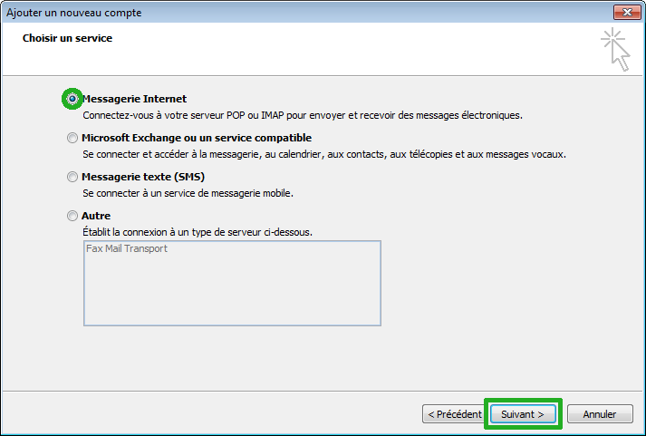
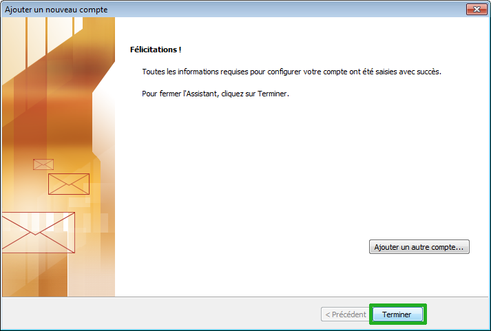

## Een account toevoegen (deel 1)
Om een e-mailaccount in Outlook 2010 toe te voegen, ga naar de interface "Account instellingen...", zoals getoond in het screenshot hieronder.

{.thumbnail}


## Een account toevoegen (deel 2)
Klik dan op Nieuw... .

U heeft nu de keuze tussen een handmatige of automatische configuratie.

{.thumbnail}


## Deel 1: Keuze van de configuratie
Selecteer: Handmatig server instellingen configureren of extra server types configureren klik dan op Volgende>.

{.thumbnail}


## Deel 2: Keuze van de dienst
Selecteer: Internet e-mail, klik dan op 'Volgende >'.

{.thumbnail}


## Deel 3: E-mail instellingen
In dit scherm moet u de volgende gegevens invoeren: 

1. Naam: Voer hier de weer te geven naam in 
2. E-mailadres: uw volledige e-mailadres

3. Account Type:POP3 (voor IMAP zie [Overzicht POP/IMAP instellingen](#RAPPEL))
4. Inkomende Mail Server: SSL0.OVH.NET 
5.  Uitgaande Mail Server (SMTP):  SSL0.OVH.NET

6. Gebruikersnaam: uw volledige e-mailadres
7. Wachtwoord: gebruik het wachtwoord voor dat e-mailaccount.

{.thumbnail}


## Deel 4: In het algemeen
1. Klik Meer instellingen....
U kunt de referentie invoeren van de account die u wilt. Standaard is dit het e-mailadres. Hier hebben we"OVH Support" vervangen.
Deze referentie zal worden weergegeven in het beheer van de e-mailaccounts in Outlook. 

2. Klik vervolgens op Uitgaande server.

{.thumbnail}


## Deel 5: Uitgaande server & geavanceerde opties
Selecteer in Uitgaande Server, het vakje: "Mijn uitgaande server (SMTP) vereist een authenticatie" en dan: Gebruik dezelfde instellingen als voor mijn inkomende mailserver.


Het is noodzakelijk dat u port 587 in SMTP gebruikt en de authenticatie selecteert om de uitgaande server te verbinden.
Dit is de uitgaande port geverifieerd voor alle ISP's (Internet Service Provider's) .


- De authentificatie voor de uitgaande server is een essentiële instelling om de verzending van e-mail te laten functioneren op onze SMTP servers. 

- Indien de authentificatie niet is geactiveerd, kan een Open SMTP incident ticket worden geopend om u te informeren, dat de "POP before SMTP" authentificatie niet wordt ondersteund. U moet deauthentificatie van de uitgaande server activeren om in staat te zijn om e-mails te verzenden.


Voer de volgende gegevens in de tab Geavanceerde optiesin:

Inkomende server (POP3):  dit moet 110 zijn.

Deze server vereist dat een versleutelde (SSL) verbinding  niet is aangevinkt.

Uitgaande server (SMTP): dit moet 587 zijn.

Gebruik het volgende versleutelde verbinding type  moet zijn ingesteld op Geen

Klik op OK om verder te gaan.

Op dit niveau is het ook mogelijk om in te stellen of de e-mails moeten worden verwijderd van de mailserver, en de tijd vóór verwijdering in te stellen.

{.thumbnail}


## Deel 6: Test de instellingen
Op dit moment kunt u uw instellingen testen door te klikken op "Accountinstellingen testen".

{.thumbnail}


## Deel 7: De configuratie beëindigen
1.  Zodra u er zeker van bent dat de instelling correct is, klikt u op Volgende>.
2.  Een nieuwe test van de instellingen van de account wordt uitgevoerd voor de laatste fase. Klik op Sluiten.

{.thumbnail}


## Deel 8: Gefeliciteerd!
U heeft uw account op Outlook 2010 correct geconfigureerd. Klik op Beëindigen.

{.thumbnail}


## 1. Het invoeren van gegevens
1. Naam:  voer hier de naam in, waarmee u uw contacten wilt weergeven
2. E-mailadres: uw volledige e-mailadres
3. Wachtwoord: wachtwoord voor de betreffende e-mailaccount en herhaal dit wachtwoord op de regel eronder ter bevestiging. 

Klik dan op Volgende>.

{.thumbnail}


## 2. Autorisatie
Outlook zoekt vervolgens naar gegevens over uw domein, die het nodig heeft om de automatische configuratie af te ronden.
Als alles goed verloopt, zal er een bericht zoals rechts weergegeven verschijnen. 

Wilt u meerdere e-mailadressen instellen op hetzelfde e-mailadres? Activeer dan Vraag niet meer naar deze website.
Hierdoor hoeft u dit verzoek niet bij elk adres steeds opnieuw te bevestigen. 

Klik vervolgens op Autoriseren.

Als het getoonde bericht niet verschijnt, moet u controleren of uw wachtwoord functioneert. Test hiervoor, of u op [Webmail](http://webmail.ovh.net) kunt inloggen.

Als uw wachtwoord daar werkt, controleert u of de DNS zone de volgende 3 regels heeft: 


```
_submission._tcp.uwdomein SRV 0 0 465 SSL0.OVH.NET
_imaps._tcp.uwdomein SRV 0 0 993 SSL0.OVH.NET
_autodiscover._tcp.uwdomein SRV 0 0 443 mailconfig.ovh.net.
```


Log hiervoor in op uw [Control Panel](https://www.ovh.com/manager/web), selecteer uw domein in de linkerkolom en klik in DNS Zone rechts van Overzicht. Wees er zeker van dat u de Expert Modus geactiveerd heeft (rechts bovenaan).

{.thumbnail}


## 3. Configuratie voltooid
De Outlook applicatie heeft met succes de configuratie voltooid.
Klik op Beëindigen.

{.thumbnail}


## POP-configuratie
Hier zijn de gegevens die gebruikt moet worden om een POP e-mailaccount te configureren.

POP configuratie met beveiligde SSL geactiveerd of gedeactiveerd:

E-mailadres: uw volledige e-mailadres.
Wachtwoord: het wachtwoord zoals in uw [Manager](https://www.ovh.com/managerv3/).
Gebruikersnaam: uw volledige e-mailadres.
Inkomende server: de server voor het ontvangen van e-mails: SSL0.OVH.NET
Inkomende server port: de port van de inkomende server: 995 of 110
Uitgaande server: de server voor het verzenden van e-mails: SSL0.OVH.NET
Uitgaande server port: de port van de uitgaande server: 465 of 587

De ports 110 en 587 corresponderend met de SSL beveiliging gedeactiveerd.
De ports 995 en 465 corresponderend met de  SSL beveiliging geactiveerd.


- U moet  [de authenticatie](#configuration_manuelle_partie_5_serveur_sortant_amp_options_avancees) van de uitgaande SMTP server activeren.


|Ports|SSLgeactiveerd|SSLgedeactiveerd|
|Inkomend|995|110|
|Uitgaand|465|587|


## IMAP-configuratie
Hier zijn de gegevens die gebruikt moeten worden om een IMAP e-mailaccount te configureren.

IMAP configuratie met SSL beveiliging geactiveerd of gedeactiveerd:

 E-mailadres: uw volledige e-mailadres.
Wachtwoord: het wachtwoord zoals in [het control panel](https://www.ovh.com/managerv3/).
Gebruikersnaam: uw volledige e-mailadres.
Inkomende server: de server voor het ontvangen van e-mails: SSL0.OVH.NET
Inkomende server port: de port van de inkomende server: 993 of 143
Uitgaande server: de server voor het verzenden van e-mails: SSL0.OVH.NET
Uitgaande server port: de port van de uitgaande server: 465 of 587

De ports 143 en 587 corresponderen met de SSL-beveiliging op gedeactiveerd.
De ports 993 en 465 corresponderen met de SSL-beveiliging op geactiveerd.


- U moet [de authenticatie](#configuration_manuelle_partie_5_serveur_sortant_amp_options_avancees) van de uitgaande SMTP server activeren.


|Ports|SSLgeactiveerd|SSLgedeactiveerd|
|Inkomend|993|143|
|Uitgaand|465|587|


## In het algemeen
Als u wilt, kunnen wij zorgen voor de instelling van uw e-mailaccount op uw messaging software via een betaalde interventie. OVH kan ook andere interventies uitvoeren op uw e-mailadres.

U kunt deze handleiding over de verschillende outsourcing interventies die OVH kan uitvoeren, raadplegen via:


- []({legacy}1683)


Indien u een interventie wilt aanvragen, raadpleeg dan de bovenstaande handleiding voor de te volgen procedure.

{.thumbnail}

