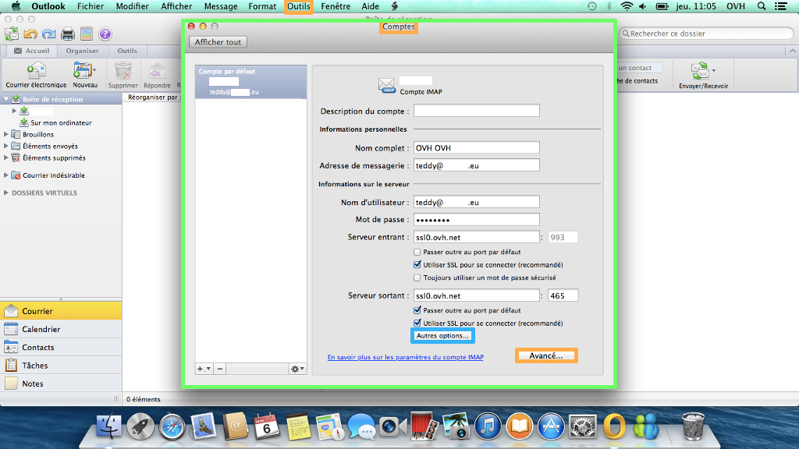

## Parte 1: Inicio
Inicie o software Microsoft Outlook 2011 no seu Mac.

Vamos escolher configurar o nosso software em IMAP, com o SSL ativado.

É possível que configure o software em POP com as informações consultáveis no final deste guia.

Para a nossa configuração utilizámos a versão 10.9.1 do Mac em como o Outlook 2011 na versão 14.0.0.

{.thumbnail}

## Parte 2: Ferramentas - Contas
Clique em "Ferramentas" e depois "Contas...".

Nenhuma conta está atualmente configurada no nosso softrware.

{.thumbnail}

## Parte 3: Adicionar uma conta
Irá aparecer uma nova interface

Selecione o ícone "Conta de e-mail" para adicionar uma conta de e-mail como POP ou IMAP.

{.thumbnail}

## Parte 4: Informações da conta
Eis o conteúdo da nova interface que será apresentada.

Preencha os seguintes campos com os valores correspondentes:

Endereço de e-mail: O seu endereço de e-mail na íntegra.

Password: A password que definiu no [manager](https://www.ovh.com/manager/web/login/).

Nome do utilizador: O seu endereço de e-mail na íntegra.

Tipo: Selecione IMAP (pode selecionar POP e nesse caso deve introduzir as informações presentes no final deste guia).

Servidor de receção: SSL0.OVH.NETPorta do servidor de receção: 993

Selecione as opções "Passar outra à porta por defeito" bem como "Utilizar SSL para estabelecer ligação (recomendado)".

Servidor de envio: SSL0.OVH.NETPorta do servidor de envio: 465

Selecione as opções "Passar outra à porta por defeito" bem como "Utilizar SSL para estabelecer ligação (recomendado)".

Se lhe for pedido que adicione a sua password às passwords do Mac, terá a possibilidade de a guardar para evitar que introduza em futuros pedidos.

Clique em "Adicionar uma conta" para guardar a conta.

{.thumbnail}

## Parte 5: Finalização
A sua conta de e-mail está agora adicionada à interface do Outlook 2011.

Pode desde já consultar, enviar ou eliminar os seus e-mails.

{.thumbnail}

## Ferramentas - Contas
Clique em "Ferramentas" e depois "Contas...".

Selecione a conta que deseja modificar.

A interface seguinte aparece (cf captura de ecrã ao lado):

Após clicar em "Outras opções..." no menu irá aparecer e é-lhe possível selecionar "Autenticação" -> "Utilizar as informações do servidor de receção".

É ainda possível que modifique as informações de configuração da sua conta de e-mail, bem como o tipo de conta (POP ou IMAP)

Veja as opções disponíveis em "Avançado...".

{.thumbnail}

- A autenticação para o servidor de envio é um parâmetro indispensável para que a emissão de email possa funcionar corretamente nos nossos servidores SMTP.

- Se a autenticação não estiver ativada, um ticket de incidente Open SMTP poderá ser automaticamente encetado e enviado para o informar quanto ao facto de que a autenticação "POP before SMTP" não é suportada. Deverá, imperativamente, ativar a Autenticação para o servidor de saída a fim de poder enviar emails.

## Servidor
Veja os parâmetros modificáveis no separador "Servidor" nas opções avançadas da conta.

{.thumbnail}
Para que a configuração possa estar plenamente funcional, convidamo-lo a introduzir no campo "Pasta raiz IMAP" o valor "INBOX".

## Pastas
Veja os parâmetros modificáveis no separador "Pastas" nas opções avançadas da conta.

{.thumbnail}

## Segurança
Veja os parâmetros modificáveis no separador "Segurança" nas opções avançadas da conta.

{.thumbnail}

## Configuração POP
Eis as informações a ter em conta para a configuração de uma conta de email POP.

Configuração POP com encriptação SSL activada ou SSL desativada : 

Endereço de Email : O seu endereço de email completo.
Palavra-passe : A palavra-passe que definiu no seu espaço [Espaço Cliente](https://www.ovh.com/managerv3/).
Nome de utilizador : O seu endereço de email completo.
Servidor de receção : Servidor de receção de emails : SSL0.OVH.NET
Porta do servidor de receção : A porta : 995 ou 110
Servidor de envio : O servidor deve ser : SSL0.OVH.NET
Porta do servidor de envio: Use a porta: 465 ou 587

As portas 110 e 587 correspondem à encriptação SSL desativada.
As portas 995 e 465 correspondem à encriptação SSL ativada.

- Deve obrigatoriamente ativar a  autenticação[/url] para o servidor SMTP.

|Portas|SSLactivado|SSLdesativado|
|Receção|995|110|
|Envio|465|587|

## Configuração IMAP
Eis as informações a ter em conta para a configuração de uma conta de email IMAP.

Configuração IMAP com encriptação SSL activada ou SSL desativada : 

Endereço de Email : O seu endereço de email completo.
Palavra-passe : A palavra-passe que definiu no seu espaço [Espaço Cliente](https://www.ovh.com/managerv3/).
Nome de utilizador : O seu endereço de email completo.
Servidor de receção : Servidor de receção de emails : SSL0.OVH.NET
Porta do servidor de receção : A porta : 993 ou 143
Servidor de envio : O servidor deve ser : SSL0.OVH.NET
Porta do servidor de envio: Use a porta: 465 ou 587

As portas 143 e 587 correspondem à encriptação SSL desativada.
As portas 993 e 465 correspondem à encriptação SSL ativada.

- Deve obrigatoriamente ativar a  autenticação[/url] para o servidor SMTP.

|Portas|SSLactivado|SSLdesativado|
|Receção|993|143|
|Envio|465|587|

