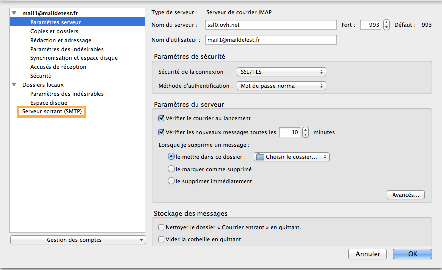

## Parte 1: avvio
Apri l'applicazione Thunderbird installata sul tuo Mac.

Questa interfaccia si apre di default se non sono presenti account email configurati. Altrimenti, accedi al menu per aggiungere un nuovo account.

Per continuare l'installazione dell'account email, seleziona Salta questo step e utilizza il mio indirizzo esistente.

{.thumbnail}

## Parte 2: creazione dell'account
Completa questi campi:

Nome: il nome che vuoi che venga visualizzato.

Indirizzo email: il tuo indirizzo email completo.

Password: la password definita nel tuo Spazio Cliente OVH.

Ricorda password: seleziona questa opzione.

Clicca su Continua per passare alla fase successiva.

{.thumbnail}

## Parte 3: creazione account (seguito)
Thunderbird recupera le impostazioni dell'indirizzo email e ti propone due configurazioni: IMAP o POP3.

Nel nostro esempio, configuriamo l'account IMAP. Per la configurazione POP3, utilizza le informazioni riportate alla fine di questa guida.

Thunderbird ti propone di eseguire una configurazione manuale.

Clicca su Configurazione manuale per passare alla fase successiva.

{.thumbnail}

## Parte 4: configurazione delle impostazioni server
Verifica che questi parametri siano inseriti correttamente:
Per i Server in entrata:
In entrata: IMAP
Nome server: SSL0.OVH.NET
Porta: 993
SSL: SSL/TLS
Autenticazione: Password normale

{.thumbnail}
Per i Server in uscita:
In uscita: SMTP
Nome server: SSL0.OVH.NET
Porta: 465
SSL: SSL/TLS
Autenticazione: Password normale
Nome utente: cioè l'identificativo per il server in entrata e in uscita, il tuo indirizzo email completo
Clicca su "Crea un account" per completare la configurazione.

## Parte 5: impostazioni server & Server in uscita (SMTP)
Una volta aggiunto il tuo account, è possibile accedere alle impostazioni del server.

Clicca su Serveur in uscita (SMTP) per verificare le informazioni inserite per il server in uscita.

{.thumbnail}

## Parte 6: impostazioni server & Server in uscita (SMTP)(seguito)
Inserisci questi parametri:
Nome server: SSL0.OVH.NET
Porta: 465
Sicurezza della connessione: SSL/TLS
Metodo di autenticazione: Password normale
Nome utente: il tuo indirizzo email completo

Clicca su Ok per confermare le informazioni del server SMTP.

{.thumbnail}

## Configurazione POP
Ecco le informazioni necessarie alla configurazione di un account email POP.

Configurazione POP con protocollo SSL attivato o disattivato:

Indirizzo email: il tuo indirizzo email completo.
Password: la password che hai definito nel tuo [Spazio Cliente OVH](https://www.ovh.com/manager/web/login/).
Nome utente: il tuo indirizzo email completo.
Server in entrata: il server di posta in arrivo, SSL0.OVH.NET.
Porta del server in entrata: 995 o 110
Server in uscita: il server di posta in uscita, SSL0.OVH.NET.
Porta del server in uscita:465 o 587.

Se utilizzi le porte 110 e 587, il protocollo SSL è disattivato.
Se utilizzi le porte 995 e 465, il protocollo SSL è attivato.

- Ricordati che è necessario attivare [l'autenticazione](#impostazioni_account__server_posta_in_uscita_smtp) del server di posta in uscita SMTP.

|Porte|SSLattivato|SSLdisattivato|
|In entrata|995|110|
|In uscita|465|587|

## Configurazione IMAP
Ecco le informazioni necessarie alla configurazione di un account email IMAP.

Configurazione IMAP con protocollo SSL attivato o disattivato:

Indirizzo email: il tuo indirizzo email completo.
Password: la password che hai definito nel tuo [Spazio Cliente OVH](https://www.ovh.com/manager/web/login/).
Nome utente: il tuo indirizzo email completo.
Server in entrata: il server di posta in arrivo, SSL0.OVH.NET.
Porta del server in entrata:993 o 143
Server in uscita: il server di posta in uscita, SSL0.OVH.NET.
Porta del server in uscita:465 o 587.

Se utilizzi le porte 143 e 587, il protocollo SSL è disattivato.
Se utilizzi le porte 993 e 465, il protocollo SSL è attivato.

- Ricordati che è necessario attivare [l'autenticazione](#impostazioni_account__server_posta_in_uscita_smtp) del server di posta in uscita SMTP.

|Porte|SSLattivato|SSLdisattivato|
|In entrata|993|143|
|In uscita|465|587|

