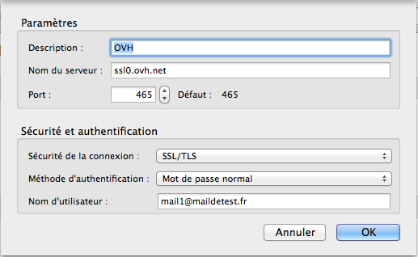

## Część 1: Uruchomienie programu
Przejdź do aplikacji "Thunderbird" zainstalowanej na komputerze z systemem Mac.

Oto interfejs, który pojawi się domyślnie, jeśli nie masz skonfigurowanego adresu e-mail. W przeciwnym razie przejdź do menu, aby rozpocząć dodawanie nowego konta.

{.thumbnail}

## Część 2: Zakładanie konta
"Nazwa konta": Wpisz nazwę, która ma się wyświetlać.

"Adres e-mail": Wpisz adres e-mail.

"Hasło": Hasło zdefiniowane w panelu klienta dla tego konta e-mail.

"Zapamiętaj hasło": Należy zaznaczyć tę opcję.

Kliknij na "Kontynuuj".

{.thumbnail}

## Część 3: Zakładanie konta (ciąg dalszy)
Thunderbird pobiera ustawienia adresu e-mail i proponuje dwie możliwe konfiguracje:  IMAP lub POP3.

W naszym przykładzie skonfigurujemy konto IMAP, ale możesz również skonfigurować konto w trybie POP. Na końcu przewodnika podaliśmy informacje niezbędne do skonfigurowania konta e-mail typu POP3.

Thunderbird proponuje konfigurację ręczną.

Kliknij na "Konfiguracja ręczna".

{.thumbnail}

## Część 4: Konfiguracja ustawień serwerów
Sprawdź, czy te parametry są poprawnie wpisane:
W pierwszej linii Serwer poczty przychodzącej:
Serwer poczty przychodzącej: IMAP
Nazwa serwera: SSL0.OVH.NET
Port: 993
SSL: SSL/TLS
Uwierzytelnianie: Hasło

{.thumbnail}
W drugiej linii Serwer poczty wychodzącej:
Serwer poczty wychodzącej: SMTP
Nazwa serwera: SSL0.OVH.NET
Port: 465
SSL: SSL/TLS
Uwierzytelnianie: Hasło
Identyfikator serwera poczty przychodzącej & wychodzącej: adres e-mail
Kliknij na "Zakończone", aby zakończyć instalację.

## Część 5: Parametry serwera poczty wychodzącej (SMTP)
Po dodaniu konta będziesz mógł sprawdzić poszczególne ustawienia serwera. 

Kliknij na "Serwer poczty wychodzącej (SMTP)", aby sprawdzić informacje dotyczące serwera poczty wychodzącej.

{.thumbnail}

## Część 6: Parametry serwera poczty wychodzącej (SMTP) - ciąg dalszy
Parametry SMTP do wpisania:
Nazwa serwera: SSL0.OVH.NET
Port: 465
Bezpieczeństwo połączenia: SSL/TLS
Metoda uwierzytelniania: Hasło
Użytkownik: adres e-mail

Kliknij na "Ok".

{.thumbnail}

## Konfiguracja POP
Oto informacje do konfiguracji konta e-mail POP

Konfiguracja POP z zabezpieczeniem SSL włączonym/green] lub wyłączonym:

Adres Email : Cały adres e-mail
Hasło: Hasło zdefiniowane w panelu klienta
Nazwa użytkownika: Caly adres e-mail
Serwer poczty przychodzącej:ssl0.ovh.net
Port serwera poczty przychodzącej:995 lub 110
Serwer poczty wychodzącej:ssl0.ovh.net
Port serwera poczty wychodzącej:465 lub 587

Porty 110 i 587 są podawane, gdy zabezpieczenie SSL jest wyłączone.
Porty 995 i 465 są podawane, gdy zabezpieczenie SSL jest włączone.

- Należy obowiązkowo włączyć [uwierzytelnianie](#parametres_des_comptes_parametres_du_serveur_sortant_smtp) serwera SMTP.

|Porty|SSLwłączony|SSLwyłączony|
|Wchodzący|995|110|
|Wychodzący|465|587|

## Konfiguracja IMAP
Oto informacje do konfiguracji konta e-mai IMAP.

Konfiguracja IMAP z zabezpieczeniem SSL włączonym lub wyłączonym:

Adres Email : Cały adres e-mail
Hasło: Hasło zdefiniowane w panelu klienta
Nazwa użytkownika: Caly adres e-mail
Serwer poczty przychodzącej:ssl0.ovh.net
Port serwera poczty przychodzącej:993 lub 143
Serwer poczty wychodzącej:ssl0.ovh.net
Port serwera poczty wychodzącej:465 lub 587

Porty 143 i 587 są podawane, gdy zabezpieczenie SSL jest wyłączone.
Porty 993 i 465 są podawane, gdy zabezpieczenie SSL jest włączone.

- Należy obowiązkowo włączyć [uwierzytelnianie](#parametres_des_comptes_parametres_du_serveur_sortant_smtp) serwera SMTP.

|Porty|SSLwłączony|SSLwyłączony|
|Wchodzący|993|143|
|Wychodzący|465|587|

