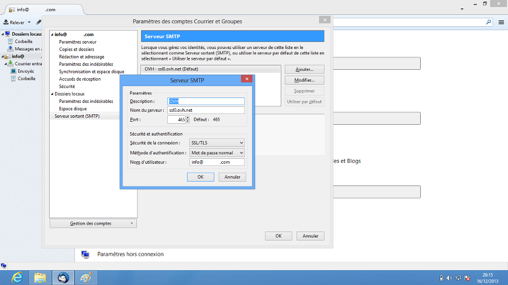

## 1 dalis: Pradžia
Pirmiausiai į kompiuterį reikia įsidiegti programą "Thunderbird".

Iliustracijoje pateikiamas programos langas be sukonfigūruotų paskyrų. Jeigu bent viena paskyra jau sukonfigūruota, atidarykite paskyrų valdymo langą.

Pasirinkite "El. pašto dėžutė", kad pridėtumėte naują dėžutę.

{.thumbnail}

## 2 dalis: Pradžia (tęsinys)
El. pašto dėžutės konfigūravimą pradėsite spragtelėję "Praleisti šį etapą ir naudoti egzistuojantį el. paštą".

{.thumbnail}

## 3 dalis: Paskyros kūrimas
Užpildykite reikiamus laukus:

Vardas ir pavardė: Paskyros bei laiškų siuntėjo vardas ir pavardė.

El. pašto adresas: Visas el. pašto adresas.

Slaptažodis: El. pašto dėžutės slaptažodis, kurį nurodėte [valdymo sąsajoje](https://www.ovh.lt/managerv3/), kurdami paskyrą.

Įsiminti slaptažodį: Rekomenduojame pažymėti šį laukelį.

Thunderbird nuskaitys el. pašto dėžutės parametrus ir pasiūlys du galimus konfigūracijos tipus: IMAP ir POP3.

 Pavyzdyje konfigūruosime IMAP paskyrą. Galite konfigūruoti ir kitaip, papildoma informacija pateikiama gido pabaigoje.

Pastaba: Thunderbird taip pat suteikia galimybę patiems konfigūruoti paskyrą, tokiu atveju skaitykite gido dalį "Rankinis konfigūravimas".

Spragtelėkite "Baigti" ir diegimas bus baigtas.

{.thumbnail}

## 4 dalis: Pabaiga
Jūsų el. pašto dėžutė automatiškai sukonfigūruota ir veikianti.

Toliau gide apžvelgsime skirtingus paskyros nustatymus.
Juos matysite spragtelėję savo el. pašto adresą ir "Žr. paskyros nustatymus".

{.thumbnail}

## Paskyros nustatymai
Čia pateikiama bendroji paskyros informacija.

Čia taip pat galite pridėti el. laiškų parašą arba nustatyti kitą adresą, iš kurio atsakysite į gautus laiškus.

Be to, šioje vietoje galėsite peržiūrėti ir keisti paskyros naudojamą SMTP serverį.

{.thumbnail}

## Gautų laiškų serverio nustatymai
Šiame lange matysite gautų laiškų serverio nustatymus.

Galėsite nustatyti naujų laiškų tikrinimo dažnumą, taip pat laiškų trynimą.

{.thumbnail}

## Kopijos ir katalogai
Čia galėsite nustatyti įvairias katalogų, siunčiamų laiškų ir archyvų taisykles.

{.thumbnail}

## Sinchronizavimas ir disko vieta
Galite rinktis būdą, kaip bus sinchronizuojami laiškai, taip pat nustatyti, ar trinti senus laiškus.

{.thumbnail}

## Siunčiamų laiškų serverio (SMTP) nustatymai
Šioje vietoje galite keisti siunčiamų laiškų serverio nustatymus.

{.thumbnail}

## Siunčiamų laiškų serverio (SMTP) nustatymai (tęsinys)
Norėdami keisti įvairius SMTP serverio nustatymus, pasirinkite serverį ir spragtelėkite "Keisti".

- Autentifikavimas naudojant slaptažodį yra neišvengiamas nustatymas, kad el. laiškų siuntimas veiktų mūsų SMTP serveriuose.

Dėl to nustatykite autentifikavimo metodą naudojant slaptažodį.

{.thumbnail}

- Autentifikavimas naudojant slaptažodį yra neišvengiamas nustatymas, kad el. laiškų siuntimas veiktų mūsų SMTP serveriuose.

- Jeigu autentifikavimas atliekamas kitais būdais (nenaudojant slaptažodžio), greičiausiai matysite Open SMTP gedimo kvitą, kuriame informuojama, kad "POP before SMTP" autentifikavimas nepalaikomas. Tokiu atveju reikia nedelsiant aktyvuoti autentifikavimą naudojant slaptažodį, kad galėtumėte siųsti el. laiškus.

## Neautomatinis paskyros kūrimas
Šis langas matomas spragtelėjus "Rankinis konfigūravimas" (žr. 3 dalį).

Konfigūruodami savo paskyrą, čia galite nustatyti pageidaujamus parametrus.

{.thumbnail}

## POP nustatymai
Čia pateikiama informacija, kuria reiktų vadovautis konfigūruojant el. pašto paskyrą su POP.

POP konfigūravimas su įjungta ir išjungta SSL apsauga:

Email Address: Jūsų el. pašto adresas
Password: Slaptažodis, kurį nurodėte [valdymo sąsajoje](https://www.ovh.lt/managerv3/), kurdami paskyrą.
Username: Visas el. pašto adresas
Incoming server:SSL0.OVH.NET
Incoming Server Port:995 arba 110
Outgoing server: The sending mail server: SSL0.OVH.NET
Outgoing Server Port:465 arba 587

Prievadai 110 ir 587 atitinka konfigūraciją su išjungta SSL apsauga.
Prievadai 995 ir 465 atitinka konfigūraciją su įjungta SSL apsauga.

- Taip pat būtina įjungti SMTP [autentifikaciją](#parametres_des_comptes_parametres_du_serveur_sortant_smtp).

|Prievadai|SSLįjungta|SSLišjungta|
|Įeinantis|995|110|
|Išeinantis|465|587|

## IMAP nustatymai
Čia pateikiama informacija, kuria reiktų vadovautis konfigūruojant el. pašto paskyrą su IMAP.

IMAP konfigūravimas su įjungta ir išjungta SSL apsauga:

Email Address: Jūsų el. pašto adresas
Password: Slaptažodis, kurį nurodėte [valdymo sąsajoje](https://www.ovh.lt/managerv3/), kurdami paskyrą.
Username: Visas el. pašto adresas
Incoming server:SSL0.OVH.NET
Incoming Server Port:993 arba 143
Outgoing server: The sending mail server: SSL0.OVH.NET
Outgoing Server Port:465 arba 587

Prievadai 143 ir 587 atitinka SSL su išjungta apsauga.
Prievadai 993 ir 465 atitinka SSL su įjungta apsauga.

|Prievadai|SSLįjungta|SSLišjungta|
|Įeinantis|995|110|
|Išeinantis|465|587|

## Bendra informacija
Jeigu pageidaujate, mes galime sukonfigūruoti jūsų pašto programą. Tai atliekama užsakius mokamą intervenciją. OVH taip pat gali atlikti kitas su el. paštu susijusias mokamas intervencijas.

OVH atliekamų mokamų intervencijų informacija pateikiama šiame gide:

- 

Norėdami užsakyti intervenciją, sekite gide nurodytus žingsnius.

{.thumbnail}

