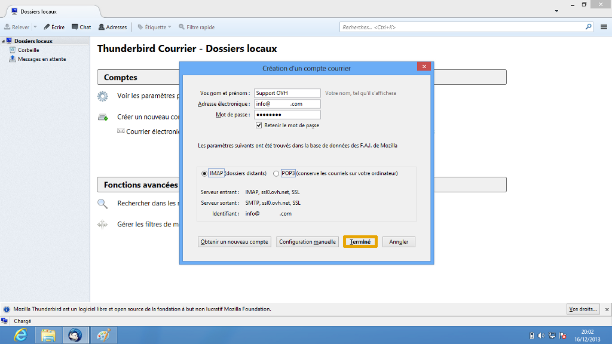
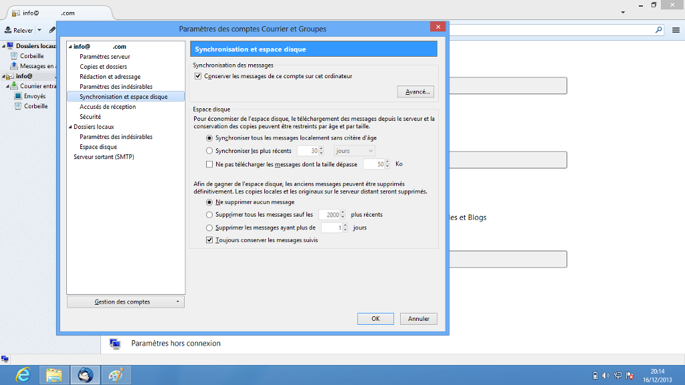
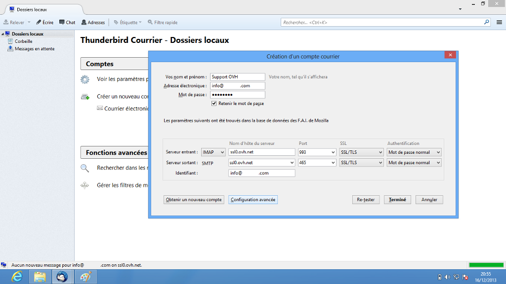

## Parte 1: Início
Num primeiro tempo aceda à aplicação "Thunderbird" instalada no seu computador.

Veja a interface que irá aparecer por defeito caso ainda não possui nenhuma conta de e-mail configurada. Caso contrário, no menu poderá adicionar uma nova conta.

Selecione "Correio eletrónico" para continuar.

{.thumbnail}

## Parte 2: Início (continuação)
Para prosseguirmos com a instalação da conta de e-mail, selecione "Passar esta etapa e utilizar o meu endereço de e-mail existente" para continuar.

{.thumbnail}

## Parte 3: Criação da conta
Introduzas os campos apresentados:

"O seu nome e apelido": introduza o nome desejado.

"Endereço de e-mail": o seu endereço de e-mail na íntegra.

Password: A password que definiu no [manager](https://www.ovh.com/managerv3/) para a conta de e-mail partilhada.

"Guardar a password": deve selecionar esta opção.

O Thunderbird recupera os parâmetros da conta de e-mail e propõe-lhe duas possíveis configurações: IMAP ou POP3.

No nosso exemplo vamos configurar a conta como IMAP. É porém possível que a configure como POP, encontrando no final deste guias as informações necessárias para que configure a conta como POP3.

Deve ter em conta que o Thunderbird propõe uma configuração manual, podendo encontrá-la na secção "Configuração Manual" deste guia.

Clique em "Terminar" para finalizar as etapas da instalação.

{.thumbnail}

## Parte 4: Finalização
Nesta altura o seu endereço de e-mail foi adicionado automaticamente e está funcional.

Vamos ver em conjunto no seguimento deste guia, os diferentes parâmetros da conta.

Para tal selecione "Ver os parâmetros desta conta" após clicar no endereço de e-mail.

{.thumbnail}

## Parâmetros da conta
Encontra aqui as informações gerais da sua conta de e-mail.

Pode adicionar aqui uma assinatura aos seus e-mails, ou definir um outro endereço de e-mail ao qual os seus destinatários respondem.

Pode igualmente consultar e modificar o servidor SMTP utilizado pela conta de e-mail.

{.thumbnail}

## Parâmetros do servidor de receção
Nesta janela irá encontrar todas as informações que dizem respeito ao servidor de receção de e-mails.

Pode parametrizar o intervalo de tempo em que o software verifica as novas mensagens ou a política de gestão de eliminação de e-mails.

{.thumbnail}

## Cópias e pastas
Aqui encontrará as diferentes regras que dizem respeito às pastas, ao envio de e-mails, aos arquivos.

{.thumbnail}

## Sincronização e espaço em disco
Dispõe da possibilidade de escolher a forma como os seus e-mails são sincronizados, podendo ainda definir a eliminação, ou não, dos seus e-mails.

{.thumbnail}

## Parâmetros do servidor de envio SMTP
É possível que adicione ou modifique os servidores SMTP configurados no seu software.

{.thumbnail}

## Parâmetros do servidor de envio SMTP: (continuação)
Encontrará aqui os diferentes parâmetros modificáveis, que aparecerão assim que clicar no seu servidor SMTP e clicar em "Modificar".

- Deve, imperiosamente, ativar  a autenticação do servidor SMTP.

Selecione como método de autenticação: Palavra-passe normal

{.thumbnail}

- A autenticação para o servidor de envio é um parâmetro indispensável para que a emissão de email possa funcionar corretamente nos nossos servidores SMTP.

- Se a autenticação não estiver ativada, um ticket de incidente Open SMTP poderá ser automaticamente encetado e enviado para o informar quanto ao facto de que a autenticação "POP before SMTP" não é suportada. Deverá, imperativamente, ativar a Autenticação para o servidor de saída a fim de poder enviar emails.

## Adicionar uma conta manualmente
Veja o que aparece após clicar em "Configuração manual" (Cf. parte 3).

Pode definir os parâmetros de configuração da conta de e-mail.

{.thumbnail}

## Configuração POP
Eis as informações a ter em conta para a configuração de uma conta de email POP.

Configuração POP com encriptação SSL activada ou SSL desativada : 

Endereço de Email : O seu endereço de email completo.
Palavra-passe : A palavra-passe que definiu no seu espaço [Espaço Cliente](https://www.ovh.com/managerv3/).
Nome de utilizador : O seu endereço de email completo.
Servidor de receção : Servidor de receção de emails : SSL0.OVH.NET
Porta do servidor de receção : A porta : 995 ou 110
Servidor de envio : O servidor deve ser : SSL0.OVH.NET
Porta do servidor de envio: Use a porta: 465 ou 587

As portas 110 e 587 correspondem à encriptação SSL desativada.
As portas 995 e 465 correspondem à encriptação SSL ativada.

- Deve obrigatoriamente ativar a  autenticação[/url] para o servidor SMTP.

|Portas|SSLactivado|SSLdesativado|
|Receção|995|110|
|Envio|465|587|

## Configuração IMAP
Eis as informações a ter em conta para a configuração de uma conta de email IMAP.

Configuração IMAP com encriptação SSL activada ou SSL desativada : 

Endereço de Email : O seu endereço de email completo.
Palavra-passe : A palavra-passe que definiu no seu espaço [Espaço Cliente](https://www.ovh.com/managerv3/).
Nome de utilizador : O seu endereço de email completo.
Servidor de receção : Servidor de receção de emails : SSL0.OVH.NET
Porta do servidor de receção : A porta : 993 ou 143
Servidor de envio : O servidor deve ser : SSL0.OVH.NET
Porta do servidor de envio: Use a porta: 465 ou 587

As portas 143 e 587 correspondem à encriptação SSL desativada.
As portas 993 e 465 correspondem à encriptação SSL ativada.

- Deve obrigatoriamente ativar a  autenticação[/url] para o servidor SMTP.

|Portas|SSLactivado|SSLdesativado|
|Receção|993|143|
|Envio|465|587|

## Generalidades
Se desejar, podemos encarregar-nos da configuração da sua conta de email no seu software de email através de uma intervenção paga. A OVH pode igualmente realizar outras intervenções relacionadas com a sua conta de email.

Pode consultar este guias relativo às diferentes intervenções pagas que podem ser realizadas pela OVH:

- 

Para efetuar um pedido de intervenção paga, consulte no guia acima indicado o procedimento a ser efetuado.

{.thumbnail}

