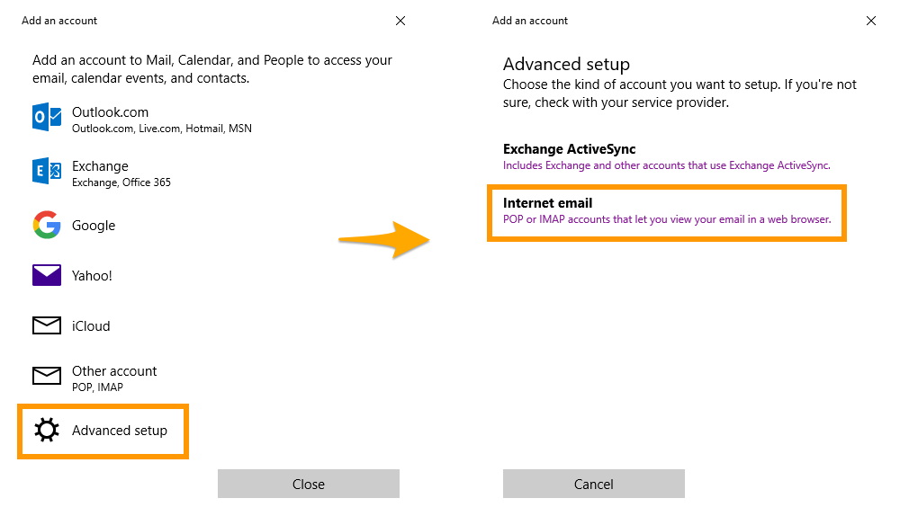

**Last updated 5th May 2020**

## Objective

You can configure email addresses on email clients, if they are compatible. By doing so, you can use your email address through your preferred email application.

**Find out how to configure your email address in the Mail application for Windows 10.**

## Requirements

- You need to have an MX Plan email address, available as part of our [Web Hosting plans](https://www.ovh.com/asia/web-hosting/).
- You need to have the Mail app installed on your device.
- You need to have the required credentials for the email address you would like to configure.

## Instructions

### Step 1: Add the account

Once you have launched the Mail application on your device, you can add an account in two different ways:

- **When you open the app for the first time:** A window will appear, asking you to `Add account`{.action}.

- **If an account has already been set up**: click on `Accounts`{.action} in the menu bar to the left of the application, then on `Add account`{.action} in the menu that pops up on the right.

{.thumbnail}

In the window that appears, click on `Advanced settings`{.action}, then select `Internet email`{.action} as the account type.

Enter the information requested:

|Information|Description|
|---|---|
|Mail address|Enter your full email address.|
|Username|Enter your full email address.|
|Password|Enter the password for your email address.|
|User name|Enter a name that will distinguish this account from any other accounts shown in your Mail app.|
|Send your messages using this name|Enter the name that you wish to be displayed in the sender field when sending emails from this address.|
|Incoming email server|Enter the server “ssl0.ovh.net:993”.|
|Account type|We recommend using **IMAP4**. You can also select **POP** (in which emails are stored locally on your Mail app) in the drop-down menu.|
|Outgoing email server|Enter the server “ssl0.ovh.net:465”.|

Make sure that the checkboxes are ticked for the following options:

- Outgoing server requires authentication
- Use the same user name and password for sending mail
- Require SSL for incoming email
- Require SSL for outgoing email

Once you have entered this information, click `Sign in`{.action}. If all the information you have entered is correct, you will be able to log in to your account straight away.

To check that the account has been correctly configured, you can send a test email.

{.thumbnail}

If you need to enter any settings manually in your account preferences, the technical settings you will need to use are listed below:

- **For IMAP4 configuration**

|Server type|Server name|SSL|Port|
|---|---|---|---|
|Incoming|ssl0.ovh.net|Yes|993|
|Outgoing|ssl0.ovh.net|Yes|465|

- **For POP configuration**

|Server type|Server name|SSL|Port|
|---|---|---|---|
|Incoming|ssl0.ovh.net|Yes|995|
|Outgoing|ssl0.ovh.net|Yes|465|

### Step 2: Use the email address

Once you have configured your email address, you can start using it! You can now send and receive emails.

OVHcloud also has a web application you can use to access your email account from your browser. You can access this application via the following address: <https://www.ovh.com/asia/mail>. You can log in using your email credentials.
 
## Go further

Join our community of users on <https://community.ovh.com/en/>.
