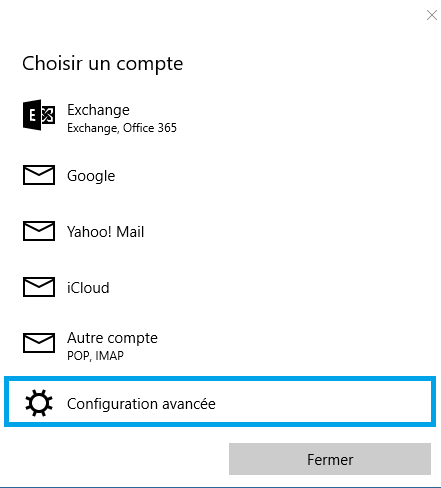
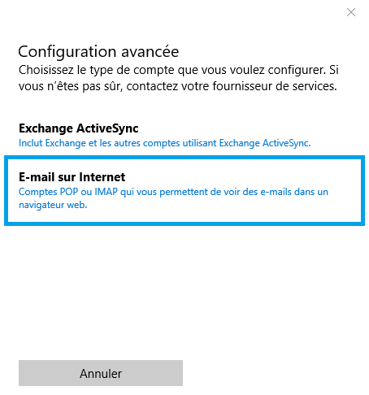

## Reikalavimai

- Veikiantis OVH el. pašto adresas
- El. pašto programa (prieinama diegiant Windows 10)

## 1 dalis: paleidimas ir konfigūravimas
Paaiškinsime, kaip konfigūruoti IMAP su įjungtaSSL apsauga. 

Paleiskite el. pašto programą.

{.thumbnail}
Spragtelėkite + Pridėti paskyrą centre.

{.thumbnail}
Spragtelėkite „Pažangus konfigūravimas“.

{.thumbnail}
Spragtelėkite „El. paštas internetu“.

{.thumbnail}
Kaip pateiktame pavyzdyje, įveskite šiuos nustatymus:

- Paskyra: įveskite savo OVH el. pašto adresą
- Vardas: įveskite savo vardą ir pavardę
- Įeinančių el. laiškų serveris: įveskite ssl0.ovh.net
- Paskyros tipas: pasirinkite IMAP4
- El. pranešimų adresas: įveskite savo OVH el. pašto adresą
- Naudotojas: įveskite savo OVH el. pašto adresą
- Slaptažodis: įveskite savo OVH el. pašto adreso slaptažodį
- Išeinančių el. laiškų serveris (SMTP): įveskite ssl0.ovh.net
- Palikite pažymėtus 4 paskutinius pasirinkimus
- Ir spauskite „Prisijungti“

{.thumbnail}
Jei teisingai įvedėte visus nustatymus, atsidarys patvirtinimo langas.
Spragtelėkite „Baigta“ ir „Jūs esate pasiruošęs“.

{.thumbnail}

## 2 dalis: Siuntimo ir gavimo testas
Spragtelėkite „+ Naujas pranešimas“.

{.thumbnail}
Laukelyje „Kam“ įveskite tą patį adresą, kaip ir laukelyje „Nuo“, kad galėtumėte sau išsiųsti el. laišką.
Rašykite ką pageidaujate, po to spauskite Siųsti.

{.thumbnail}
Po kelių sekundžių prireikus spauskite atnaujinimo mygtuką, po to gausite savo el. laišką.

Jūsų OVH el. pašto adresas dabar yra sukonfigūruotas Windows 10 El. pašto aplikacijoje.

{.thumbnail}

## 3 dalis: POP ar IMAP?
Konfigūruodami jūs galite rinktis POP protokolą vietoje IMAP.

Prieš galutinį pasirinkimą, rekomenduojame sužinoti daugiau apie šių protokolų naudojimą.

Jei abejojate, rinkitės IMAP konfigūraciją.

