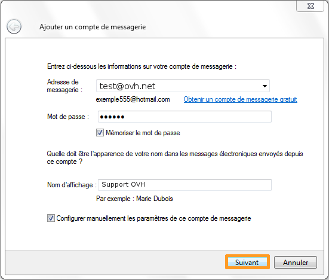

## Vaihe 1: sähköpostitilin lisäys
Avaa Windows Mail -sähköpostisovellus ja lisää uusi postitili.

Täytä vaaditut kentät ja klikkaa ”Next”.

{.thumbnail}

## Vaihe 2: sähköpostitilin asetukset
Syötä ikkunaan jonka sait eteesi, seuraavat tiedot:

Tulevan postipalvelimen tyyppi: POP3

Tuleva palvelin: ns0.ovh.net
Portti: 110

Käyttäjätunnus: koko sähköpostiosoitteesi.

Lähtevä palvelin: ns0.ovh.net
Portti: 587

Tarkista että ”My outgoing server requires authentication” on valittuna.

Portin 587 ja käyttäjätunnuksen & salasanan käyttö on pakollista lähtevään palvelimeen yhdistämistä varten. Tämä portti on kaikkien internetpalveluntarjoajien käytettävissä.

Kilikkaa ”Next” viimeistelläksesi asennuksen, jonka jälkeen postitili onkin valmiina käytettäväksi.

{.thumbnail}

- Lähtevän palvelimen autentikointi on tehtävä, jotta sähköpostinlähetys toimisi moitteettomasti SMTP-palvelimillamme.

- Jos autentikointia ei aktivoida, Open SMTP-häiriötiketti voidaan avata, jossa ilmoitetaan, että "POP before SMTP" autentikointia ei tueta. Lähtevän palvelimen autentikointi on aktivoitava sähköpostien lähettämiseksi.

## POP-asetukset
Tässä ovat sähköpostilaatikon POP-tilin asetukset.

POP-tilin konfigurointi SSL-suojaus aktivoituna tai deaktivoituna: 

Sähköpostiosoite: sähköpostiosoite kokonaisuudessaan.
Salasana: salasana, joka on määritelty [hallintapaneelissa](https://www.ovh.com/managerv3/).
Käyttäjätunnus:jaettu sähköpostiosoite kokonaisuudessaan.
Saapuvan postin palvelin: saapuvien sähköpostiviestien palvelin: SSL0.OVH.NET
Saapuvan postin palvelimen portti: saapuvien sähköpostiviestien palvelimen portti: 995 tai 110
Lähtevän postin palvelin: lähtevien sähköpostiviestien palvelin: SSL0.OVH.NET
Saapuvan postin palvelimen portti: lähtevien sähköpostiviestien palvelimen portti: 465 tai 587

Portit 110 ja 587 vastaavat deaktivoitua SSL-suojausta.
Portit 995 ja 465 vastaavat  aktivoitua SSL-suojausta.

- Lähtevän SMTP-palvelimen [autentikointi](#configuration_de_windows_mail_partie_2_parametre_du_compte_e-mail) on aktivoitava.

|Portti|SSLaktiivinen|SSLdeaktivoitu|
|Saapuva|995|110|
|Lähtevä|465|587|

## IMAP-asetukset
Tässä ovat sähköpostilaatikon IMAP-tilin asetukset.

IMAP-tilin konfigurointi SSL-suojaus aktivoituna tai deaktivoituna: 

Sähköpostiosoite: sähköpostiosoite kokonaisuudessaan.
Salasana: salasana, joka on määritelty [hallintapaneelissa](https://www.ovh.com/managerv3/).
Käyttäjätunnus: sähköpostiosoite kokonaisuudessaan.
Saapuvan postin palvelin: saapuvien sähköpostiviestien palvelin: SSL0.OVH.NET
Saapuvan postin palvelimen portti: saapuvien sähköpostiviestien palvelimen portti: 993 tai 143
Lähtevän postin palvelin: lähtevien sähköpostiviestien palvelin: SSL0.OVH.NET
Saapuvan postin palvelimen portti: lähtevien sähköpostiviestien palvelimen portti: 465 tai 587

Portit 143 ja 587 vastaavat deaktivoitua SSL-suojausta.
Portit 993 ja 465 vastaavat  aktivoitua SSL-suojausta.

- Lähtevän SMTP-palvelimen [autentikointi](#configuration_de_windows_mail_partie_2_parametre_du_compte_e-mail) on aktivoitava.

|Portti|SSLaktiivinen|SSLdeaktivoitu|
|Saapuva|993|143|
|Lähtevä|465|587|

## Yleistä
Halutessasi voimme maksua vastaan määritellä sähköpostilaatikon puolestasi käyttämääsi sähköpostiohjelmaan. Voimme suorittaa muitakin sähköpostiin liittyviä toimenpiteitä.

Maksulliset toimenpiteet on eritelty seuraavassa linkissä:

- 

Katso ohjeesta, miten maksullista toimenpidettä pyydetään.

{.thumbnail}

